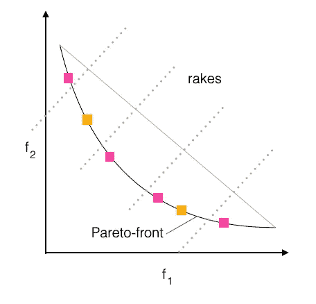

# 进化多目标优化与耙选择

> [原文链接](https://towardsdatascience.com/evolutionary-multi-objective-optimization-with-rake-selection-2a238d2b9f77?source=collection_archive---------16-----------------------#2023-03-14)

## 一种用于良好分布的帕累托前沿近似的方法

  [Oliver Kramer](https://medium.com/@Oliver_Kramer?source=post_page-----2a238d2b9f77--------------------------------)

·

在[Towards Data Science](https://towardsdatascience.com/?source=post_page-----2a238d2b9f77--------------------------------)上发布的文章，作者：[Oliver Kramer](https://medium.com/@Oliver_Kramer?source=post_page-----2a238d2b9f77--------------------------------)，阅读时间约 5 分钟，发布日期：2023 年 3 月 14 日。

--

 [点击这里](https://medium.com/m/signin?actionUrl=https%3A%2F%2Fmedium.com%2F_%2Fbookmark%2Fp%2F2a238d2b9f77&operation=register&redirect=https%3A%2F%2Ftowardsdatascience.com%2Fevolutionary-multi-objective-optimization-with-rake-selection-2a238d2b9f77&source=-----2a238d2b9f77---------------------bookmark_footer-----------)

图像由 AI 生成。

多目标优化是一个关键的研究领域，在工程、金融和生物学等多个领域具有广泛的应用。它涉及同时优化多个目标，其中目标可能是相互冲突的，不可能在不妥协其他目标的情况下改善一个目标。近年来，许多新方法已经被开发出来，以解决多目标优化问题。在这篇博客文章中，我们介绍了一种名为“rake selection”的新方法，旨在有效解决多目标优化问题。

遗传算法（GA）非常适合多目标优化，因为它们基于解决方案的种群而非单一解决方案运行。这一特性使它们能够探索更大的搜索空间，并捕捉到可以覆盖广泛目标的多样化解决方案。

在典型的遗传算法（GA）中，生成一个潜在解决方案的种群，并根据多个目标评估其适应度。然后，选择最适合的个体进行繁殖，产生新一代解决方案，这些解决方案经过进一步的选择和繁殖，直到找到一个令人满意的解决方案。

在多目标优化中，种群中每个个体的适应度是同时基于多个目标进行评估的。这使得遗传算法能够捕捉到一组在种群中不被任何其他解决方案支配的解决方案，这被称为帕累托最优前沿。

图 1：在一个具有两个目标的最小化问题中，一个解决方案将目标空间划分为四个象限。

如果解空间中的其他任何解决方案都不支配某个解决方案，则该解决方案被称为帕累托最优。图 1 展示了单个解决方案如何将目标空间划分为四个象限。左下象限包含支配考虑中的解决方案的解决方案；所有这些象限中的解决方案在两个目标方面表现更好。右上象限中的解决方案被考虑中的解决方案支配。左上和右下象限包含与考虑中的解决方案不可比拟的解决方案。非支配解的集合包括相对于所有其他解决方案在这些象限中的解决方案。

## 非支配排序

大多数多目标优化方法，如 NSGA-II、撬棒选择和基于超体积指标的选择，都从非支配排序开始。这个过程涉及根据非支配等级对 GA 的种群进行排序。如果一个解没有被其他解支配，则被认为是非支配的。第一个等级包含所有非支配解，如果这些解被移除，第二个等级由未被剩余解支配的解组成。这个过程持续进行，直到所有解都被排序。图 2 说明了解如何将解排序到不同的等级中，粉色方块代表非支配解，橙色方块代表第二等级的解，灰色方块代表第三等级的解。第一等级的非支配解作为二次选择过程的基础。

图 2：非支配排序根据支配关系为每个解分配一个等级。

## 撬棒选择

维持目标空间中解的均匀分布的一个有效方法称为撬棒选择。它基于在撬棒基准上正交定位的撬棒，并延伸到非支配解所在的目标空间区域，见图 3。撬棒基准将最优解与单一目标相关联。对于每个撬棒，选择排名为一的解中距离最近的点。如果非支配解过少，还可能考虑来自下一个排名的解。无论目标空间的维度如何，点和线之间的距离都可以高效地计算。

图 3：离撬棒最近的解被选择进入下一代。

形成撬棒基准的最优点可以通过单独优化每个目标来计算，然后使用其余目标的适应度值计算目标空间中的附加坐标点。或者，撬棒基准可以通过使用当前种群中每个目标的最佳解来计算。这种即时计算的撬棒基准可能导致不同的位置。

撬棒方法的有效性在 Pareto 前沿具有线性形状时最为明显。当前沿变得更加弯曲时，撬棒在并行线切割中的效果会降低。然而，可以基于当前非支配解集的形状对撬棒方法进行调整。[2] 提出了类似的机制，通过计算比例来调整每一步的撬棒距离，基于撬棒与选择解之间的连接。这种方法允许在处理形状更复杂的 Pareto 前沿时具有更大的灵活性和有效性。

## 实验

图 4 展示了在多目标问题 ZDT1 至 ZDT4 上进行 Rake Selection 的实验结果。耙基连接角点，垂线定义了目标空间中的耙。需要注意的是，由于坐标轴的比例不均，这些耙在图中可能不会显得垂直于耙基。

图 4：ZDT 1–4 的耙选择实验（来自[2]）。

在 1,000 次迭代后，相当于 50,000 次目标函数评估，解位于耙上和帕累托前沿的曲线上。这表明 Rake Selection 方法在识别非支配解和实现多个目标之间最佳权衡方面的有效性。

## 结论

总结而言，多目标优化是一个关键的研究领域，具有广泛的应用。遗传算法（GAs）是多目标优化的有效工具，因为它们基于解的种群运作，并能够探索多样的解集，以捕捉多个目标之间的权衡。非支配排序和耙选择是可以有效识别帕累托最优前沿和选择最佳权衡解的技术。实验结果表明，Rake Selection 方法在识别非支配解和实现多个目标之间的最佳权衡方面是有效的。总体而言，多目标优化是一种强大的方法，能够提供对复杂系统的宝贵见解并指导决策过程。

*除非另有说明，所有图像均由作者提供。*

## 参考文献

1.  K. Deb, S. Agrawal, A. Pratap, 和 T. Meyarivan. 一种快速且精英的多目标遗传算法：NSGA-II. *IEEE 进化计算汇刊*，6(2)：182–197，2002 年。

1.  O. Kramer 和 P. Koch. 耙选择：一种新颖的进化多目标优化算法。见于 *人工智能进展（KI）*，页 177–184，2009 年。
