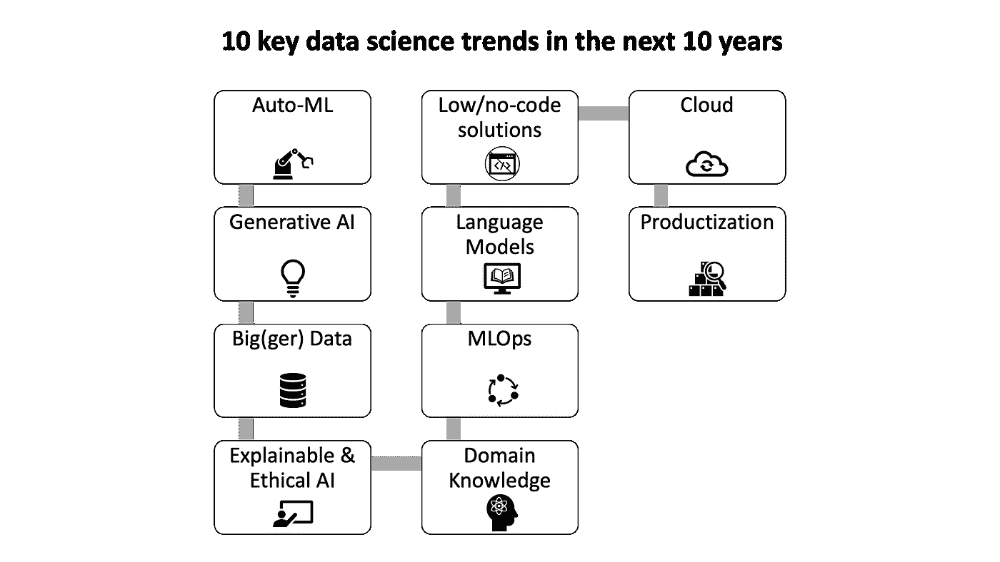
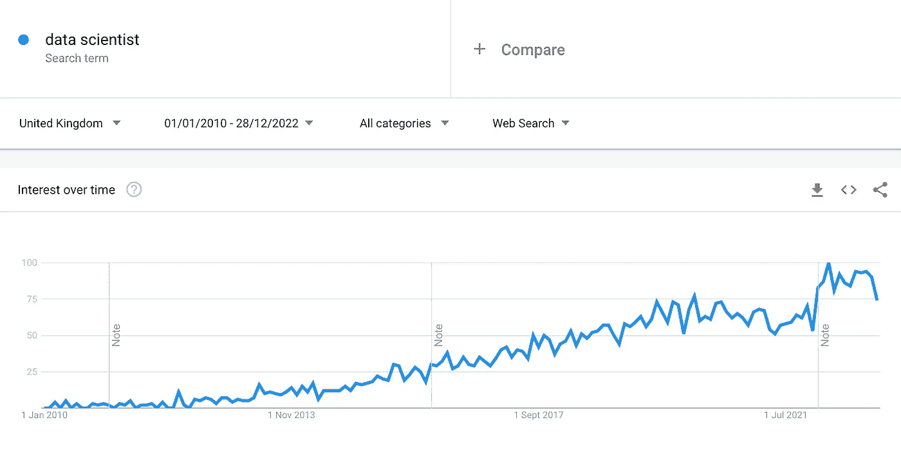

# 未来 10 年将塑造数据科学家角色的 10 个趋势

> 原文：[`towardsdatascience.com/10-trends-that-will-shape-the-role-of-data-scientists-in-the-next-10-years-759cdda3a442?source=collection_archive---------5-----------------------#2023-01-18`](https://towardsdatascience.com/10-trends-that-will-shape-the-role-of-data-scientists-in-the-next-10-years-759cdda3a442?source=collection_archive---------5-----------------------#2023-01-18)

## 数据科学家角色的演变

## 我们会看到提示工程师的崛起吗？

 [Shahrokh Barati](https://medium.com/@tech.intrapreneur?source=post_page-----759cdda3a442--------------------------------)

·

[关注](https://medium.com/m/signin?actionUrl=https%3A%2F%2Fmedium.com%2F_%2Fsubscribe%2Fuser%2F67c421235d57&operation=register&redirect=https%3A%2F%2Ftowardsdatascience.com%2F10-trends-that-will-shape-the-role-of-data-scientists-in-the-next-10-years-759cdda3a442&user=Shahrokh+Barati&userId=67c421235d57&source=post_page-67c421235d57----759cdda3a442---------------------post_header-----------) 发表在 [Towards Data Science](https://towardsdatascience.com/?source=post_page-----759cdda3a442--------------------------------) ·10 分钟阅读·2023 年 1 月 18 日

--

未来 10 年将塑造数据科学家角色的 10 个趋势 — 图片由作者创作

在过去十年里，数据科学家角色的受欢迎程度急剧上升，因为组织越来越多地转向数据驱动的决策以保持竞争力（请参见下方的 Google 趋势图表关于“数据科学家”搜索词）。在这段短暂的时间里，角色发生了显著的变化，而下一个十年无疑将带来更多的变革。

在 10 年内，数据科学家的角色可能与我们当前的预期大相径庭，特别是随着新技术和方法的不断出现。因此，数据科学家需要时刻关注这一领域的最新发展，并根据需要进行调整，以便在日益竞争激烈的市场中保持竞争力。

“数据科学家”搜索词的兴趣趋势 — 来源：Google 趋势

# 简要历史…

数据科学家的角色随着时间的推移发生了显著变化，其根源可以追溯到 50 多年前的统计学领域的发展。首次提到“数据科学家”这一…
