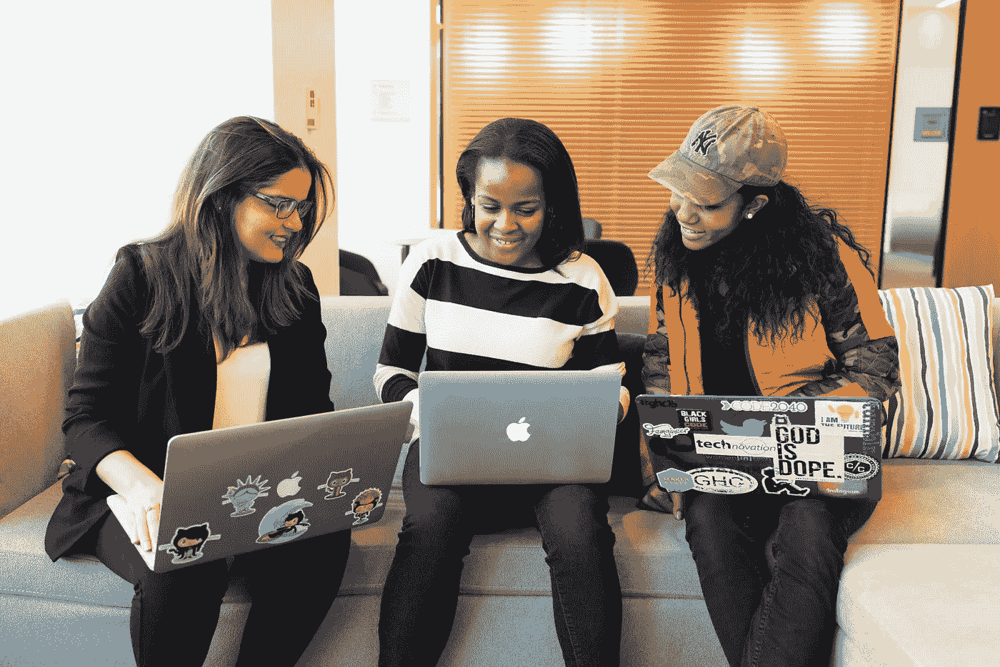

# 10 位女性分享在 IT 和数据领域的工作经验

> 原文：[`towardsdatascience.com/10-women-working-in-it-and-data-share-their-experience-17d8845233e6?source=collection_archive---------11-----------------------#2023-03-09`](https://towardsdatascience.com/10-women-working-in-it-and-data-share-their-experience-17d8845233e6?source=collection_archive---------11-----------------------#2023-03-09)

 [Kamila Hamalcikova](https://medium.com/@kamila.hamalcikova?source=post_page-----17d8845233e6--------------------------------)

·

[关注](https://medium.com/m/signin?actionUrl=https%3A%2F%2Fmedium.com%2F_%2Fsubscribe%2Fuser%2F68fd4870e44&operation=register&redirect=https%3A%2F%2Ftowardsdatascience.com%2F10-women-working-in-it-and-data-share-their-experience-17d8845233e6&user=Kamila+Hamalcikova&userId=68fd4870e44&source=post_page-68fd4870e44----17d8845233e6---------------------post_header-----------) 发表在 [数据科学前沿](https://towardsdatascience.com/?source=post_page-----17d8845233e6--------------------------------) ·9 分钟阅读·2023 年 3 月 9 日

--

**IT 行业仍然被认为是男性主导的领域，还是时代在慢慢变化？我们采访了来自欧洲不同国家的女性 IT 专业人士，了解她们在 IT 或数据相关工作的经验。**

照片由 [Mimi Thian](https://unsplash.com/@mimithian?utm_source=unsplash&utm_medium=referral&utm_content=creditCopyText) 提供，来源于 [Unsplash](https://unsplash.com/photos/8kdA2IJsjcU?utm_source=unsplash&utm_medium=referral&utm_content=creditCopyText)

为什么技术行业中的从业者是更多女性还是男性很重要？如今，技术招聘人员经常试图确保 IT 和数据团队的多样性，以确保 10 名软件工程师或数据分析师组成的团队不会提出相同的 10 个解决方案。

尽管有这些努力，根据[麦肯锡的研究](https://www.mckinsey.com/capabilities/mckinsey-digital/our-insights/women-in-tech-the-best-bet-to-solve-europes-talent-shortage)，**在欧洲只有 22%的技术岗位由女性担任**。考虑到[女性在 STEM 学科的低入学率](https://www.umultirank.org/blog/In-which-European-countries-are-STEM-graduates-most-highly-recognised/)，这并不令人感到特别惊讶。此外，根据欧洲统计局的数据，女性在高等教育中 STEM 学科的毕业率正在下降。

因此，我邀请了 10 位具有不同 IT 领域经验的女性 IT 专业人士分享她们在技术行业的亮点和挑战，以帮助年轻女孩决定是否想尝试 IT 职业。(*更多关于受访女性的细节可以在本文末尾找到。*)

**问题 1: 你认为女性在 IT/数据领域或任何人从事这个领域工作的最大优势是什么？**

图片由[Christina @ wocintechchat.com](https://unsplash.com/@wocintechchat?utm_source=unsplash&utm_medium=referral&utm_content=creditCopyText)拍摄，来源于[Unsplash](https://unsplash.com/photos/FPQlXQtjkqU?utm_source=unsplash&utm_medium=referral&utm_content=creditCopyText)

> **玛利亚**: 我会从 IT/数据从业者的角度来回答这个问题。因为我认为这些优势与性别无关。IT 或数据相关的工作需求非常高。**这给了你选择的机会，对我来说这也意味着力量。**
> 
> 你不必急于得到任何东西，你可以选择最适合你的工作。其他一些优势是能够在任何地方工作，因为你只需要一台笔记本电脑和 Wi-Fi。高薪是当前对这些角色需求旺盛的另一个结果。此外，我非常喜欢挑战和解决问题的可能性，但我认为这更多是个人感受。
> 
> **雅雅**: 优势包括各种工作机会、体面的薪资以及在一个动态环境中工作，在这里你总是能学到新东西。这也非常灵活，你可以很容易地转换领域。
> 
> **比安卡**: 最大的优势是持续学习和自我发展、环境、薪资和其他福利。

尽管来自葡萄牙的数据工程师玛利亚、在法国工作的摩洛哥软件工程师雅雅，以及来自罗马尼亚的软件测试员比安卡提到高薪是技术行业的一个优势，但这只是部分正确。

IT 和数据领域的薪资通常高于大多数其他部门，但**基于经济活动的性别薪酬差距在欧盟 ICT 部门中仍然是第二高**。[来自 Eurostat 的数据](https://ec.europa.eu/eurostat/statistics-explained/index.php?title=Gender_pay_gap_statistics#Highest_gender_pay_gap_in_financial_and_insurance_activities) 显示，2020 年未经调整的性别薪酬差距为 13%，而金融和保险服务领域为 26.4%，信息和通信（ICT）紧随其后，为 19.4%的[性别薪酬差距](https://ec.europa.eu/eurostat/statistics-explained/index.php?title=Glossary%3AGender_pay_gap_%28GPG%29)。

> **Swati**：一般来说；在家工作、灵活的工作时间（如果项目允许的话），而且不需要太多的体力劳动。
> 
> **Nadia**：有很多优势；高薪资、成长机会、灵活的时间表：我不必在 9 点开始一天或在 6 点结束。**我每周的会议相对较少**，我可以根据自己的喜好安排剩余的时间。
> 
> 另外，跨国移动的可能性：我去年搬到了法国，我不会说法语，但这并不影响我的工作，因为一切都用英语讨论。而且，**工作的性质当然也是不受国家限制的**。

正如 Swati Bhoi 和 Nadia Chirkova 所提到的，她们都在法国工作，尽管她们来自不同的原籍国（印度和俄罗斯），但远程工作的可能性是一个特别的好处，特别是在 IT 领域。根据[来自 Coresignal 的分析](https://coresignal.com/blog/remote-work-trends-during-covid-19/)，**IT 和服务在 2021 年在欧洲的远程职位中占据了最高比例，为 22.1%**。

> **Darya**：社区和网络。尽管女性在 IT 领域仍然代表性不足，**女性创建了许多支持小组，你可以在这些小组中结识志同道合的人**。有专门针对女性的活动（如[HerHackathon](https://thehackathoncompany.com/herhackathon/)）或女性专属的专业项目（如[BreakLine](https://breakline.org/program/)）。社区支持和欢迎。
> 
> **Sylvie**：作为自由职业者，自主安排工作时间的可能性。另外，该领域的良好薪资使我们能够获得独立。对我来说，**作为女性是一个优势，因为多样化团队的需求使女性更容易找到工作**，而且女性在电脑前被贴上极客标签的可能性较小。
> 
> **Andreea**：总体而言，能够在一个非常创新的领域工作在技术和社会发展的过程中变得越来越重要。
> 
> **Catherine**：对我来说，这是一个女性配额和学习成长的机会。

尽管一些公司努力聘用更多女性担任某些技术岗位，但**女性在技术快速增长的角色中的代表性仍然很低**。

虽然 46%的欧洲 UX 设计师是女性，但在软件工程和架构职能中，女性仅占 19%。此外，**云解决方案架构师仅有 10%是女性，Python 开发者中只有 13%是女性**，而[这些职位在就业市场上需求极高](https://www.mckinsey.com/capabilities/mckinsey-digital/our-insights/women-in-tech-the-best-bet-to-solve-europes-talent-shortage)。

图片来源：[Humphrey Muleba](https://unsplash.com/@good_citizen?utm_source=unsplash&utm_medium=referral&utm_content=creditCopyText) 于 [Unsplash](https://unsplash.com/photos/9MoQKZW0nGU?utm_source=unsplash&utm_medium=referral&utm_content=creditCopyText)

> **特雷莎**：女性在 IT/数据领域工作的最大优势，或者说任何人在这个领域工作的最大优势，就是工作的创造性。这些项目和挑战种类繁多，提供了持续学习和成长的机会。此外，工作的性质允许在时间和空间上有很大的灵活性。
> 
> **只需一台笔记本电脑、网络连接，和可能的一杯好咖啡，我就可以在任何地方工作**，无论是在家里、咖啡店，还是在我们位于布拉格市中心的美丽办公室。这种灵活性使我能够追求职业生涯，同时还能照顾我的两个儿子（陪伴大儿子去柔道课，或在周五午餐后接小儿子放学）。
> 
> 我真正喜欢在 IT 行业工作的原因是女性可以获得的支持和社区。有**许多旨在支持和赋能女性的倡议**（比如[Czechitas](https://www.czechitas.cz/en)或[PyLadies](https://pyladies.com/)），社区也非常强大和热情。

**问题 2：你认为女性在 IT/数据领域工作，或者一般在这个领域工作的人面临的最大挑战是什么？**

图片来源：[LinkedIn Sales Solutions](https://unsplash.com/it/@linkedinsalesnavigator?utm_source=unsplash&utm_medium=referral&utm_content=creditCopyText) 于 [Unsplash](https://unsplash.com/photos/4rvBjoQWERk?utm_source=unsplash&utm_medium=referral&utm_content=creditCopyText)

> **凯瑟琳**：我认为在 IT 或数据世界中，男性的声音更容易被听到。
> 
> **Swati**：从我的女性视角来看，当你提出解决方案时，可能面临**被不够重视的风险**，有时薪水较低，还需要更具说服力来证明自己的价值。
> 
> **Aya**：我认为最大的挑战之一是**打破这是男性领域的刻板印象，证明我们同样有能力和聪明**。这迫使我们在工作中加倍努力，以使我们的技能得到认可。
> 
> **Maria**：一个常见的挑战是需要不断学习。你必须投入大量精力来学习和提升你的编程/分析技能。但他们没告诉你的是，如果你想要成功，你必须不断进行这项工作。**总是有新的东西，新的更好的东西，你必须跟上 IT 及其市场的速度**。
> 
> 作为女性，我不得不承认，相较于我的男性同事，**我觉得自己必须比男性客户证明自己多一倍或三倍才能被认真对待**。不止一次，他们的问题被直接问向电话中的男性，即使我在主导讨论。这也引发了“我够好吗？”、“我只是填补了一个名额吗？”的疑问，你开始怀疑自己并感觉像个冒名顶替者。

面试的女性共同关心的问题是，相比男性同行，IT 领域的女性工作者需要证明自己，这可能也是**2022 年所有科技裁员中有 69.2%是女性**的原因之一。这个数据来自于[WomenTech Network 的研究](https://www.womentech.net/en-us/women-technology-statistics)。

> **Bianca**：最大挑战是技术迅速变化以及客户需求模糊且经常不完整。
> 
> **Sylvie**：我认为在 IT 领域对女性没有什么特别的要求，除了我每月一次的生理期让我感到困扰。我在同事中感到受尊重。
> 
> **Andreea**：总体而言，**跟上技术进步**，以及向不同的参与者展示数据素养和数据民主的重要性，当数据基础设施尚未到位时。
> 
> **Darya**：这绝对是**冒名顶替综合症**。我遇到了许多背景、经验和职业水平各异的了不起的女性，她们时不时**感受到“自己不够好”的感觉**。IT 领域广阔且变化迅速，所以不可能了解所有的东西。
> 
> 此外，这个领域竞争激烈，因此人们常常会相互比较。这一切都造成了一种**不擅长编程、数据、演讲等的错觉。总有某人做得更好**。所以在我看来，成功往往取决于个人，是否能够勇敢地开始只与过去的自己进行比较。

虽然白俄罗斯数据科学家 Darya Petrashka 提到的冒名顶替综合症在 IT 和数据领域由于技术快速变化而相当常见，但女性往往会更多地遭遇这一综合症。

正如网站 [womenintech.co.uk/](https://www.womenintech.co.uk/) 所指出的：“*女性常常感到自己不属于这里，不如男性同行技艺高超。同样，来自少数群体的员工可能会因为相同的原因而体验到类似的感觉。”*

> **Nadia**：最大的挑战是保持知识的最新：你使用的框架可能会频繁变化，或者出现新的工具。但通常有**许多以友好和全面的方式编写的教程或博客**，所以这并不难。在我的领域，这一点更为强烈，因为除了工具之外，你还必须跟上科学文献。相关的文章每天都在发布。但这也是一种乐趣，因为阅读所有这些文章令人兴奋和鼓舞。
> 
> 另一个挑战是**较低的身体活动水平和大量的屏幕时间，对健康有非常负面的影响**。你必须通过其他活动如散步或运动来弥补这一点。我个人在没有特殊的蓝光阻挡眼镜的情况下无法看屏幕，因为我的眼睛很快就会感到疲劳。
> 
> **Tereza**：我觉得最近变化很大，但**仍然存在的最大挑战之一是克服我们内心的刻板印象**。当我考虑大学选项时，我最初倾向于更多传统的女性专业，比如语言和经济学。我没有考虑 IT 行业的职业。
> 
> 然而，在发现了专注于女性 IT 教育的组织之后，我意识到我的真正热情在于编程和数据分析。总结一下——保持开放的心态，接受所有可能性，并且永远不要停止学习和探索。

**受访的 IT 或数据专业人士：**

> Catherine，是一名拥有 1-2 年经验的 BI 分析师，来自英国，远程为位于伦敦的客户工作。
> 
> Bianca，是一名拥有 2 年经验的测试工程师，来自罗马尼亚，工作地点在罗马尼亚的雅西。
> 
> Sylvie，是一名数据分析师和教师（自由职业者），拥有 7 年经验，来自法国，在法国格勒诺布尔工作。
> 
> Swati，是一名拥有 4 年以上经验的 IT 顾问，来自印度，在法国巴黎工作。
> 
> Darya，是一名拥有 3.5 年经验的数据科学家，来自白俄罗斯，远程在波兰工作。
> 
> Tereza，是一名数据分析经理，拥有 8 年经验，来自捷克，在捷克布拉格工作。
> 
> Andreea，是一名面向客户的数据科学家，拥有 6 年经验，来自法国，在法国里昂工作。
> 
> Maria，是一名拥有 2 年经验的数据工程师，来自葡萄牙，远程为位于伦敦和捷克布拉格的客户工作。
> 
> Nadia，是一名计算机科学领域的研究科学家，拥有 5 年经验，来自俄罗斯，在法国格勒诺布尔工作。
> 
> Aya，是一名拥有 1 年经验的软件工程师，来自摩洛哥，在法国格勒诺布尔工作。

声明：部分名字已根据受访女性的要求进行了更改。
