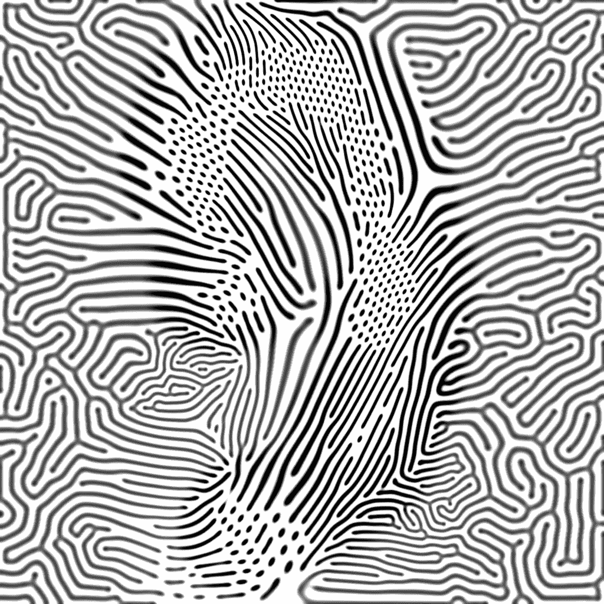
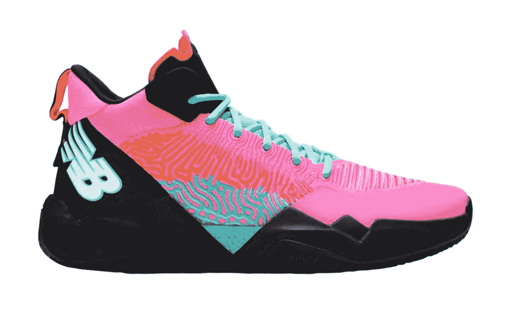
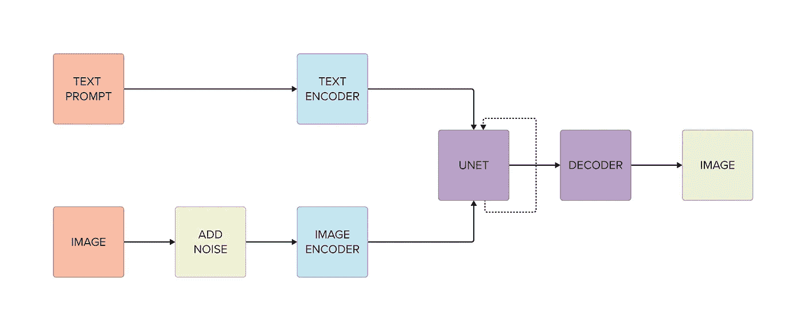

# 扩散模型：它们是如何扩散的？

> [原文](https://towardsdatascience.com/ai-diffusion-models-how-do-they-diffuse-5ac0fcb4426f)

## 理解生成式人工智能背后的核心过程

  [Onur Yuce Gun, PhD](https://medium.com/@OnurGun?source=post_page-----5ac0fcb4426f--------------------------------)

·发表于 [Towards Data Science](https://towardsdatascience.com/?source=post_page-----5ac0fcb4426f--------------------------------) ·7 分钟阅读·2023 年 11 月 4 日

--

# 扩散模型

机器学习中的“扩散模型”这一名称来源于统计学中扩散过程的概念。

那是什么*统计概念*？

在自然科学中，扩散是粒子从高浓度区域扩散到低浓度区域的过程，这一过程常通过物理学和数学中的扩散方程来描述。

反应-扩散是一个很好的例子。

卡尔·西姆斯的珊瑚生长模拟

# 反应-扩散

反应-扩散是一个相当复杂的过程；如果你想阅读数学逻辑，你可以访问扩散模型大师卡尔·西姆斯的网站：

[## 反应-扩散教程](https://www.karlsims.com/rd.html?source=post_page-----5ac0fcb4426f--------------------------------)

### 格雷-斯科特反应-扩散模型的插图教程。

[www.karlsims.com](https://www.karlsims.com/rd.html?source=post_page-----5ac0fcb4426f--------------------------------)

让我们从一个简单的类比开始：

反应-扩散系统是一种描述事物如何变化和移动的方式，尤其是当你谈论化学物质时。想象你在纸上有几种不同的颜料，它们开始混合并创造出新颜色——这就像是“反应”部分。颜料的斑点不仅停留在一个地方；它们会扩散并混合——这种扩散就像是“扩散”部分。

所以，这些系统只是一组规则，它们告诉我们这些过程是如何发生的：化学物质如何相互反应形成新物质，以及它们是如何移动或扩散的。

这可以描述自然界中的许多不同事物，例如动物皮肤上的图案是如何形成的，污染是如何在环境中扩散的，以及许多其他同时发生反应和移动的情况！

反应-扩散算法在生成吸引人且实用的图案方面非常高效 — 图像由作者提供。

为什么这有用？

> 嗯，你可以用它们设计鞋子！ ;)

New Balance Two WXY 系列具有反应-扩散图案 — 这不是我的设计，但计算设计团队在 2018 年向办公室的设计师们介绍了 RD — www.newbalance.com

嗯，这只是一个应用案例 —

反应-扩散系统可以通过数学公式进行描述和模拟，这有助于我们理解扩散事件。

这些公式主要解释了一个或多个化学物质如何随时间变化并在空间中移动。

这涉及到化学反应，其中化学物质可以转变为其他化学物质，以及扩散，即使这些化学物质在一个区域内扩散的过程。

# AI 和机器学习中的扩散模型

在生成式 AI 领域，扩散模型以一种有些类似的方式工作，通过建模向数据中逐步添加噪声的过程，然后学习逆转这一过程。

> 然而，重要的是不要将反应-扩散生成的图案与机器学习系统中添加到图像的噪声混淆！

扩散模型接收一个信号（例如图像），并逐渐添加噪声，直到原始信号完全被遮蔽。再次强调，添加的噪声不需要有特定的形状（与反应-扩散生成的美丽图案相对！）

这在概念上类似于物质通过介质扩散的物理过程。

扩散模型的训练涉及学习逆过程：从一个有噪声的信号开始，逐渐去除噪声，以恢复原始信号。

> 这个过程让人联想到物理学中逆转扩散过程，其中粒子的位置从平衡状态（完全扩散）追溯到原始状态（浓缩）。

因此，"扩散模型"这一名称捕捉了从噪声到干净、有序信号的逆过程的本质，这是机器学习生成模型中的核心。

我见过很多解释扩散模型的图示，但要么我迷失在其中，要么它们被过于简化，以便阐明实际过程。

我还想为**设计师**开发一个*自定义图示*：这些人懂得伪代码和流程图，但不一定了解其中的数学（当然也有例外）：

图示展示了扩散过程 — 由作者绘制

这个图示既不特别详细也不完全简化。我希望复杂度能“刚刚好”，使更多的人能够理解扩散过程。

在这个图示中，我感到有必要解释 UNET 和随后的“添加噪声”节点，因为它们构成了扩散过程中的“魔法”。

我们开始吧 —

## UNET

UNET 是一种用于快速而精确图像分割的卷积网络架构。

结果发现，它最初是为了生物医学图像分割开发的。

UNET 的名称来源于其 U 形架构！

> 在“UNET”名称的由来中，我猜想可能有一些视觉传达元素在发挥作用！在我提供一个更民主化的 UNET 描述（我也能理解的 (!)）之前，这里是我在 Medium 上找到的更逐行的技术描述（做得好！）：

## UNet 逐行解释

### 示例 UNet 实现

towardsdatascience.com

UNET 在其他应用中变得流行，如地理信息系统（GIS）。在这方面，分割技术可以帮助从航空或卫星数据中划定海岸线，实现精确的沿海制图。同样，它也可以用于识别和提取大型结构的轮廓，如摩天大楼或工业综合体，从高分辨率图像中提取。

因此，UNET 的应用逐渐扩展到其原始应用之外的各种图像到图像的翻译任务，包括图像去噪、超分辨率，最后进入生成模型如稳定扩散。

在稳定扩散模型的训练中，这包括从文本描述生成图像（文本到图像）或将一张图像转化为另一张具有某些风格变化的图像（图像到图像），UNet 发挥了重要作用。以下是其使用的简化说明：

## **1\. 编码器-解码器结构**

可以把 UNET 想象成一台有两个主要部分的机器。第一部分是“编码器”，它像一台紧凑的相机，聚焦于图像中最重要的部分，并将其拆分成更小的部分——这样更易于处理。第二部分是“解码器”，它像一位艺术家，接过紧凑的版本后，重新绘制出包含所有细节的完整图像。

## 2\. **跳跃连接**

通常，当你将某物缩小（如在编码器中），你会丢失一些细节（显而易见！）。但 UNET 有一个巧妙的技巧：它使用“跳跃连接”，这些快捷方式允许它记住并恢复在图像变小时可能丢失的细节。这有助于“艺术家”部分确保最终图像与原始图像一样详细。

## **3\. 潜在空间操作**

想象图像在编码器中的压缩版本作为一种蛋糕的食谱，我们称之为“潜在空间”。这个食谱包括了制作蛋糕所需的所有原料和步骤。在稳定扩散中，你可以改变这个食谱来改变最终的蛋糕。想把香草蛋糕变成巧克力蛋糕？你调整食谱——这就像调整“潜在空间”。你不是从头开始；你只是对原料（或图像特征）做一些小的调整，以得到不同但相关的结果（这可以帮助我们猜测自定义训练的提示）。如果基本食谱是草图，那么添加的风味和装饰就是绘画中的颜色和纹理。

## **4. 使用噪声进行训练**

想象一下在暴风雨中开车。一开始，雨水猛烈地拍打在你的挡风玻璃上，让你难以看清前方的路。然而，雨刷会擦去水滴，给你短暂的清晰视野。训练 UNET 处理噪声就像是在提升雨刷的效果。起初，它们可能有缺陷，每次擦拭视野依然模糊。但随着你“训练”雨刷——调整其速度并确保它们与玻璃的接触正确——它们在清除雨水方面变得更有效。同样，U-Net 开始时试图穿透图像上的“雨”噪声。随着时间的推移，它在清除噪声方面变得更好，直到它能稳定地提供清晰的“视图”——就像有效的雨刷最终给你清晰的道路视野一样——可能不是最好的比喻，但你明白了……

如果你不喜欢这样的比喻，这里有一个更直接的描述：

# 添加和去除噪声

· 从一张干净的输入图像开始，引入噪声，将其转变为带噪声的图像。

· 在训练过程中将带噪声的图像输入 UNET，这是一种去噪自动编码器。

· 训练 UNET 预测并识别添加到图像中的特定噪声。

· 通过迭代训练，提高 U-Net 准确预测噪声的能力。

· 随着 UNET 技能的提升，它在从噪声数据中生成清晰图像方面变得更为娴熟。

· 利用 UNET 的噪声处理和操作能力来增强扩散过程，该过程系统地添加和去除噪声以制作新图像。

这种逐渐扩散的过程是产生高质量合成图像所必需的，已经在互联网上和我们的日常生活中广泛存在——但像 Midjourney、Stable Diffusion、Dall-E 等 AI 驱动的图像生成模型的令人印象深刻的结果是无可否认的。

就这样。读完这些内容后，希望你对扩散模型有更清晰的理解。

## 了解作者

想了解更多或联系我？这里是我的 [LinkedIn](https://www.linkedin.com/in/onuryucegun/) 和 [YouTube](https://www.youtube.com/@computationaldesign) 账号。我还会在我的 [Instagram](https://www.instagram.com/onur.yuce.gun/) 账号上分享生动的图像和新闻。

## 参考资料

 [## U-net 是如何工作的？ | ArcGIS Python API

### ArcGIS Python API 文档。

developers.arcgis.com](https://developers.arcgis.com/python/guide/how-unet-works/?source=post_page-----5ac0fcb4426f--------------------------------)  ## 卷积神经网络解析

### 让我们一起构建你的第一个 CNN 模型

towardsdatascience.com
