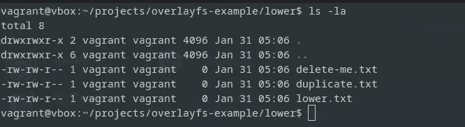

# 探索 Linux 容器中叠加文件系统的力量

> [`towardsdatascience.com/exploring-the-power-of-overlay-file-systems-in-linux-containers-d846724ec06d`](https://towardsdatascience.com/exploring-the-power-of-overlay-file-systems-in-linux-containers-d846724ec06d)

## 通过独特而简单的分层思路释放容器化的潜力

  [Dimitris Poulopoulos](https://dpoulopoulos.medium.com/?source=post_page-----d846724ec06d--------------------------------)

·发布于 [Towards Data Science](https://towardsdatascience.com/?source=post_page-----d846724ec06d--------------------------------) ·7 min read·2023 年 2 月 1 日

--


[Hoach Le Dinh](https://unsplash.com/@hoachld?utm_source=unsplash&utm_medium=referral&utm_content=creditCopyText) 摄影 [Unsplash](https://unsplash.com/photos/PeRt3uMmjYM?utm_source=unsplash&utm_medium=referral&utm_content=creditCopyText)

本系列文章探讨了 Linux 容器如何在幕后工作，以及我们需要什么工具来构建类似的环境而无需 Docker。为什么要这样做？好吧，如果你真的想知道当你执行 `docker run` 时发生了什么，这是你需要迈出的第一步。最后两篇文章集中在命名空间和控制组（groups）在容器化中的作用。

[## 容器：它们如何在幕后工作以及为什么它们正在主导数据科学世界](https://towardsdatascience.com/?source=post_page-----d846724ec06d--------------------------------)

### 初学者理解 Docker 神奇的指南

[## Linux 控制组的力量：容器如何掌控其资源](https://towardsdatascience.com/?source=post_page-----d846724ec06d--------------------------------)

### 使用 Linux 控制组优化容器资源分配

[The Power of Linux Cgroups: How Containers Take Control of Their Resources](https://towardsdatascience.com/?source=post_page-----d846724ec06d--------------------------------)

本文完成了对这一主题的讨论，引入了叠加文件系统，这是创建类似容器环境所需的最后一个构建块，无需依赖 Docker。

Linux 容器彻底改变了现代计算中应用程序的部署和管理方式。此技术的核心是叠加文件系统，这是一个关键组件，使容器能够共享一个共同的基础镜像，同时保持每个容器之间的隔离。

在接下来的段落中，我们将深入探讨叠加文件系统的概念及其在使 Linux 容器轻量、高效和安全方面的作用。无论你是经验丰富的系统管理员还是刚开始探索容器的新人，本文都提供了叠加文件系统的全面概述及其对容器化世界的影响。

> [学习速率](https://www.dimpo.me/newsletter?utm_source=medium&utm_medium=article&utm_campaign=overlayfs)是一个针对那些对 MLOps 世界感兴趣的人的新闻简报。MLOps 是一个广泛的领域，致力于以高效和可重复的方式将 ML 模型投入生产。容器在管道中扮演了关键角色。如果你想了解更多类似的主题，可以在 [这里](https://www.dimpo.me/newsletter?utm_source=medium&utm_medium=article&utm_campaign=overlayfs) 订阅。你会在每个月的最后一个星期六收到我的更新和对最新 MLOps 新闻和文章的看法！

# 设置场景

Linux 容器已成为现代计算的一个重要组成部分，提供了一种高效和灵活的方式来打包和部署应用程序。与传统虚拟机不同，容器允许多个隔离的应用程序在单个主机上运行，共享主机的操作系统内核。这种架构提供了诸多好处，包括提高效率、可扩展性和可移植性。

容器已经存在了十多年，首个容器化技术出现于 2000 年代初。然而，直到 2013 年 Docker 的出现，容器才真正起飞，成为现代应用程序部署的基石。

然而，为了充分理解底层发生的情况，我们退一步，假设 Docker 不存在，尝试自己创建一个类似容器的环境。虽然这个努力不会给我们一个生产就绪的解决方案，我们仍然会缺少一些东西，但它将使我们更好地理解容器是如何工作的。

为此，本文探讨了叠加文件系统。叠加文件系统是一种联合文件系统，允许多个下层堆叠在一起，创建数据的统一视图。在 Linux 容器的背景下，叠加文件系统用于将容器所做的更改层叠在基础镜像之上，同时保持原始镜像的完整。这允许容器共享一个共同的基础镜像，并减少需要传输、存储和部署的镜像的大小。

如果这个解释听起来令人困惑，让我们自己创建一个 overlay 文件系统。它比你想象的要简单。

# 一个简单的例子

要构建 overlay 文件系统，我们需要两样东西：i）一个下层和 ii）一个上层。简单来说，我们需要两个目录。为了清楚地说明它们的角色，我们将第一个命名为`lower`，第二个命名为`upper`：

```py
mkdir lower upper
```

接下来，让我们进入`lower`目录并创建三个文件。我们将第一个文件命名为`delete-me.txt`，第二个命名为`duplicate.txt`，最后一个命名为`lower.txt`。可以在文件中放入任何内容，但请确保明确说明这是一个存在于`lower`目录中的文件。例如，在`duplicate.txt`中我们可以写：

```py
I'm a duplicate file in the lower directory. 
```


`lower`目录 — 作者提供的图片

在`upper`目录中，我们还将创建一个`duplicate.txt`文件和一个`upper.txt`文件。你可以根据自己的需要填充这些文件的内容，但请确保明确说明这些文件存在于`upper`目录中。


`upper`目录 — 作者提供的图片

现在，我们准备创建一个 overlay 文件系统，它将把两个目录叠加在一起，并呈现数据的统一视图。为此，我们需要两个更多的目录，一个名为`merged`，另一个名为`workdir`。这些目录与`lower`和`upper`目录处于同一层级。

```py
mkdir merged workdir
```


我们的工作环境 — 作者提供的图片

创建 overlay 文件系统的命令如下：

```py
sudo mount -t overlay -o lowerdir=lower/,upperdir=upper/,workdir=workdir none merged/
```

让我们一步一步地解读这个过程。首先，你说你想挂载一个类型为`overlay`的新文件系统。你指定了`lower`、`upper`和`workdir`目录。你将源设置为`none`，因为没有包含数据的底层设备。相反，数据来自`lower`和`upper`目录。最后，你说你想将其挂载到`merged`目录中。`workdir`目录是系统保存所需元数据的特殊位置。我们不会触碰这个目录。

如果你现在列出`merged`目录中的文件，你会看到`lower`和`upper`目录的统一视图。`lower`目录中的`lower.txt`和`delete-me.txt`文件都在其中，而`upper`目录中的`upper.txt`和`duplicate.txt`文件也在其中。正如你现在可以安全地猜测的那样，`lower`和`upper`目录中具有相同名称的任何文件都将来自`upper`目录。


合并目录 — 作者提供的图片

此外，`lower`目录是只读的。你在`merged`目录中所做的任何更改不会影响它。相反，一切都将记录在`upper`目录中。

例如，如果你删除了`delete-me.txt`文件，系统将在`upper`目录中放置一个字符设备，其名称相同，次要和主要数字为零。这告诉系统该文件已被删除，你将在`merged`目录中看不到它：


删除文件 — 作者图像

如果你在`lower`目录中浏览，你会发现`delete-me.txt`文件仍在你留下的位置：



下层目录是只读的 — 作者图像

另一方面，如果你更改了`lower.txt`文件的内容，系统将执行写时复制操作。这意味着，当你保存对`lower.txt`文件的更改时，它将把文件复制到`upper`目录，并在其中保留这些更改。你可以自行检查每个目录中的`lower.txt`文件的内容。

这就是覆盖文件系统的精髓；你有一个保持不变的下层目录，而一个位于其上方的目录记录所有的更改。这就是在容器中如何保持基础镜像的文件系统不变，并拥有记录你对容器所做更改的层。

# 结论

总之，覆盖文件系统在 Linux 容器的成功中扮演着至关重要的角色，它使得应用程序的高效、安全和隔离部署成为可能。覆盖文件系统允许容器共享一个共同的基础镜像，同时保持每个容器相互隔离，从而减少镜像的大小并提高容器生态系统的整体性能。

在本文中，我们探讨了覆盖文件系统的基础知识及其对容器化生态系统的影响。现在，我们准备继续前进，创建一个不使用 Docker 的类似容器的环境。我将在下一篇文章中见到你。

# 关于作者

我的名字是[Dimitris Poulopoulos](https://www.dimpo.me/?utm_source=medium&utm_medium=article&utm_campaign=overlayfs)，我是一名在[Arrikto](https://www.arrikto.com/)工作的机器学习工程师。我为欧洲委员会、Eurostat、IMF、欧洲中央银行、OECD 和 IKEA 等主要客户设计和实施了人工智能和软件解决方案。

如果你有兴趣阅读更多关于机器学习、深度学习、数据科学和数据操作的文章，可以在[Medium](https://towardsdatascience.com/medium.com/@dpoulopoulos/follow)、[LinkedIn](https://www.linkedin.com/in/dpoulopoulos/)或 Twitter 上的[@james2pl](https://twitter.com/james2pl)关注我。

表达的意见完全是我个人的观点，并不代表我雇主的观点或意见。
