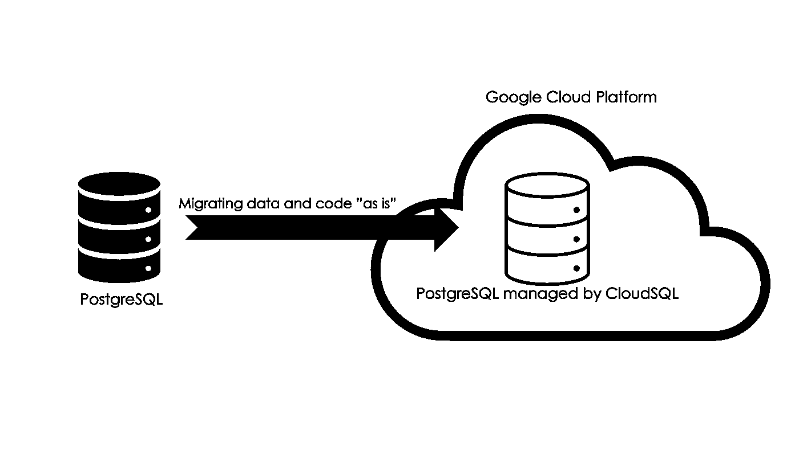

# 从本地部署到云端的 2 种有效方法

> 原文：[`towardsdatascience.com/2-effective-ways-to-move-data-from-on-premises-to-the-cloud-b3c3b03837f0?source=collection_archive---------15-----------------------#2023-07-13`](https://towardsdatascience.com/2-effective-ways-to-move-data-from-on-premises-to-the-cloud-b3c3b03837f0?source=collection_archive---------15-----------------------#2023-07-13)

## 从本地部署到云端的轻松迁移技巧

 [Hanzala Qureshi](https://hanzalaqureshi.medium.com/?source=post_page-----b3c3b03837f0--------------------------------)

·

[关注](https://medium.com/m/signin?actionUrl=https%3A%2F%2Fmedium.com%2F_%2Fsubscribe%2Fuser%2F467270b83111&operation=register&redirect=https%3A%2F%2Ftowardsdatascience.com%2F2-effective-ways-to-move-data-from-on-premises-to-the-cloud-b3c3b03837f0&user=Hanzala+Qureshi&userId=467270b83111&source=post_page-467270b83111----b3c3b03837f0---------------------post_header-----------) 发表在 [Towards Data Science](https://towardsdatascience.com/?source=post_page-----b3c3b03837f0--------------------------------) ·5 分钟阅读·2023 年 7 月 13 日

--

照片由 [Ritish Jarodia](https://unsplash.com/@lensomaniac?utm_source=medium&utm_medium=referral) 提供，刊登在 [Unsplash](https://unsplash.com/?utm_source=medium&utm_medium=referral)

AWS（Amazon Web Services）对于亚马逊的意义就如同复利对于金融的意义。

云计算在过去十年间一直备受关注，其模式具有复利效应；你托管的组织越大，作为供应商你赚的钱就越多。因此，供应商的利益在于确保组织的增长并保持其业务。

这就是商业问题；将数据从本地迁移到云的技术模式是什么？

让我们深入探讨吧！

# 1\. 提升和迁移——将应用程序及其所有数据原封不动地迁移到云端

这是开始使用云服务的最便宜的选项。

图片来源：作者

在上面的例子中，我们正在将 PostgreSQL 迁移到 Google Cloud Platform (GCP)。为此，你可以使用 GCP 的 Cloud SQL 服务；目标是将现有的 PostgreSQL Server 数据库转移到托管的 Cloud SQL 服务中，而不做实质性的修改…
