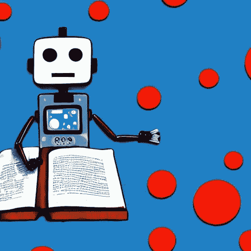

# 寻找机器学习团队候选人时应关注的 20 种软技能

> 原文：[`towardsdatascience.com/20-soft-skills-to-look-for-in-candidates-for-your-machine-learning-team-23dfccf996ee?source=collection_archive---------12-----------------------#2023-02-16`](https://towardsdatascience.com/20-soft-skills-to-look-for-in-candidates-for-your-machine-learning-team-23dfccf996ee?source=collection_archive---------12-----------------------#2023-02-16)

 [Lydia Nemec](https://medium.com/@LydiaNemec?source=post_page-----23dfccf996ee--------------------------------)

·

[关注](https://medium.com/m/signin?actionUrl=https%3A%2F%2Fmedium.com%2F_%2Fsubscribe%2Fuser%2F1ddbbb172903&operation=register&redirect=https%3A%2F%2Ftowardsdatascience.com%2F20-soft-skills-to-look-for-in-candidates-for-your-machine-learning-team-23dfccf996ee&user=Lydia+Nemec&userId=1ddbbb172903&source=post_page-1ddbbb172903----23dfccf996ee---------------------post_header-----------) 发表在 [Towards Data Science](https://towardsdatascience.com/?source=post_page-----23dfccf996ee--------------------------------) ·9 分钟阅读·2023 年 2 月 16 日

--

尽管教育、技能和经验提供了技术基础，并且对一个有能力的机器学习（ML）团队至关重要，但只有当结合了正确的软技能时，团队才会变得强大和成功。

图像阅读机器人 ML 生成自 [`creator.nightcafe.studio`](https://creator.nightcafe.studio)

教育、技能和经验是一个合格的机器学习专家的重要特质。拥有数学、计算机科学、自然科学和统计学的坚实教育背景，为理解驱动机器学习模型的基础理论和算法提供了强有力的基础。此外，通过动手实践各种编程语言、库和工具来获得实际技能，对于实现和部署成功的机器学习解决方案至关重要。[R1, R2]

然而，正确的软技能组合可以将一支有能力的机器学习专家团队转变为成功的团队。这些技能补充了技术技能。[R3] 软技能是个人属性和能力。在机器学习领域，软技能尤为重要，因为它们使专家能够有效地与利益相关者、客户和其他团队成员合作，以确保解决了正确的问题，开发和部署了正确的解决方案。

准备好提升你的团队吧！在接下来的 20 点中，我将分享我对这些能力的个人见解。所以，让我们深入探讨，发现如何发掘我们自己和团队的最佳表现！

阅读机器人的图像由 openAI 的 [dall-e](https://deepai.org/machine-learning-model/cute-creature-generator) 生成

1.  **有目的地工作**：明确活动的目的很重要。对目标有清晰的认识可以使工作保持一致。在机器学习项目中，很容易从一个有趣的分析跳到另一个。风险在于，你可能会在某个地方结束，却没有找到解决实际问题的方案。有目的地工作可以帮助开发有意义的解决方案。[R4]

1.  **有纪律和专注地工作**：自律工作是成功的主要因素。自律使你能够纠正过去的行为而不重复错误。它使得培养良好的工作习惯并保持足够的质量标准成为可能。[R5] 在现代工作环境中，干扰无处不在。专注于特定的目标并保持全神贯注，可以在有限的时间内获得高质量的结果。[R6]

1.  **智力严谨性和灵活性**：在开发机器学习解决方案时，明确基本假设、应用逻辑严谨的推理并得出结论很重要。同时，保持心理灵活性以重新审视假设和结论也同样重要，如果结果看起来可疑的话。根据我的经验，机器学习生成的结果如果看起来好得不真实，往往并非如此。

1.  **时间管理**：找到专注工作的时间是困难的。团队可以引入专门的时间用于集中工作，但这只能在每个团队成员充分利用可用时间时才能实现集中工作。时间管理的另一个方面是能够持续工作，设定明确的优先级，以管理项目和团队之间的相互依赖，并按时完成任务。记住：你永远无法完成所有想做的事情，所以一定要优先排序！[R7, R8]

1.  **跨文化能力**：ML 专家可能来自不同的教育背景、国籍和年龄群体。每个团队成员都能够处理文化差异非常重要。例如，在我们的团队中，主要使用英语，但对我们大多数人来说，英语是外语。重要的是要仔细倾听并提出问题，直到双方都确认达成了共同的理解。

1.  **终身学习的态度**：ML 领域广泛，团队的要求和期望也多种多样。对领域特定主题以及与之相关的内容有深厚的学习态度，加上对其他解决有趣问题领域的广泛兴趣，可以成为解决问题的丰富灵感来源。这种基本态度可以为团队快速熟悉新项目中的主题条件奠定基础。顺便说一下，午餐讨论也会变得更加有趣！[R9]

1.  **挫折容忍度**：在开发 ML 解决方案时，实验和测试未知结果的新方法是日常工作的一部分。ML 专家必须承担进入未知领域所带来的风险。事情不应该出错，但往往会出错，例如数据不足（数量、信息内容、质量）、算法可能无法收敛等等。团队需要能够在问题变得困难时坚持下去，能够应对挫折并继续前进。第一次、第二次或第三次都不会总是成功——ML 是困难的，我们必须应对。

1.  **责任感**：处理数据意味着处理信任。这带来了极大的责任：对数据、对所应用算法的结果以及对因数据偏差等意外结果负责。ML 团队必须认识到这一点，并且不畏惧承担这种责任。[R10]

1.  **责任感与所有权**：机器学习解决方案的开发和运作是复杂的，往往意味着团队必须应对不确定性。重要的是团队中的每个人都要对各自的工作负责。具有健康所有权思维的团队通常拥有“如果我搞坏了，我就修复”的文化。然而，所有权需要问责。每个人必须对自己负责，并且必须有空间和安全感，诚实地面对结果。[R11]

1.  **工程思维**：无论其准确性如何，机器学习模型如果不能部署、应用于现实数据、扩展和维护，则价值有限。成功的团队会开发出可维护、可扩展且稳健的端到端解决方案。这包括两个方面：首先是数据——数据通常是杂乱的，需要大量工作和精心处理才能揭示其有价值的信息内容。其次是软件（& 云）工程。在这里，软件工程的最佳实践适用。[R12]

1.  **分析与批判性思维**：不要信任机器！毕竟，机器学习算法解决的是数值优化问题。它们将数字作为输入并输出数字。无论结果是否合理或是否解决了给定的问题，都需要由经验丰富的机器学习专家团队进行检查。

1.  **协作**：信任和安全是任何真正协作的基础。每个团队成员必须对自己的能力和局限性有信任，以便在团队内建立信任并进行持续改进。在这种情况下，安全意味着：首先，在团队内部，我们尊重所有权，但积极为机器学习产品的成功做出贡献。其次，每个人都会犯错，每个团队成员都应感到安全，能够承认错误、纠正错误并从中学习。这使得每个团队成员都能成为一个强大而可靠的合作者。

1.  **基于角色的指导**：基于角色的指导是一种有效促进个人和职业成长的方式。这种方法有两个方面：首先，寻找团队内部或外部的导师，以进行积极的学习、获得指导和交流意见。其次，寻找受指导者，提供指导，例如，通过代码审查、数据探索讨论或挑战机器学习解决方案。

1.  **问题解决**：我们收到的每个请求都代表着一个尚未解决的问题。我们的工作是根据现有数据探讨是否存在潜在解决方案，这本质上是一个困难的挑战。为了解决这个问题，团队中的每个人都需要拥有个人的工具箱，能够处理、理清，并最终解决所给的问题。这通常涉及将先进的分析应用于复杂的数据集，开发有效的算法，并寻找创新的解决方案。这种能力为团队、公司及其客户做出了宝贵的贡献。

1.  **有效沟通**：主动发言者和主动倾听者都对良好的沟通负有责任。发言者需要能够在与合作者、利益相关者或其他专家沟通时清晰地表达复杂的技术概念和结果。[R13] 在机器学习开发中，明确的资源和时间规划可能是困难的。这也是为什么它被称为*数据科学*。因此，协商资源和截止日期的能力是团队工作的一个重要方面。[R14] 数据往往无法满足利益相关者的期望，这可能会导致摩擦。同样重要的是，具有文化和教育多样性、不同能力以及有时目标冲突的团队的性质可能会导致真正困难的对话。处理这些对话需要耐心、理解的开放态度以及适量的同理心。[R15] 我们在这里列出了成功的机器学习专家所需的三大主要沟通方面。

1.  **应对模糊性**：模糊性来源于竞争的想法、不明确的结果愿景、相互冲突的利益和有限的信息。根据可用信息推理和调整计划的能力对于得出结论和确定最佳下一步至关重要。[R16]

1.  **战略思维**：能够设想整体解决方案及其对团队、组织、客户和社会的影响是机器学习专家的重要技能。这种能力结合对机器学习产品开发中相互关联复杂性的深刻理解，使他们能够专注于大局，预见障碍，并提前考虑几步。因此，专家能够清晰地与利益相关者和客户沟通，并优先关注成功的关键领域。

1.  **组织能力**：机器学习产品开发中的典型挑战包括复杂的相互依赖、不可预见的障碍和不完整的信息，例如关于现有数据是否足以解决问题的不确定性。计划可计划的事项、处理意外情况、设定优先级、分配合适的资源以及有效地交付结果是关键技能。[R17]

1.  **商业头脑**：这是识别和优先考虑那些对公司经济成功产生积极影响的正确决策的能力。一个重要的前提是理解商业问题和客户需求。然后，挑战在于有效且技术上高效地实现这些需求。技术解决方案的表现与机器学习模型的质量相关，同样重要的是其成本效益实施。强大的商业头脑使机器学习专家能够为公司的利润做出贡献。

1.  **以客户为中心**：*给客户他需要的，而不是他要求的。* 这是将知识和能力用于帮助客户的关键技能。客户应该对机器学习产品和开发团队充满信心。客户中心意味着理解客户的需求并开发合适的解决方案。[R18]

> “**我们的计划是通过新产品引领公众，而不是询问他们想要什么样的产品。公众不知道什么是可能的，但我们知道。”** 赤尾守田（1921–1999）是日本商人，索尼的联合创始人、首席执行官和董事长。

# 推荐阅读列表

[R1] 安基塔·尼贾姆；[数据科学家必备的 20 种技能](https://blog.insaid.co/top-20-must-have-skills-for-a-data-scientist/) blog.insaid.co

[R2] 西德赫什·辛德；[在这里发现顶级 11 种数据科学技能](https://emeritus.org/blog/find-the-top-11-data-science-skills-in-demand-here/) emeritus.org/blog（2022 年 12 月 8 日）

[R3] [安迪·麦克唐纳](https://medium.com/u/9c280f85f15c?source=post_page-----23dfccf996ee--------------------------------)；成功数据科学家必须具备的 5 种软技能 towardsdatascience.com（2022 年 10 月 28 日）

[R4] 西蒙·西内克；《从为什么开始：伟大的领导者如何激励每个人采取行动》（2011 年 12 月 27 日）

[R5] 詹姆斯·克利尔；《原子习惯：一种简单且经过验证的方法来建立好习惯并打破坏习惯》（2018 年 10 月 16 日）

[R6] 丹尼尔·戈尔曼；《专注：卓越的隐藏驱动力》（2013 年 10 月 8 日）

[R7] 奥利弗·伯克曼；《四千周：凡人的时间管理》（2021 年 8 月 10 日）

[R8] 米哈伊·契克森米哈伊；《心流：最佳体验的心理学》（2008 年 7 月 1 日）

[R9] 大卫·爱泼斯坦；《范围：全才如何在专业化世界中获胜》（2020 年 10 月 1 日）

[R10] 凯特·克劳福德；《人工智能地图：权力、政治与人工智能的全球成本》（2022 年 8 月 16 日）

[R11] 乔科·威林克，莱夫·巴宾；《极端责任：美国海豹突击队如何领导和胜利》（2017 年 11 月 21 日）

[R12] 罗伯特·C·马丁；《清洁代码：敏捷软件工艺手册》（2008 年 8 月 1 日）

[R13] 南希·杜阿特；《幻灯片学：创造伟大演示的艺术与科学》（2008 年 8 月 7 日）

[R14] 克里斯·沃斯；《从不妥协：谈判如同你的生命依赖于此》（2017 年 3 月 23 日）

[R15] 道格拉斯·斯通，布鲁斯·帕顿，希拉·欣；《困难对话：如何讨论重要的事》（2010 年 11 月 2 日）

[R16] 卡琳·艾尔斯特，塔玛拉·克里斯滕森；《在模糊中引领：如何将不确定性转变为可能性》（2022 年 10 月 12 日）

[R17] 斯科特·伯肯；《实现目标：掌握项目管理》（2008 年 4 月 1 日）

[R18] [保罗·洛普辛斯基](https://medium.com/u/480db42723df?source=post_page-----23dfccf996ee--------------------------------) 《为什么索尼的联合创始人赤尾守田是我心目中的产品经理英雄，以及他为什么也应该成为你的英雄》（2017 年 3 月 7 日）
