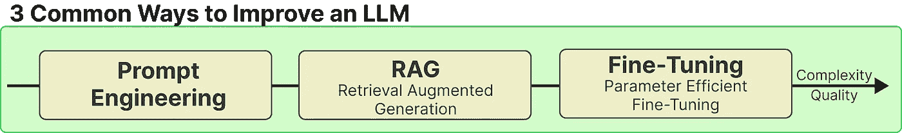

# 改善大型语言模型的 3 种简单方法

> 原文：[`towardsdatascience.com/3-easy-methods-for-improving-your-large-language-model-68670fde9ffa?source=collection_archive---------1-----------------------#2023-09-15`](https://towardsdatascience.com/3-easy-methods-for-improving-your-large-language-model-68670fde9ffa?source=collection_archive---------1-----------------------#2023-09-15)

## 增强 Llama 2 的能力

 [Maarten Grootendorst](https://medium.com/@maartengrootendorst?source=post_page-----68670fde9ffa--------------------------------)

·

[关注](https://medium.com/m/signin?actionUrl=https%3A%2F%2Fmedium.com%2F_%2Fsubscribe%2Fuser%2F22405c3b2875&operation=register&redirect=https%3A%2F%2Ftowardsdatascience.com%2F3-easy-methods-for-improving-your-large-language-model-68670fde9ffa&user=Maarten+Grootendorst&userId=22405c3b2875&source=post_page-22405c3b2875----68670fde9ffa---------------------post_header-----------) 发表在 [Towards Data Science](https://towardsdatascience.com/?source=post_page-----68670fde9ffa--------------------------------) ·12 分钟阅读·2023 年 9 月 15 日

--

大型语言模型（LLMs）已经成为长期存在的技术。随着 Llama 2 的发布，开源 LLMs 的性能正接近 ChatGPT，并且经过适当调整甚至可以超越它。

使用这些 LLMs 往往不像看起来那么简单，特别是当你想将 LLM 微调以适应你的特定用例时。

在这篇文章中，我们将探讨提高任何 LLM 性能的 3 种最常见的方法：

+   提示工程

+   检索增强生成（RAG）

+   参数高效微调（PEFT）

还有很多其他方法，但这些是最简单的，而且能在不费太多力气的情况下带来重大改进。

这 3 种方法从最简单的方法开始，即所谓的低悬果，到提升你的 LLM 的更复杂的方法。

为了最大程度地发挥 LLM 的效果，你甚至可以将这三种方法结合使用！
