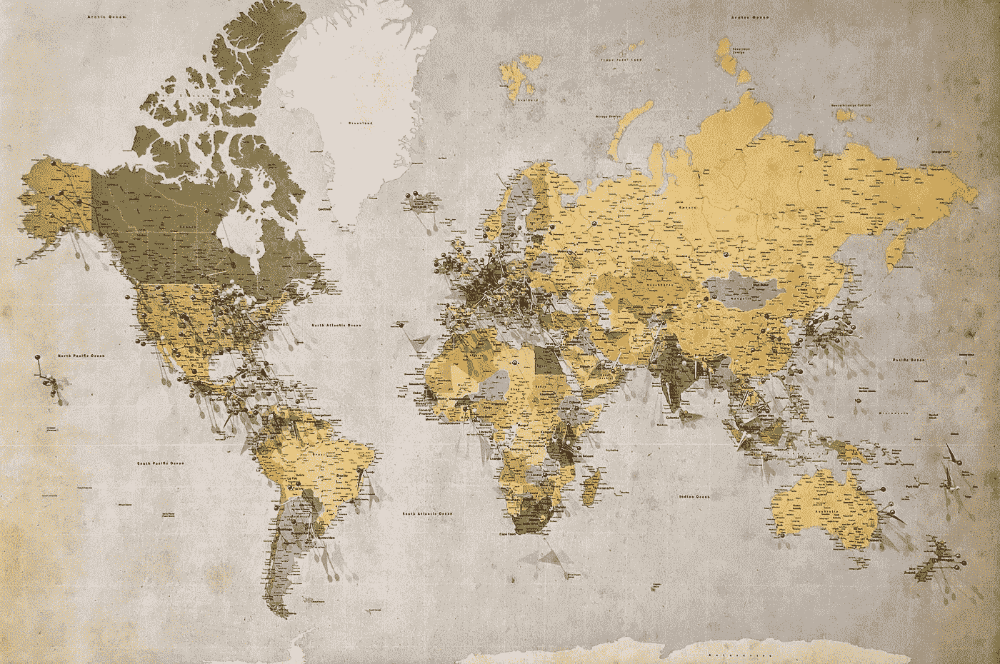

# 在 Streamlit 应用中包含交互式地图的三种简单方法

> 原文：[`towardsdatascience.com/3-easy-ways-to-include-interactive-maps-in-a-streamlit-app-b49f6a22a636?source=collection_archive---------0-----------------------#2023-02-19`](https://towardsdatascience.com/3-easy-ways-to-include-interactive-maps-in-a-streamlit-app-b49f6a22a636?source=collection_archive---------0-----------------------#2023-02-19)

## 在 Streamlit 中可视化地理空间数据

[](https://andymcdonaldgeo.medium.com/?source=post_page-----b49f6a22a636--------------------------------)[](https://towardsdatascience.com/?source=post_page-----b49f6a22a636--------------------------------) [安迪·麦克唐纳](https://andymcdonaldgeo.medium.com/?source=post_page-----b49f6a22a636--------------------------------)

·

[关注](https://medium.com/m/signin?actionUrl=https%3A%2F%2Fmedium.com%2F_%2Fsubscribe%2Fuser%2F9c280f85f15c&operation=register&redirect=https%3A%2F%2Ftowardsdatascience.com%2F3-easy-ways-to-include-interactive-maps-in-a-streamlit-app-b49f6a22a636&user=Andy+McDonald&userId=9c280f85f15c&source=post_page-9c280f85f15c----b49f6a22a636---------------------post_header-----------) 发布于[数据科学前沿](https://towardsdatascience.com/?source=post_page-----b49f6a22a636--------------------------------) ·6 分钟阅读·2023 年 2 月 19 日[](https://medium.com/m/signin?actionUrl=https%3A%2F%2Fmedium.com%2F_%2Fvote%2Ftowards-data-science%2Fb49f6a22a636&operation=register&redirect=https%3A%2F%2Ftowardsdatascience.com%2F3-easy-ways-to-include-interactive-maps-in-a-streamlit-app-b49f6a22a636&user=Andy+McDonald&userId=9c280f85f15c&source=-----b49f6a22a636---------------------clap_footer-----------)

--

[](https://medium.com/m/signin?actionUrl=https%3A%2F%2Fmedium.com%2F_%2Fbookmark%2Fp%2Fb49f6a22a636&operation=register&redirect=https%3A%2F%2Ftowardsdatascience.com%2F3-easy-ways-to-include-interactive-maps-in-a-streamlit-app-b49f6a22a636&source=-----b49f6a22a636---------------------bookmark_footer-----------)

图片由[安德鲁·斯图茨曼](https://unsplash.com/@drwmrk?utm_source=medium&utm_medium=referral)拍摄，来源于[Unsplash](https://unsplash.com/?utm_source=medium&utm_medium=referral)

[**Streamlit**](https://streamlit.io/) 提供了一种快速简便的方法来构建数据分析和机器学习的互动应用程序和仪表板。如果我们希望在 Streamlit 中构建一个使用包含位置数据的数据的分析应用程序，那么我们可能会考虑首先添加的可视化之一就是地图。在我们的应用程序中拥有一个互动地图，可以让我们可视化数据点的位置，从而识别模式或更深入地挖掘数据。

在这篇简短的文章中，我们将探讨三种在 Streamlit 应用程序中直接创建互动地图的简单方法。

# 导入库和数据

在开始之前，我们需要导入我们将使用的库和数据。对于这篇文章，我们将首先使用两个库：[**Streamlit**](https://streamlit.io/) 和 [**Pandas**](https://pandas.pydata.org/)。

```py
import streamlit as st
import pandas as pd
```

我们在这篇文章中使用的数据来自挪威石油管理局网站，包含了在挪威大陆架上钻探的所有井的位置。完整的数据集可以在这里下载…
