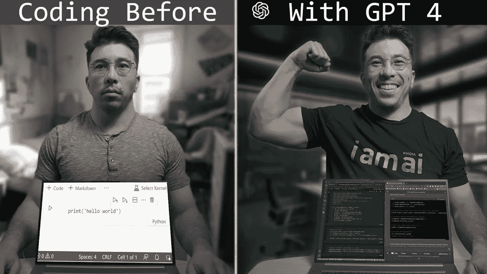

# 我用 ChatGPT 和 GPT-4 改善编程的 3 种有效方法

> 原文：[`towardsdatascience.com/3-great-ways-use-chatgpt-gpt-4-better-coding-7fb94e86be3e?source=collection_archive---------0-----------------------#2023-05-08`](https://towardsdatascience.com/3-great-ways-use-chatgpt-gpt-4-better-coding-7fb94e86be3e?source=collection_archive---------0-----------------------#2023-05-08)

## 自从 GPT-4 发布后，我的编程方式再也不会一样了。好消息是我每周节省了 5 小时的时间。坏消息是我可能会完全忘记编程。

 [Ken Jee](https://medium.com/@kenneth.b.jee?source=post_page-----7fb94e86be3e--------------------------------)

·

[关注](https://medium.com/m/signin?actionUrl=https%3A%2F%2Fmedium.com%2F_%2Fsubscribe%2Fuser%2F6ee1f7466557&operation=register&redirect=https%3A%2F%2Ftowardsdatascience.com%2F3-great-ways-use-chatgpt-gpt-4-better-coding-7fb94e86be3e&user=Ken+Jee&userId=6ee1f7466557&source=post_page-6ee1f7466557----7fb94e86be3e---------------------post_header-----------) 发布于 [Towards Data Science](https://towardsdatascience.com/?source=post_page-----7fb94e86be3e--------------------------------) ·8 分钟阅读·2023 年 5 月 8 日

--

图片由作者提供

# 目录

1.  第一部分：冷启动问题

1.  第二部分：对话编程

1.  第三部分：像函数一样使用 ChatGPT

1.  GPT-4 与前几版本比较

我在过去几个月一直在使用 ChatGPT，最近一个月使用 GPT-4。我可以诚实地说，我编写代码的方法已经被永远改变了，我认为这是更好的。这项技术有能力彻底改变我们所知道的编程方式。

好的，这并不简单，但已经越来越接近了。图片由作者提供

我的效率提高了，我花在调试上的时间也显著减少了，并且[与我之前的编码过程相比，我每周可能节省了 5 个小时](https://medium.com/gitconnected/how-i-save-over-5-hours-every-week-using-chatgpt-as-a-data-scientist-715fb5fd68d)。

那么，我的编码过程是如何变得更好的呢？以下是三种主要方式。
