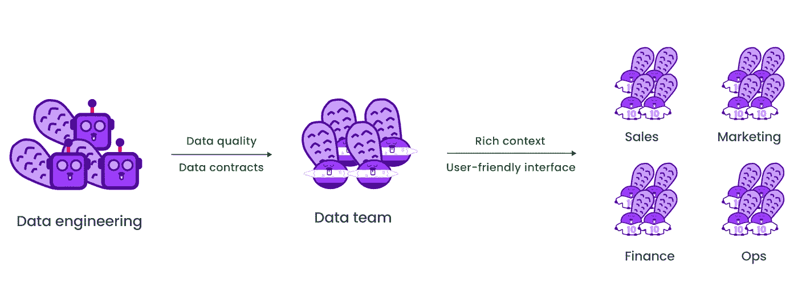
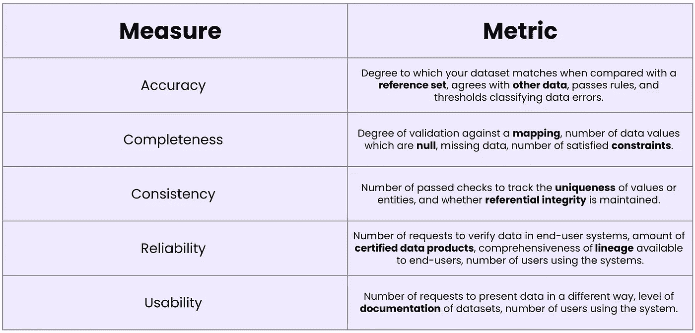
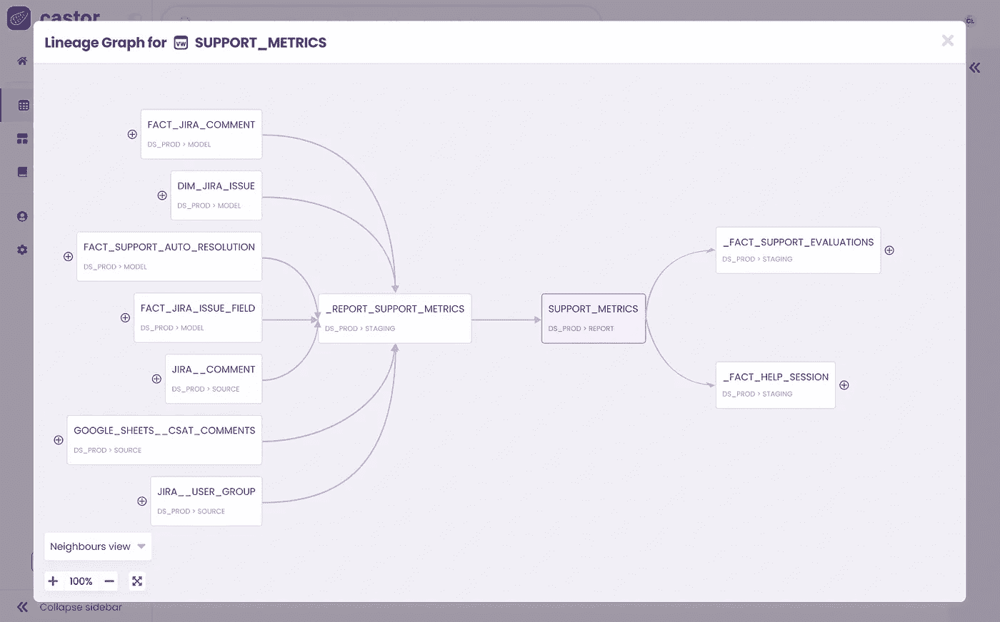

# 成功数据共享的 3 条不可变规则

> 原文：[`towardsdatascience.com/3-immutable-rules-for-successful-data-sharing-ac884766ca10?source=collection_archive---------1-----------------------#2023-01-21`](https://towardsdatascience.com/3-immutable-rules-for-successful-data-sharing-ac884766ca10?source=collection_archive---------1-----------------------#2023-01-21)

## 解锁数据协作的力量

 [Louise de Leyritz](https://medium.com/@louise.de.leyritz?source=post_page-----ac884766ca10--------------------------------)

·

[关注](https://medium.com/m/signin?actionUrl=https%3A%2F%2Fmedium.com%2F_%2Fsubscribe%2Fuser%2Fa926de8a6b3f&operation=register&redirect=https%3A%2F%2Ftowardsdatascience.com%2F3-immutable-rules-for-successful-data-sharing-ac884766ca10&user=Louise+de+Leyritz&userId=a926de8a6b3f&source=post_page-a926de8a6b3f----ac884766ca10---------------------post_header-----------) 发表在 [Towards Data Science](https://towardsdatascience.com/?source=post_page-----ac884766ca10--------------------------------) ·9 分钟阅读·2023 年 1 月 21 日

--

在我之前的文章中，我讨论了[数据共享](https://www.castordoc.com/blog/5-benefits-of-data-sharing)这一已经非常成熟的概念。数据共享指的是向所有部门开放数据访问，以赋予每个部门进行数据驱动决策的能力。

对于公司来说，在没有适当计划的情况下贸然开展数据共享计划，认为仅仅增加业务部门的访问权限就足够了，这种情况仍然很常见。这种做法是错误的。实际上，数据共享是一项复杂的任务，需要经过深思熟虑的规划和执行才能成功。

我们提出了三条不变的规则，以确保你的数据共享计划的成功

1.  你不应妥协数据质量

1.  你应为数据提供丰富的背景

1.  你应提供正确的接口来探索数据

关于**数据质量**的第一条规则是数据共享的基石——这是一个不可谈判的前提。数据质量是数据生产者（软件和数据工程团队）的责任。这是将高质量数据交到数据团队手中的问题。没有高质量的数据，数据团队无法完成工作，更无法与其他部门进行数据共享。实际上，如果数据团队无法使用数据，那还分享给别人干嘛呢？

本文中的第二条和第三条规则侧重于确保高质量数据有效地与业务团队共享。这不仅涉及提供准确和可靠的数据，还包括用相关背景丰富数据，并通过用户友好的界面使其易于访问。这样，即使是技术能力较弱的团队也能轻松使用数据。下面可以找到一个可视化表示。

有效数据共享的三条规则 — 图片由[Castor](https://www.castordoc.com/)提供

忽视这些规则中的任何一条必然会导致失败，这也是我们理想中想要避免的。让我们深入探讨每一条规则。

# 数据质量

成功的数据共享的基础是保持你与业务部门共享的数据质量。

数据共享是为了让业务部门能够做出数据驱动的决策。为此，你必须提供**一流的数据**。

当你分享有缺陷的数据时，人们显然会做出错误的决策。这可能导致重大财务损失、错失机会，并损害公司声誉。更重要的是，这会侵蚀对[信任](https://www.castordoc.com/blog/transparency-for-trust)的数据信任，并导致对数据的普遍漠视。如果计划不是分享一流的数据，那么根本不要分享数据。数据共享要么全力以赴，要么彻底放弃。如果执行不当，可能对你的组织造成损害。

**数据质量**是一个涵盖所有影响数据能否用于预期用途的因素的总括性术语。有几个特征定义了高质量的数据，包括但不限于：

+   **准确性**：数据准确描述其所代表的现实世界现象的程度。

+   **完整性**：数据是完整的，包含了所有必要的信息。

+   **一致性**：数据在不同来源和平台上是一致的。

+   **可靠性**：数据是最新的，并且与预期的使用场景相关。

+   **可用性**：数据被预期受众理解和使用以做出明智决策的难易程度。

你可以在 Kevin Hu 的 [文章](https://www.metaplane.dev/blog/data-quality-metrics-for-data-warehouses)中找到更多数据质量指标。

数据质量属性及其相关指标 — 图片来源于 [Castor](https://www.castordoc.com/)

当你分享具有这些属性的数据时，你增加了改进决策和效率的可能性。但这并不是数据质量的全部。

确保你的数据符合正确的质量标准的一个好方法是实施 **数据合同**。

数据合同是任何数据民主化倡议中的重要组成部分。数据社区与数据合同有着 [爱恨交织的关系](https://www.youtube.com/watch?v=4BEpYAp3Qu4)。但我们认为它们在数据共享对话中值得一提。

[数据合同](https://www.montecarlodata.com/blog-data-contracts-explained/#whats-in-a-data-contract)是数据生产者和数据消费者之间的协议，概述了共享和使用数据的具体条款和条件。它们在确保数据质量方面可以发挥重要作用，通过设定明确的期望和处理数据的指导方针。

数据合同规定，在数据共享之前，数据必须符合某些格式、约束和语义意义，或者可能包括要求定期审计数据质量的条款。

数据合同可能包括以下信息：

+   正在收集哪些数据

+   数据的采集频率和方式

+   谁拥有和负责数据（个人或团队）

+   谁可以访问数据以及访问的级别

+   安全性和治理措施，例如匿名化

例如，让我们考虑一下驱动 Ubereats 的机器学习模型。该模型的性能取决于其训练数据的准确性，而这些数据来源于公司内部的各种表格。

为确保模型正常运行，我们期望数据的完整性始终得到保持；这意味着列不应被删除，每个字段的值应保持一致，所有关键业务逻辑应得到遵守。如果这些条件中的任何一个未得到满足，模型的性能可能会受到影响。

为确保这些期望得到满足，应在数据合同中进行概述，以使数据生产者对维护数据的完整性负责。

总体而言，数据合同可以通过设定明确的指导方针和期望来提供一个确保数据质量的框架。这可以帮助确保所有相关方对数据质量的维护负有责任。这样，数据合同可以防止有缺陷的数据流入运营团队手中。

维护高水平的数据质量很重要，但仅此不足以解决问题。下一步是确保提供背景信息。

# 丰富的背景

背景是有效实施数据共享的第二个关键。没有背景的数据是危险和毫无价值的，因为它可能被不同的团队以不同的方式解读。

让我告诉你，这不是一个安全的选择。不同的解释意味着不同的结论，最终导致部门间报告不一致。如果你要引导业务团队进入未知领域，就给他们一张地图。背景就是这张地图。

人们了解一个数据集时，他们需要知道这些数据将满足什么需求、其内容以及其位置。一旦人们找到相关的数据集，他们就完成了 10%的工作。接下来，他们需要通过一个包含 10 多个问题的检查清单，确保他们理解自己使用的数据。只有当人们能够回答以下问题时，他们才真正理解数据：

+   数据来源于哪里？

+   它的流动路径是什么？它向下游喂送了哪些表？

+   谁拥有它/谁对它负责？

+   我所在领域中某个字段的含义是什么？

+   为什么这很重要？

+   这个表最后一次更新时间是什么时候？

+   这些数据的上游和下游依赖关系是什么？

+   这是生产质量的数据吗？

背景始于**文档**。所有共享的数据资产都需要被记录，以便利益相关者理解它们。实际上，这意味着对你的数据资产进行整理，包括列定义、标签、所有者等。当你正确记录数据时，人们知道在哪里找到它以及如何使用它，而不需要向公司中的其他人寻求帮助。

提供背景的第二个方面是拥有强大的**数据血统能力**。数据血统是一种极其强大的透明工具。它使人们能够理解数据资产之间的关系。如果上游出现问题，数据血统允许每个人了解下游的后果，从而避免不愉快的惊讶。血统还可以帮助利益相关者在数据问题出现时识别其来源。

数据血统：追踪数据资产之间的关系——图片来自[Castor](https://www.castordoc.com/)

提供背景的第三个方面是促进**社交发现**。这可以通过共享有关数据如何被利用的信息来实现。

当人们看到他们的同事如何使用和查询数据时，他们能够以更强的基础开始，并从同事的见解和策略中学习。社交发现使团队能够在彼此的知识基础上进行合作，从而提高工作效率。

例如，一个想要对营销合格线索（MQLs）进行分析的市场营销分析师可以利用社交发现来简化过程。通过社交发现，分析师可以迅速识别出营销团队使用的最相关的表格和数据集。此外，他还可以访问团队执行的查询，这可以作为分析的起点。这不仅节省了时间，还允许分析师从同事的工作中获得见解和学习。

# 用户友好的接口

如果你要与他人共享数据，必须通过正确的接口进行。并非所有团队成员的技术水平相同，也不是所有团队的数据需求相同。为正确的团队提供合适的接口对于让数据对所有人都可访问至关重要。

如果你在 dbt 中记录数据，不能期望市场营销团队在那儿提取文档。上下文应该在对业务团队友好的工具中提供。有两种方法可以实现这一点：

实现这一点的一种方法是提供一个能够高效**搜索和导航**的工具。该工具应易于使用和理解，以确保非技术团队成员能够有效使用。数据目录是一个可以用来轻松发现、理解和访问数据的工具的例子。

‍

另一种提供正确接口的方法是通过使数据在业务团队已经使用的工具**中易于访问**。这种方法涉及将数据交付给团队已经熟悉的工具。可以使用反向 ETL 工具来实现这一目的。

通过在现有工具中使数据可查找，团队可以访问所需的数据，而无需导航新系统或学习新软件。例如，一旦在数据仓库中计算了线索评分，反向 ETL 允许将该指标同步到 Salesforce。这使得销售人员可以直接在他们熟悉的工具中访问数据。

无论你采用什么方法，请记住，如果你想让数据对所有人可用，必须满足业务团队的需求。要求他们学习技术团队的工具和流程只会阻碍你的努力。

提供正确的接口对于数据民主化和使所有团队成员都能访问数据至关重要。在决定正确的接口时，重要的是考虑不同团队的技术专长和数据需求。通过提供易于使用的工具或将数据发送到现有工具，团队可以访问所需的数据，以做出明智的决策并推动结果。

# 结论

总之，数据共享是推动数据驱动决策和促进跨部门协作的强大工具。

但这是一个复杂的任务，需要深思熟虑的规划和执行才能成功。

我们提出了三条不可改变的规则，以确保您的数据共享计划成功：1）保持数据质量，2）提供数据的丰富背景，3）提供正确的界面以探索数据。

当然，数据共享涉及隐私和安全问题，这篇文章中没有提及。我下一篇文章将完全致力于这个话题！

# 关于我们

我们撰写了有关利用数据资产的所有过程：从 [现代数据栈](https://notion.castordoc.com/) 到数据团队组成，再到数据治理。我们的 [博客](https://www.castordoc.com/resources/blog) 涵盖了从数据中创造实际价值的技术和非技术方面。

在 Castor，我们正在为 Notion、Figma 和 Slack 一代开发一个数据文档工具。

想要了解更多？[联系我们](https://www.castordoc.com/try-castor)，我们将向您展示演示。

‍

*最初发表于* [*https://www.castordoc.com*](https://www.castordoc.com/blog/3-immutable-rules-for-successful-data-sharing)*。*
