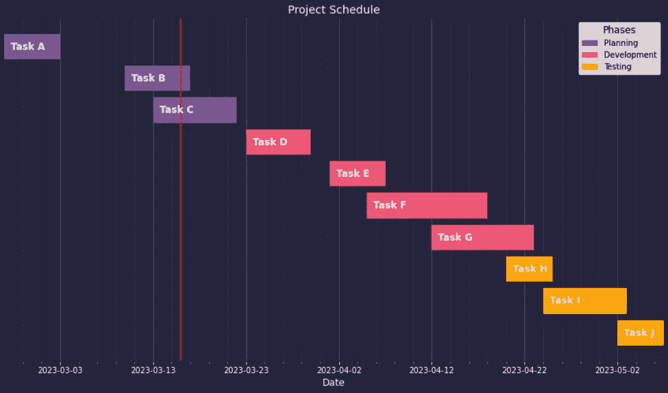
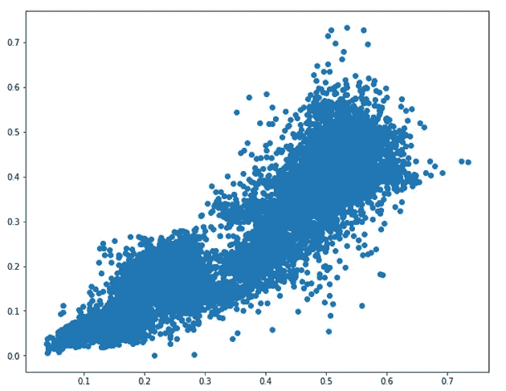

# 3 个你可能没想到使用 Matplotlib 创建的独特图表

> 原文：[`towardsdatascience.com/3-unique-charts-created-with-matplotlib-you-probably-havent-seen-before-421ab8cdd36f?source=collection_archive---------13-----------------------#2023-03-20`](https://towardsdatascience.com/3-unique-charts-created-with-matplotlib-you-probably-havent-seen-before-421ab8cdd36f?source=collection_archive---------13-----------------------#2023-03-20)

## 利用 Python 的 Matplotlib 创建高级数据可视化

 [安迪·麦克唐纳](https://andymcdonaldgeo.medium.com/?source=post_page-----421ab8cdd36f--------------------------------)

·

[关注](https://medium.com/m/signin?actionUrl=https%3A%2F%2Fmedium.com%2F_%2Fsubscribe%2Fuser%2F9c280f85f15c&operation=register&redirect=https%3A%2F%2Ftowardsdatascience.com%2F3-unique-charts-created-with-matplotlib-you-probably-havent-seen-before-421ab8cdd36f&user=Andy+McDonald&userId=9c280f85f15c&source=post_page-9c280f85f15c----421ab8cdd36f---------------------post_header-----------) 发表在 [Towards Data Science](https://towardsdatascience.com/?source=post_page-----421ab8cdd36f--------------------------------) · 7 分钟阅读 · 2023 年 3 月 20 日

--

使用 matplotlib 创建的示例甘特图 — 图片由作者提供。

通常，[matplotlib](https://matplotlib.org/) 有时会被认为是创建乏味图形且使用不便的工具。然而，凭借一些耐心、研究和额外的 Python 代码，我们可以创建一些独特且视觉上非常吸引人的图形。

在学习 python 时，[matplotlib](https://matplotlib.org/) 通常是人们遇到的第一个数据可视化库。只需几行代码，你就可能生成如下所示的图形。之后，许多人会转向学习 [Seaborn](https://seaborn.pydata.org/) 或 [Plotly](https://plotly.com/)，再也不回头。

一个基本的 matplotlib 散点图示例。图片由作者提供。

然而，有时你可能想要创建一个非常具体的图形，而这些高级库无法精确地实现你的需求。或者，也许你想要享受创建独特可视化的乐趣。这时，[matplotlib](https://matplotlib.org/) 便再次发挥作用。

[Matplotlib](https://matplotlib.org/) 是一个低级库，允许你修改图形中的几乎所有元素。这包括标签、刻度线、坐标轴等等。然而，它可能会显得繁琐和不便…
