# 高斯混合模型（GMM）的 3 个应用场景

> 原文：[`towardsdatascience.com/3-use-cases-for-gaussian-mixture-model-gmm-72951fcf8363?source=collection_archive---------1-----------------------#2023-07-27`](https://towardsdatascience.com/3-use-cases-for-gaussian-mixture-model-gmm-72951fcf8363?source=collection_archive---------1-----------------------#2023-07-27)

## 特征工程、无监督分类以及使用 GMM 算法的异常检测

 [Viyaleta Apgar](https://viyaleta.medium.com/?source=post_page-----72951fcf8363--------------------------------)

·

[关注](https://medium.com/m/signin?actionUrl=https%3A%2F%2Fmedium.com%2F_%2Fsubscribe%2Fuser%2Fccae8864d5a4&operation=register&redirect=https%3A%2F%2Ftowardsdatascience.com%2F3-use-cases-for-gaussian-mixture-model-gmm-72951fcf8363&user=Viyaleta+Apgar&userId=ccae8864d5a4&source=post_page-ccae8864d5a4----72951fcf8363---------------------post_header-----------) 发布于 [Towards Data Science](https://towardsdatascience.com/?source=post_page-----72951fcf8363--------------------------------) ·10 分钟阅读·2023 年 7 月 27 日

--

高斯混合模型（GMM）是一种简单而强大的无监督分类算法，基于 K-means 算法来预测每个实例的分类概率。GMM 的这一特性使其在许多应用中都具有很大的灵活性。在本文中，我将讨论 GMM 如何用于特征工程、无监督分类和异常检测。

# 高斯混合模型（GMM）是什么？

## 模型描述

尽管单一或多个变量的数据集的高斯分布试图以概率方式表示整个数据集，GMM 假设数据集中存在子群体，并且每个子群体遵循其自己的正态分布。以无监督的方式，GMM 试图学习数据中的子群体及其对每个数据点的概率表示[1]。GMM 的这一特性使我们能够使用模型找到属于任何子群体的概率较低的点，从而将这些点分类为异常值。

GMM 本质上是通过利用组件来表示这些子群体，并修改多变量概率分布函数以适应组件，从而扩展了多变量高斯分布以适应子群体情况。温馨提醒，多变量高斯分布的概率密度函数如下：

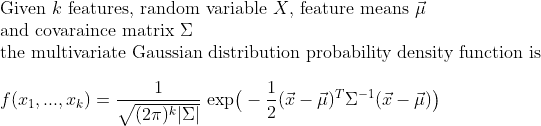

多变量高斯分布的概率密度函数

在 GMM 中，每个实例的概率被修改为所有组件的概率和，组件权重被参数化为𝜙。GMM 要求所有组件权重的总和为 1，以便将每个组件视为整体的一个比率。GMM 还结合了每个组件的特征均值和方差。模型如下：

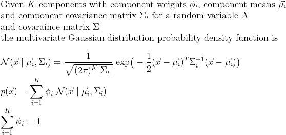

GMM 模型的公式

注意多变量分布与 GMM 之间的相似性。实质上，GMM 算法为每个组件找到正确的权重，这些组件被表示为多变量高斯分布。在他的文章中，[Oscar Contreras Carrasco](https://medium.com/u/91a848e356c8?source=post_page-----72951fcf8363--------------------------------)对 GMM 做了精彩的推导[2]。

模型的参数可以通过随机初始化或使用特定策略进行初始化，模型的组件权重𝜙通过重复的期望最大化（EM）步骤来确定[1]。

## 模型算法

GMM 的实施的第一部分是**组件的初始化**。GMM 的实施包括初始化步骤，随后是迭代的**期望最大化**（EM）过程，直到收敛：

**第 1 步：** 在***初始化***步骤中，模型参数被初始化：*K*值从数据集中随机分配为组件均值；组件方差根据随机分配的均值计算；所有组件权重被赋值为 1/*K*。

**步骤 2：** 在***期望步骤***中，我们计算每个数据点由每个组件生成的概率。每个数据点-组件对的期望是该特定组件的权重乘以我们数据点属于该组件的概率（给定组件均值和方差），作为所有其他组件概率的一个分数，参数化为各自的组件权重。基本上，期望步骤尝试找出每个点属于每个组件的可能性，并利用这个值来逐步调整模型参数直到收敛。

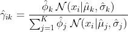

期望步骤的公式

**步骤 3：** 在***最大化步骤***中，我们重置组件的权重和均值，并根据期望步骤中的γ值重新计算方差。新的组件权重设置为该组件所有数据点期望值的总和。每个组件的新均值是所有数据点的平均值，加权由期望值决定。

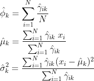

最大化步骤的公式

就像在 k-means 算法中一样，如果组件的数量事先不可用，那么猜测组件的数量*K*是合适的。

下面是 GMM 收敛的视觉示例。在这里，GMM 展示了在具有两个簇的二维数据集上的收敛。该算法的行为类似于 k-means，但不同之处在于它估计概率密度（而不是纯粹对样本数据点的分类）。

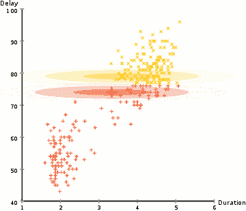

旧忠实数据的 EM 聚类 [[3](https://commons.wikimedia.org/wiki/File:EM_Clustering_of_Old_Faithful_data.gif)]

让我们看看这个算法如何应用于我们的三个用例。

# 特征工程中的 GMM

尽管一些机器学习模型（如臭名昭著的 XGBoost）可以学习各种输入特征分布，但其他模型对其要求更为严格。线性回归、逻辑回归、线性判别分析（LDA）和多变量高斯通常期望特征呈正态分布，如果数据是多模态的，可能效果不佳。我们可能还有其他分析和视觉上的原因需要处理多模态，而 GMM 可以帮助我们实现这一点。

我们来看一个虚构书店数据集中双峰特征的示例。我从 Kaggle 数据库中提取了这些数据（[链接在此](https://www.kaggle.com/datasets/sbonelondhlazi/bookstore-dataset)），其中包含从 [books.toscrape.com](http://books.toscrape.com/) [7] 爬取的数据。该数据集包含典型的书店信息，如书名、类别、价格和评分。它还包含书籍数量，这决定了虚构书店库存中的书籍总数。巧合的是，这些书籍具有双峰分布。我们来看看是否可以使用 GMM 作为特征工程技术，从书籍数量数据中创建两个独立的特征。

我使用以下代码在 Python 中实现了这一任务：

让我们查看结果。左侧的图表显示了书籍数量的原始分布。右侧的图表显示了每个预测组件的分布，在 GMM 转换之后。请注意，完整分布的形状完全相同，但两个组件在特定点处拆分了原始分布，创建了两个（大多）正常的直方图。如果我对分割两个组件的点不满意，我可以使用 GMM 预测的概率来调整组件 1 结束和组件 2 开始的位置。

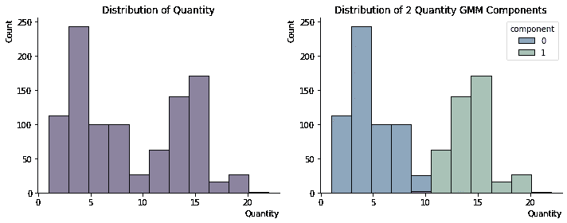

数量在 GMM 之前和之后的分布 [[9](https://github.com/viyaleta/Medium-Code-Examples/blob/main/GMM/3%20Use-Cases%20for%20GMM.ipynb)]

# GMM 用于无监督分类

GMM 的另一个应用场景是无监督分类。在这方面，GMM 的工作方式类似于 K-means 算法，但允许对类别归属进行概率性判断（不同于 K-means，其中输出是一个二元度量）。这对于需要自定义分类阈值或简单要求概率输出的用例特别有益。

对于这个例子，我下载了企鹅数据集（[在 Kaggle 上提供](https://www.kaggle.com/datasets/parulpandey/palmer-archipelago-antarctica-penguin-data)），并选择了两个特征以进行可视化演示：企鹅的喙长度和深度（喙是企鹅喙的顶部脊）[[8](https://www.kaggle.com/datasets/parulpandey/palmer-archipelago-antarctica-penguin-data)]。我删除了空值数据点，并创建了散点图以描绘数据。

当我们查看散点图时，3 个潜在的组脱颖而出。如果我们为实际类别上色，我们会发现，事实上，三种企鹅与三组数据点对齐。这个例子非常基础，因为在现实世界中，我们通常处理的是多维数据，且没有简单的方法来确定数据集中存在多少个子群体。尽管如此，我们还是来看看 GMM 如何帮助我们对数据进行分割。

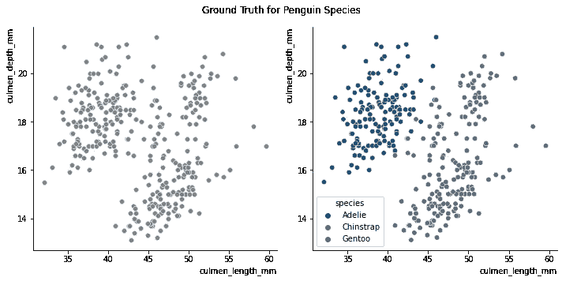

描述企鹅喙长与深度的散点图 [[9](https://github.com/viyaleta/Medium-Code-Examples/blob/main/GMM/3%20Use-Cases%20for%20GMM.ipynb)]

在下面的 Python 代码片段中，我下载了数据集，删除了空值，选择了两个感兴趣的特征，并将 GMM 模型拟合到它们上面。`sklearn`提供了两种预测选项——预测类别和预测类别归属的概率。每个数据点的概率总和等于 1（根据 GMM 算法约束）。

让我们看看每个数据点属于每个组件的概率。下面的三个散点图显示了每个组件实例的概率。透明度较高的点具有较低的概率，而颜色较亮的点具有较高的概率。在下图中，我们可以看到，GMM 对位于不同组件之间的点预测了更大的不确定性，这在预期之中。我们可以使用`gmm.predict_proba()`函数来控制类别归属。

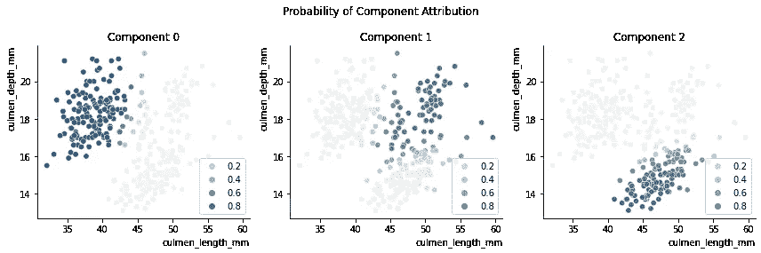

描述每个预测类别的类归属概率的散点图 [[9](https://github.com/viyaleta/Medium-Code-Examples/blob/main/GMM/3%20Use-Cases%20for%20GMM.ipynb)]

# 用于异常检测的 GMM

在我的之前的故事中，我分享了异常检测的基础知识以及统计方法在检测异常中的应用[6]。也就是说，我使用多变量高斯分布来识别低概率符合正态分布的数据点。然而，这种方法的问题是我们的数据往往更复杂。高斯混合模型（GMM）尝试解决多模态问题，并且在特征形成正态分布特征关系的子群体的情况下非常有用。

在这个最后的例子中，我将使用来自[ODDS library](http://odds.cs.stonybrook.edu/wine-dataset/) [10]的葡萄酒数据集。这是我在我的帖子中使用的数据集，在那里我应用了多变量高斯分布来检测离群点。让我们看看我是否可以改进之前的结果，在那个结果中，41 个实例被错误分类，其中 40 个被错误识别为异常点。相比多变量高斯分布方法，第一个优点是我们可以使用所有特征，而不限于仅正态分布的特征。第二个优点是我们可以考虑数据子群体。

GMM 最显著的优势可能是该模型可以帮助发现两种类型的异常数据：一种是人口中的离群点（例如数据录入错误），另一种是形成自己组的异常（例如信用卡欺诈行为）。在葡萄酒数据集中，正实例被构建为两种类型的葡萄酒样本，而数据集中的异常被构建为第三种葡萄酒的子样本 [10]。因此，我们很可能会发现我们的离群点在这个实例中构成了自己的组。

由于我们的数据集中有 13 个特征，让我们将数据汇总到前两个 PCA 组件中并绘制它们。在下面的图表中，我们将看到散点图包含一个密集区域和大约二十个分散的点。数据中没有明显的子群体。

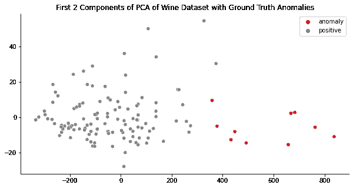

前两个 PCA 组件的散点图，显示真实的异常情况 [[9](https://github.com/viyaleta/Medium-Code-Examples/blob/main/GMM/3%20Use-Cases%20for%20GMM.ipynb)]

下面的代码片段使用`sklearn`库中的 2 个组件和标准输入字段来拟合 GMM 模型到我们的数据集。希望一个组件能够识别正实例，而另一个组件能够识别异常。

预测组件的编号是随机的，因此我做了一些背景处理来重新标记预测。你可以查看我的 [Jupyter notebook](https://github.com/viyaleta/Medium-Code-Examples/blob/main/GMM/3%20Use-Cases%20for%20GMM.ipynb) 以获取更多关于如何做到这一点的指导。

结果看起来很好！我们没有假阴性，并且有 11 个错误识别的异常。如果这是现实世界，我们在运行此模型后只需人工检查大约 15%的数据。这已经是对多变量高斯分布方法的显著改进。

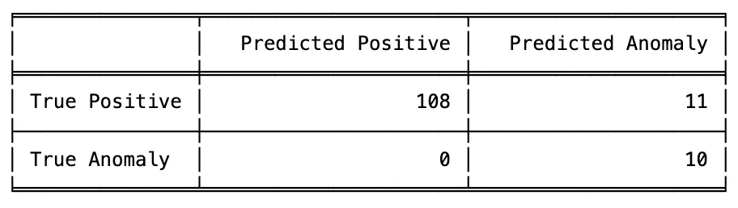

GMM 结果的混淆矩阵 [[9](https://github.com/viyaleta/Medium-Code-Examples/blob/main/GMM/3%20Use-Cases%20for%20GMM.ipynb)]

如果我们绘制结果，可以看到被错误识别的异常情况实际上更接近最密集的区域。再次强调，我们仅使用前两个 PCA 组件进行可视化，GMM 在对数据点进行分类时做了更多工作。

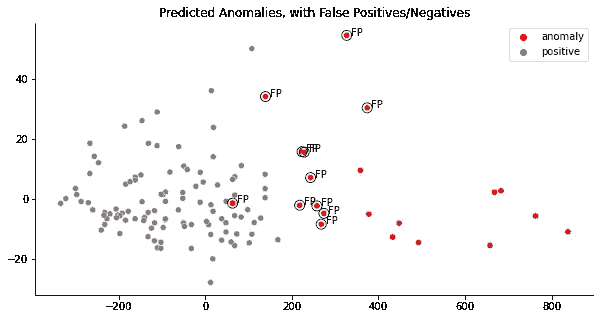

前两个 PCA 组件的散点图，显示预测的异常情况 [[9](https://github.com/viyaleta/Medium-Code-Examples/blob/main/GMM/3%20Use-Cases%20for%20GMM.ipynb)]

我们可能通过分析预测的异常概率来改进这个结果。下面，我已经为错误识别的异常实例和真实异常实例绘制了这些概率（没有预测的假阴性）。

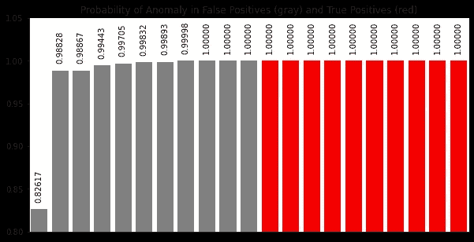

条形图显示了在错误识别的异常和真实异常之间的异常类别归属概率 [[9](https://github.com/viyaleta/Medium-Code-Examples/blob/main/GMM/3%20Use-Cases%20for%20GMM.ipynb)]

我们可以看到大多数错误识别的异常概率低于 0.9999。因此，我们可以使用预测的异常概率并设置新的阈值，而不是使用默认分类。如果我们将阈值设置为大于 0.9999 的异常检测，我们将只有 3 个错误识别的异常。这可以用一行代码完成：`components = np.where(proba>0.9999, 1, 0)`。在某些情况下，改变阈值可能会增加我们最终结果中的假阴性。幸运的是，这种情况并不存在。

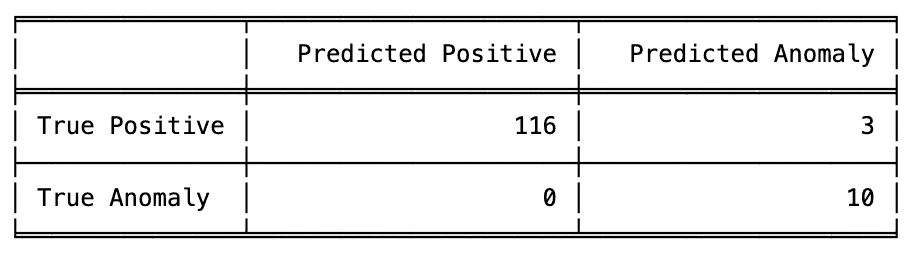

GMM 结果的混淆矩阵，在降低提高概率阈值之后 [[9](https://github.com/viyaleta/Medium-Code-Examples/blob/main/GMM/3%20Use-Cases%20for%20GMM.ipynb)]

在以下 PCA 散点图中，我们可以看到我们的模型仍然预测了 3 个错误识别的异常，但通过新的改进，我们只需手动检查 10% 的数据实例以检测异常。考虑到 8% 的数据实际上是异常的，这真是太棒了！

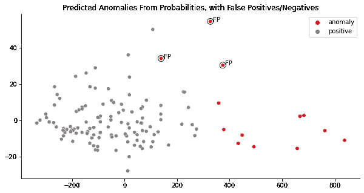

提高异常概率阈值后的前 2 个 PCA 组件的散点图 [[9](https://github.com/viyaleta/Medium-Code-Examples/blob/main/GMM/3%20Use-Cases%20for%20GMM.ipynb)]

预测类别概率的能力使得 GMM 成为数据科学中一个强大而多用途的工具。尽管它有与 K-means 同类的相同限制，GMM 在特征工程、更灵活的无监督分类和异常检测中非常有用。

我在写这篇文章时非常开心，读它的时候也同样开心。我总是欢迎反馈和问题，所以一定要利用评论区。如果你希望直接反馈，可以随时[在 LinkedIn 上找到我](https://www.linkedin.com/in/viyaleta/)。

## 来源：

1.  [`brilliant.org/wiki/gaussian-mixture-model/`](https://brilliant.org/wiki/gaussian-mixture-model/)

1.  `towardsdatascience.com/gaussian-mixture-models-explained-6986aaf5a95`

1.  [`commons.wikimedia.org/wiki/File:EM_Clustering_of_Old_Faithful_data.gif`](https://commons.wikimedia.org/wiki/File:EM_Clustering_of_Old_Faithful_data.gif)

1.  `towardsdatascience.com/understanding-anomaly-detection-in-python-using-gaussian-mixture-model-e26e5d06094b`

1.  [`scikit-learn.org/stable/modules/generated/sklearn.mixture.GaussianMixture.html#sklearn.mixture.GaussianMixture.fit`](https://scikit-learn.org/stable/modules/generated/sklearn.mixture.GaussianMixture.html#sklearn.mixture.GaussianMixture.fit)

1.  `towardsdatascience.com/the-basics-of-anomaly-detection-65aff59949b7`

1.  [`www.kaggle.com/datasets/sbonelondhlazi/bookstore-dataset`](https://www.kaggle.com/datasets/sbonelondhlazi/bookstore-dataset)

1.  [`medium.com/r/?url=https%3A%2F%2Fwww.kaggle.com%2Fdatasets%2Fparulpandey%2Fpalmer-archipelago-antarctica-penguin-data`](https://www.kaggle.com/datasets/parulpandey/palmer-archipelago-antarctica-penguin-data)

1.  [`github.com/viyaleta/Medium-Code-Examples/blob/main/GMM/3%20Use-Cases%20for%20GMM.ipynb`](https://github.com/viyaleta/Medium-Code-Examples/blob/main/GMM/3%20Use-Cases%20for%20GMM.ipynb)

1.  Saket Sathe 和 Charu C. Aggarwal. LODES: 局部密度与谱异常检测的结合。SIAM 数据挖掘会议，2016\. [`odds.cs.stonybrook.edu/wine-dataset/`](http://odds.cs.stonybrook.edu/wine-dataset/)
