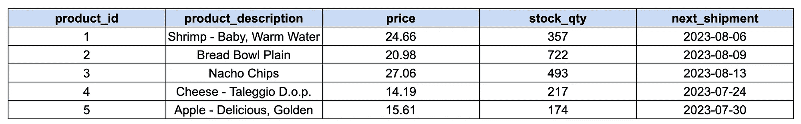

# SQL CASE WHEN 语句的 3 种使用场景

> 原文：[`towardsdatascience.com/3-use-cases-for-sql-case-when-statement-51e8e2829218?source=collection_archive---------12-----------------------#2023-07-14`](https://towardsdatascience.com/3-use-cases-for-sql-case-when-statement-51e8e2829218?source=collection_archive---------12-----------------------#2023-07-14)

## 通过示例进行解释

 [Soner Yıldırım](https://sonery.medium.com/?source=post_page-----51e8e2829218--------------------------------)

·

[关注](https://medium.com/m/signin?actionUrl=https%3A%2F%2Fmedium.com%2F_%2Fsubscribe%2Fuser%2F2cf6b549448&operation=register&redirect=https%3A%2F%2Ftowardsdatascience.com%2F3-use-cases-for-sql-case-when-statement-51e8e2829218&user=Soner+Y%C4%B1ld%C4%B1r%C4%B1m&userId=2cf6b549448&source=post_page-2cf6b549448----51e8e2829218---------------------post_header-----------) 发表于 [Towards Data Science](https://towardsdatascience.com/?source=post_page-----51e8e2829218--------------------------------) ·4 分钟阅读·2023 年 7 月 14 日

--

图片由 [Tobias Fischer](https://unsplash.com/@tofi?utm_source=unsplash&utm_medium=referral&utm_content=creditCopyText) 提供，来源于 [Unsplash](https://unsplash.com/photos/PkbZahEG2Ng?utm_source=unsplash&utm_medium=referral&utm_content=creditCopyText)

简而言之，`CASE WHEN` 语句根据给定条件进行评估，并返回基于该评估的结果。

我们可以用它从现有列中派生新列。但在其他情况下，`CASE WHEN` 也很有用来解决复杂任务。

本文将学习以下内容：

+   使用`CASE WHEN`派生新列

+   在`GROUP BY`中使用`CASE WHEN`

+   在基于派生类别计算聚合时使用`CASE WHEN`

我们将查询一个我创建的`product_inventory`表，该表包含[模拟数据](https://medium.com/@sonery/generate-mock-data-of-any-format-with-mockaroo-9345facabc1e)。以下是该表的前五行：

（图像由作者提供）

## 1\. 使用 Case When 派生新列

`CASE WHEN`（或`CASE`）语句允许评估条件，其结果可以用于创建新列。

（图像由作者提供）
