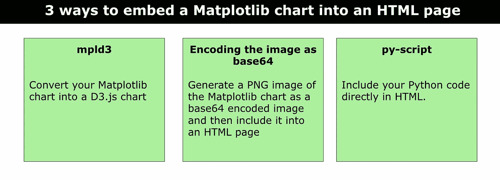

# 将 Matplotlib 图表嵌入 HTML 页面的 3 种方法

> 原文：[`towardsdatascience.com/3-ways-to-embed-a-matplotlib-chart-into-an-html-page-8e11fa66a4b0?source=collection_archive---------4-----------------------#2023-06-22`](https://towardsdatascience.com/3-ways-to-embed-a-matplotlib-chart-into-an-html-page-8e11fa66a4b0?source=collection_archive---------4-----------------------#2023-06-22)

## 数据可视化，Web 应用

## 关于如何将 Matplotlib 图表导入 HTML 文件的教程

 [Angelica Lo Duca](https://alod83.medium.com/?source=post_page-----8e11fa66a4b0--------------------------------)

·

[关注](https://medium.com/m/signin?actionUrl=https%3A%2F%2Fmedium.com%2F_%2Fsubscribe%2Fuser%2Ff8bc34d63aee&operation=register&redirect=https%3A%2F%2Ftowardsdatascience.com%2F3-ways-to-embed-a-matplotlib-chart-into-an-html-page-8e11fa66a4b0&user=Angelica+Lo+Duca&userId=f8bc34d63aee&source=post_page-f8bc34d63aee----8e11fa66a4b0---------------------post_header-----------) 发布于 [Towards Data Science](https://towardsdatascience.com/?source=post_page-----8e11fa66a4b0--------------------------------) · 5 分钟阅读 · 2023 年 6 月 22 日

--

作者提供的图片

Python 提供了许多库来执行不同的操作，包括数据可视化。然而，你可能会发现将使用 Matplotlib 构建的图表集成到 HTML 页面中是复杂的。最简单的解决方案是将图表导出为静态图像，例如 PNG 或 JPEG，然后将其集成到 HTML 页面中。然而，如果使用静态图像，你会失去原始图表的所有交互性。

另一种解决方案可能是使用外部框架，例如 [Streamlit](https://streamlit.io/) 或 [Flask](https://flask.palletsprojects.com/en/2.3.x/)，但在这两种情况下，你必须设置一个独立的 Web 服务器来提供你的图像。这种解决方案可能太昂贵了。在我们镇上，我们说用大炮打苍蝇！

本博客文章展示了将 Matplotlib 图表嵌入 HTML 页面的三种策略。这三种解决方案是：

+   使用 mpld3 库

+   将图像编码为 base64

+   使用 `py-script`。

在描述每种解决方案之前，让我们描述一下我们将用于演示这三种情况的情景。

# 情景
