# 34% 更快的整数到字符串转换算法

> [原文](https://towardsdatascience.com/34-faster-integer-to-string-conversion-algorithm-c72453d25352?source=collection_archive---------0-----------------------#2023-12-04)

## *我们打印整数的速度够快吗？*

  [Tigran Hayrapetyan](https://medium.com/@tigran.cs?source=post_page-----c72453d25352--------------------------------)

·

[关注](https://medium.com/m/signin?actionUrl=https%3A%2F%2Fmedium.com%2F_%2Fsubscribe%2Fuser%2F36e8a35f28b3&operation=register&redirect=https%3A%2F%2Ftowardsdatascience.com%2F34-faster-integer-to-string-conversion-algorithm-c72453d25352&user=Tigran+Hayrapetyan&userId=36e8a35f28b3&source=post_page-36e8a35f28b3----c72453d25352---------------------post_header-----------) 发表在 [Towards Data Science](https://towardsdatascience.com/?source=post_page-----c72453d25352--------------------------------) ·14 min read·2023 年 12 月 4 日

--


# 1. 介绍

在计算机编程中，将给定的整数转换为字符串是一项常见操作，例如在将整数打印到屏幕上或任何文本文件（如 *.xml, *.json, *.csv, *.txt 等）之前需要进行此操作。

众所周知，整数（以及其他所有内容）在计算机内存中以二进制格式存储——即 0 和 1 的序列。例如：

+   数字 12 在内存中的表示为“1100”。

+   数字 29 被表示为“11101”。

这就是为什么每次我们想要将其转换为人类可读的十进制格式时，需要进行这样的转换。

在这个故事中，我将要：

+   对用于这种转换的标准算法进行概述，

+   观察其现有的优化，

+   提出我的算法，并且

+   展示他们的实验比较。

我们将看到，我的算法对于 32 位整数运行**25–38%**更快，对于 64 位整数运行**40–58%**更快，相比于优化的标准算法。其在 C++语言中的实现可以在 GitHub 上找到，如文末引用。

当然，如果应用在其生命周期内只打印少量整数，那么负责将它们转换为字符串的算法不会成为瓶颈。但是，对于那些将大量数据打印到文本文件中的情况，转换算法的效率就开始发挥作用。在数据科学或机器学习等领域，转换大量整数为字符串的需求很常见，例如在将数据集导出到文本文件时，如*.csv 或*.json。

# 2\. 标准转换算法

将整数转换为字符串是一个常见操作，任何现代编程语言中都有实现这样的算法，无论是作为语言的一部分还是作为标准库的一部分。而且这个算法几乎在所有地方都是相同的——基于反复获取并提取整数的最后一个数字，然后继续处理剩余部分。

为了获得给定整数*N*的最后一位数字，它只是计算其除以 10 的余数：

> “digit := N mod 10”,

并且为了提取它，执行整数除法：

> “N := N / 10”。


*给定一个整数 N，它的最后一位数字

其余部分正在计算中。*

请注意，在这个故事中，当除以两个整数时，我们将假设只取结果的整数部分。

作为完整算法的示例，当打印数字“*N* = 2'167”时，将执行以下操作：

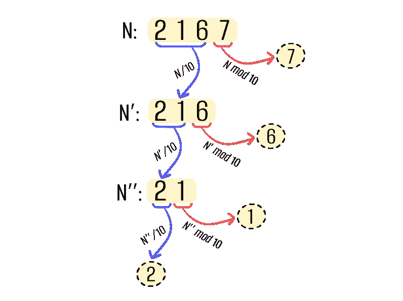

*打印数字“2167”的操作：

第一步：2167 % 10 = 7（存储数字“7”），2167 / 10 = 216（继续处理 216），

第二步：216 % 10 = 6（存储数字“6”），216 / 10 = 21（继续处理 21），

第三步：21 % 10 = 1（存储数字“1”），21 / 10 = 2（继续处理 2），

第四步：由于“2 < 10”，只存储最后一个数字“2”。

第五步：（未示例）反转存储的数字的顺序并打印它们。*

请注意，当我们处理 1 位整数（即范围为[0..9]）时，我们可以直接发送进行打印，因为这些 10 个数字中的每一个对应的字符已经固定。且除以 10 的余数总是 1 位整数。

我们还可以注意到，这个算法报告的* N *的数字是倒序的（这里我们得到的数字序列是‘7’，‘6’，‘1’，‘2’，而不是‘2’，‘1’，‘6’，‘7’），所以在最后需要将生成的序列进行反转。

总结一下，它的伪代码如下：

```py
var result[0 .. 25] : Array of Characters  // Assume at most 25 characters

// The procedure takes integer 'N' to be printed, and fills its
// decimal characters into 'result' array.
procedure print( N: Integer )
    i := 0  // Index over 'result' array
    while N > 0
        result[ i ] := '0' + (N mod 10)  // Take the last digit
        N := ⌊ N / 10 ⌋   // Pick out the last digit
        i := i+1
    result[ i ] := '\0'  // Append the terminating 'null' character
    reverse array result[0 .. i-1]
```

描述的算法很简单，我们可以用 3–4 行代码轻松实现。但它的瓶颈在于对*N*的每一位小数表示使用了两个相对昂贵的操作——整数除法和整数余数计算。众所周知，整数除法和余数计算平均花费的时间比两个整数的加法、减法甚至乘法要长 4–5 倍。这里我们可以观察到上述算术操作的时间基准：

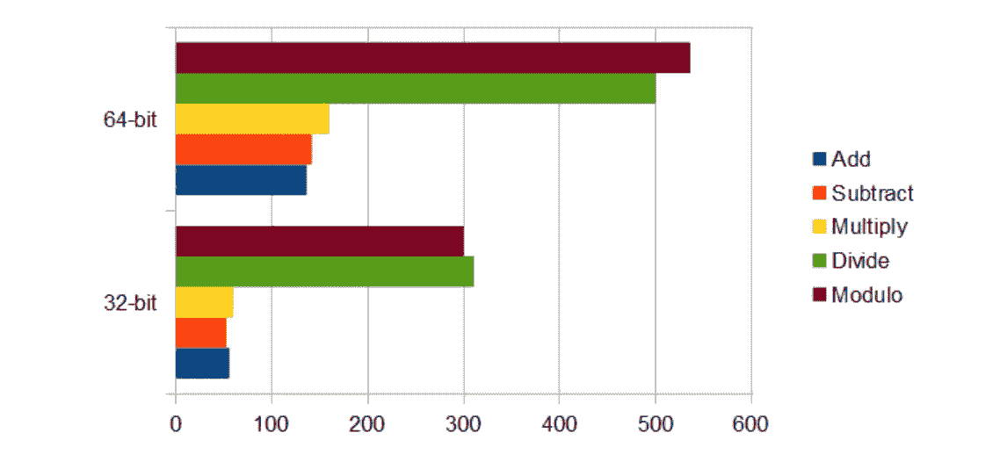

*时间（以纳秒为单位）花费的实验比较，用于执行 5 种类型的

算术操作（每个操作在随机数据上运行 200 次）。

我们可以看到最后两个操作（整数除法和余数计算）

花费的时间显著更多。此外，我们看到整数乘法

执行的速度几乎与加法或减法一样快。*

实验是在以下系统下使用 Google Benchmark 进行的：

*CPU: Intel Core i7–11800H @ 2.30GHz

内存：16.0 GB

操作系统：Windows 11 Home，64 位

编译器：MSVC 2022 (/O2 /Ob2 /MD /GR /Gd)*

让我们看看是否存在更快的整数打印方法…

# 3\. 现有优化

## 优化 1

对于描述的算法，一个常见的优化是消除最后一步反转生成的数字序列。这个技巧在例如 [1] 中有很好的介绍。在这个优化中，我们将数字直接按正确的顺序写入缓冲区。由于算法本身从右到左报告给定整数*N*的数字，所以我们也将它们从右到左写入缓冲区。

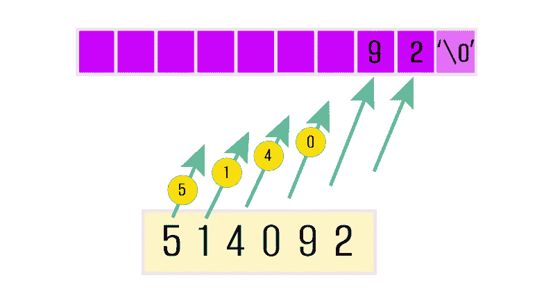

*将生成的数字从右到左填入结果数组，

直接以它们在最终位置的顺序。*

伪代码将如下所示：

```py
var result[0 .. 25] : Array of Characters  // Assume at most 25 characters

// The function takes integer 'N' to be printed, and returns position 
// of its converted first character in the 'result' array.
function print( N: Integer ) : Integer
    result[ 25 ] := '\0'  // Place the terminating 'null' character at the end
    i := 25  // Index over 'result' array
    while N > 0
        i := i-1  // Here we go to left, for placing the next digit
        result[ i ] := '0' + (N mod 10)  // Take the last digit
        N := ⌊ N / 10 ⌋  // Pick out the last digit
    return i  // Position from where the converted integer starts
```

*注意，在本故事的此处和所有其他伪代码中，我们没有处理打印数字“0”的情况。根据所有编写的算法，“0”将显示为没有任何位的序列，因此在几乎所有打印算法中，打印“0”都在一个单独的分支中完成。我们这里只是为了简洁跳过了这个分支。*

这个优化的另一个小优点是我们不需要在每次转换后都写入终止的空字符。相反，我们只需在缓冲区的最后一个位置写入一次，因为*N*的最后一位的物理位置是预先固定的，它将始终是缓冲区中倒数第二个位置。

这种优化的缺点是第一个字符的位置变得可变，因为它取决于整数*N*的位数。

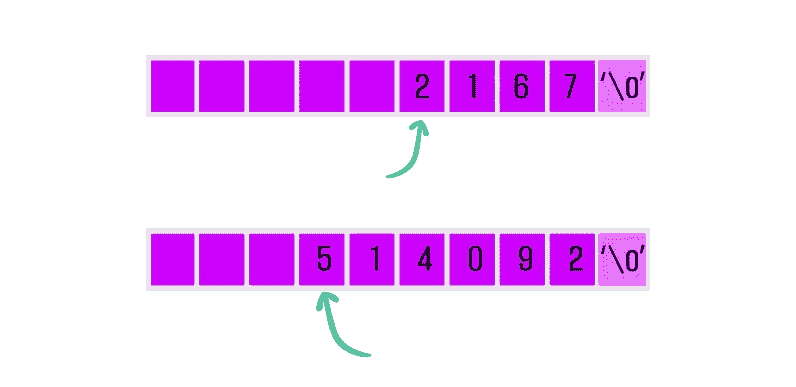

*优化 1 的缺点：不同

位数计数将在输出数组中从不同的位置开始。*

然而，实际上这不会成为问题，因为转换后的整数通常会立即发送到文本文件或屏幕上，因此不会在内存中停留太久。对于这样的目的，我们不需要转换的数字从内存中某个精确指定的位置开始写入。

## 优化 2

下一项优化是通过使用整数除法和余数计算操作来在单一步骤中获取*N*的 2 位数字。这个技巧在[1]和[2]中也有详细记录。为此，我们不再重复计算

> “digit := N mod 10”，接着
> 
> “N := N / 10”，

我们将计算：

> “digits := N mod 100”，接着
> 
> “N := N / 100”，

这将给我们*N*的最后 2 位数字，然后将它们都剪掉。

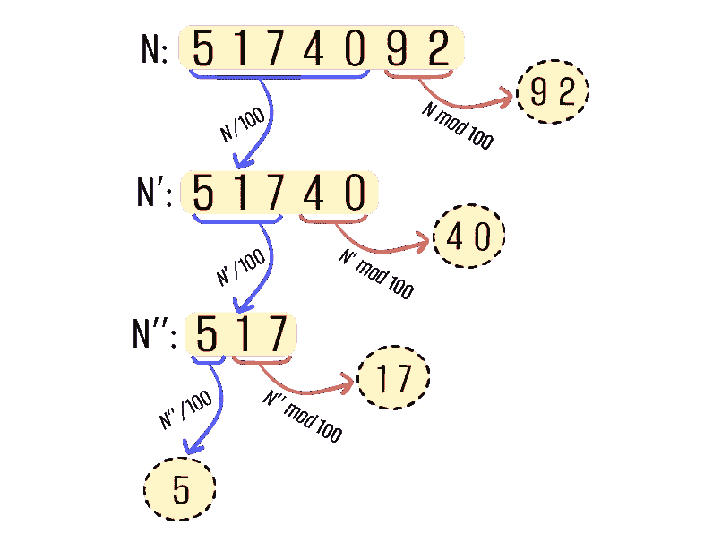

*启用第二个优化的数字“5174092”打印操作：

步骤 1：5174092 % 100 = 92（存储数字“92”），5174092 / 100 = 51740（继续处理 51740），

步骤 2：51740 % 100 = 40（存储数字“40”），51740 / 100 = 517（继续处理 517），

步骤 3：517 % 100 = 17（存储数字“17”），517 / 100 = 5（继续处理 5），

步骤 4：由于“5 < 100”，只存储最后一位数字“5”。*

请注意，为了最终高效地打印这些获得的 2 位数字，我们应该准备一个长度为 100 的数组（索引从 0 到 99——因此对应所有可能的余数“*N* mod 100”），其中的值将是一对字符，从“00”，“01”，“02”，……一直到“98”，“99”。

在此优化中，整数除法和余数操作的数量减少了近 2 倍。

完成这部分后，我想引起你们的注意，即使启用了上述两个优化，我们仍然会进行与给定整数*N*中的数字数量成正比的整数除法和余数计算操作。

# 4. 我的算法

我打算提出另一种算法，这将使 32 位整数的整数打印加速约**25–38%**，64 位整数的加速约**40–58%**。其思想是——如果我们从给定整数*N*中提取数字时不是从右到左，而是从左到右呢？所以首先我们会获得最重要的数字，然后是下一个重要的数字，依此类推，直到只剩下最不重要的数字。如果我们事先不知道*N*的位数，这会变得有点困难，但现在让我们暂时搁置这个问题，假设我们已经知道*N*中有*L*位数字。


*具有 L=7 位的输入数字 N 的示例。*

那么我们如何获得最重要的数字呢？再次使用整数除法，但这次为：

> “digit := N / 10^(L-1)”

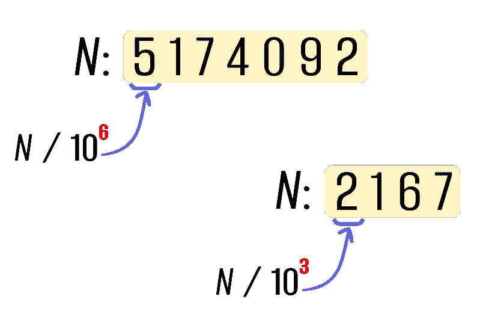

*获取给定整数的最左侧数字的示例。*

那么我们如何从 *N* 中提取它，以便能够继续处理剩余部分？在知道最重要的数字是‘*d*’后，我们可以进行以下减法操作：

> “N := N — d*10^(L-1)”

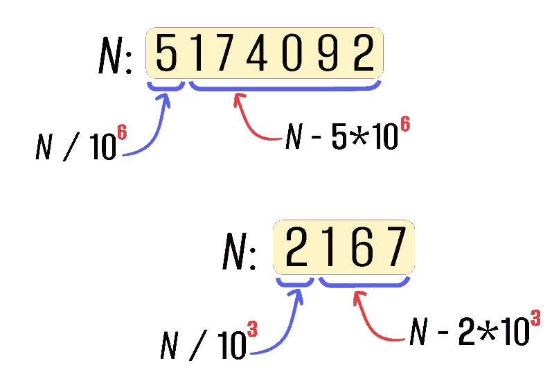

*从给定整数中提取最左边数字的示例。*

后续我们将重复除法和减法操作，直到 *N* 变为 1 位整数（即范围 [0..9]），最终也会打印该数字。让我们看看算法在“*N* = 6'129”情况中的表现。请注意，它有 4 位数字，所以这里我们从“*L*=4”开始。

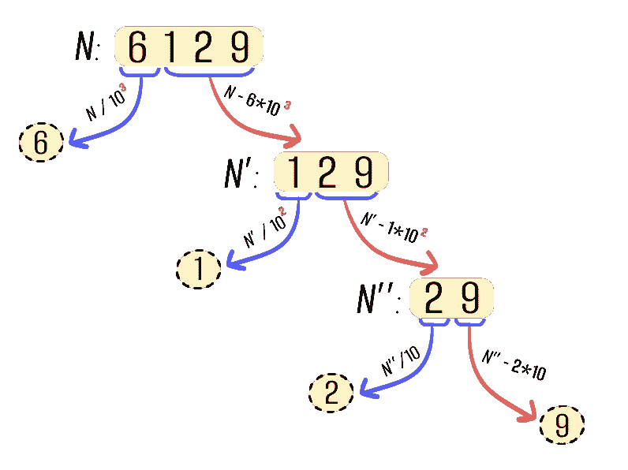

*使用我的算法打印数字“6129”的操作：

步骤 1：6129 / 1000 = 6（打印数字‘6’），6129–6*1000 = 129（继续处理 129），

步骤 2：129 / 100 = 1（打印数字‘1’），129–1*100 = 29（继续处理 29），

步骤 3：29 / 10 = 2（打印数字‘2’），29–2*10 = 9（继续处理 9），

步骤 4：由于“9 < 10”，只需打印最后一位数字‘9’。*

你可能会争辩说，计算不同的 10 的幂比进行整数除法或取余计算更耗时。这绝对正确，除了一个细节：我们可以预计算所有必要的 10 的幂，并在程序的整个执行过程中使用它们。对于 32 位整数，只有 10 个不同的 10 的幂，对于 64 位整数，有 20 个 10 的幂。因此，将它们全部预计算并保存在内存中不会成为问题。

那么总体上我们有什么？为了用我的算法打印一个 *N* 的数字，我们做：

> 1 次整数除法，
> 
> 1 次乘法，以及
> 
> 1 次减法，

与标准算法相比：

> 1 次取余计算以及
> 
> 1 次整数除法。

在下一节中，我们将看到我的方法实际上更好，因为乘法和减法加起来比取余计算消耗的 CPU 时间更少。这些算术操作的时间消耗实验比较在第二章中介绍过。

我算法的主要部分的伪代码可能如下所示：

```py
var powers_of_10[0 .. 10] : Array of Integers 
  = { 1, 10, 100, 1'000, ..., 100'000'000, 1'000'000'000 }
  // Precalculated powers of 10, which will be used during print

var result[0 .. 25] : Array of Characters  // Assume at most 25 characters

// The procedure takes integer 'N' to be printed, and fills its
// decimal characters into the 'result' array.
procedure print( N: Integer )
    L := calculate_digits_count( N )
    i := 0  // Index over 'result' array
    while L > 0
        digit := ⌊ N / powers_of_10[ L-1 ] ⌋  // Obtain left-most digit
        result[ i ] := '0' + digit   // Write it to the 'result' array
        N := N – digit * powers_of_10[ L-1 ]  // Calculate remaining part
        L := L-1  // Adjust its count of digits accordingly
        i := i+1
    result[ i ] := '\0'  // Append the terminating 'null' character
```

由于我的算法从左到右打印 *N* 的数字，我想称之为“左到右打印机”或简短为“LR 打印机”。

还有一件事需要高效找到 *L* — *N* 的十进制数字计数。幸运的是，预计算的 10 的幂数组在这里也会有帮助。我们只需从小的幂次迭代到较大的幂次，直到找到比 *N* 大的幂 10^*L*。然后，指数 *L* 本身将表示 *N* 中的数字计数。

例如，获取“*N* = 23'504”的数字计数如下所示：

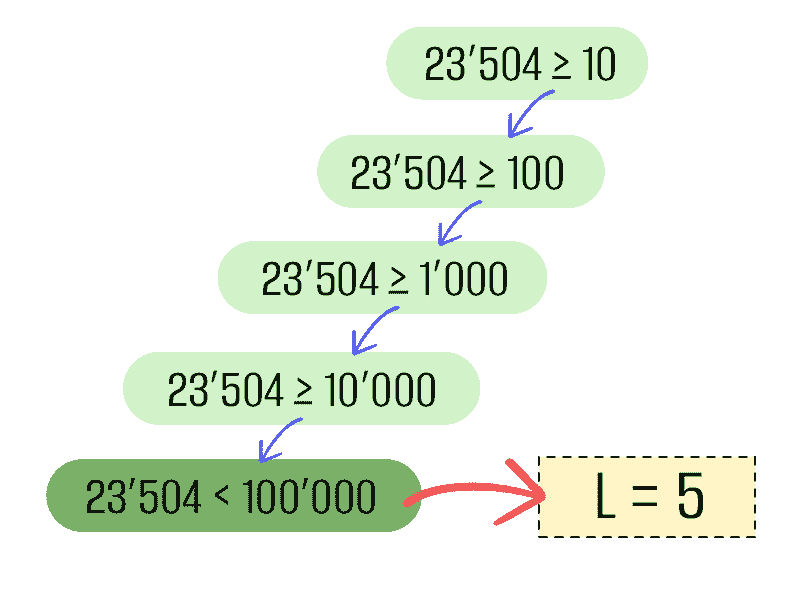

*如何计算数字 N = 23'504 的数字计数 L。*

我们依次将 N 与 10 的幂比较，直到 N 变小。

这发生在 100'000 的幂次上，即 10⁵，因此我们得出结论 L=5。*

该函数的伪代码可能如下所示：

```py
// The function takes integer 'N' and returns count of its digits.
function calculate_digits_count( N: Integer ) : Integer
    // Check case of numbers with maximal count of digits
    if N >= powers_of_10[ 9 ]  // Compare with maximal power of 10
        return 10  // Count of digits for such numbers
    // Regular case
    L := 0
    while N >= powers_of_10[ L ] 
        L := L+1
    return L
```

通过这两个部分，我们提供了将整数转换为字符串的完整算法。

请注意，由于“LR 打印机”从左到右报告 *N* 的数字，因此最后不需要做任何反转。此外，与现有的优化 1 相比，这里我们保留了指定转换后的 *N* 的第一个数字应放置在内存中的位置的能力。

“LR 打印机”可以用于打印任何基数的数字（不仅仅是 base 10）。为此，我们只需要用新基数的预计算幂替换预计算的 10 的幂。

“LR 打印机”在 C++ 语言中的实现可以在 GitHub 上找到，链接为 [3]。

## *“LR 打印机”的优化 2*

我的算法可以通过在“现有优化”部分中描述的第二次优化进行增强，并在 [1] 和 [2] 中进行了记录。如果进行优化，则我们将每次打印 2 位数字，而不是逐位打印。

让我们看看它如何在数字“*N* = 4'610'937”上运行。这里 *L*=7，我们这次从将 *N* 除以 10^(L-2)=10'000 开始：

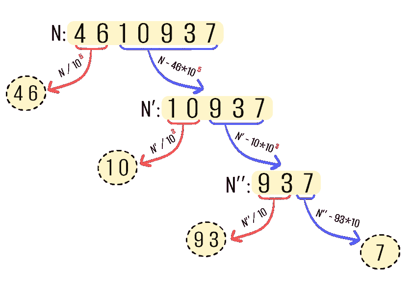

*启用第二次优化的“LR 打印机”打印数字“4610937”的操作：

步骤 1：4610937 / 10⁵ = 46（打印数字‘46’），4610937–46*10⁵ = 10937（继续处理数字 10937），

步骤 2：10937 / 10³ = 10（打印数字‘10’），10937–10*10³ = 937（继续处理数字 937），

步骤 3：937 / 10 = 93（打印数字‘93’），937–93*10 = 7（继续处理数字 7），

步骤 4：由于“7 < 100”，只打印最后一位数字‘7’。*

启用此功能后，我们将花费：

> 1 次整数除法，
> 
> 1 次乘法，以及
> 
> 1 次减法，

每 2 位输入数字。

在这里，数字将按其自然顺序 — 从左到右获取，因此无需在最后进行反转。

启用第二次优化的“LR 打印机”的实现也可以在 GitHub 上找到，链接为 [3]。

# 5\. 与现有算法的实验比较

进行实验比较对于这类工作至关重要，因此在本章中，我将展示以下整数打印算法的比较结果：

+   第一个优化的标准算法（标记为“Std”），

+   我的算法“LR 打印机”（标记为“LR”），

+   标准算法的第二次优化（标记为“Std [2-dig]”）和

+   含第二次优化的“LR 打印机”（标记为“LR [2-dig]”）。

这些算法都在 32 位和 64 位整数上进行了测试，输入数字的位数不同。

## 在 base=10 中打印数字：

在*基数*=10（普通情况）下打印的结果是：

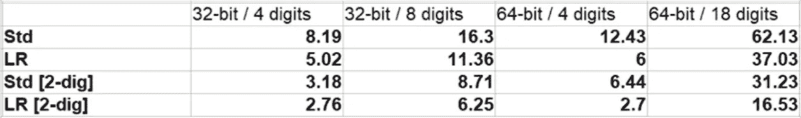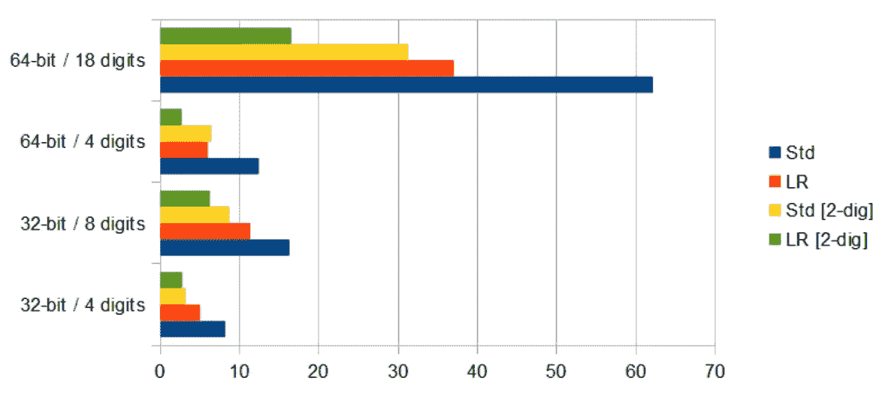

*打印 1 个数字（无论是 32 位还是 64 位）所花费的时间（以纳秒为单位），

具有特定位数的不同算法。

打印是在 base=10 中完成的。*

对于 32 位整数，我们可以看到“LR printer”相较于标准打印机的性能提升约为**30–38%**。当启用第二次优化（每步打印 2 位）时，性能提升较低，为**13–28%**。这是完全预期的，因为总体上我们只执行了 2 或 4 步。

在打印 64 位整数时，我的算法表现更佳。“LR printer”比标准算法快约**40–50%**。当两者都启用第二次优化时，“LR printer”性能提升**47–58%**。

本故事标题中的百分比是通过考虑最常见的情况选择的：当我们在 *base*=10 下处理 32 位整数，并假设它们有许多位数时。在这种情况下，“LR printer”相对于标准算法的性能提升为 30–38%，所以取平均数大约为 34%。

## 在 base=3 中打印数字：

让我们看看在其他基数下打印整数时结果是否会显著不同。我们将观察在数字 *base*=3 中的打印情况：

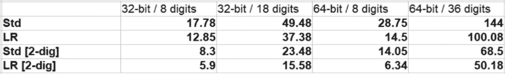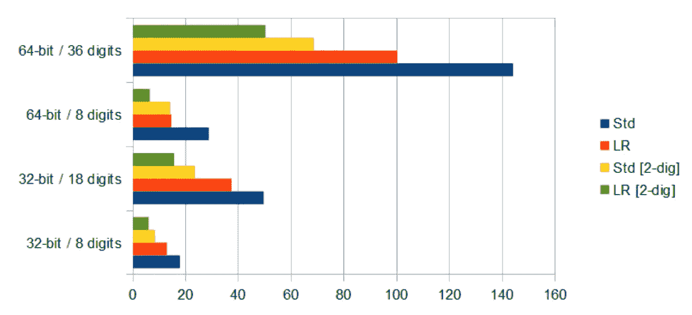

*打印一个数字（无论是 32 位还是 64 位）所花费的时间（以纳秒为单位），

具有一定数量位数的情况下，使用不同算法。

打印是在 base=3 中进行的。

如我们所见，对于 32 位整数，“LR-printer”相对于标准算法的性能提升约为**25–33%**，这通常对应于所使用算术操作的性能差异。

对于 64 位整数，“LR-printer”的性能提升约为短数字（8 位）**50–55%**，长数字（36 位）**27–30%**。

## *总体备注*

通常，整数打印的基数不会对相对性能提升产生太大影响，因为打印过程中要执行的操作数量与输入数字的位数成正比，而不是这些位数可能具有的值的数量。

几乎总是这样，数字位数越多，“LR-printer”（或“LR-printer [2-dig]”变体）比标准打印算法（或其“2-dig”变体）的表现会更好。这一点也很明确，因为位数越多，循环外指令的影响（如从一个函数调用另一个函数或放置空字符）越小。

总体来说，在打印 64 位整数时，“LR-printer”和“LR-printer [2-dig]”变体的结果都更令人印象深刻。

对我个人而言，这些结果相当显著。

# 6. 结论

我们提出了一种将整数转换为字符串的新算法，称为“LR printer”。与优化后的标准转换算法相比，它在 32 位整数上运行**25–38%**更快，在 64 位整数上运行**40–58%**更快。我们的算法可以在任何数字基数下工作（不仅仅是在普通的 base 10 下）。

将整数转换为字符串的算法在仅打印少量数字的应用程序中从不成为瓶颈。但对于其他类型的应用程序，例如自动生成 *.csv、*xml 或 *.json 等文本文件的应用程序，转换算法的效率就显得尤为重要。特别是当这些文本文件将包含大量数字时，例如在导出大型数据集时。

非常感谢你读到最后！很高兴看到你在下面的评论！

> 我向 David Ayrapetyan 表示感谢 ([`www.linkedin.com/in/davidayrapetyan/`](https://www.linkedin.com/in/davidayrapetyan/))，感谢他仔细审阅了本故事的草稿，并提出了多个上下文改进和语法修正。
> 
> 感谢 Hayk Aslanyan ([`www.linkedin.com/in/haykaslanyan/`](https://www.linkedin.com/in/haykaslanyan/))，感谢他对草稿进行了技术审查，并提出了其他改进建议。
> 
> 插图设计由 Asya Papyan 制作: [`www.behance.net/asyapapyan`](https://www.behance.net/asyapapyan)
> 
> 如果你喜欢阅读这个故事，可以在 LinkedIn 上找到我： [`www.linkedin.com/in/tigran-hayrapetyan-88989b12/`](https://www.linkedin.com/in/tigran-hayrapetyan-88989b12/)

# 参考文献

[1] : “整数到字符串转换” — [`tia.mat.br/posts/2014/06/23/integer_to_string_conversion.html`](https://tia.mat.br/posts/2014/06/23/integer_to_string_conversion.html)

[2] : “C++ 的三个优化技巧” — [`www.facebook.com/notes/10158791579037200/`](https://www.facebook.com/notes/10158791579037200/)

[3] : “C++ 语言中的 LR 打印机实现” — [`github.com/tigranh/lr_printer`](https://github.com/tigranh/lr_printer)
