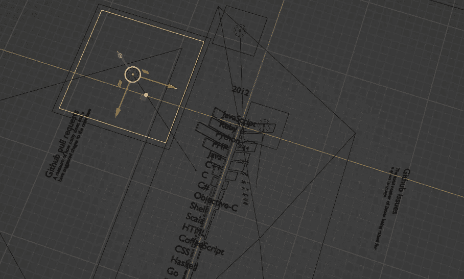
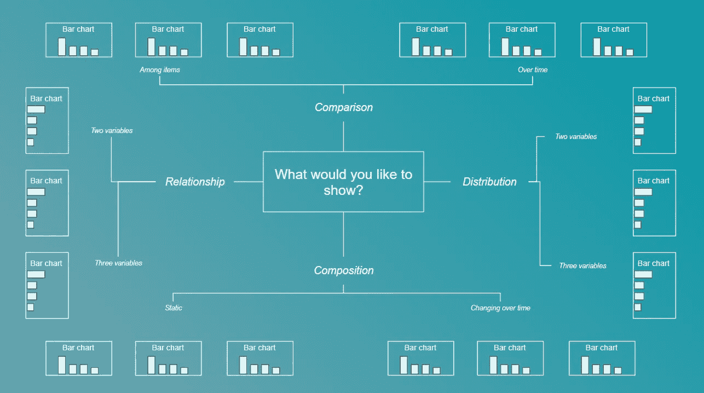

# 3D 和数据可视化中的动态效果

> 原文：[`towardsdatascience.com/3d-and-motion-in-data-visualisation-d25a386810dd?source=collection_archive---------4-----------------------#2023-01-20`](https://towardsdatascience.com/3d-and-motion-in-data-visualisation-d25a386810dd?source=collection_archive---------4-----------------------#2023-01-20)

数据可视化、Python 和 3D 创作软件的完美融合。来源：作者

## 一个许多好莱坞特效背后的开源工具如何帮助创建惊艳的数据可视化

 [Josh Taylor](https://medium.com/@thejoshtaylor?source=post_page-----d25a386810dd--------------------------------)

·

[关注](https://medium.com/m/signin?actionUrl=https%3A%2F%2Fmedium.com%2F_%2Fsubscribe%2Fuser%2Fb5b5ec923fa3&operation=register&redirect=https%3A%2F%2Ftowardsdatascience.com%2F3d-and-motion-in-data-visualisation-d25a386810dd&user=Josh+Taylor&userId=b5b5ec923fa3&source=post_page-b5b5ec923fa3----d25a386810dd---------------------post_header-----------) 发布于 [Towards Data Science](https://towardsdatascience.com/?source=post_page-----d25a386810dd--------------------------------) ·3 min read·2023 年 1 月 20 日

--

数据可视化领域已经非常成熟，有一些出色的文献[1,2] 说明了数据如何可以被视觉传达。

不幸的是，随着这种成熟的到来，也带来了平凡。如今大多数可视化都是单调的，常规的图表，原创性被抛弃，代之以经过验证的方法。

当我们有证据表明最有效的数据表示方式是使用对比的条形长度时[3]，我们如何避免一切都变成条形图？

一个有用的数据可视化速查表。来源：作者

## 让数据可视化重新充满活力

在我最近的两篇文章中，我讨论了为什么我们应该在数据可视化中使用动画和[3D](https://medium.com/towards-data-science/when-to-use-3d-in-data-visualisation-f3739e320da7)。

对这两种方法的有力论据是需要给一个应当引人入胜和刺激的领域注入兴奋感。创造一些新颖、不同和原创的东西是关键。真正的原创性虽然困难[4]，但对数据可视化的持续发展至关重要。
