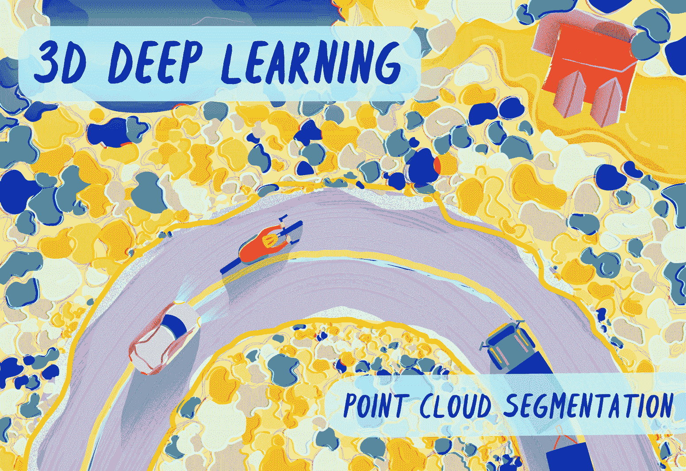

# 3D 深度学习 Python 教程：PointNet 数据准备

> 原文：[`towardsdatascience.com/3d-deep-learning-python-tutorial-pointnet-data-preparation-90398f880c9f?source=collection_archive---------1-----------------------#2023-05-31`](https://towardsdatascience.com/3d-deep-learning-python-tutorial-pointnet-data-preparation-90398f880c9f?source=collection_archive---------1-----------------------#2023-05-31)

## 实操教程、深入解析、3D Python

## 终极 Python 指南，构建大型 LiDAR 点云以训练具有 PointNet 架构的 3D 深度学习语义分割模型。

 [Florent Poux, Ph.D.](https://medium.com/@florentpoux?source=post_page-----90398f880c9f--------------------------------)

·

[关注](https://medium.com/m/signin?actionUrl=https%3A%2F%2Fmedium.com%2F_%2Fsubscribe%2Fuser%2F8ba7bf4ad784&operation=register&redirect=https%3A%2F%2Ftowardsdatascience.com%2F3d-deep-learning-python-tutorial-pointnet-data-preparation-90398f880c9f&user=Florent+Poux%2C+Ph.D.&userId=8ba7bf4ad784&source=post_page-8ba7bf4ad784----90398f880c9f---------------------post_header-----------) 发表在 [Towards Data Science](https://towardsdatascience.com/?source=post_page-----90398f880c9f--------------------------------) ·30 分钟阅读·2023 年 5 月 31 日

--

这幅创意插图直观地展示了 3D 深度学习如何以易于区分类别的方式表示从上到下的场景。如果你喜欢这些内容，请联系 [Marina Tünsmeyer](http://mimatelier.com/)。

3D 深度学习的应用领域近年来迅速扩展。我们在多个领域有着出色的应用，包括机器人技术、自动驾驶与制图、医学影像以及娱乐。当我们看到结果时，我们常常会感到惊叹（但不是每次 😁），并且我们可能会想：“我现在就将这个模型用于我的应用！”。但不幸的是，噩梦开始了：3D 深度学习的实现。即使新的编码库旨在简化这一过程，实现一个端到端的 3D 深度学习模型仍是一项壮举，尤其是当你孤立在某个阴暗角落时。

这就是编写 3D 深度学习代码的感觉。© F. Poux

在 3D 深度学习框架中，最被忽视的痛点之一是准备数据以**适用于**选定的学习架构。我不是指一个优雅的研究数据集，而是一个实际的（杂乱的）...
