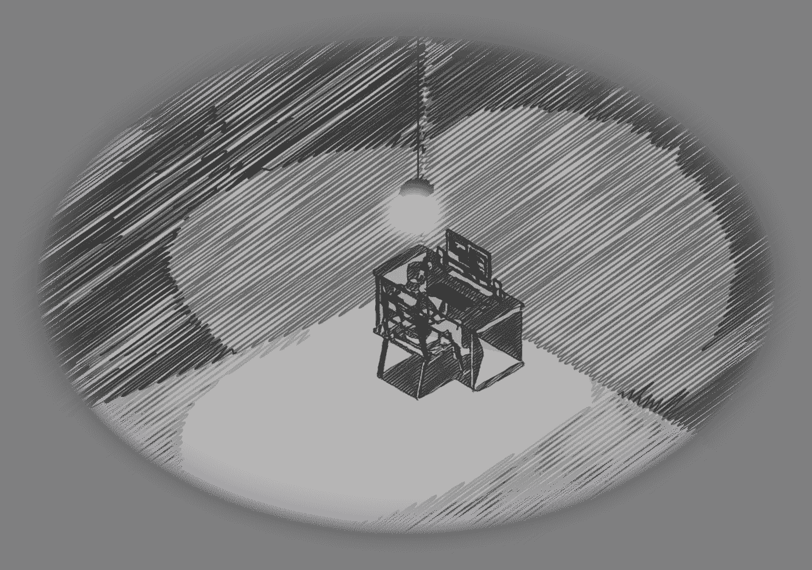
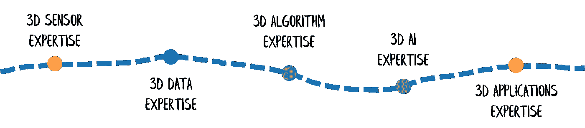

# 3D 深度学习 Python 教程：PointNet 数据准备

> 原文：[`towardsdatascience.com/3d-deep-learning-python-tutorial-pointnet-data-preparation-90398f880c9f`](https://towardsdatascience.com/3d-deep-learning-python-tutorial-pointnet-data-preparation-90398f880c9f)

## 实践教程，深度探讨，3D Python

## 《终极 Python 指南：为 PointNet 架构训练 3D 深度学习语义分割模型而构建大型 LiDAR 点云》

[](https://medium.com/@florentpoux?source=post_page-----90398f880c9f--------------------------------)[](https://towardsdatascience.com/?source=post_page-----90398f880c9f--------------------------------) [Florent Poux, Ph.D.](https://medium.com/@florentpoux?source=post_page-----90398f880c9f--------------------------------)

·发表于 [Towards Data Science](https://towardsdatascience.com/?source=post_page-----90398f880c9f--------------------------------) ·30 分钟阅读·2023 年 5 月 31 日

--


这张创意插图直观地突出了 3D 深度学习如何以易于分类的方式表现自上而下的场景。如果你喜欢这些，联系[Marina Tünsmeyer](http://mimatelier.com/)。

近年来，3D 深度学习的应用领域迅速扩展。我们在机器人技术、自动驾驶与地图制作、医学成像和娱乐等各个领域都拥有卓越的应用。看到这些结果时，我们常常感到惊叹（但并非总是如此😁），我们可能会想：“我现在就要在我的应用中使用这个模型！”但不幸的是，噩梦开始了：3D 深度学习的实现。即使新的编码库旨在简化这一过程，实现一个端到端的 3D 深度学习模型仍是一项壮举，尤其是当你孤身一人待在某个阴暗的角落时。



这就是编码 3D 深度学习的感觉。© F. Poux

在 3D 深度学习框架中，最被忽视的痛点之一是将数据**准备好**以供选定的学习架构使用。我指的不是一个精美的研究数据集，而是一个实际的（混乱的）数据仓库，你想在其上开发应用程序。在大型且复杂的 3D 点云数据集的情况下，这个问题尤为严峻。

哦，你是否明白我们要在这篇文章中探讨什么？你梦到了它（不要隐藏，我知道😉），我们将深入到适当的编码深度。这篇实践教程探讨了如何高效地准备从航空 LiDAR 活动中获得的 3D 点云，以用于最流行的基于点的 3D 深度学习模型：PointNet 架构。

我们涵盖了整个数据准备流程，从 3D 数据整理到特征提取和归一化。它提供了知识和实际的 Python 技能，以解决现实世界的 3D 深度学习问题。


PointNet 数据准备工作流程用于 3D 语义分割。© F. Poux

通过跟随本教程，你将能够将这些技术应用到你自己的 3D 点云数据集上，并利用它们来训练 PointNet 语义分割模型。你准备好了吗？

```py
Theory. 3D Deep Learning Essentials
Step 1\. Preparing the Environment
Step 2\. 3D Data Curation
Step 3\. 3D Data Analysis
Step 4\. 3D Data labelling
Step 5\. Feature Selection
Step 6\. Data Structuration
Step 7\. 3D Python I/O
Step 8\. 3D Data Normalization
Step 9\. 3D Interactive Vizualisation
Step 10\. Tensor Creation
```

🎵**读者注意**：本实践指南是与我的亲爱的同事* [***UTWENTE***](https://www.itc.nl/) *合作的一部分* [***桑德·奥德·埃尔伯林克教授***](https://people.utwente.nl/s.j.oudeelberink)*。我们感谢来自数字双胞胎* [*@ITC*](http://twitter.com/ITC) *项目的财务支持，该项目由特温特大学 ITC 学院资助。*

# 3D 深度学习要点

## 3D 语义分割 VS 分类

3D 语义分割和 3D 点云分类的根本区别在于，分割旨在为点云中的每个点分配标签。而分类则试图为整个点云分配一个标签。


分类模型与语义分割模型之间的区别。在这两种情况下，我们都传递一个点云，但对于分类任务，整个点云是一个实体，而在语义分割的情况下，每个点是一个需要分类的实体。© F. Poux

例如，使用 PointNet 架构，3D 点云分类涉及将整个点云通过网络，并输出一个代表整个点云的标签。相比之下，语义分割的“头部”将为云中的每个点分配一个标签。方法的不同在于，分割需要对表示的 3D 空间有更详细的理解，因为它试图识别和标记点云中的个体对象或区域。相比之下，分类仅需要对点云的整体形状或组成有较高层次的理解。

总的来说，尽管 3D 语义分割和分类是分析 3D 点云数据的关键任务，但主要区别在于标记过程所需的详细程度和粒度。

正如你猜到的，我们将攻克语义分割，因为它需要对被分析的空间有更详细的理解，这非常有趣 😁。

不过在此之前，让我们稍微回顾一下，以更好地理解 PointNet 架构的工作原理，好吗？

## PointNet：一种基于点的 3D 深度学习架构

将复杂的主题拆解成小块知识是我的专长。但是我必须承认，当涉及到 3D 深度学习时，通过神经网络中不同过程学到的函数的复杂性以及超参数确定的经验性特征是重要的挑战。要克服这些挑战，嗯？😁

首先，让我们回顾一下 PointNet 是什么。PointNet 是 3D 深度学习中神经网络的开创者之一。如果你理解了 PointNet，你就可以使用所有其他高级模型。但是，当然，理解只是方程的一部分。


PointNet 架构能够处理三种语义应用：分类、部件分割和语义分割。© F. Poux

另一部分是让这些复杂的东西发挥作用，并将其扩展到你的数据上！这是一项具有挑战性的任务！即使对于经验丰富的编码员也是如此。因此，我们将这个过程分为几个部分。今天，我们讨论的是准备数据，以确保我们在实际条件下有用的东西。

为了正确准备数据，理解网络的构建块是至关重要的。下面我将介绍在使用网络准备数据时需要考虑的关键方面。


论文作者描述的 PointNet 模型架构：[ArXiv 论文](https://arxiv.org/pdf/1612.00593.pdf)。

PointNet 的架构由几个处理点云数据的神经网络层组成。PointNet 的输入是一个简单的点集，每个点由其 3D 坐标和附加特征（如颜色或强度）表示。这些点被输入到连续的共享多层感知器（MLP）网络中，网络学习从每个点中提取局部特征。


论文作者描述的 PointNet 架构中的 MLP：[ArXiv 论文](https://arxiv.org/pdf/1612.00593.pdf)。

🦚 **注意**：*MLP 是一个由多个层连接的节点或神经元构成的神经网络。MLP 中的每个神经元从上一层的神经元接收输入，利用权重和偏置对该输入进行变换，然后将结果传递给下一层的神经元。MLP 中的权重和偏置在训练过程中通过反向传播学习，以最小化网络预测值与真实输出之间的差异。*

这些 MLP 是全连接层，每一层后面跟着我们称之为“非线性激活函数”（如 ReLU）。每层的神经元数量（例如 64）和层数（例如 2）可以根据具体任务和输入点云数据的复杂性进行调整。正如你所猜测的，神经元和层数越多，目标问题可能越复杂，因为架构的可塑性带来了组合可能性。如果我们继续深入研究 PointNet 架构，我们会看到我们用 1024 个特征描述原始的 n 个输入点，这些特征从最初提供的（X、Y 和 Z）中延展出来。这是架构通过使用最大池化操作对局部学习特征进行全局描述的地方，从而获得一个总结整个点云的全局特征向量。然后，这个全局特征向量会通过若干全连接层来生成分类头的最终输出，即 k 类的评分。


由论文作者描述的 PoinNet 模型架构的 MaxPool 和 MLP: [ArXiv Paper](https://arxiv.org/pdf/1612.00593.pdf)。

如果你仔细观察，PointNet 中的语义分割头是一个全连接网络，它将全局特征向量和局部特征向量串联在一起，为输入点云数据中的每个点生成一个每点评分或标签。语义分割头由若干全连接层、ReLU 激活函数和一个最终的 softmax 层组成。最终 softmax 层的输出代表不同语义标签或类别的每点概率分布。


由论文作者描述的 PoinNet 模型架构的分割头: [ArXiv Paper](https://arxiv.org/pdf/1612.00593.pdf)。

PointNet 架构能够捕捉任务如 3D 数据中的对象分类和分割所需的重要几何和上下文信息，通过从输入点云中的每个点学习局部和全局特征。PointNet 的一个关键创新是在最大池化操作中使用对称函数，这确保了输出对输入点的顺序不变。这使得 PointNet 对输入点顺序的变化具有鲁棒性，这在 3D 数据分析中至关重要。

现在，我们准备全力以赴地为 PointNet 准备数据。最开始我们指的是什么点云？我们是否输入一个完整的点云？

# PointNet: 数据准备的关键方面

从高层次来看，如果我们研究[原始论文](https://arxiv.org/pdf/1612.00593.pdf)，我们可以看到 PointNet 的功能非常直接：

+   我们将点云数据规范化到标准空间。

+   我们计算一系列特征（不依赖于我们已有的知识，而是利用网络的能力来创建有用的特征）

+   我们将这些特征汇聚成考虑中的点云的全局特征。

+   *选项 1*：我们使用这个全局特征来对点云进行分类

+   *选项 2*：我们将这个全局特征与局部特征结合，构建更精确的语义分割特征。


PointNet 在语义分割或分类任务中的五个步骤。© F. Poux

一切都围绕特征展开，这意味着我们提供给网络的块应该非常相关。例如，给出整个点云是行不通的，给出一个微小的样本也是行不通的，提供具有不同分布的结构化样本也行不通。那么我们怎么做呢？

让我们遵循一个线性的十步流程，以获得经过深思熟虑的 3D 点云训练/推理准备数据集。


PointNet 数据准备工作流程。© F. Poux

# 第一步：准备你的工作环境


在本文中，我们使用两个主要组件：CloudCompare 和 JupyterLab IDE (+ Python)。对于最佳设置的详细视图，我强烈建议你参考这篇文章，它详细介绍了所需内容：

[](/3d-python-workflows-for-lidar-point-clouds-100ff40e4ff0?source=post_page-----90398f880c9f--------------------------------) ## 3D Python 工作流程用于 LiDAR 城市模型：逐步指南

### 解锁 3D 城市建模应用程序的终极指南。该教程涵盖了 Python…

[towardsdatascience.com

我们将有一个特定的库栈，分为主要库、绘图库和实用库。

🦚 **注意**：*如果你在本地环境中工作，我建议本教程使用 pip 进行包管理*（pip install library_name）

我们将使用的两个主要库是 NumPy 和 Pytorch：

+   **Numpy**：NumPy 是一个用于处理数值数据的 Python 库，它提供了操作数组和矩阵、数学运算和线性代数函数的功能。

+   **Pytorch**：Pytorch 是一个流行的 Python 深度学习框架。它提供了构建和训练神经网络以及优化和评估模型的工具。

然后，我们使用两个绘图库来支持这些：

+   **Matplotlib**：Matplotlib 是一个用于创建可视化图表、图形和图像的 Python 库。

+   **Plotly**：Plotly 是一个用于创建**交互式**可视化的 Python 库。

最后，我们还将使用三个实用模块：

+   **os**: Python 中的 os 模块提供了一种使用操作系统相关功能的方法。它提供了与文件系统交互的函数，例如创建、删除和重命名文件和目录。

+   **glob**: Python 中的 glob 模块提供了一种使用模式匹配文件和目录的方法。例如，它可以在目录中找到所有具有特定扩展名的文件。

+   **random**（可选）：`random`库是一个内置模块，提供生成随机数、从列表中选择随机项和打乱序列的函数。

一旦完成，我们就可以进入第二个方面：获取新的 3D 点云数据集！

# 步骤 2：3D 数据整理


对于本教程，我们前往荷兰东部，靠近恩斯赫德，那里有特温特大学的光芒🌞。在这里，我们选择了 AHN4 数据集的一部分，这部分数据应该有足够的树木、地面、建筑物以及一点水 🚿。我们可以说每个类别都有足够的点！

🦚 **注意**: *我们将在不平衡的数据集上进行训练，其中地面点的比例远高于其他类别。这不是理想的情况，在这种情况下，MLP 和语义分割头可能会偏向于预测多数类别标签，而忽略少数类别标签。这可能导致不准确的分割和少数类别点的错误分类。不过，可以使用几种技术来减轻不平衡类别的影响，如数据增强、少数类别的过采样或欠采样，以及使用加权损失函数。这是另一个话题。* 😉

为了收集数据集，我们访问开放数据门户 [geotiles.nl](https://geotiles.nl/)。我们缩放到一个感兴趣的区域，等待有 _XX（以便数据量一致），然后下载.laz 数据集，如下所示：


从荷兰 AHN4 LiDAR 活动中收集点云数据集。© F. Poux

此外，我们可以准备一些引人注目的用例，以便你以后可以在感兴趣的切片上测试你的模型。例如，可以在你所在的地方，如果那里有开放数据。

🦚 **注意**: *如果你想对你的模型进行真正的挑战，下载另一个地区的切片是一个很好的泛化测试！例如，你可以下载一个* [*LiDAR HD*](https://geoservices.ign.fr/lidarhd) *点云切片，以查看如果用于训练或测试，是否会有差异/改进。*

现在你已经有了.laz 文件格式的点云，让我们探索 info 文件提供的特性，你也可以查看或下载：


一份关于选定 3D LiDAR 点云数据集的信息文件。© F. Poux

这有助于深入理解数据内容，这是构建高质量数据集时至关重要的第一步。


这展示了点云的附加信息内容。© F. Poux

在浏览各种信息点时，有几个字段值得注意：

```py
number of point records:    32080350
offset x y z:               205980 464980 0
min x y z:                  205980.000 464980.000 4.101
max x y z:                  207019.999 466269.999 53.016
intensity          56       5029
classification      1         26
Color R 17 255
      G 39 255
      B 31 255
    NIR 0 255
```

这个小文件选择提示我们将处理大约 3200 万数据点，这些数据点具有颜色、强度，并且如果我们希望稍后提升模型，还可以具有近红外字段。

非常好！现在我们已经安装了软件堆栈并下载了 3D 点云，我们可以进行 3D 数据分析，以确保输入到模型中的数据符合预期。

# 步骤 3：3D 数据分析（CloudCompare）


现在是时候将 3D 航空点云文件加载到软件[CloudCompare](https://cloudcompare.org/)中了。首先，在计算机上打开 CloudCompare，直到出现空的 GUI，如下所示。


CloudCompare 的 GUI。来源：[learngeodata.eu](http://learngeodata.eu)

从那里，我们通过拖放的方式加载下载的.laz 文件，并在导入时从弹出的菜单中选择一些属性，如下图所示。


在 CloudCompare 中导入 3D 点云。我们确保选择相关特征进行加载。© F. Poux

🦚 **注意**：*我们取消选择所有字段以预选一些带来不相关或低相关信息的特征以及每个点的标签，这些标签可能指示真实情况。因此，我们只保留强度和分类字段。确实，由于我们针对的是航空点云，我们希望选择能够高效泛化的特征。因此，我们的目标是选择在未标记的数据中可能找到的特征，以便我们后续的模型能够在这些数据上进行表现。此外，点云还具有 RGB 信息，这也是一个不错的选择。*

在这一阶段，**七**个选定的特征如下：X、Y 和 Z（空间），R、G、B（辐射计），以及强度。此外，我们保留来自.laz 文件分类字段的 AHN4 标签。成功将 3D 航空点云导入 CloudCompare 后，我们就准备好进行分析和可视化了。我们可以快速查看“`对象属性面板`（3）”中的两个额外字段（强度和分类）。如果我们研究强度，会发现一些离群点稍微偏移了我们的特征向量，如下所示。


强度着色的点云及其分布直方图。© F. Poux

如果我们想将其用作 PointNet 的输入特征，这是我们必须解决的第一个观察点。

关于颜色值（红色、绿色、蓝色），它们是从另一个传感器获得的，可能是在另一个时间。因此，由于它们是从该区域的现有正射影像中合成的，我们可能会遇到一些精度/重投影问题。但正如你所想，能够将绿色元素与红色元素分开应该能给我们一个清晰的指示，表明一个点属于植被类别的概率😁。


LiDAR 数据集使用正射影像着色以获取 R、G、B 特征。© F. Poux

我们有一个点云，其中包含 3200 万个点，以笛卡尔坐标系（X，Y，Z）表示，每个点都有强度特征和颜色（红色、绿色和蓝色）。

🦚 **注意**：*你可以将这个阶段留到后面，因为你可能会有许多选择的特征，例如下面所示的近红外（NIR）通道，它在数据集中是可用的。例如，这是一个方便的字段，可以突出显示健康（或不健康）的植被。* 😉


近红外特征。© F. Poux

如果你滚动可用的字段，我们还有另一个最后的标量字段。分类字段，当然！这对于帮助我们创建标注数据集非常方便，以避免从零开始（感谢开放数据！👌）


提供的分类。© F. Poux

🦚 **注意**：*出于教学培训的目的，我们将考虑将分类作为教程剩余部分的真实情况。然而，请知道分类是有一定不确定性的，如果你想要最好的模型，必须修正它。确实，有一句著名的 3D 深度学习格言：垃圾进=垃圾出。因此，数据的质量应该是首要的。*

让我们专注于精炼标注阶段。

# 第 4 步：3D 数据标注（标签连接）


好的，在进入这个步骤之前，我必须说点什么。3D 点云标注用于训练有监督的 3D 语义分割学习模型是一个（痛苦的）手动过程。目标是为 3D 点云中的单个点分配标签。这个过程的主要关键目标包括识别点云中的目标物体、选择合适的标注技术，并确保标注过程的准确性。


标注过程的一个示例：标注簇与标注单个点。© F. Poux

要识别点云中需要标注的物体或区域，我们可以手动检查云，或者使用基于特征（如大小、形状或颜色）自动检测特定物体或区域的算法。

[](https://learngeodata.eu/?source=post_page-----90398f880c9f--------------------------------) [## 3D Academy - 点云在线课程

### 为教师、研究人员、开发人员和工程师提供的最佳 3D 在线课程。掌握 3D 点云处理及……

[learngeodata.eu](https://learngeodata.eu/?source=post_page-----90398f880c9f--------------------------------)

在我们的案例中，我们有一个优势：点云已经被分类。因此，第一步是将每个类别提取为独立的点云，如下图所示。


首先，我们选择点云并将“颜色”属性从 RGB 切换到标量场。然后确保我们可视化分类标量场。从那里，我们转到 EDIT > Scalar Field > Split Cloud by Integer Value，从而在点云中为每个类别生成一个点云。

从我们得到的各种点云类别中，我们可以看到：

```py
class 1 = vegetation + clutter
class 2 = ground
class 6 = buildings
class 9 = water
class 26 = bridge. 
```

从那里，我们可以重新处理`class 1 = vegetation + clutter`。

必须根据特定任务和可用数据选择合适的标记技术。例如，我们可以使用无监督技术进行更多的探索性分析，并通过选择植被中的候选点来进行一些颜色阈值处理，如下图所示。


根据颜色信息对点云进行分割，以半自动化的方式创建更精确的标签。© F. Poux

这将给出不准确的结果，但可能会加快手动选择属于植被的任何点。

最后，确保标签过程的准确性对于产生可靠结果至关重要。这可以通过手动验证或质量控制技术，如交叉验证或标注者一致性，来实现。

🦚 **注意**：*了解术语是好的，但不要害怕。这些概念可以在后续阶段覆盖。一件事一次完成。* 😉

最终，标签过程的准确性将直接影响后续任务的表现，包括 3D 语义分割。在我们的案例中，我们将数据组织如下：

```py
Class 1 = ground
Class 2 = Vegetation
Class 3 = Buildings
Class 4 = Water
Class 0 = unannotated (All the remaining points)
```

我们在 CloudCompare 中执行此操作。


在 CloudCompare 中组织各种类别。© F. Poux

在为清晰度重命名我们的不同点云（初始化）后，我们将（1）将杂乱物体合并为一个单独的点云，（2）删除所有点云的分类字段，（3）用新的编号重新创建分类字段，（4）克隆所有点云，（5）合并克隆点云，如下所示。


初步准备我们的标签进入新的点云。© F. Poux


数据准备阶段在 CloudCompare 中执行。© F. Poux

现在，我们有一个带标签的数据集，并具有特定的点标签分布。


我们注意到，在 32,080,350 个点中，23,131,067 个属于地面（72%），7,440,825 个属于植被（23%），1,146,575 个属于建筑物（4%），191,039 个属于水体（不到 1%），剩余的 170,844 个未标记（类别 0）。这将非常有趣，因为我们处于这个特定的不平衡情况中，具有主导类别。

现在我们已经分析了点云的内容并细化了标签，我们可以*深入*进行特征选择。

# 第 5 步。3D 特征选择


在使用 PointNet 架构进行 3D 点云语义分割时，特征选择对于准备训练数据至关重要。

在传统机器学习方法中，通常需要特征工程来选择和提取数据中的相关特征。然而，使用 PointNet 等深度学习方法可以避免这一步骤，因为模型可以自动学习从数据中提取特征。

然而，确保输入数据包含模型学习相关和推导特征所需的信息仍然很重要。我们使用七个特征：`X`、`Y`、`Z`（空间属性）、`R`、`G`、`B`（辐射属性）和强度`I`（激光雷达衍生）。

```py
X                Y              Z          R  G   B  INTENSITY
205980.49800000 465875.02398682 7.10500002 90 110 98 1175.000000
205980.20100001 465875.09802246 7.13500023 87 107 95 1115.000000
205982.29800010 465875.00000000 7.10799980 90 110 98 1112.000000
```

这是我们的参考。这意味着我们将使用这个输入来构建模型，任何我们希望用训练好的 PointNet 模型处理的其他数据集必须包含这些相同的特征。在进入 Python 之前，最后一步是根据架构规范结构化数据。

# 第 6 步。数据结构化（瓦片化）


由于几个原因，在使用神经网络架构 PointNet 处理 3D 点云时，将其结构化为正方形瓦片是必要的。


在此工作流中的瓦片定义是训练 PointNet 3D 深度学习架构。© F. Poux

首先，PointNet 要求输入数据为固定大小，这意味着所有输入样本应具有相同数量的点。通过将 3D 点云分割成正方形瓦片，我们可以确保每个瓦片具有更均匀的点数量，使 PointNet 能够一致有效地处理它们，而不会在采样到最终固定点数时产生额外开销或不可逆损失。


采样策略对 3D 点云数据集的影响示例。© F. Poux

🌱 **增长**：*使用 PointNet 时，我们需要将输入瓦片固定为推荐的 4096 个点。这意味着需要一种采样策略（****CloudCompare 中未实现****）。如上图所示，使用不同策略对点云进行采样将产生不同的结果和物体识别能力（例如右侧的电线杆）。你认为这会影响 3D 深度学习架构的性能吗？*

其次，PointNet 的架构涉及应用于每个点的共享多层感知机（MLP），这意味着网络在处理每个点时是独立的，不考虑其邻居。通过将点云结构化为瓦片，我们可以在保持每个点局部上下文的同时，让网络独立处理点，从而从数据中提取有意义的特征。


生成的 3D 点云瓦片。© F. Poux

最后，将 3D 点云结构化为瓦片也可以提高神经网络的计算效率，因为它允许对瓦片进行并行处理，从而减少分析整个点云所需的总体处理时间（在 GPU 上）。

我们使用“横截面”工具（1）来实现这一目标。我们将大小设置为 100 米（2），然后沿 X 轴和 Y 轴（负方向）移动，以尽可能接近初始瓦片的最底部角落（3），我们使用多个切片按钮（4），沿 X 轴和 Y 轴重复（5），得到最终的方形瓦片（6），如下所示。


自动化瓦片创建过程在 CloudCompare 中。© F. Poux


自动化瓦片创建过程在 CloudCompare 中。© F. Poux

这允许定义大约一百米乘一百米的瓦片，沿 X 轴和 Y 轴。我们获得了 143 个瓦片，其中抛弃了最后 13 个瓦片，因为它们可能更能代表我们希望输入的内容（即，它们不是方形，因为它们位于边缘）。在剩下的 130 个瓦片中，我们选择了大约 20%具有代表性的瓦片（按住 Shift + 选择），如下所示。


对 PointNet 进行的选择和手动分割训练集和测试集。© F. Poux

🌱 **增长**：*我们按照 80/20 的比例将数据分为训练集和测试集。在这个阶段，你怎么看这种方法？你认为什么样的策略比较好？*

在这个过程中，我们在训练集和测试集中分别拥有约 100 个瓦片和 30 个瓦片，每个瓦片都保留了原始点数。然后，我们选择一个文件夹，将每个瓦片导出为 ASCII 文件，如下所示。


将点云瓦片导出以供 PointNet 使用

🦚 **注意**：*CloudCompare 允许在选择以 ASCII 文件格式导出时，将所有点云独立导出到一个目录中。它会在最后一个字符之后自动缩进，使用“*`*_*`*”字符以确保一致性。这非常方便，可以使用/滥用。*

将 3D 点云结构化为方形瓦片是使用 PointNet 时的一个重要预处理步骤。它允许输入数据大小的一致性，保留局部上下文，并提高计算效率，这些都有助于更准确和高效的数据处理。这是进入 3D Python 🎉之前的最后一步。

# 第 7 步。3D Python 数据加载


现在是时候在 Python 中处理点云瓦片了。

为此，我们导入所需的库。如果你使用的是可以在这里访问的 Google Colab 版本：💻 Google Colab Code，那么重要的是要运行下面所示的第一行：

```py
from google.colab import drive
drive.mount('/content/gdrive')
```

对于任何设置，我们必须导入下述各种库：

```py
#Base libraries
import numpy as np
import random
import torch
#Plotting libraries
%matplotlib inline
from mpl_toolkits import mplot3d
import matplotlib.pyplot as plt
import plotly
import plotly.graph_objects as go
#Utilities libraries
from glob import glob
import os
```

太好了！从这里开始，我们将数据文件名拆分到各自的文件夹中，`pointcloud_train_files`和`pointcloud_test_files`

```py
#specify data paths and extract filenames
project_dir="gdrive/My Drive/_UTWENTE/DATA/AHN4_33EZ2_12"
pointcloud_train_files = glob(os.path.join(project_dir, "train/*.txt"))
pointcloud_test_files = glob(os.path.join(project_dir, "test/*.txt"))
```

🦚 **注意**：*我们在资源管理器中有两个文件夹：训练文件夹和测试文件夹，均在* `AHN4_33EZ2_12` *文件夹中。我们在这里做的是首先指定根文件夹的路径，然后用 glob 收集训练和测试中的所有文件，使用* `***` *表示“*`选择所有`”。*一种处理多个文件的便捷方法！*

在这一步，两个变量保存了我们准备好的所有瓦片的路径。为了确保这一点，我们可以打印从 0 到 20 的随机分布中随机选取的一个元素：

```py
print(pointcloud_train_files[random.randrange(20)])
>> gdrive/My Drive/_UTWENTE/DATA/AHN4_33EZ2_12/train/AHN4_33EZ2_12_train_000083.txt
```

太好了，所以我们可以进一步将数据集拆分成三个变量：

+   **valid_list**：这保存了验证数据路径。验证拆分通过在每个训练周期后微调模型来帮助提高模型性能。

+   **train_list**：这保存了训练数据路径，即用于训练的数据集。

+   **test_list**：这保存了测试数据路径。测试集告知我们模型在完成训练阶段后的最终准确性。

这是通过友好的 numpy 函数完成的，这些函数作用于列表中的数组索引。实际上，我们随机提取了`pointcloud_train_files`中的 20%，然后将保留的部分与未保留的部分进行分割，后者构成了`train_list`变量。

```py
#Prepare the data in a train set, a validation set (to tune the model parameters), and a test set (to evaluate the performances)
#The validation is made of a random 20% of the train set.
valid_index = np.random.choice(len(pointcloud_train_files),int(len(pointcloud_train_files)/5), replace=False)
valid_list = [pointcloud_train_files[i] for i in valid_index]
train_list = [pointcloud_train_files[i] for i in np.setdiff1d(list(range(len(pointcloud_train_files))),valid_index)]
test_list = pointcloud_test_files
print("%d tiles in train set, %d tiles in test set, %d files in valid list" % (len(train_list), len(test_list), len(valid_list)))
```

然后，我们通过查看中位数、标准差和最小-最大值来随机研究一个数据文件的属性，使用以下代码片段：

```py
tile_selected=pointcloud_train_files[random.randrange(20)]
print(tile_selected)
temp=np.loadtxt(tile_selected)
print('median\n',np.median(temp,axis=0))
print('std\n',np.std(temp,axis=0))
print('min\n',np.min(temp,axis=0))
print('max\n',np.max(temp,axis=0))
```

这将产生：

```py
gdrive/My Drive/_UTWENTE/DATA/AHN4_33EZ2_12/train/AHN4_33EZ2_12_train_000083.txt 
median [2.068e+05 4.659e+05 6.628e+00 1.060e+02 1.210e+02 1.030e+02 1.298e+03 1.000e+00] 
std [ 28.892 30.155 0.679 29.986 21.4 17.041 189.388 0.266] 
min [2.068e+05 4.659e+05 5.454e+00 3.600e+01 6.200e+01 5.700e+01 7.700e+01 0.000e+00] 
max [2.068e+05 4.660e+05 1.505e+01 2.510e+02 2.470e+02 2.330e+02 1.625e+03 4.000e+00]
```

正如我们所注意到的，有一个核心问题需要解决：数据归一化。确实，为了避免任何不匹配，我们需要处于这种“规范空间”，这意味着我们可以在特征空间中复制相同的实验环境。使用 T-Net 就像用火箭筒🪰杀苍蝇。这是可以的，但如果我们可以避免并使用实际一致的方法，那将更聪明😁。

# 步骤 8\. 3D Python 归一化


在将 3D 点云瓦片输入到 PointNet 架构之前进行归一化至关重要，主要有三个原因。首先，归一化确保输入数据围绕原点中心，这对于 PointNet 的架构至关重要，因为它对每个点独立应用 MLP。当输入数据围绕原点中心时，MLP 更有效，这使得特征提取更有意义，整体性能更好。


归一化对训练 3D 深度学习模型结果的影响示意图。© F. Poux

🌱 **成长**：*在盲目归一化之前，有些直觉也是有益的。例如，我们主要使用基于重力的场景，这意味着 Z 轴几乎总是与 Z 轴共线。因此，你会如何处理这种归一化？*

其次，归一化将点云数据缩放到一致的范围，这有助于防止 MLP 中的激活函数饱和。这使得网络能够从整个输入值范围中学习，提高了准确分类或分割数据的能力。


在 3D 点云的强度场上说明[0,1]缩放的问题。© F. Poux

最后，归一化有助于减少点云数据中不同尺度的影响，这可能是由于传感器分辨率或扫描物体的距离差异（在航拍 LiDAR 数据中有所平坦化）。这提高了数据的一致性和网络从中提取有意义特征的能力。

好的，让我们开始吧。对于我们的实验，我们将首先捕捉特征的最小值`min_f`和平均值`mean_f`：

```py
cloud_data=temp.transpose()
min_f=np.min(cloud_data,axis=1)
mean_f=np.mean(cloud_data,axis=1)
```

🦚 **注意**：*我们对数据集进行了转置，以更高效、便捷地处理数据和索引。因此，要获取点云的* `X-axis` *元素，我们可以直接使用* `cloud_data[0]` *而不是* `cloud_data[:,0]`*，这样可以减少一些开销。*

我们现在将对不同的特征进行归一化，以用于我们的 PointNet 网络。首先是空间坐标 X、Y 和 Z。我们将把数据中心化到平面坐标轴（X 和 Y），并确保减去 Z 的最小值，以区分屋顶和地面，例如：

```py
n_coords = cloud_data[0:3]
n_coords[0] -= mean_f[0]
n_coords[1] -= mean_f[1]
n_coords[2] -= min_f[2]
print(n_coords)
```

很好，现在我们可以通过确保我们在[0,1]范围内来缩放我们的颜色。这是通过将所有颜色的最大值（255）进行除法实现的：

```py
colors = cloud_data[3:6]/255
```

最后，我们将处理强度特征的归一化。在这里，我们将使用分位数来获得对异常值具有鲁棒性的归一化，就像我们在探索数据时看到的那样。这是通过三个阶段的过程完成的。首先，我们计算四分位差`IQR`，即第 75 个分位数和第 25 个分位数之间的差值。然后我们从所有观测值中减去中位数，并除以四分位差。最后，我们减去强度的最小值，以获得显著的归一化：

```py
# The interquartile difference is the difference between the 75th and 25th quantile
IQR = np.quantile(cloud_data[-2],0.75)-np.quantile(cloud_data[-2],0.25)
# We subtract the median to all the observations and then divide by the interquartile difference
n_intensity = ((cloud_data[-2] - np.median(cloud_data[-2])) / IQR)
#This permits to have a scaling robust to outliers (which is often the case)
n_intensity -= np.min(n_intensity)
print(n_intensity)
```

太棒了！在这一阶段，我们已经有了一个归一化的点云，准备好输入 PointNet 架构。但是自动化这个过程是执行所有瓦片的下一步逻辑步骤。

## 创建一个点云瓦片加载和归一化函数

我们创建一个函数`cloud_loader`，它以一个瓦片路径`tile_path`和一个用于的特征字符串`features_used`作为输入，并输出一个`cloud_data`变量，其中包含归一化特征，以及一个真实标签变量`gt`，其中包含每个点的标签。该函数将如下操作：


定义一个云加载函数来处理点云数据集，并使其准备好用于训练。© F. Poux

这转换为一个简单的`cloud_loader`函数，如下所示：

```py
# We create a function that loads and normalize a point cloud tile
def cloud_loader(tile_path, features_used):
  cloud_data = np.loadtxt(tile_path).transpose()
  min_f=np.min(cloud_data,axis=1)
  mean_f=np.mean(cloud_data,axis=1)
  features=[]
  if 'xyz' in features_used:
    n_coords = cloud_data[0:3]
    n_coords[0] -= mean_f[0]
    n_coords[1] -= mean_f[1]
    n_coords[2] -= min_f[2]
    features.append(n_coords)
  if 'rgb' in features_used:
    colors = cloud_data[3:6]/255
    features.append(colors)
  if 'i' in features_used:
    IQR = np.quantile(cloud_data[-2],0.75)-np.quantile(cloud_data[-2],0.25)
    n_intensity = ((cloud_data[-2] - np.median(cloud_data[-2])) / IQR)
    n_intensity -= np.min(n_intensity)
    features.append(n_intensity)

  gt = cloud_data[-1]
  gt = torch.from_numpy(gt).long()

  cloud_data = torch.from_numpy(np.vstack(features))
return cloud_data, gt
```

该函数现在用于获取点云特征和标签，如下所示：

```py
pc, labels = cloud_loader(tile_selected, ‘xyzrgbi’)
```

🌱 **成长**：*如你所见，我们传递了一个特征的字符串。这对于我们不同的‘*`*if*`*’测试非常方便。然而，请注意，如果传递给函数的内容不符合预期，我们不会返回错误。这不是标准的代码实践，但这扩展了本教程的范围*。 *如果你想开始编写漂亮的代码，我建议查看 PEP-8 指南。*

# 步骤 9\. 3D Python 交互式可视化


如果我们想要平行于以前的文章，可以在这里访问：

[](/3d-python-workflows-for-lidar-point-clouds-100ff40e4ff0?source=post_page-----90398f880c9f--------------------------------) ## LiDAR 城市模型的 3D Python 工作流：逐步指南

### 解锁 3D 城市建模应用的**终极指南**。该教程涵盖 Python…

[towardsdatascience.com

我们可以使用 Open3D 可视化我们的数据集。首先，我们需要安装一个特定版本（如果在 Jupyter Notebook 环境中工作，如 Google Colab 或 CRIB 平台），并在我们的脚本中加载它：

```py
!pip install open3d==0.16
import open3d as o3d
```

🦚 **注意**：*在 pip 之前的“*`!`*”是在 Google Colab 上工作时使用的，表示它应该直接使用环境控制台。如果你在本地工作，应删除此字符并直接使用* `pip install open3d==0.16` *。*

然后我们执行以下连续步骤：


绘制函数以直接在 Google Colab 中绘制交互式 3D 场景。© F. Poux

这转化为以下代码行：

```py
pc, gt = cloud_loader(tile_selected, ['xyz','rgb','i'])
pcd=o3d.geometry.PointCloud()
pcd.points=o3d.utility.Vector3dVector(np.array(pc)[0:3].transpose())
pcd.colors=o3d.utility.Vector3dVector((np.array(pc)[3:6]).transpose())
o3d.visualization.draw_plotly([pcd],point_sample_factor=0.5, width=600, height=400)
```

🦚**注意**：*由于我们的 pc 变量捕获了* `cloud_data` *来自* `cloud_loader` *函数的输出被转置，我们在使用* `open3d` *绘图时必须记得将其转置回去。*

上述代码片段将输出以下可视化：


使用 plotly 绘制场景和 R、G、B 字段的结果。© F. Poux

🦚 **注意**：*使用* `draw_plotly` *函数时，我们无法直接控制图表的缩放，并且可以注意到* `*X*`*,* `*Y,*` *和* `*Z*`*的比例不等，这在这种情况下强调了 Z。* 😁

由于你可以注意到的限制，我们创建了一个自定义可视化函数来可视化随机切片，以便运行函数：`visualize_input_tile` 输出一个交互式的 `plotly` 可视化，让我们切换渲染模式。

要测试提供的函数，我们首先需要在实验中定义类名称：`class_names = [‘unclassified’, ‘ground’, ‘vegetation’, ‘buildings’, ‘water’]`。然后，我们提供云特征`cloud_features=’xyzi’`，随机选择变量`selection`中捕获的点云，并可视化切片。这转化为以下代码片段：

```py
class_names = ['unclassified', 'ground', 'vegetation', 'buildings', 'water']
cloud_features='xyzi'
selection=pointcloud_train_files[random.randrange(len(pointcloud_train_files))]
visualize_input_tile(selection, class_names, cloud_features, sample_size=20000)
```

这将输出如下交互式场景。


在 Google Colab 中的交互式 3D 场景。© F. Poux

🦚 **注意**：*你可以使用按钮在特征强度和从加载的感兴趣特征的标签之间切换渲染模式。*

我们有一个工作解决方案用于加载、规范化和可视化 Python 中的单个切片。最后一步是创建我们称之为张量的内容，以用于 PointNet 架构。

# 第 10 步。张量创建


我想向你展示如何使用 PyTorch 进行初步操作。为清晰起见，让我快速定义我们使用这个库时操作的主要 Python 对象类型：张量。

PyTorch 张量是一个多维数组，用于在 PyTorch 中存储和操作数据。它类似于 NumPy 数组，但具有针对深度学习模型优化的额外好处。张量可以使用 `torch.tensor()` 函数创建，并用数据初始化，或者创建一个具有指定形状的空张量。例如，要创建一个 3x3 的张量并填充随机数据：

```py
import torch

x = torch.tensor([[1.0, 2.0, 3.0],
                  [4.0, 5.0, 6.0],
                  [7.0, 8.0, 9.0]])

print(x)
```

这将输出：

```py
tensor([[1., 2., 3.],
        [4., 5., 6.],
        [7., 8., 9.]])
```

相当简单，对吧？现在，为了简化操作，还有一个小型的 Pytorch 库，我们可以用来准备数据集列表。这个库叫做`TorchNet`。`TorchNet` 旨在通过提供一组预定义的模块和助手函数来简化构建和训练复杂神经网络架构的过程，这些模块和助手函数适用于数据加载、验证和测试等日常任务。

`TorchNet` 的主要优势之一是其模块化设计，允许用户通过组合一系列预构建模块来轻松构建复杂的神经网络架构。这可以节省大量时间和精力，相比从头开始构建神经网络，尤其是在刚接触深度学习时。

🦚 **注意**：*除了其模块化设计外，TorchNet 还提供了多个用于常见深度学习任务的助手函数，例如数据增强、早期停止和模型检查点。这可以帮助用户获得更好的结果，并更高效地优化他们的神经网络架构*。

要安装`torchnet`版本`0.0.4`并将其导入到我们的脚本中，我们可以执行以下操作：

```py
!pip install torchnet==0.0.4
import torchnet as tnt
```

我们还导入了另一个名为 `functools` 的实用模块。该模块用于处理或返回其他函数的高阶函数。为此，将 `import functools` 添加到导入语句中。

通常，任何可调用的对象都可以被视为此模块的函数。通过这些额外的设置，可以使用以下四行代码轻松生成训练集、验证集和测试集：

```py
cloud_features='xyzrgbi'
test_set = tnt.dataset.ListDataset(test_list,functools.partial(cloud_loader, features_used=cloud_features))
train_set = tnt.dataset.ListDataset(train_list,functools.partial(cloud_loader, features_used=cloud_features))
valid_set = tnt.dataset.ListDataset(valid_list,functools.partial(cloud_loader, features_used=cloud_features))
```

现在，如果我们想要探索，可以使用像经典的 numpy 数组一样的索引来检索特定位置的张量，例如`train_set[1]`，其输出为：


最后，我们必须将结果保存到 Python 对象中，以便在接下来的步骤中直接使用，例如 PointNet 训练。我们使用的库是 pickle，它非常适合保存 Python 对象。要保存一个对象，只需运行以下命令：

```py
import pickle
f = open(project_dir+"/data_prepared.pckl", 'wb')
pickle.dump([test_list, test_set, train_list, train_set, valid_list, valid_set], f)
f.close()
```

如果你想测试你的设置，还可以运行以下代码行，确保你检索到你想要的内容：

```py
f = open(project_dir+"/data_prepared.pckl", 'rb')
test_list_t, test_set_t, train_list_t, train_set_t, valid_list_t, valid_set_t = pickle.load(f)
f.close()
print(test_list_t)
```

+   💻 在这里获取代码访问：[Google Colab](https://colab.research.google.com/drive/1pqBqGPV36_gxi4yjPiTUR3fb5IldpdaS?usp=sharing)

+   🍇 在这里获取数据访问：[3D 数据集](https://drive.google.com/drive/folders/1RPCX2NCBn24g4lC3qS_xhuS1peR_EnxM?usp=sharing)

+   👨‍🏫3D 数据处理和 AI 课程：[3D 学院](https://learngeodata.eu/)

+   📖 订阅以获得 3D 教程的早期访问：[3D AI 自动化](https://medium.com/@florentpoux/subscribe)

+   💁 支持我的工作与 Medium 🤟：[Medium 订阅](https://medium.com/@florentpoux/membership)



# 🔮 结论

恭喜！在这个实践教程中，我们探讨了准备用于 PointNet 架构的 3D 点云数据的关键步骤。


PointNet 的 3D 深度学习数据准备工作流程。© F. Poux

通过遵循这个逐步指南，你已经学会了如何清理、处理 LiDAR 点云，提取相关特征，并为 3D 深度学习模型规范化数据。我们还讨论了一些处理 3D 点云数据的关键注意事项，如瓦片大小、规范化和数据增强。你可以将这些技术应用于你的 3D 点云数据集，并用它们来训练和测试 PointNet 模型，用于对象分类和分割。3D 深度学习领域正在快速发展，这个教程是一个基石，为你进一步探索这一激动人心的领域提供了坚实的基础。

# 🤿 进一步探索

但学习之旅并未止步于此。我们的终身探索才刚刚开始，未来的步骤将深入探讨 3D 体素工作、3D 数据的人工智能、语义分析和数字双胞胎。此外，我们将使用深度学习技术分析点云，解锁高级 3D LiDAR 分析工作流程。还有很多令人兴奋的内容！

# 参考文献

1.  Qi, C. R., Su, H., Mo, K., & Guibas, L. J. (2017). Pointnet：点集上的深度学习用于 3D 分类和分割。收录于 *IEEE 计算机视觉与模式识别会议论文集* (第 652–660 页)。

1.  Poux, F., & Billen, R. (2019). 基于体素的 3D 点云语义分割：无监督几何和关系特征与深度学习方法。*ISPRS 国际地理信息学杂志*, *8*(5), 213。

1.  Xu, S., Vosselman, G., & Elberink, S. O. (2014). 基于多实体的城市区域航空激光扫描数据分类。*ISPRS 摄影测量与遥感杂志*, *88*, 1–15。
