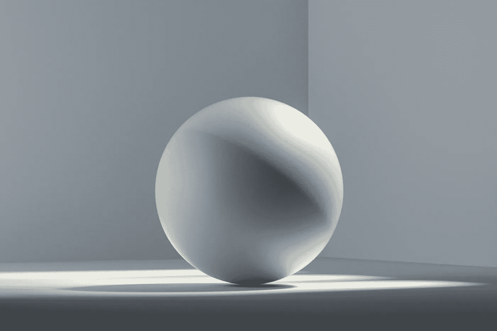

# 使用 DeepSDF 进行 3D 生成建模

> 原文：[`towardsdatascience.com/3d-generative-modeling-with-deepsdf-2cd06f1ec9b3?source=collection_archive---------5-----------------------#2023-01-30`](https://towardsdatascience.com/3d-generative-modeling-with-deepsdf-2cd06f1ec9b3?source=collection_archive---------5-----------------------#2023-01-30)

## 简单的神经网络可以捕捉复杂的 3D 几何形状

 [Cameron R. Wolfe, Ph.D.](https://wolfecameron.medium.com/?source=post_page-----2cd06f1ec9b3--------------------------------)

·

[关注](https://medium.com/m/signin?actionUrl=https%3A%2F%2Fmedium.com%2F_%2Fsubscribe%2Fuser%2F28aa6026c553&operation=register&redirect=https%3A%2F%2Ftowardsdatascience.com%2F3d-generative-modeling-with-deepsdf-2cd06f1ec9b3&user=Cameron+R.+Wolfe%2C+Ph.D.&userId=28aa6026c553&source=post_page-28aa6026c553----2cd06f1ec9b3---------------------post_header-----------) 发表在 [Towards Data Science](https://towardsdatascience.com/?source=post_page-----2cd06f1ec9b3--------------------------------) ·10 min 阅读·2023 年 1 月 30 日

--

（照片由 [Milad Fakurian](https://unsplash.com/@fakurian?utm_source=unsplash&utm_medium=referral&utm_content=creditCopyText) 提供，来源于 [Unsplash](https://unsplash.com/s/photos/3D-shape?utm_source=unsplash&utm_medium=referral&utm_content=creditCopyText)）

计算机图形学和 3D 计算机视觉领域的先前研究提出了多种表示 3D 形状的方法。这些方法对于：

1.  存储内存高效的已知形状表示

1.  生成新形状

1.  基于有限或噪声数据修复/重建形状

除了经典方法外，深度学习——或者更具体地说，生成式神经网络——可以用于表示 3D 形状。为此，我们可以训练一个神经网络输出 3D 形状的表示，从而将各种形状的表示间接存储在神经网络的权重中。然后，我们可以查询这个神经网络来生成新的形状。

在这篇文章中，我们将研究其中一种方法，称为 DeepSDF [1]，它使用一个简单的前馈神经网络来学习各种 3D 形状的符号距离函数（SDF）表示。基本的思路很简单：我们不是直接编码几何形状（例如，通过网格），而是训练一个生成式神经网络来输出这种几何形状。然后，我们可以进行推理，以*(i)* 获得一个（可能是新的）3D 形状的直接编码，或者 *(ii)* 从噪声数据中修复/重建一个 3D 形状。
