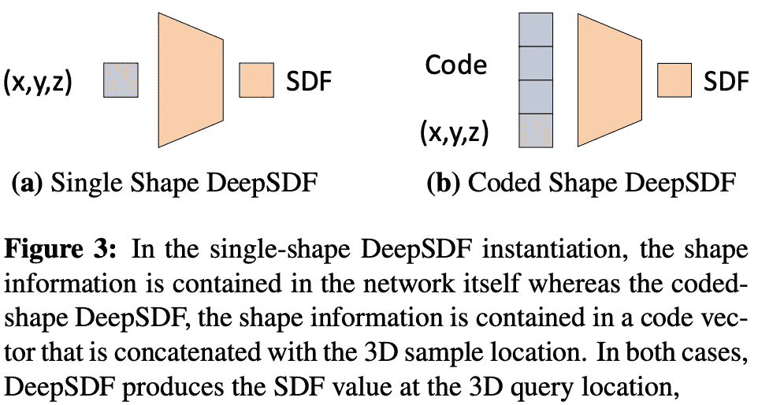
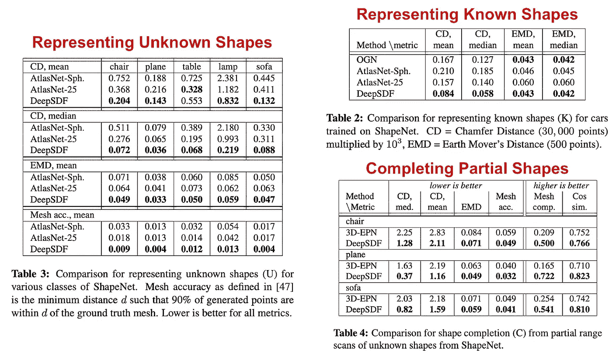

# 使用 DeepSDF 进行 3D 生成建模

> 原文：[`towardsdatascience.com/3d-generative-modeling-with-deepsdf-2cd06f1ec9b3`](https://towardsdatascience.com/3d-generative-modeling-with-deepsdf-2cd06f1ec9b3)

## 简单的神经网络可以捕捉复杂的 3D 几何形状

 [Cameron R. Wolfe, Ph.D.](https://wolfecameron.medium.com/?source=post_page-----2cd06f1ec9b3--------------------------------)

·发表于 [Towards Data Science](https://towardsdatascience.com/?source=post_page-----2cd06f1ec9b3--------------------------------) ·阅读时间 10 分钟·2023 年 1 月 30 日

--

（照片由 [Milad Fakurian](https://unsplash.com/@fakurian?utm_source=unsplash&utm_medium=referral&utm_content=creditCopyText) 提供，来源于 [Unsplash](https://unsplash.com/s/photos/3D-shape?utm_source=unsplash&utm_medium=referral&utm_content=creditCopyText)）

计算机图形学和 3D 计算机视觉领域的先前研究提出了多种表示 3D 形状的方法。这些方法对以下方面有用：

1.  存储内存高效的已知形状表示

1.  生成新形状

1.  基于有限或噪声数据修复/重建形状

超越传统方法，深度学习——更具体地说，生成性神经网络——可以用来表示 3D 形状。为此，我们可以训练一个神经网络来输出 3D 形状的表示，从而将多种形状的表示间接存储在神经网络的权重中。然后，我们可以查询这个神经网络来生成新形状。

在这篇文章中，我们将深入研究其中一种方法，称为 DeepSDF [1]，它使用一个简单的前馈神经网络来学习多种 3D 形状的符号距离函数（SDF）表示。基本思想很简单：我们不是直接编码几何体（例如，通过网格），而是训练一个生成性神经网络来输出这些几何体。然后，我们可以进行推理以*(i)* 获取（潜在的新）3D 形状的直接编码，或*(ii)* 从噪声数据中修复/重建一个 3D 形状。

（来自 [1]）

# 背景

在深入了解 DeepSDF 的工作原理之前，我们需要理解一些背景概念。首先，我们将讨论一下 3D 形状通常是如何表示的，以及签名距离函数（SDF）如何用于表示 3D 形状。然后，我们将讨论前馈神经网络，这是一种非常简单的深度学习架构，在 3D 形状建模的研究中被广泛使用。

# 表示 3D 形状

在考虑如何在计算机中存储 3D 形状时，我们有三个选项：点云、网格或体素。这些表示方法各有不同的优缺点，但都是直接表示 3D 形状的有效方法。让我们简单了解它们的工作原理。

**点云。** 点云相对容易理解。顾名思义，它们只是存储空间中一组具有 `[x, y, z]` 坐标的点，这些点用于表示一个潜在的几何形状。点云非常有用，因为它们与我们从 LiDAR 或深度传感器相机等传感器中获得的数据非常接近。但点云无法提供[完全封闭](https://davidstutz.de/a-formal-definition-of-watertight-meshes/)的表面（即具有一个封闭表面的形状）。

**网格。** 一种可以提供封闭表面的 3D 表示方法是网格。网格是基于顶点、边和面集合的 3D 形状表示，用于描述一个潜在的形状。简单来说，网格就是一系列多边形（例如三角形），这些多边形拼接在一起形成一个 3D 几何形状。

**基于体素的表示。** 体素只是具有体积的像素。在 2D 图像中的像素在 3D 空间中被称为体素（即立方体）。要使用体素表示 3D 形状，我们可以：

1.  将 3D 空间的一个部分划分为离散体素

1.  确定每个体素是否被填充

使用这种简单的技术，我们可以构建一个基于体素的 3D 对象。为了获得更准确的表示，我们可以简单地增加使用的体素数量，从而形成更细致的 3D 空间离散化。请参见下文了解点云、网格和体素之间的差异插图。

（来自[3]）

# 签名距离函数

直接使用点云、网格或体素存储 3D 形状需要大量内存。相反，我们通常希望存储一种更高效的间接表示方法。一种方法是使用签名距离函数（SDF）。

给定一个空间 `[x, y, z]` 点作为输入，SDF 将输出该点到所表示对象的最近表面的距离。SDF 输出的符号表示该空间点在对象表面内（负值）还是外（正值）。请参见下面的方程。

（由作者创建）

我们可以通过找到 SDF 等于零的位置来识别 3D 物体的表面，这表明某个点位于物体的边界。通过使用 SDF 找到这个表面后，我们可以通过使用类似 [Marching Cubes](https://graphics.stanford.edu/~mdfisher/MarchingCubes.html#:~:text=Marching%20cubes%20is%20a%20simple,a%20region%20of%20the%20function.) 的算法生成网格。

**这有什么用？** 从高层次看，SDF 允许我们存储一个函数，而不是 3D 形状的直接表示。这种函数可能更高效地存储，并且我们仍然可以用它来恢复网格表示！

# 前馈神经网络

许多高精度的 3D 形状建模方法基于前馈网络架构。这样的架构将一个向量作为输入，并在网络的每一层内应用相同的两个变换：

1.  线性变换

1.  非线性激活函数

尽管我们输入的维度是固定的，但网络架构的两个方面是我们可以选择的：隐藏维度和层数。像这样的变量，我们作为实践者需要设置，称为 *超参数*。这些超参数的正确设置取决于我们试图解决的问题和/或应用。

**代码。** 前馈网络的复杂性不大。我们可以像下面展示的那样在 PyTorch 中轻松实现它们。

# [DeepSDF: 学习连续有符号距离函数以进行形状表示](https://arxiv.org/abs/1901.05103) [1]

（来自 [1]）

在计算机图形学和 3D 计算机视觉领域，先前的研究提出了许多经典的方法来表示 3D 形状和几何体。在 [1] 中，作者提出了一种基于深度学习的方法，称为 DeepSDF，该方法使用神经网络来学习广泛类别形状的连续 SDF。简单来说，这意味着我们可以通过一个单一的前馈神经网络来编码基于 SDF 的多种不同类型的 3D 形状，从而使这些形状能够被表示、插值甚至从部分数据中完成；见上文。

DeepSDF 的核心思想很简单：我们希望使用神经网络直接对 SDF 的值进行 回归。为此，我们通过 SDF 的点样本（即具有相关 SDF 值的单个 `[x, y, z]` 点）来训练该模型。如果我们以这种方式训练网络，我们就可以轻松预测查询位置的 SDF 值，并通过找到 SDF 等于零的点来恢复形状的表面。

**我们如何表示形状？** 更具体地说，考虑一个单一形状，从中我们采样固定数量的 3D 点样本及其 SDF 值。我们应该注意，采样更多的点将使形状的表示更加精确，但这会增加计算成本。

（由作者创作）

在上面的方程中，`x` 是一个包含 `[x, y, z]` 坐标的向量，而 `s` 是与这些坐标相关联的给定形状的 SDF 值。

**训练神经网络。** 从这里，我们可以直接训练一个前馈神经网络，以 `x` 作为输入，利用这些样本对进行训练，从而生成 SDF 值 `s`，使用 [L1 回归损失](https://amitshekhar.me/blog/l1-and-l2-loss-functions)。然后，结果模型可以输出准确的 SDF 值来表示底层形状；见下图左侧子图。

（来自 [1]）

这种模型的局限性在于它仅表示单一形状。理想情况下，我们希望用一个神经网络建模多种形状。为此，我们可以将一个潜在向量（即上图中的“Code”）与每个形状关联。这是一个对每个形状唯一的低维向量，存储在我们的神经网络中。可以将这个潜在向量作为输入添加到神经网络中，以告知网络它正在为特定形状生成输出。这一简单技巧允许我们在一个模型中表示多个形状（这节省了大量内存！）；见上图右侧子图。

我们可能会问的最终问题是：*我们如何为每个形状获取这个潜在向量？* 在 [1] 中，作者通过提出一个自解码器架构来实现这一点，该架构 *(i)* 将潜在向量添加到模型的输入中，并 *(ii)* 在训练过程中通过梯度下降学习每个形状的最佳潜在向量；见下文。

（来自 [1]）

通常，潜在向量是通过 [自编码器架构](https://www.jeremyjordan.me/autoencoders/) 学习的，但这需要额外的编码器模块，增加了额外的计算开销。作者在 [1] 中提出了自解码器方法以避免这种额外计算。这些方法之间的区别如下所示。

**生成形状。** 要使用 DeepSDF 进行推理，我们必须：

1.  从稀疏/不完整的 SDF 值样本开始

1.  从这些样本中确定最佳的潜在向量

1.  使用我们训练好的神经网络对 3D 空间中的一系列不同点进行推理，以确定 SDF 值

从这里，我们可以使用像 [Marching Cubes](https://graphics.stanford.edu/~mdfisher/MarchingCubes.html#:~:text=Marching%20cubes%20is%20a%20simple,a%20region%20of%20the%20function.) 这样的算法来可视化由 DeepSDF 表示的形状，这些算法对 3D 空间进行离散化，并基于这些 SDF 值提取实际的 3D 几何形状。

**数据。** DeepSDF 是使用合成的 [ShapeNet](https://shapenet.org/) 数据集进行训练和评估的。特别地，它的性能在四个任务中得到了衡量。

1.  训练集中的形状表示

1.  重建未见（测试）形状

1.  完成部分形状

1.  从潜在空间采样新形状

对于前三个任务，我们发现 DeepSDF 一直优于基线方法，这表明它能够以高精度表示复杂形状，甚至能够从不完整的样本中较好地恢复形状。考虑到我们在一个单一且节省内存的神经网络中存储了大量的 3D 形状，这一点尤为显著；见下图。

（来自 [1]）

我们还可以对 DeepSDF 模型的嵌入空间进行插值，以生成连贯的结果。这使我们能够做一些事情，比如找到卡车和汽车之间的平均形状；见下图。

（来自 [1]）

从这些结果中，我们可以看到潜在向量之间的插值产生了形状之间的平滑过渡，这表明 DeepSDF 嵌入的连续 SDF 是有意义的！形状的常见特征 —— 如卡车车厢或椅子扶手 —— 都被 DeepSDF 利用的表示所捕捉。这对于这样一个简单的前馈网络来说，实在是非常了不起。

# 收获

DeepSDF 是一个前馈生成神经网络，我们可以用来表示和操作 3D 形状。使用这个模型，我们可以轻松地执行诸如生成形状的网格表示、从不完整或噪声数据中恢复基本形状，甚至生成一个新的形状，这个新形状是已知几何形状的插值。以下列出了 DeepSDF 的优点和局限性。

**大量压缩。** 要在计算机中存储 3D 几何形状，我们可以使用网格或体素表示。为了避免直接存储这种形状的内存开销，我们可以使用像 DeepSDF 这样的生成模型。通过这种方法，我们不再需要几何形状的直接网格编码。相反，我们可以使用 DeepSDF —— 一个易于存储的小型神经网络 —— 来准确生成各种形状的网格。

**修复破损几何形状。** 给定基本形状的部分或噪声表示，DeepSDF 可以用来恢复准确的网格；见下图。相比之下，大多数之前的方法无法执行这种任务 —— 它们需要访问与用于训练模型的数据类型匹配的完整 3D 形状表示。

（来自 [1]）

**插值潜在空间。** Deep SDF 能够表示许多不同的形状，并将它们的属性嵌入到低维潜在空间中。此外，实验表明，这个潜在空间是有意义的，并且具有良好的覆盖范围。实际上，这意味着我们可以在潜在向量（即，不同对象的向量表示）之间进行 [线性插值](https://en.wikipedia.org/wiki/Linear_interpolation)，并生成有效的新形状。我们可以轻松地利用这一点生成具有各种有趣属性的新形状。

**局限性。** DeepSDF 非常出色，但它总是需要访问（可能是噪声或不完整的）3D 几何体来进行推断。此外，寻找最佳潜在向量（即，由于自动解码器方法，这必须始终在进行推断之前完成）计算成本很高。因此，DeepSDF 的推断能力在某种程度上是有限的。总结来说，该方法较慢，无法从头生成新形状，这为未来的改进留下了空间。

## 结束语

非常感谢您阅读本文。我是 [Cameron R. Wolfe](https://cameronrwolfe.me/)，一名在 [Alegion](https://www.alegion.com/) 工作的研究科学家，同时也是赖斯大学的博士生，研究深度学习的经验和理论基础。您还可以查看我在 medium 上的 [其他文章](https://medium.com/@wolfecameron)！如果您喜欢，请在 [twitter](https://twitter.com/cwolferesearch) 上关注我，或者订阅我的 [Deep (Learning) Focus 新闻通讯](https://cameronrwolfe.substack.com/)，我在其中撰写关于重要深度学习主题的易于理解的概述系列。

## 参考文献

[1] Park, Jeong Joon 等. “Deepsdf: 学习用于形状表示的连续符号距离函数。” *IEEE/CVF 计算机视觉与模式识别会议论文集*. 2019.

[2] Mildenhall, Ben 等. “Nerf: 将场景表示为神经辐射场以进行视图合成。” *ACM 通讯* 65.1 (2021): 99–106.

[3] Hoang, Long 等. “一种使用波形核签名和 3D 三角网中心点的深度学习方法进行 3D 对象分类。” *电子学* 8.10 (2019): 1196.
