# 室内建模的 3D 点云形状检测

> 原文：[`towardsdatascience.com/3d-point-cloud-shape-detection-for-indoor-modelling-70e36e5f2511`](https://towardsdatascience.com/3d-point-cloud-shape-detection-for-indoor-modelling-70e36e5f2511)

## [动手教程](https://towardsdatascience.com/tagged/hands-on-tutorials)，3D Python

## 10 æ­¥ Python 指å—，用于自动化 3D 形状检测ã€åˆ†å‰²ã€èšç±»å’Œä½“素化，以实现室内点云数æ®é›†çš„空间å ç”¨ 3D 建模。

[](https://medium.com/@florentpoux?source=post_page-----70e36e5f2511--------------------------------)[](https://towardsdatascience.com/?source=post_page-----70e36e5f2511--------------------------------) [Florent Poux, Ph.D.](https://medium.com/@florentpoux?source=post_page-----70e36e5f2511--------------------------------)

·å‘布于 [Towards Data Science](https://towardsdatascience.com/?source=post_page-----70e36e5f2511--------------------------------) ·阅读时长 28 分钟·2023 å¹´ 9 月 7 æ—¥

--

如果你有点云或数æ®åˆ†æžçš„ç»éªŒï¼Œä½ çŸ¥é“识别模å¼æœ‰å¤šé‡è¦ã€‚识别具有相似模å¼çš„æ•°æ®ç‚¹æˆ–“对象â€å¯¹èŽ·å–有价值的è§è§£è‡³å…³é‡è¦ã€‚我们的视觉认知系统å¯ä»¥è½»æ¾å®Œæˆè¿™é¡¹ä»»åŠ¡ï¼Œä½†é€šè¿‡è®¡ç®—方法å¤åˆ¶è¿™ç§äººç±»èƒ½åŠ›æ˜¯ä¸€ä¸ªé‡å¤§æŒ‘战。

目标是利用人类视觉系统自然的元素分组倾å‘。👀

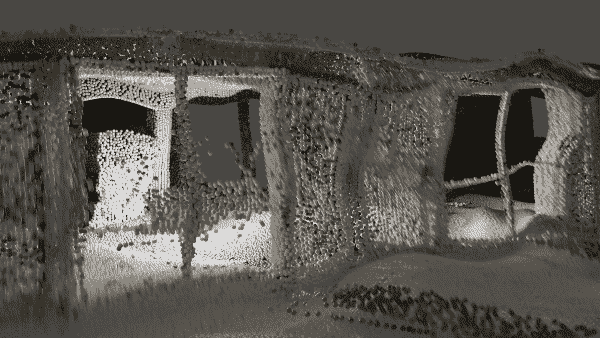

3D 点云分割阶段结果示例。© F. Poux

## 但这有什么用呢？

首先，它通过将数æ®åˆ†ç»„到ä¸åŒçš„段中，让你轻æ¾è®¿é—®å’Œå¤„ç†æ•°æ®çš„特定部分。其次，通过查看区域而ä¸æ˜¯å•ä¸ªç‚¹ï¼Œå®ƒä½¿æ•°æ®å¤„ç†æ›´å¿«ã€‚è¿™å¯ä»¥èŠ‚çœå¤§é‡æ—¶é—´å’Œç²¾åŠ›ã€‚最åŽï¼Œåˆ†å‰²å¯ä»¥å¸®åŠ©ä½ å‘现通过查看原始数æ®æ— æ³•çœ‹åˆ°çš„模å¼å’Œå…³ç³»ã€‚🔠总的æ¥è¯´ï¼Œåˆ†å‰²å¯¹äºŽä»Žç‚¹äº‘æ•°æ®ä¸­èŽ·å–有用信æ¯è‡³å…³é‡è¦ã€‚如果你ä¸ç¡®å®šå¦‚何åšï¼Œåˆ«æ‹…心——我们会一起æžå®šçš„ï¼ðŸ¤¿

## ç­–ç•¥

在我们以有效的解决方案处ç†é¡¹ç›®ä¹‹å‰ï¼Œè®©æˆ‘们框定整体方法。本教程éµå¾ªä¸€ä¸ªç”±å个简å•æ­¥éª¤ç»„æˆçš„策略，如下方的策略图所示。

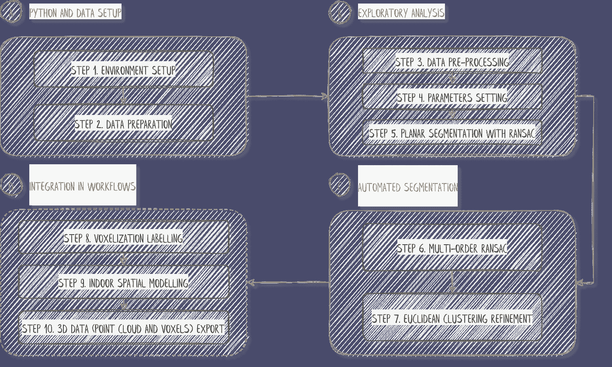

本指å—展示了 3D 点云室内建模的工作æµç¨‹ã€‚© F. Poux

策略已列出，下é¢ä½ å¯ä»¥æ‰¾åˆ°ä¸åŒæ­¥éª¤çš„å¿«æ·é“¾æŽ¥ï¼š

```py
Step 1\. Environment Setup
Step 2\. 3D Data Preparation
Step 3\. Data Pre-Processing
Step 4\. Parameter Setting
Step 5\. RANSAC Planar Detection
Step 6\. Multi-Order RANSAC
Step 7\. Euclidean Clustering Refinement
Step 8\. Voxelization Labelling
Step 9\. Indoor Spatial Modelling
Step 10\. 3D Workflow Export
```

既然我们已åšå¥½å‡†å¤‡ï¼Œé‚£å°±ç›´æŽ¥å¼€å§‹å§ã€‚

🎵**读者注æ„**：此动手指å—是* [***UTWENTE***](https://www.itc.nl/) *è”åˆå·¥ä½œçš„一部分，由* ***F. Poux*** *å’Œ* ***V. Lehtola*** *å…±åŒä½œè€…。我们感谢æ¥è‡ªæ•°å­—åŒèƒžèƒŽ* [*@ITC*](http://twitter.com/ITC) *项目的资助，该项目由特温特大学 ITC ç³»æ供。***æ‰€æœ‰å›¾åƒ Â© Florent Poux***。*

# 1\. 设置您的 Python 环境。

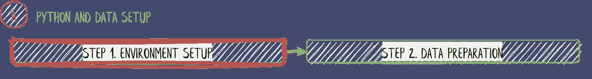

在下é¢çš„上一篇文章中，我们展示了如何快速设置 Anaconda 环境并使用 IDE JupyterLab 管ç†ä»£ç ã€‚如果您继续以这ç§æ–¹å¼è®¾ç½®è‡ªå·±ï¼Œæ‚¨å°†æˆä¸ºä¸€å完整的 Python 应用程åºå¼€å‘者 😆。

[](/3d-python-workflows-for-lidar-point-clouds-100ff40e4ff0?source=post_page-----70e36e5f2511--------------------------------) ## 3D Python 工作æµç¨‹ç”¨äºŽ LiDAR 城市模型：é€æ­¥æŒ‡å—

### è§£é” 3D 城市建模应用程åºçš„精简工作æµç¨‹çš„终æžæŒ‡å—。教程涵盖了 Python...

towardsdatascience.com

🦊 **Florent**：*我强烈推è使用桌é¢è®¾ç½®æˆ– IDE，é¿å…使用 Google Colab，尤其是当您需è¦ä½¿ç”¨æ供的库å¯è§†åŒ– 3D 点云时，因为它们在最佳情况下会ä¸ç¨³å®šï¼Œæœ€ç³Ÿç³•çš„情况下则无法工作（ä¸å¹¸çš„是…）。*

🤠 **Ville**：*我们猜您是在 Windows 上è¿è¡Œï¼Ÿè¿™æ²¡é—®é¢˜ï¼Œä½†å¦‚果您想进入计算方法领域，Linux 是首选ï¼*

好å§ï¼Œæˆ‘们将采å–一ç§â€œå¿«é€Ÿæˆæžœâ€çš„方法。实际上，我们将通过éµå¾ªæœ€ç®€åŒ–çš„ç¼–ç æ–¹æ³•æ¥å®žçŽ°å“越的分割💻。这æ„味ç€æˆ‘们对底层库éžå¸¸æŒ‘剔ï¼æˆ‘们将使用三个éžå¸¸å¼ºå¤§çš„库，分别是`numpy`ã€`matplotlib`å’Œ`open3d`。

好的，è¦åœ¨ä¸€ä¸ªå…¨æ–°çš„虚拟环境中安装上述库包，我们建议您从`cmd`终端è¿è¡Œä»¥ä¸‹å‘½ä»¤ï¼š

```py
conda install numpy
conda install matplotlib
pip install open3d==0.16.0
```

🜠***å…责声明***：*我们选择了 Python，而ä¸æ˜¯ C++ 或 Julia，所以性能就是那样 😄。希望它能满足您的应用需求 😉，对于我们所谓的“离线â€è¿‡ç¨‹ï¼ˆéžå®žæ—¶ï¼‰ã€‚*

在您的 Python IDE 中，请确ä¿å¯¼å…¥å°†è¢«é¢‘ç¹ä½¿ç”¨çš„三个库：

```py
#%% 1\. Library setup
import numpy as np
import open3d as o3d
import matplotlib.pyplot as plt
```

就这样ï¼æˆ‘们准备好进行室内点云建模工作æµç¨‹äº†ï¼

# 2\. 点云数æ®å‡†å¤‡

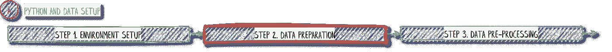

在之å‰çš„教程中，我们演示了如何处ç†ç‚¹äº‘并在使用 AHN4 LiDAR 活动获å–çš„ 3D æ•°æ®é›†ä¸Šè¿›è¡Œç½‘格化。这一次，我们将使用一个通过地é¢æ¿€å…‰æ‰«æ仪收集的数æ®é›†ï¼šITC 新建筑。它被组织æˆä¸‰ä¸ªä¸åŒçš„集åˆä¾›æ‚¨å®žéªŒã€‚紫色的是户外部分。红色是地é¢å±‚，绿色是第一层，如下图所示。

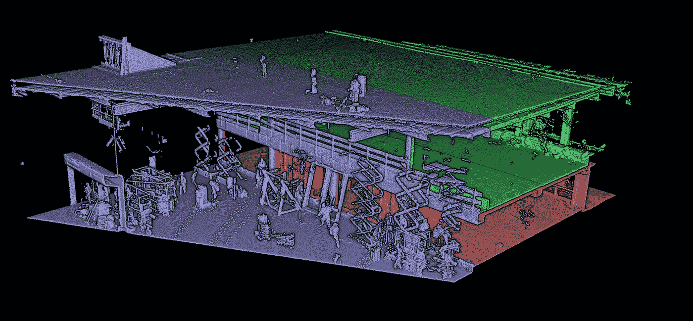

使用的 ITC æ•°æ®é›†çš„ 3D 点云部分。© F. Poux

ä½ å¯ä»¥ä»Žè¿™é‡Œä¸‹è½½æ•°æ®ï¼š[ITC æ•°æ®é›†](https://drive.google.com/drive/folders/1sCBT1lc9A8Zn4grpxwFrBrvos86c0HZR?usp=share_link)。一旦你在本地对数æ®æœ‰äº†ç‰¢å›ºçš„掌æ¡ï¼Œä½ å¯ä»¥ç”¨ä¸¤è¡Œç®€å•çš„代ç å°†æ•°æ®é›†åŠ è½½åˆ°ä½ çš„ Python 执行环境中：

```py
DATANAME = "ITC_groundfloor.ply"
pcd = o3d.io.read_point_cloud("../DATA/" + DATANAME)
```

🦊 **Florent**: *这段 Python 代ç ç‰‡æ®µä½¿ç”¨* `*Open3D*` *库æ¥è¯»å–ä½äºŽç›®å½•â€œ*`*../DATA/*`*â€ä¸­çš„点云数æ®æ–‡ä»¶* `*ITC_groundfloor.ply*` *，并将其赋值给å˜é‡* `*pcd*`*。*

å˜é‡çŽ°åœ¨ä¿å­˜ç€ä½ çš„点云 `pcd`，你将用以下代ç è¿›è¡Œæ“作：


一旦点云数æ®æˆåŠŸåŠ è½½åˆ° Open3D 中，下一步是应用å„ç§é¢„处ç†æŠ€æœ¯æ¥æå‡å…¶è´¨é‡å¹¶æå–有æ„义的信æ¯ã€‚

# 3\. 点云预处ç†


如果你打算在 `open3d` 中å¯è§†åŒ–点云，建议你将点云移动以绕过大å标的近似，这样å¯ä»¥é¿å…产生晃动的å¯è§†åŒ–效果。è¦å¯¹ä½ çš„ `pcd` 点云应用这ç§ç§»åŠ¨ï¼Œé¦–先获å–点云的中心，然åŽé€šè¿‡ä»ŽåŽŸå§‹å˜é‡ä¸­å‡åŽ»å®ƒæ¥è¿›è¡Œå¹³ç§»ï¼š

```py
pcd_center = pcd.get_center()
pcd.translate(-pcd_center)
```

现在å¯ä»¥é€šè¿‡ä»¥ä¸‹ä»£ç è¡Œè¿›è¡Œäº¤äº’å¼å¯è§†åŒ–：

```py
o3d.visualization.draw_geometries([pcd])
```

🦚 **注æ„**: `o3d.visualization.draw_geometries([pcd])` *调用了* `*draw_geometries()*` *函数，这个函数属于 Open3D çš„* `*visualization*` *模å—。该函数接å—一个几何体列表作为å‚数，并在å¯è§†åŒ–窗å£ä¸­æ˜¾ç¤ºå®ƒä»¬ã€‚在这ç§æƒ…况下，列表包å«ä¸€ä¸ªå‡ ä½•ä½“，å³è¡¨ç¤ºç‚¹äº‘çš„* `*pcd*` *å˜é‡ã€‚* `*draw_geometries()*` *函数创建一个 3D å¯è§†åŒ–窗å£å¹¶æ¸²æŸ“点云。你å¯ä»¥ä¸Žå¯è§†åŒ–窗å£äº’动以旋转ã€ç¼©æ”¾ï¼Œå¹¶ä»Žä¸åŒè§’度探索点云。*

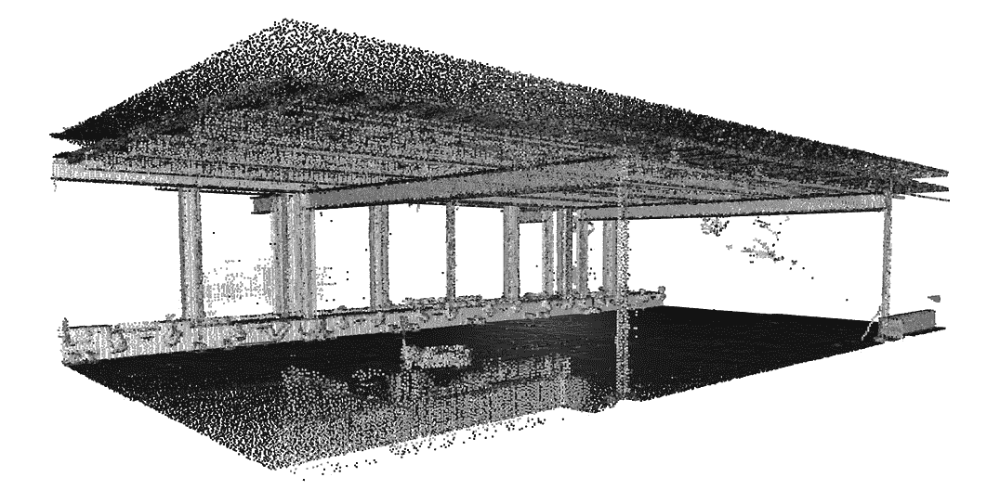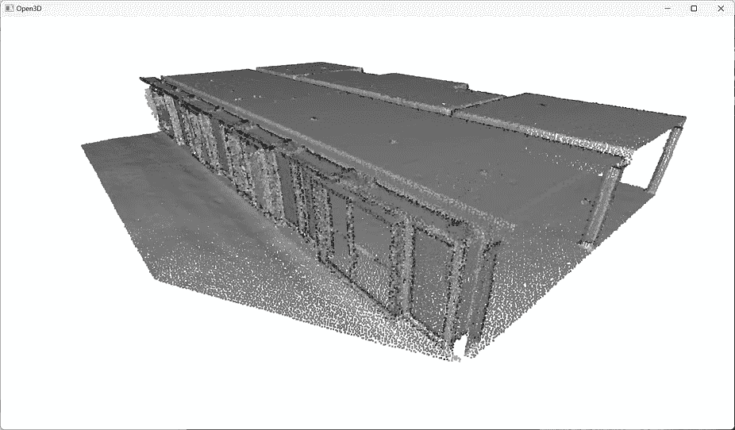

太棒了👌，我们已ç»å‡†å¤‡å¥½æµ‹è¯•ä¸€äº›é‡‡æ ·ç­–ç•¥æ¥ç»Ÿä¸€æˆ‘们的下游处ç†ã€‚

## 3.1\. 点云éšæœºé‡‡æ ·

让我们考虑那些å¯ä»¥æœ‰æ•ˆå‡å°‘点云大å°åŒæ—¶ä¿æŒæ•´ä½“结构完整性和代表性的方法。如果我们将点云定义为一个矩阵 (m x n)，那么通过ä¿ç•™è¯¥çŸ©é˜µæ¯éš” n 行的一个行，我们å¯ä»¥å¾—到一个**简化的点云**：

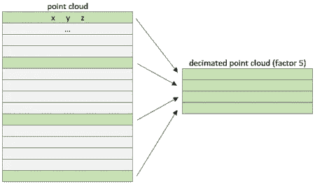

一个点云简化策略。© F. Poux

在矩阵级别，简化æ“ä½œæ˜¯é€šè¿‡æ ¹æ® n å› å­ä¿ç•™æ¯éš” n 行的点æ¥è¿›è¡Œçš„。当然，这å–决于点在文件中的存储方å¼ã€‚用 `open3d` 切片点云是相当直接的。为了简化和å‚数化表达å¼ï¼Œä½ å¯ä»¥å†™å‡ºä»¥ä¸‹ä»£ç ï¼š

```py
retained_ratio = 0.2
sampled_pcd = pcd.random_down_sample(retained_ratio)
```

🦚 **注æ„**：`sampled_pcd = pcd.random_down_sample(retained_ratio)` *对原始点云* `*pcd*` *应用éšæœºä¸‹é‡‡æ ·ï¼Œä½¿ç”¨çš„是* `random_down_sample()` *函数，该函数由 Open3D æ供。* `retained_ratio` *å‚数决定了下采样åŽä¿ç•™çš„点的比例。例如，如果* `retained_ratio` *设置为 0.5，则大约 50% 的点将被éšæœºé€‰æ‹©å¹¶ä¿ç•™åœ¨é‡‡æ ·åŽçš„点云中。*

```py
o3d.visualization.draw_geometries([sampled_pcd], window_name = "Random Sampling")
```

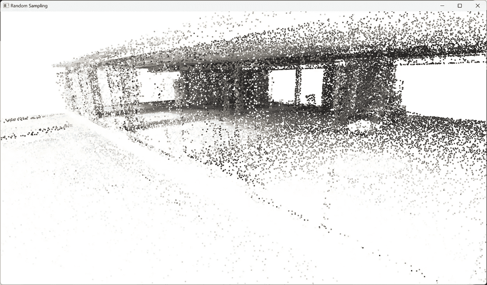

点云的下采样结果。© F. Poux

🌱 **å‘展**：*在研究 3D 点云时，éšæœºé‡‡æ ·æœ‰å…¶å±€é™æ€§ï¼Œå¯èƒ½ä¼šå¯¼è‡´é—æ¼é‡è¦ä¿¡æ¯å’Œåˆ†æžä¸å‡†ç¡®ã€‚它没有考虑点之间的空间组件或关系。因此，使用其他方法以确ä¿æ›´å…¨é¢çš„分æžæ˜¯è‡³å…³é‡è¦çš„。*

尽管这ç§ç­–略快速，但éšæœºé‡‡æ ·å¯èƒ½ä¸é€‚åˆâ€œæ ‡å‡†åŒ–â€ç”¨ä¾‹ã€‚下一步是通过统计异常值去除技术æ¥å¤„ç†æ½œåœ¨çš„异常值，以确ä¿æ•°æ®çš„è´¨é‡å’Œå¯é æ€§ï¼Œä»¥ä¾¿è¿›è¡ŒåŽç»­åˆ†æžå’Œå¤„ç†ã€‚

## 3.2\. 统计异常值去除

对 3D 点云数æ®ä½¿ç”¨å¼‚常值过滤器å¯ä»¥å¸®åŠ©è¯†åˆ«å’ŒåŽ»é™¤ä»»ä½•æ˜¾è‘—ä¸åŒäºŽæ•°æ®é›†å…¶ä½™éƒ¨åˆ†çš„æ•°æ®ç‚¹ã€‚这些异常值å¯èƒ½æ˜¯ç”±äºŽæµ‹é‡è¯¯å·®æˆ–其他因素造æˆçš„，这些因素å¯èƒ½ä¼šå½±å“分æžã€‚通过去除这些异常值，我们å¯ä»¥èŽ·å¾—更有效的数æ®è¡¨ç¤ºï¼Œå¹¶æ›´å¥½åœ°è°ƒæ•´ç®—法。然而，我们需è¦å°å¿ƒä¸è¦åˆ é™¤æœ‰ä»·å€¼çš„点。

我们将定义一个 `statistical_outlier_removal` 过滤器，以去除与其邻居相比远离平å‡å€¼çš„点。它需è¦ä¸¤ä¸ªè¾“å…¥å‚数：

+   `nb_neighbors`，用于指定在计算给定点的平å‡è·ç¦»æ—¶è€ƒè™‘多少个邻居。

+   `std_ratio`，å…许根æ®ç‚¹äº‘中平å‡è·ç¦»çš„标准差设置阈值水平。这个数值越低，过滤器的作用就越强。

这包括以下内容：

```py
nn = 16
std_multiplier = 10

filtered_pcd, filtered_idx = pcd.remove_statistical_outlier(nn, std_multiplier)
```

🦚 **注æ„**：*`*remove_statistical_outlier()*` *函数通过指定数é‡çš„最近邻（*`*nn*`*）和一个标准差乘数（*`*std_multiplier*`*）æ¥å¯¹ç‚¹äº‘应用统计异常值去除。该函数返回两个值：* `*filtered_pcd*` *å’Œ* `*filtered_idx*`*。* `*filtered_pcd*` *表示ç»è¿‡æ»¤çš„点云，其中已去除统计异常值。* `*filtered_idx*` *是一个索引数组，对应于在异常值去除过程中ä¿ç•™çš„原始点云* `*pcd*` *中的点。*

为了å¯è§†åŒ–è¿™ç§è¿‡æ»¤æŠ€æœ¯çš„结果，我们将异常值标记为红色，并将其添加到我们希望å¯è§†åŒ–的点云对象列表中：

```py
outliers = pcd.select_by_index(filtered_idx, invert=True)
outliers.paint_uniform_color([1, 0, 0])
o3d.visualization.draw_geometries([filtered_pcd, outliers])
```

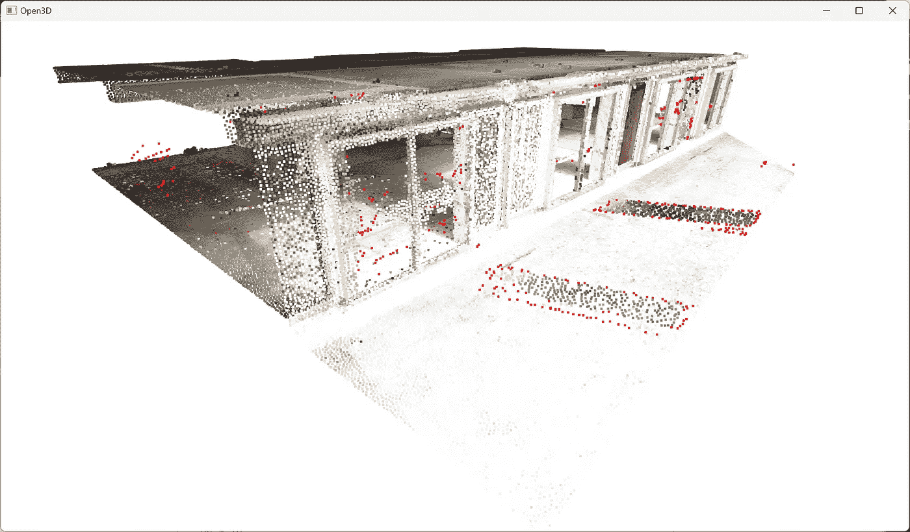

异常值在点云中用红色标记和å¯è§†åŒ–。© F. Poux

在从点云中移除统计异常值之åŽï¼Œä¸‹ä¸€æ­¥æ˜¯åº”用基于体素的采样技术，进一步下采样数æ®ï¼Œä»¥ä¾¿é«˜æ•ˆå¤„ç†å’Œåˆ†æžï¼ŒåŒæ—¶ä¿ç•™ç‚¹äº‘的基本结构特å¾ã€‚

## 3.3. 点云体素（网格）采样

网格下采样策略基于将 3D 空间划分为规则的立方体å•å…ƒï¼Œç§°ä¸ºä½“素。对于这个网格的æ¯ä¸ªå•å…ƒï¼Œæˆ‘们åªä¿ç•™ä¸€ä¸ªä»£è¡¨æ€§ç‚¹ï¼Œå¹¶ä¸”å¯ä»¥ç”¨ä¸åŒçš„æ–¹å¼é€‰æ‹©è¿™ä¸ªç‚¹ã€‚当下采样时，我们ä¿ç•™è¯¥å•å…ƒæœ€æŽ¥è¿‘é‡å¿ƒçš„点。

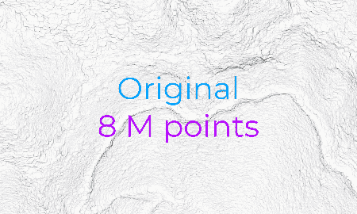

体素网格采样示例。© F. Poux

具体而言，我们定义一个`voxel_size`，然åŽç”¨å®ƒæ¥è¿‡æ»¤æˆ‘们的点云：

```py
voxel_size = 0.05
pcd_downsampled = filtered_pcd.voxel_down_sample(voxel_size = voxel_size)
```

🦚 **注æ„**：*此行对过滤åŽçš„点云执行体素下采样，* `*filtered_pcd*`*，使用* `*voxel_down_sample()*` *函数。* `*voxel_size*` *å‚数指定体素下采样点云的æ¯ä¸ªä½“素的大å°ã€‚较大的体素尺寸会导致点云密度显著å‡å°‘。下采样æ“作的结果分é…ç»™å˜é‡* `*pcd_downsampled*`*，代表下采样åŽçš„点云*。

现在是仔细å¯è§†åŒ–下采样åŽåˆ†å¸ƒçš„时间：

```py
o3d.visualization.draw_geometries([pcd_downsampled])
```

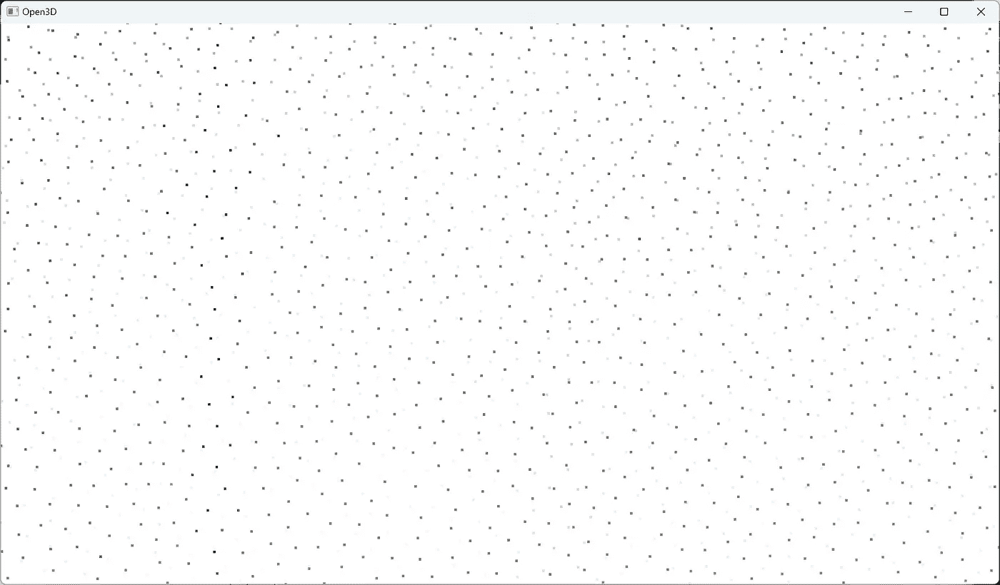

应用在点云上的采样策略结果。© F. Poux

在此阶段，我们有一组未在进一步处ç†æ—¶è§¦åŠçš„异常点和一个下采样åŽçš„点云，构æˆäº†åŽç»­è¿‡ç¨‹çš„新主题。

## 3.4. 点云法线æå–

点云法线指的是 3D 点云中特定点处表é¢çš„æ–¹å‘。它å¯ä»¥ç”¨äºŽé€šè¿‡å°†ç‚¹äº‘划分为具有相似法线的区域æ¥è¿›è¡Œåˆ†å‰²ã€‚例如，在我们的案例中，法线将有助于识别点云中的物体和表é¢ï¼Œä½¿å…¶æ›´å®¹æ˜“å¯è§†åŒ–。这也是介ç»ä¸€ç§åŠè‡ªåŠ¨è®¡ç®—法线的方法的ç»ä½³æœºä¼šã€‚我们首先定义点云中æ¯ä¸ªç‚¹ä¸Žå…¶é‚»å±…之间的平å‡è·ç¦»ï¼š

```py
nn_distance = 0.05
```

然åŽï¼Œæˆ‘们利用这些信æ¯åœ¨åŠå¾„为`radius_normals`的范围内æå–有é™çš„`max_nn`个点，为 3D 点云中的æ¯ä¸ªç‚¹è®¡ç®—法线：

```py
radius_normals=nn_distance*4
pcd_downsampled.estimate_normals(search_param=o3d.geometry.KDTreeSearchParamHybrid(radius=radius_normals, max_nn=16), fast_normal_computation=True)
```

现在，`pcd_downsampled`点云对象很高兴地拥有法线，准备展示其最漂亮的一é¢ðŸ˜Šã€‚此时你知é“该åšä»€ä¹ˆï¼š

```py
pcd_downsampled.paint_uniform_color([0.6, 0.6, 0.6])
o3d.visualization.draw_geometries([pcd_downsampled,outliers])
```

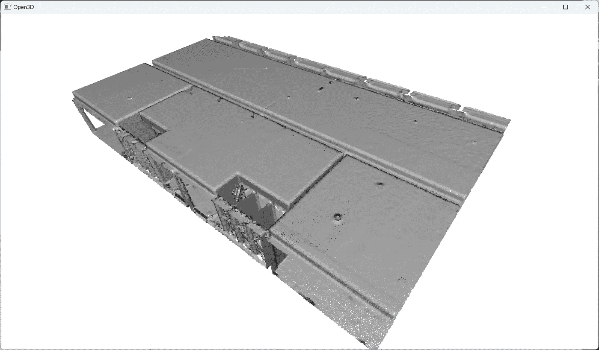

用于åŽç»­å®žéªŒçš„点云。

完æˆç‚¹äº‘的体素下采样åŽï¼Œä¸‹ä¸€æ­¥æ˜¯é…置点云形状检测和èšç±»çš„å‚数，这在将相似点分组以åŠä»Žä¸‹é‡‡æ ·ç‚¹äº‘æ•°æ®ä¸­æå–有æ„义的结构或对象中起ç€å…³é”®ä½œç”¨ã€‚

# 4\. 点云å‚数设置


在本教程中，我们为您精选了两ç§æœ€æœ‰æ•ˆä¸”å¯é çš„ 3D 形状检测和èšç±»æ–¹æ³•ï¼šRANSAC 和使用 DBSCAN 的欧几里得èšç±»ã€‚然而，在使用这些方法之å‰ï¼Œäº†è§£å‚æ•°çš„åŒæ—¶ï¼Œç†è§£åŸºæœ¬æ¦‚念是至关é‡è¦çš„。

## RANSAC

RANSAC 算法，RANdom SAmple Consensus 的缩写，是一个强大的工具，用于处ç†åŒ…å«å¼‚常值的数æ®ï¼Œè¿™åœ¨ä½¿ç”¨çŽ°å®žä¸–界传感器时常常会é‡åˆ°ã€‚该算法通过将数æ®ç‚¹åˆ†ä¸ºä¸¤ç±»ï¼šå†…点和外点æ¥å·¥ä½œã€‚通过识别并忽略外点，您å¯ä»¥ä¸“注于处ç†å¯é çš„内点，从而使分æžæ›´åŠ æœ‰æ•ˆã€‚

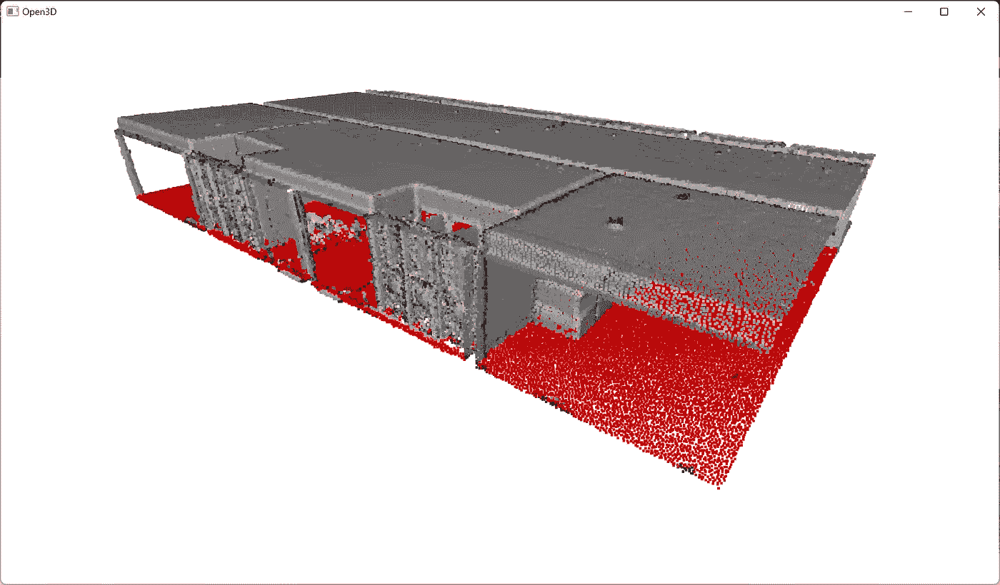

在 3D 点云中使用 RANSAC 进行平é¢æ£€æµ‹ã€‚© F. Poux

让我用一个简å•çš„例å­æ¥è¯´æ˜Ž RANSAC 的工作原ç†ã€‚å‡è®¾æˆ‘们想通过下é¢çš„点云拟åˆä¸€ä¸ªå¹³é¢ã€‚我们怎么åšå‘¢ï¼Ÿ

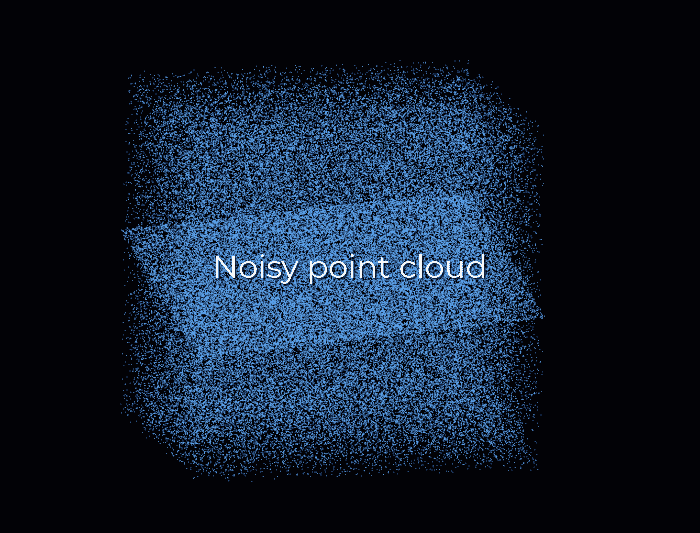

在éšæœºç‚¹äº‘中进行的 RANSAC å¹³é¢æ£€æµ‹æ¨¡æ‹Ÿã€‚© F. Poux

首先，我们从数æ®ä¸­åˆ›å»ºä¸€ä¸ªå¹³é¢ï¼Œä¸ºæ­¤ï¼Œæˆ‘们从点云中éšæœºé€‰æ‹© 3 个点æ¥å»ºç«‹å¹³é¢ã€‚然åŽï¼Œæˆ‘们简å•åœ°æ£€æŸ¥å‰©ä½™çš„点中有多少点è½åœ¨è¯¥å¹³é¢ä¸Šï¼ˆè¾¾åˆ°æŸä¸ªé˜ˆå€¼ï¼‰ï¼Œè¿™å°†ä¸ºæ案打分。


RANSAC 评分系统说明。您å¯ä»¥çœ‹åˆ°ï¼Œæ¯æ¬¡è¿­ä»£éƒ½ä¼šéšæœºæŠ½å– 3 个点，从中创建一个平é¢ï¼Œç„¶åŽé€‰æ‹©è½åœ¨å¹³é¢ä¸Šçš„点。在这里，第 159 次迭代会是最佳候选。© F. Poux

然åŽï¼Œæˆ‘们用 3 个新的éšæœºç‚¹é‡å¤è¿™ä¸ªè¿‡ç¨‹ï¼Œçœ‹çœ‹æ•ˆæžœå¦‚何。是更好了å—？更差了å—？然åŽï¼Œæˆ‘们åå¤è¿›è¡Œè¿™ä¸ªè¿‡ç¨‹ï¼Œæ¯”如说 10 次ã€100 次ã€1000 次，然åŽé€‰æ‹©å¾—分最高的平é¢æ¨¡åž‹ï¼ˆå³å…·æœ‰æœ€ä½³â€œæ”¯æŒâ€çš„剩余数æ®ç‚¹ï¼‰ã€‚这将是我们的解决方案：支æŒç‚¹åŠ ä¸Šæˆ‘们采样的三个点构æˆæˆ‘们的**内点集**，其余部分是我们的**外点集**。够简å•å§ ðŸ˜ï¼Ÿ

哈哈，对于那些怀疑者，你们难é“没有一个上å‡çš„问题å—？我们如何实际确定应该é‡å¤å¤šå°‘次过程？我们应该多频ç¹åœ°å°è¯•ï¼Ÿå¥½å§ï¼Œè¿™å®žé™…上是å¯ä»¥è®¡ç®—的，但我们先把它放到一边，专注于当å‰çš„问题：点云分割😉。

## RANSAC å‚数设置

我们希望使用 RANSAC æ¥æ£€æµ‹ç‚¹äº‘中的 3D å¹³é¢å½¢çŠ¶ã€‚使用 RANSAC 时，我们需è¦å®šä¹‰ä¸‰ä¸ªå‚数：一个è·ç¦»é˜ˆå€¼`distance_threshold`，用于将点标记为内点或外点；一个最å°ç‚¹æ•°`ransac_n`，用于拟åˆå‡ ä½•æ¨¡åž‹ï¼›ä¸€ä¸ªè¿­ä»£æ¬¡æ•°`num_iterations`。

**è·ç¦»é˜ˆå€¼çš„确定**：我们å¯èƒ½ä¼šå› ä¸ºéœ€è¦ä¸€äº›é¢†åŸŸçŸ¥è¯†æ¥è®¾ç½®æœªæ¥çš„分割和建模阈值而å—到é™åˆ¶ã€‚因此，å°è¯•ç»•è¿‡è¿™ä¸€ç‚¹ä»¥ä½¿æ–¹æ³•å¯¹éžä¸“家开放将是令人兴奋的。我们将与你分享一个简å•çš„想法，这å¯èƒ½ä¼šæœ‰ç”¨ã€‚如果我们计算数æ®é›†ä¸­ç‚¹ä¹‹é—´çš„å¹³å‡è·ç¦»ï¼Œå¹¶å°†å…¶ä½œä¸ºè®¾ç½®é˜ˆå€¼çš„基础，会怎样呢？

好å§ï¼Œè¿™æ˜¯ä¸€ä¸ªå€¼å¾—探索的想法。为了确定这样的值，我们使用 `KD-Tree` æ¥åŠ é€Ÿæ¯ä¸ªç‚¹çš„最近邻查询过程。从那里开始，我们å¯ä»¥æŸ¥è¯¢ç‚¹äº‘中æ¯ä¸ªç‚¹çš„ k 个最近邻，然åŽå°†å…¶æ‰“包到下é¢æ˜¾ç¤ºçš„ `open3d` 函数中：

```py
nn_distance = np.mean(pcd.compute_nearest_neighbor_distance())
```

毫无æ„外，它接近 5 cm，因为我们将点云采样到这个值。这æ„味ç€å¦‚果我们考虑最近邻，我们会有 51 mm çš„å¹³å‡è·ç¦»ã€‚

🌱 **æˆé•¿**：*从这里开始，我们å¯ä»¥å°† RANSAC å‚数设置为从 nn_distance å˜é‡å¾—出的值，这样å¯ä»¥æ ¹æ®è€ƒè™‘çš„æ•°æ®é›†è¿›è¡Œè°ƒæ•´ï¼Œè€Œä¸ä¾èµ–于领域知识。你会怎么处ç†è¿™ä¸ªé—®é¢˜ï¼Ÿ*

**点数的确定**：这里很简å•ã€‚我们想è¦æ‰¾å‡ºå¹³é¢ï¼Œå› æ­¤æˆ‘们将å–定义 3D å¹³é¢æ‰€éœ€çš„最å°ç‚¹æ•°ï¼š3。

**迭代次数的确定**：迭代次数越多，你的 3D 形状检测就越稳å¥ï¼Œä½†æ‰€éœ€æ—¶é—´ä¹Ÿè¶Šé•¿ã€‚ç›®å‰ï¼Œæˆ‘们å¯ä»¥å°†å…¶è®¾ç½®ä¸º 1000，这样å¯ä»¥èŽ·å¾—良好的结果。我们将在未æ¥çš„教程中探索更多巧妙的方法æ¥æ‰¾å‡ºç‚¹äº‘的噪声比例。😉

🧙â€â™‚ï¸ **专家**：*有一ç§è‡ªåŠ¨èŽ·å–æ¯æ¬¡è¿­ä»£æ¬¡æ•°çš„方法。如果我们希望以概率 p（例如 99%）æˆåŠŸï¼Œæ•°æ®ä¸­çš„离群点比例是 e（例如 60%ï¼‰ï¼Œæˆ‘ä»¬éœ€è¦ s 个点æ¥å®šä¹‰æˆ‘们的模型（这里是 3）。以下公å¼ç»™å‡ºäº†é¢„期的迭代次数：*

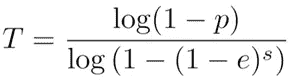

现在我们已ç»å®šä¹‰äº† RANSAC å‚数，我们å¯ä»¥ç ”究第一次分割过程。

# 5\. 使用 RANSAC 进行点云分割


首先将ä¸åŒçš„阈值设置为éžè‡ªåŠ¨å€¼è¿›è¡Œæµ‹è¯•ï¼š

```py
distance_threshold = 0.1
ransac_n = 3
num_iterations = 1000
```

从那里开始，我们å¯ä»¥ä½¿ç”¨ RANSAC 对点云进行分割以检测平é¢ï¼Œå…·ä½“如下：

```py
plane_model, inliers = pcd.segment_plane(distance_threshold=distance_threshold,ransac_n=3,num_iterations=1000)
[a, b, c, d] = plane_model
print(fâ€Plane equation: {a:.2f}x + {b:.2f}y + {c:.2f}z + {d:.2f} = 0")
```

我们将结果收集到两个å˜é‡ä¸­ï¼š`plane_model`，它包å«å¹³é¢çš„å‚æ•° `a`,`b`,`c`,`d`ï¼Œä»¥åŠ `inliers` 作为点索引。

这使得å¯ä»¥ä½¿ç”¨ç´¢å¼•å°†ç‚¹äº‘分割为 `inlier_cloud` 点集（我们将其标记为红色）和 `outlier_cloud` 点集（我们将其标记为ç°è‰²ï¼‰ï¼š

```py
inlier_cloud = pcd.select_by_index(inliers)
outlier_cloud = pcd.select_by_index(inliers, invert=True)

#Paint the clouds
inlier_cloud.paint_uniform_color([1.0, 0, 0])
outlier_cloud.paint_uniform_color([0.6, 0.6, 0.6])

#Visualize the inliers and outliers
o3d.visualization.draw_geometries([inlier_cloud, outlier_cloud]) 
```

🦊 **Florent** *：`*invert=True*` *å‚æ•°å…许选择第一个å‚æ•°çš„å义，å³æ‰€æœ‰ä¸åœ¨* `*inliers*`* 中的索引。如果你缺少阴影，记得计算法线，如上所示。*

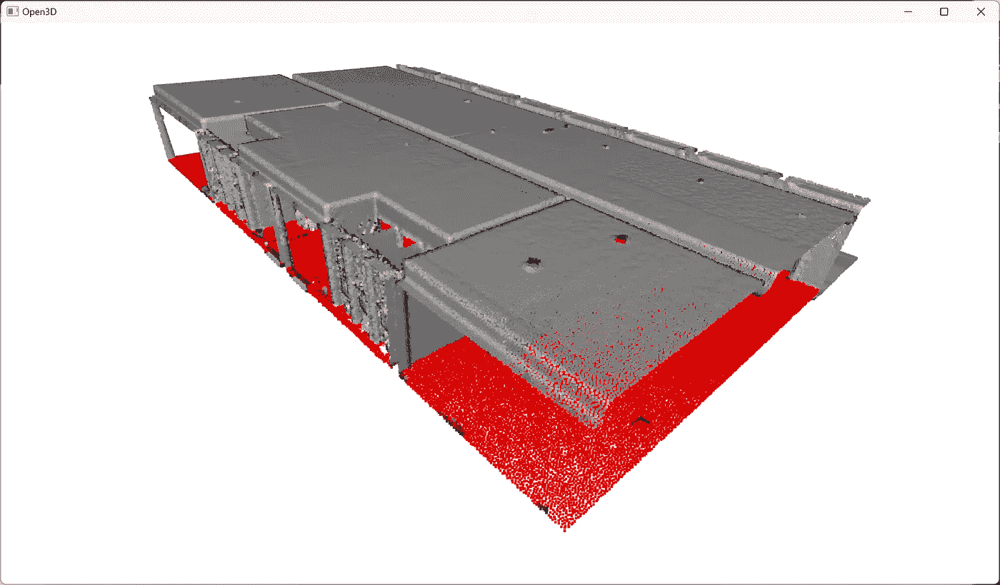

🌱 **æˆé•¿**：*å°è¯•è°ƒæ•´å„ç§å‚数，并通过定性分æžç ”究其影å“。首先记ä½è¦åŽ»ç›¸å…³å˜åŒ–（一次一个å˜é‡ï¼‰ï¼›å¦åˆ™ä½ çš„分æžå¯èƒ½ä¼šæœ‰åå·®* 😊。

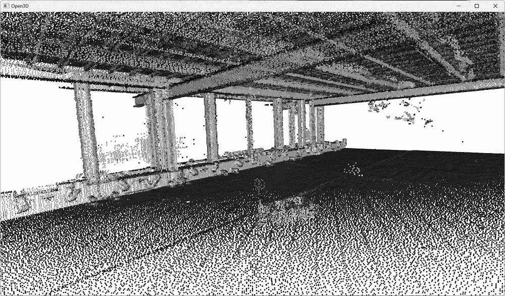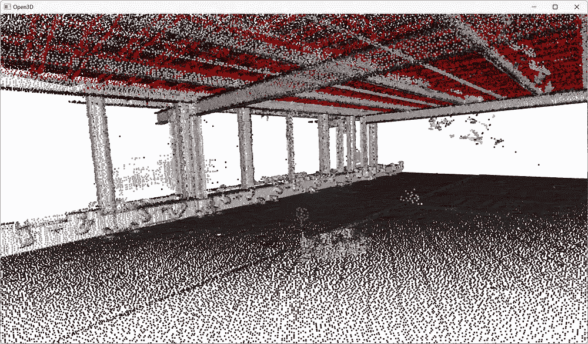

很棒ï¼ä½ çŸ¥é“如何将点云分割为内点集和外点集 🥳ï¼çŽ°åœ¨ï¼Œè®©æˆ‘们研究如何找到彼此接近的一些簇。让我们想象一下，一旦我们检测到大的平é¢éƒ¨åˆ†ï¼Œæˆ‘们有一些“漂浮â€çš„ç‰©ä½“éœ€è¦ delineate。怎么åšå‘¢ï¼Ÿï¼ˆæ˜¯çš„，这是一个å‡é—®é¢˜ï¼Œæˆ‘们有答案给你 😀）

# 6\. 扩展 3D 分割：多阶 RANSAC


我们的ç†å¿µå°†éžå¸¸ç®€å•ã€‚我们将首先多次è¿è¡Œ RANSAC（å‡è®¾ `n` 次）以æå–æž„æˆåœºæ™¯çš„ä¸åŒå¹³é¢åŒºåŸŸã€‚然åŽï¼Œæˆ‘们将通过欧几里得èšç±»ï¼ˆDBSCAN）处ç†â€œæ¼‚浮元素â€ã€‚è¿™æ„味ç€æˆ‘们必须确ä¿æœ‰ä¸€ç§æ–¹æ³•åœ¨è¿­ä»£è¿‡ç¨‹ä¸­å­˜å‚¨ç»“果。准备好了å—？

好的，让我们实例化一个空字典，以ä¿å­˜è¿­ä»£ç»“果（`segment_models`中的平é¢å‚æ•°å’Œ`segments`中的点云平é¢åŒºåŸŸï¼‰ï¼š

```py
segment_models={}
segments={}
```

然åŽï¼Œæˆ‘们需è¦ç¡®ä¿å¯ä»¥å½±å“以åŽè¿­ä»£çš„次数，以检测平é¢ã€‚为此，让我们创建一个å˜é‡`max_plane_idx`æ¥ä¿å­˜è¿­ä»£æ¬¡æ•°ï¼š

```py
max_plane_idx=10
```

🦊 **Florent***：在这里，我们说我们希望迭代 10 次以找到 10 个平é¢ï¼Œä½†æœ‰æ›´èªæ˜Žçš„方法æ¥å®šä¹‰è¿™æ ·çš„å‚数。这实际上扩展了文章的范围，将在å¦ä¸€èŠ‚中讨论。*

现在让我们进入一个工作循环 ðŸ˜ï¼Œæˆ‘将首先快速说明。

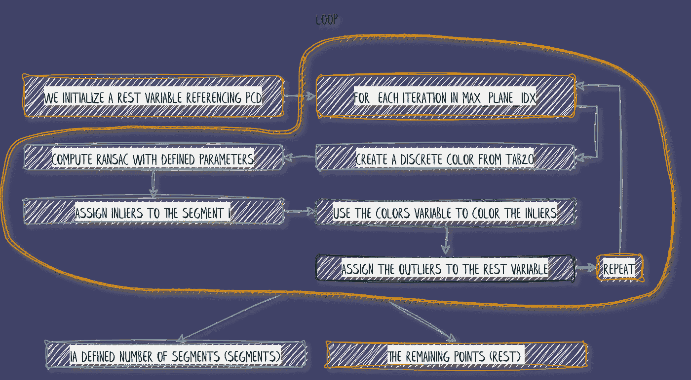

执行以在 RANSAC 过程中进行分割的循环。© F. Poux

在第一次迭代（循环`i=0`）中，我们将内点与外点分开。我们将内点存储在`segments`中，然åŽæˆ‘们åªå¯¹å­˜å‚¨åœ¨`rest`中的剩余点感兴趣，这将æˆä¸ºå¾ªçŽ¯ n+1（循环`i=1`）的研究对象。这æ„味ç€æˆ‘们希望将上一阶段的外点作为基础点云，直到达到上述的迭代阈值（与 RANSAC 迭代ä¸åŒï¼‰ã€‚这转化为以下内容：

```py
rest=pcd
for i in range(max_plane_idx):
    colors = plt.get_cmap("tab20")(i)
    segment_models[i], inliers = rest.segment_plane(
    distance_threshold=0.1,ransac_n=3,num_iterations=1000)
    segments[i]=rest.select_by_index(inliers)
    segments[i].paint_uniform_color(list(colors[:3]))
    rest = rest.select_by_index(inliers, invert=True)
    print("pass",i,"/",max_plane_idx,"done.")
```

就是这样ï¼çŽ°åœ¨ï¼Œä¸ºäº†å¯è§†åŒ–整体，我们通过循环中的第一行将æ¯ä¸ªæ£€æµ‹åˆ°çš„分段涂上æ¥è‡ª`tab20`的颜色（`colors = plt.get_cmap("tab20")(i)`），你åªéœ€å†™ï¼š

```py
o3d.visualization.draw_geometries([segments[i] for i in range(max_plane_idx)]+[rest])
```

🦚 **注æ„**：我们传递给函数`o3d.visualization.draw_geometries()`的列表`[segments[i] for i in range(max_plane_idx)]`实际上是一个“列表推导å¼â€ðŸ¤”。它等åŒäºŽç¼–写一个`for`循环，将第一个元素`segments[i]`追加到列表中。方便的是，我们å¯ä»¥å°†`[rest]`添加到这个列表中，`draw.geometries()`方法会ç†è§£æˆ‘们想è¦ç»˜åˆ¶ä¸€ä¸ªç‚¹äº‘。这ä¸æ˜¯å¾ˆé…·å—？

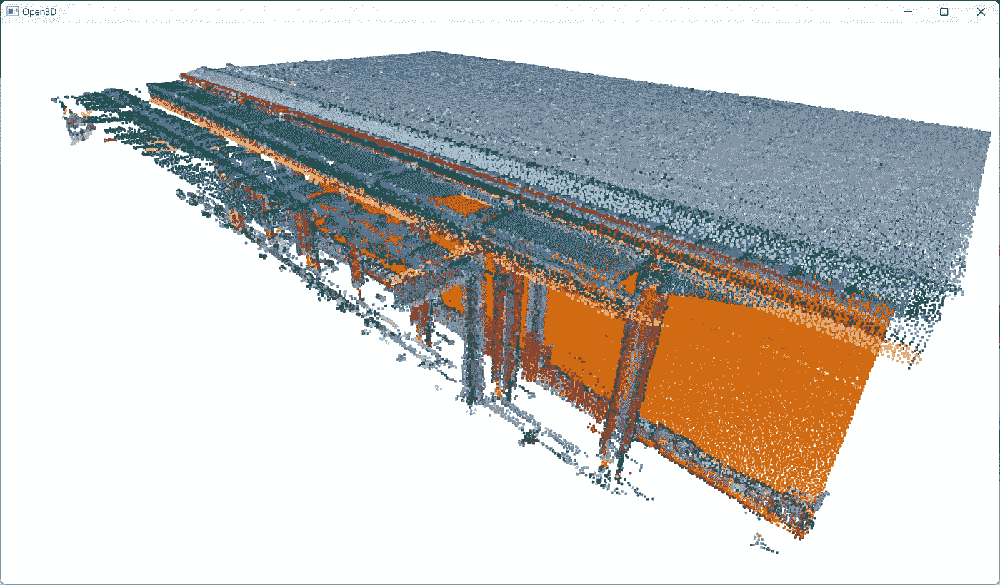

DBSCAN 对 3D 点云的第一次扫æ结果

哈ï¼æˆ‘们以为完æˆäº†â€¦â€¦ä½†æˆ‘们真的完æˆäº†å—？你注æ„到这里有什么奇怪的地方å—？如果你仔细看，会å‘现一些奇怪的伪影，比如实际切割一些平é¢å…ƒç´ çš„“红色线æ¡/å¹³é¢â€ã€‚为什么？ðŸ§

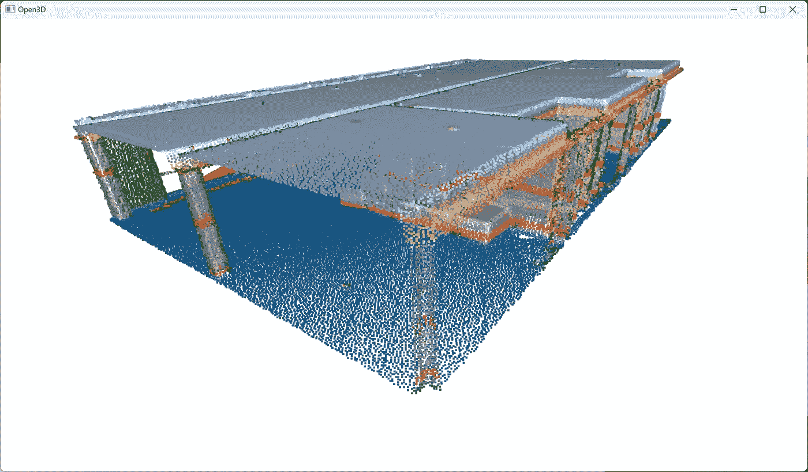

实际上，由于我们将所有点拟åˆåˆ° RANSAC å¹³é¢å€™é€‰è€…（在欧几里得空间中没有é™åˆ¶èŒƒå›´ï¼‰è€Œä¸è€ƒè™‘点的密度连续性，因此根æ®å¹³é¢çš„检测顺åºï¼Œæˆ‘们会出现这些“线â€ä¼ªå½±ã€‚所以下一步是防止这ç§è¡Œä¸ºï¼ä¸ºæ­¤ï¼Œæˆ‘建议在迭代过程中包å«ä¸€ä¸ªåŸºäºŽæ¬§å‡ é‡Œå¾—èšç±»çš„æ¡ä»¶ï¼Œä»¥åœ¨è¿žç»­çš„簇中细化内点集。为此，我们将ä¾èµ–于 DBSCAN 算法。

## 欧几里得èšç±»ï¼ˆDBSCAN）

在点云数æ®é›†ä¸­ï¼Œæˆ‘们ç»å¸¸éœ€è¦å°†ç©ºé—´ä¸Šè¿žç»­çš„点集åˆï¼ˆå³åœ¨ 3D 空间中物ç†ä¸ŠæŽ¥è¿‘或相邻）进行分组，如下所示。但我们如何有效地åšåˆ°è¿™ä¸€ç‚¹å‘¢ï¼Ÿ

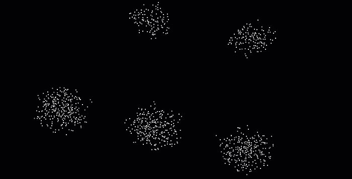

在这张图中，很明显我们想è¦å°†å½¼æ­¤æŽ¥è¿‘的点分组，找到 5 组点。© F. Poux

DBSCAN（基于密度的空间èšç±»åº”用与噪声）算法于 1996 年为此目的而æ出。该算法被广泛使用，因此在 2014 年获得了ç»å¾—起时间考验的科学贡献奖。

DBSCAN 算法涉åŠæ‰«ææ•°æ®é›†ä¸­çš„æ¯ä¸ªç‚¹ï¼Œå¹¶åŸºäºŽå¯†åº¦æž„建一个å¯è¾¾ç‚¹é›†åˆã€‚这是通过分æžæ¯ä¸ªç‚¹çš„邻域并在其包å«è¶³å¤Ÿç‚¹æ—¶å°†å…¶åŒ…å«åœ¨åŒºåŸŸå†…æ¥å®žçŽ°çš„。这个过程对æ¯ä¸ªé‚»è¿‘点é‡å¤ï¼Œç›´åˆ°ç°‡æ— æ³•å†æ‰©å±•ã€‚没有足够邻居的点被标记为噪声，使得该算法对离群点具有é²æ£’性。这ä¸æ˜¯å¾ˆä»¤äººå°è±¡æ·±åˆ»å—？😆

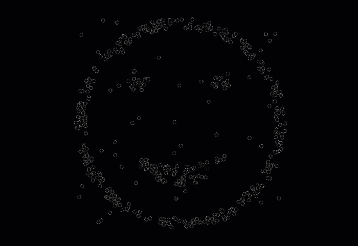

DBSCAN 算法过程和两个å‚数ϵ和 min_points 对结果的影å“的示æ„图。你å¯ä»¥çœ‹åˆ°ï¼Œå€¼è¶Šå¤§ï¼Œç»„æˆçš„簇就越少。© F. Poux

啊，我们差点忘了。å‚数选择（ϵ用于邻域，n_min 用于最å°ç‚¹æ•°ï¼‰ä¹Ÿå¯èƒ½å¾ˆæ£˜æ‰‹ï¼šè®¾ç½®å‚数时必须å°å¿ƒï¼Œä»¥ç¡®ä¿åˆ›å»ºè¶³å¤Ÿçš„内部点（如果 n_min 太大或ϵ太å°ï¼Œå°±ä¸ä¼šå‘生）。特别是，这æ„å‘³ç€ DBSCAN 在å‘现ä¸åŒå¯†åº¦çš„簇时会é‡åˆ°å›°éš¾ã€‚但 DBSCAN 有一个很大的优势，就是计算效率高，ä¸éœ€è¦åƒ Kmeans 那样预定义簇的数é‡ã€‚最åŽï¼Œå®ƒå…许å‘现任æ„形状的簇。现在我们准备深入探讨å‚æ•°çš„é»‘æš—é¢ ðŸ’»

## DBSCAN 用于 3D 点云èšç±»

让我详细说明逻辑过程（激活猛兽模å¼ðŸ‘¹ï¼‰ã€‚首先，我们需è¦å®šä¹‰è¿è¡Œ DBSCAN çš„å‚数：

```py
epsilon = 0.15
min_cluster_points = 5
```

🌱 **æˆé•¿**：*这些å‚数的定义是一个需è¦æŽ¢ç´¢çš„问题。你必须找到一ç§æ–¹æ³•æ¥å¹³è¡¡è¿‡åº¦åˆ†å‰²å’Œä¸è¶³åˆ†å‰²çš„问题。最终，你å¯ä»¥åŸºäºŽ RANSAC çš„åˆå§‹è·ç¦»å®šä¹‰ä½¿ç”¨ä¸€äº›å¯å‘å¼æ–¹æ³•ã€‚这是一个值得探索的方é¢* 😉。

在我们之å‰å®šä¹‰çš„ for 循环中，我们将在分é…内点（`segments[i]=rest.select_by_index(inliers)`）åŽç«‹å³è¿è¡Œ DBSCAN，方法是紧接ç€æ·»åŠ ä»¥ä¸‹ä¸€è¡Œï¼š

```py
labels = np.array(segments[i].cluster_dbscan(eps=epsilon, min_points=min_cluster_points))
```

然åŽï¼Œæˆ‘们将计算æ¯ä¸ªæ‰¾åˆ°çš„簇包å«å¤šå°‘个点，使用一ç§å¥‡æ€ªçš„符å·è¡¨ç¤ºæ³•ï¼Œè¯¥è¡¨ç¤ºæ³•åˆ©ç”¨äº†åˆ—表推导。结果存储在å˜é‡`candidates`中：

```py
candidates=[len(np.where(labels==j)[0]) for j in np.unique(labels)]
```

那现在呢？我们需è¦æ‰¾åˆ°â€œæœ€ä½³å€™é€‰è€…â€ï¼Œé€šå¸¸æ˜¯åŒ…å«æœ€å¤šç‚¹çš„ç°‡ï¼ä¸ºæ­¤ï¼Œè¿™é‡Œæ˜¯è¿™è¡Œä»£ç ï¼š

```py
best_candidate=int(np.unique(labels)[np.where(candidates== np.max(candidates))[0]])
```

好å§ï¼Œå¾ˆå¤šæŠ€å·§åœ¨è¿™é‡Œå‘生，但本质上，我们利用 Numpy 的熟练度æ¥æœç´¢å¹¶è¿”回属于最大簇的点的索引。从这里开始，接下æ¥çš„过程就简å•äº†ï¼Œæˆ‘们åªéœ€ç¡®ä¿åœ¨æ¯æ¬¡è¿­ä»£ä¸­å°†ä»»ä½•å‰©ä½™ç°‡çº³å…¥åŽç»­ RANSAC 迭代中（🔥 推è阅读 5 é以消化ï¼ï¼‰ï¼š

```py
rest = rest.select_by_index(inliers, invert=True) + segments[i].select_by_index(list(np.where(labels!=best_candidate)[0]))
segments[i]=segments[i].select_by_index(list(np.where(labels== best_candidate)[0]))
```

🦚 **注æ„**：*`rest`* å˜é‡çŽ°åœ¨ç¡®ä¿åŒ…å« RANSAC å’Œ DBSCAN 剩余的点。当然，内点现在被筛选为原始 RANSAC 内点集中最大的簇*。

当循环结æŸæ—¶ï¼Œä½ ä¼šå¾—到一组干净的段，这些段包å«ç©ºé—´ä¸Šè¿žç»­çš„点集，符åˆå¹³é¢å½¢çŠ¶ï¼Œä½ å¯ä»¥ä½¿ç”¨ä»¥ä¸‹ä»£ç è¡Œä»¥ä¸åŒé¢œè‰²å¯è§†åŒ–：

```py
colors = plt.get_cmap("tab20")(i)
segments[i].paint_uniform_color(list(colors[:3]))
```

结果应该类似于这个：

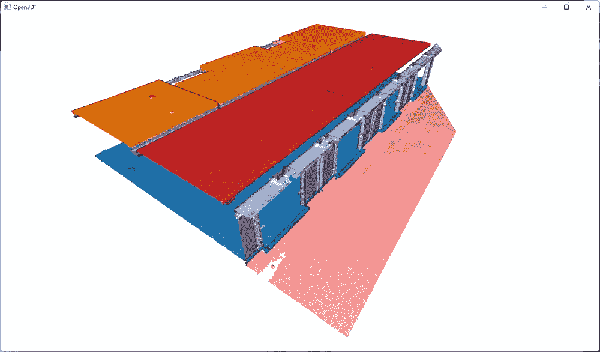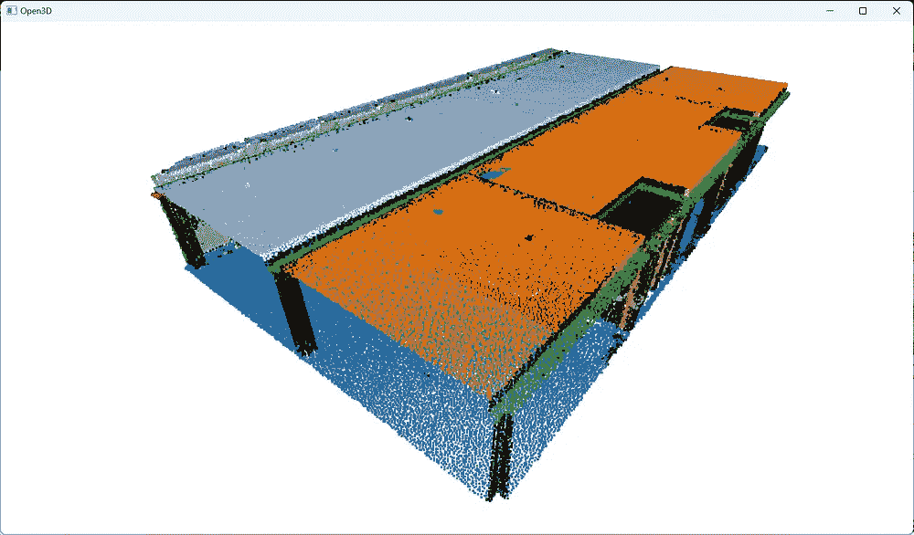

但这就结æŸäº†å—？ä¸ï¼Œä¸å¯èƒ½çš„ 😄ï¼ä¸€æ—¦å¯¹ç‚¹äº‘应用了多阶 RANSAC 分割，下一阶段就是通过利用 DBSCAN æ¥ç»†åŒ–剩余的未分割点，这有助于进一步æå‡ç‚¹äº‘分æžçš„粒度，增加更多的簇。

🦚 **注æ„**：*粒度是一个在数æ®ç§‘学中ç»å¸¸ä½¿ç”¨çš„学术è¯æ±‡ã€‚æ•°æ®çš„粒度æ„味ç€æ•°æ®ç»„织或建模的详细程度。在这里，我们å¯ä»¥ä»Žç‚¹äº‘中建模的对象越å°ï¼Œæˆ‘们的表示的粒度就越细。（很高大上，对å§ï¼Ÿï¼ï¼‰*

# 7\. 欧几里得èšç±»ç²¾ç‚¼


好了，是时候摆脱循环，处ç†åˆ†é…ç»™ `rest` å˜é‡çš„剩余点，这些点尚未分é…给任何段。让我们首先对我们讨论的内容有一个视觉上的了解：

```py
o3d.visualization.draw_geometries([rest])
```

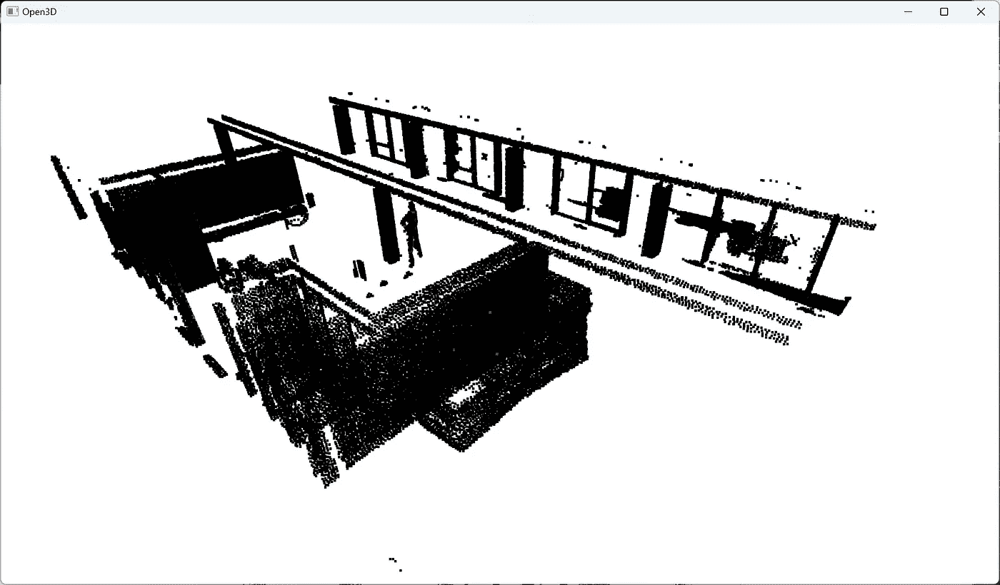

我们å¯ä»¥ä½¿ç”¨ DBSCAN 进行简å•çš„欧几里得èšç±»ï¼Œå¹¶å°†ç»“æžœæ•èŽ·åˆ°ä¸€ä¸ª `labels` å˜é‡ä¸­ã€‚你知é“怎么åšçš„：

```py
labels = np.array(pcd.cluster_dbscan(eps=0.1, min_points=10))
```

🌱 **生长：** *我们使用 10 cm çš„åŠå¾„æ¥â€œç”Ÿé•¿â€ç°‡ï¼Œåªæœ‰åœ¨æ­¤æ­¥éª¤ä¹‹åŽè‡³å°‘有 10 个点时æ‰è€ƒè™‘一个簇。但这是正确的选择å—？* 🤔*å¯ä»¥éšæ„实验以找到一个好的平衡点，ç†æƒ³æƒ…况下，找到一ç§è‡ªåŠ¨åŒ–的方法*😀。

标签的范围在 `-1` å’Œ `n` 之间，其中 `-1` 表示“噪声â€ç‚¹ï¼Œ`0` 到 `n` 的值则是分é…给相应点的簇标签。请注æ„，我们希望将标签作为 NumPy 数组获å–。

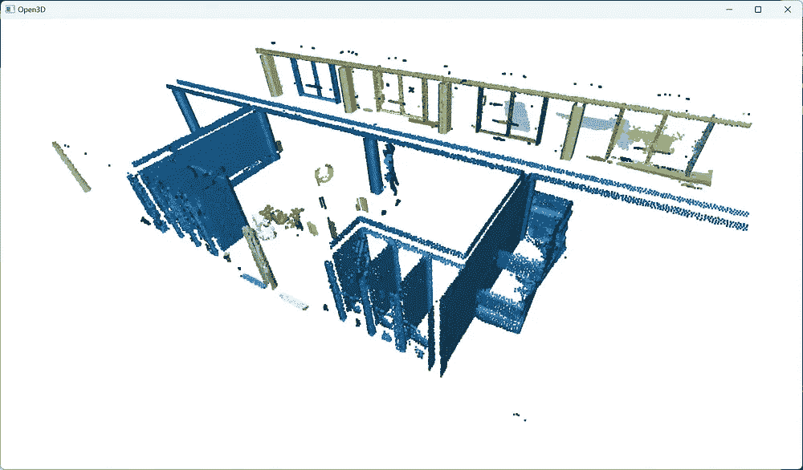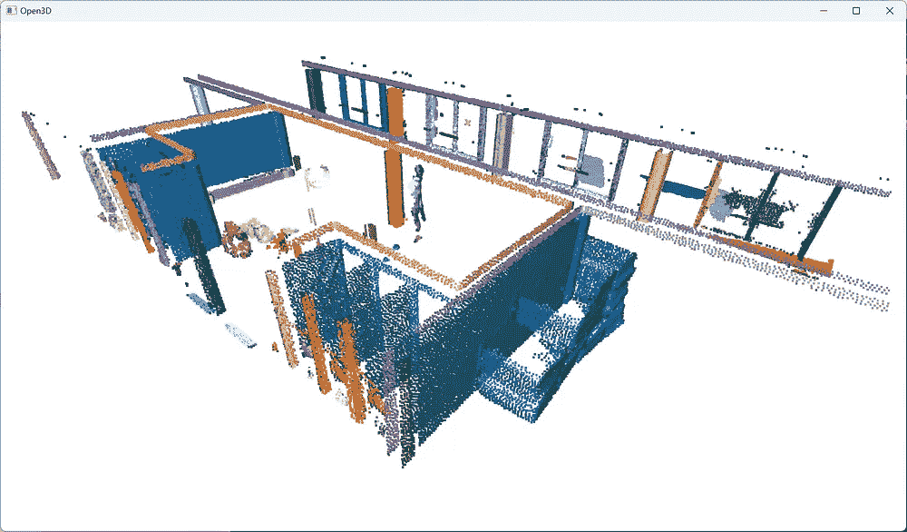

左侧：å‚数定义ä¸ä½³ã€‚å³ä¾§ï¼Œæˆ‘们对物体的轮廓有了更好的划分，以便进行åŽç»­å¤„ç†ã€‚

很好。现在我们已ç»å®šä¹‰äº†æ¯ä¸ªç‚¹çš„标签组，让我们为结果ç€è‰²ã€‚这是å¯é€‰çš„，但对于迭代过程以æœç´¢åˆé€‚çš„å‚数值éžå¸¸æœ‰ç”¨ã€‚为此，我们建议使用 Matplotlib 库获å–特定的[颜色范围](https://matplotlib.org/stable/tutorials/colors/colormaps.html)，例如 tab20：

```py
max_label = labels.max()
colors = plt.get_cmap("tab20")(labels / (max_label 
if max_label > 0 else 1))
colors[labels < 0] = 0
rest.colors = o3d.utility.Vector3dVector(colors[:, :3])
o3d.visualization.draw_geometries([rest])
```

🦚 **注æ„**：*`max_label`* *应该是直观的：它存储标签列表中的最大值。这å…许将其用作ç€è‰²æ–¹æ¡ˆçš„分æ¯ï¼ŒåŒæ—¶å¤„ç†ä¸€ä¸ªç‰¹æ®Šæƒ…况，其中èšç±»è¢«æ‰­æ›²ï¼Œä»…产生噪声+一个簇。之åŽï¼Œæˆ‘们确ä¿å°†è¿™äº›å™ªå£°ç‚¹çš„标签设置为* `-1` *（黑色*（`0`）*）。*然åŽï¼Œæˆ‘们将点云* `pcd` *çš„* `colors` *属性设置为表示 Rã€Gã€B çš„ 3 列的 2D NumPy 数组。*

就这样ï¼æˆ‘采用了与之å‰ç›¸åŒçš„方法，没有任何魔法ï¼æˆ‘åªæ˜¯ç¡®ä¿ä½¿ç”¨ä¸€è‡´çš„å‚æ•°æ¥è¿›è¡Œç²¾ç»†çš„èšç±»ï¼Œä»¥èŽ·å¾—你一直梦想的美丽彩虹场景 🥳ï¼

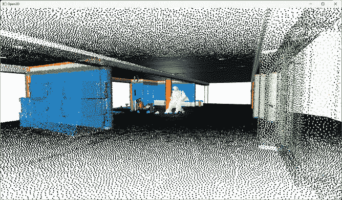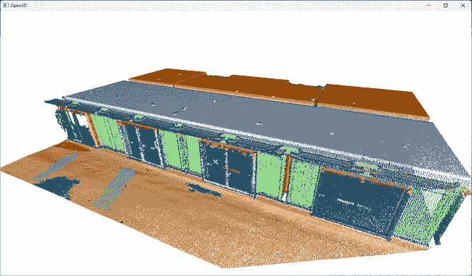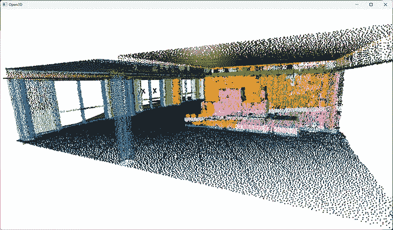

在使用 DBSCAN 精炼点云èšç±»ç»“果之åŽï¼Œç„¦ç‚¹è½¬å‘体素化技术，这涉åŠå°†æ•°æ®ç»„织æˆæœ‰æ„义的空间结构，从而实现对点云信æ¯çš„高效建模。

# 8\. 体素化和标记


现在我们有了一个带有分段标签的点云，查看我们是å¦èƒ½é€‚应室内建模工作æµå°†ä¼šéžå¸¸æœ‰è¶£ã€‚一ç§æ–¹æ³•æ˜¯ä½¿ç”¨ä½“ç´ æ¥é€‚应 O-Space å’Œ R-Space。通过将点云划分为å°ç«‹æ–¹ä½“，å¯ä»¥æ›´å®¹æ˜“地ç†è§£æ¨¡åž‹çš„å ç”¨å’Œç©ºç™½ç©ºé—´ã€‚让我们深入了解一下。

## 9.1\. 体素网格生æˆ

创建准确且详细的空间 3D 模型æ„味ç€ç”Ÿæˆä¸€ä¸ªç´§å‡‘的体素网格。这ç§æŠ€æœ¯å°†ç‚¹äº‘划分为具有自己å标系统的å°ç«‹æ–¹ä½“或体素。

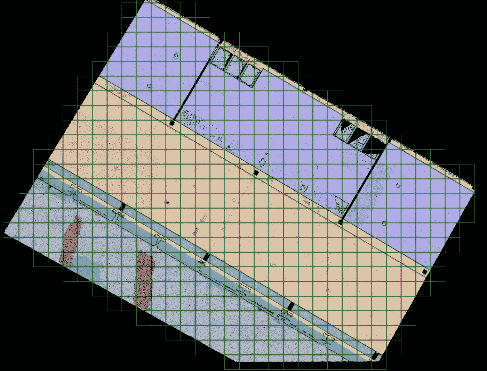

体素网格生æˆä»¥ç»“构化带有分段信æ¯çš„ 3D 点云。© F. Poux

è¦åˆ›å»ºè¿™æ ·çš„结构，我们首先定义我们新实体的大å°ï¼šä½“素：

```py
voxel_size=0.5
```

现在，我们想知é“我们需è¦å †å å¤šå°‘个这样的立方体æ‰èƒ½å¡«å……由点云定义的边界框。这æ„味ç€æˆ‘们首先需è¦è®¡ç®—点云的范围：

```py
min_bound = pcd.get_min_bound()
max_bound = pcd.get_max_bound()
```

很好，现在我们使用`o3d.geometry.VoxelGrid.create_from_point_cloud()`函数对任何选择的点云进行æ“作，以便在其上拟åˆä½“素网格。但是等等，我们想区分哪个点云以便进一步处ç†ï¼Ÿ

好的，让我们举例说明你想拥有“结构性â€å…ƒç´ çš„体素与ä¸å±žäºŽç»“构性元素的æ‚物体素的情况。没有标签的情况下，我们å¯ä»¥æ ¹æ®å®ƒä»¬æ˜¯å¦å±žäºŽ RANSAC 分段或其他分段æ¥æŒ‡å¯¼æˆ‘们的选择；这æ„味ç€é¦–先将 RANSAC 处ç†çš„分段进行拼接：

```py
pcd_ransac=o3d.geometry.PointCloud()
for i in segments:
 pcd_ransac += segments[i]
```

🦚 **注æ„**: *在这个阶段，你有能力用体素ç¨åŽæ‹¾å–çš„å‡åŒ€é¢œè‰²ä¸ºç‚¹äº‘ç€è‰²ã€‚如果这是你想è¦çš„，你å¯ä»¥ä½¿ç”¨ï¼š* `pcd_ransac.paint_uniform_color([1, 0, 0])`

然åŽï¼Œæˆ‘们å¯ä»¥ç®€å•åœ°æå–我们的体素网格：

```py
voxel_grid_structural = o3d.geometry.VoxelGrid.create_from_point_cloud(pcd_ransac, voxel_size=voxel_size)
```

并对剩余元素åšåŒæ ·çš„处ç†ï¼š

```py
rest.paint_uniform_color([0.1, 0.1, 0.8])
voxel_grid_clutter = o3d.geometry.VoxelGrid.create_from_point_cloud(rest, voxel_size=voxel_size)
```

最åŽä¸€æ­¥æ˜¯å¯è§†åŒ–我们的结果：

```py
o3d.visualization.draw_geometries([voxel_grid_clutter,voxel_grid_structural])
```

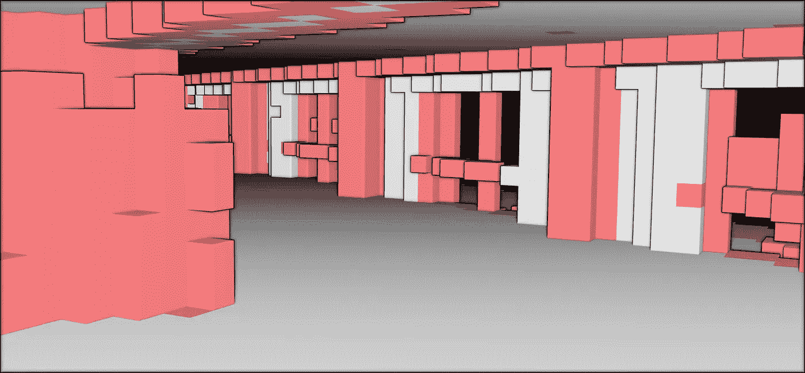

使用体素表示的空间的语义表示。© F. Poux

这太棒了ï¼å®ƒçœ‹èµ·æ¥åƒé‚£äº›æ•´ä¸ªä¸–界由立方体构æˆçš„计算机游æˆï¼è€Œä¸”我们实际上å¯ä»¥ä½¿ç”¨åˆ†æ®µæ ‡ç­¾æ¥æŒ‡å¯¼æˆ‘们的体素建模ï¼è¿™å¼€å¯äº†è®¸å¤šè§†è§’ï¼ä½†é—®é¢˜ä¾ç„¶å­˜åœ¨ã€‚使用 Open3D，æå–未填充的体素是困难的；因此，完æˆä½“素化点云的结构化åŽï¼Œä¸‹ä¸€æ­¥æ¶‰åŠæŽ¢ç´¢ä½“素空间建模技术，以æ供分æžä½“素化数æ®ç©ºé—´å…³ç³»å’Œå±žæ€§çš„替代视角，为高级点云建模开辟新途径。

🤠 **Ville**: *体素化是对相åŒç‚¹äº‘æ•°æ®çš„ä¸åŒç©ºé—´è¡¨ç¤ºã€‚如果机器人需è¦é¿å¼€ç¢°æ’žï¼Œè¿™ç§è¡¨ç¤ºéžå¸¸æœ‰ç”¨ï¼æ¯”如在模拟…ç«ç¾æ¼”习时也éžå¸¸æœ‰ç”¨ï¼*

# 9\. 空间建模


在室内建模应用中，基于体素的点云表示在æ•æ‰å’Œåˆ†æžå¤æ‚环境的几何属性方é¢èµ·ç€å…³é”®ä½œç”¨ã€‚éšç€ç‚¹äº‘æ•°æ®é›†çš„规模和å¤æ‚性的增加，深入探讨体素分割技术å˜å¾—至关é‡è¦ï¼Œä»¥æå–有æ„义的结构并促进更高层次的分æžã€‚因此，让我们定义一个函数æ¥æ‹Ÿåˆä½“素网格，并返回填充和空白区域：

```py
def fit_voxel_grid(point_cloud, voxel_size, min_b=False, max_b=False):
# This is where we write what we want our function to do.
return voxel_grid, indices
```

在函数内部，我们将 (1) 确定点云的最å°å’Œæœ€å¤§å标，(2) 计算体素网格的尺寸，(3) 创建一个空的体素网格，(4) 计算已å æ®ä½“ç´ çš„ç´¢å¼•ä»¥åŠ (5) å°†å æ®ä½“素标记为 True。


从点云创建å æ®ç½‘格的算法工作æµç¨‹ã€‚© F. Poux

这转化为我们希望在此函数中包å«çš„以下代ç ï¼š

```py
# Determine the minimum and maximum coordinates of the point cloud
 if type(min_b) == bool or type(max_b) == bool:
   min_coords = np.min(point_cloud, axis=0)
   max_coords = np.max(point_cloud, axis=0)
 else:
   min_coords = min_b
   max_coords = max_b
 # Calculate the dimensions of the voxel grid
 grid_dims = np.ceil((max_coords - min_coords) / voxel_size).astype(int)
 # Create an empty voxel grid
 voxel_grid = np.zeros(grid_dims, dtype=bool)
 # Calculate the indices of the occupied voxels
 indices = ((point_cloud - min_coords) / voxel_size).astype(int)
 # Mark occupied voxels as True
 voxel_grid[indices[:, 0], indices[:, 1], indices[:, 2]] = True
```

我们已ç»å®šä¹‰äº†å‡½æ•°ï¼ŒçŽ°åœ¨å¯ä»¥ä½¿ç”¨å®ƒæå–体素，按结构ã€æ‚乱和空体素进行分段：

```py
voxel_size = 0.3

#get the bounds of the original point cloud
min_bound = pcd.get_min_bound()
max_bound = pcd.get_max_bound()

ransac_voxels, idx_ransac = fit_voxel_grid(pcd_ransac.points, voxel_size, min_bound, max_bound)
rest_voxels, idx_rest = fit_voxel_grid(rest.points, voxel_size, min_bound, max_bound)

#Gather the filled voxels from RANSAC Segmentation
filled_ransac = np.transpose(np.nonzero(ransac_voxels))

#Gather the filled remaining voxels (not belonging to any segments)
filled_rest = np.transpose(np.nonzero(rest_voxels))

#Compute and gather the remaining empty voxels
total = pcd_ransac + rest
total_voxels, idx_total = fit_voxel_grid(total.points, voxel_size, min_bound, max_bound)
empty_indices = np.transpose(np.nonzero(~total_voxels))
```

🦚 **注æ„**：*NumPy 中的 `*nonzero()*`* 函数查找 `*ransac_voxels*` å˜é‡ä¸­éžé›¶å…ƒç´ çš„索引。`*nonzero()*`* 函数返回一个数组的元组，æ¯ä¸ªæ•°ç»„对应于特定轴上éžé›¶å…ƒç´ çš„索引。然åŽï¼Œæˆ‘们将 `*np.transpose()*`* NumPy 函数应用于从 `*np.nonzero(ransac_voxels)*`* 获得的结果。`*transpose()*`* 函数最终会排列数组的轴（有效地交æ¢è¡Œå’Œåˆ—）。通过结åˆè¿™äº›æ“作，代ç è¡Œå¯¹ `*ransac_voxels*`* çš„éžé›¶å…ƒç´ ç´¢å¼•è¿›è¡Œè½¬ç½®ï¼Œç”Ÿæˆä¸€ä¸ªè½¬ç½®æ•°ç»„，其中æ¯è¡Œè¡¨ç¤ºåŽŸå§‹ `*ransac_voxels*`* 数组中éžé›¶å…ƒç´ çš„å标或索引。😊

è¿™ç§ä½“素建模方法æ供了对体素化数æ®ç©ºé—´å…³ç³»å’Œå±žæ€§çš„å®è´µè§è§£ã€‚为了在 Python 之外以é€æ˜Žåº¦å¯è§†åŒ–结果，我们需è¦å¯¼å‡ºæ•°æ®ã€‚

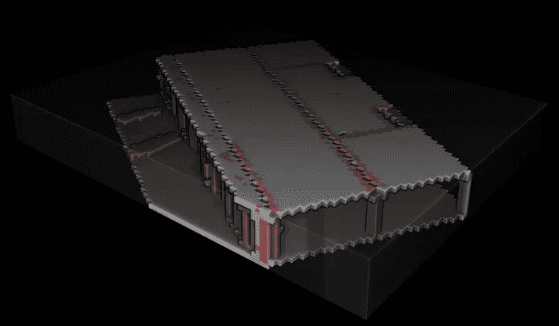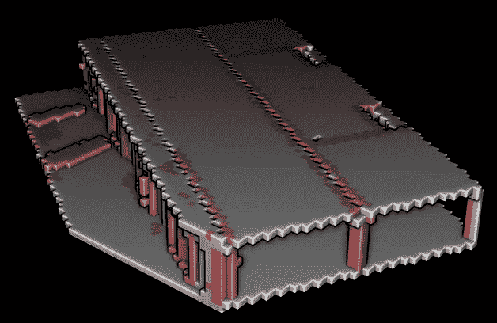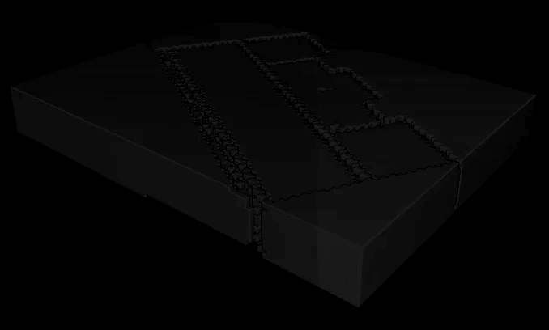

å æ®ç½‘格匹é…的结果。左侧是填充体素和空体素，中间是填充体素，å³ä¾§æ˜¯ç©ºä½“素。© F. Poux

在实现体素化点云的结构化åŽï¼Œä¸‹ä¸€æ­¥æ¶‰åŠå°†ç‚¹äº‘和体素数æ®å¯¼å‡ºä¸ºå¤–部格å¼ï¼Œä»¥ä¾¿å®žçŽ°äº’æ“作性，并与其他软件工具和工作æµç¨‹æ— ç¼é›†æˆã€‚此导出过程确ä¿ç»“构化的体素数æ®å’ŒåŽŸå§‹ç‚¹äº‘å¯ä»¥è½»æ¾å…±äº«ã€å¯è§†åŒ–或用于进一步分æžï¼Œä»Žè€Œä¿ƒè¿›å¯¹ç‚¹äº‘æ•°æ®åˆ©ç”¨çš„å作和多功能方法。

# 10\. 导出 3D æ•°æ®é›†


让我们首先关注导出点云分割数æ®é›†ã€‚

## 10.1\. 分割点云导出

è¦å¯¼å‡ºåˆ†å‰²åŽçš„点云，我们必须确ä¿å¯ä»¥åœ¨å¯è¯»çš„ ASCII 文件中为æ¯ä¸ªç‚¹å†™å…¥æ ‡ç­¾ã€‚为此，我们将创建一个 XYZ 片段列表，并将标签特å¾é™„加到该列表。这å¯ä»¥é€šè¿‡ä»¥ä¸‹`for`循环完æˆï¼š

```py
xyz_segments=[]
for idx in segments:
 print(idx,segments[idx])
 a = np.asarray(segments[idx].points)
 N = len(a)
 b = idx*np.ones((N,3+1))
 b[:,:-1] = a
 xyz_segments.append(b)
```

从那里，我们ä¸æƒ³å¿˜è®° DBSCAN èšç±»ä¸­çš„剩余元素，对其应用相åŒçš„原则：

```py
rest_w_segments=np.hstack((np.asarray(rest.points),(labels+max_plane_idx).reshape(-1, 1)))
```

最åŽï¼Œæˆ‘们将其附加到片段列表中：

```py
 xyz_segments.append(rest_w_segments)
```

然åŽæˆ‘们所需è¦åšçš„就是使用 numpy 导出数æ®é›†å¹¶è¿›è¡Œå¤–部å¯è§†åŒ–：

```py
np.savetxt("../RESULTS/" + DATANAME.split(".")[0] + ".xyz", np.concatenate(xyz_segments), delimiter=";", fmt="%1.9f")
```

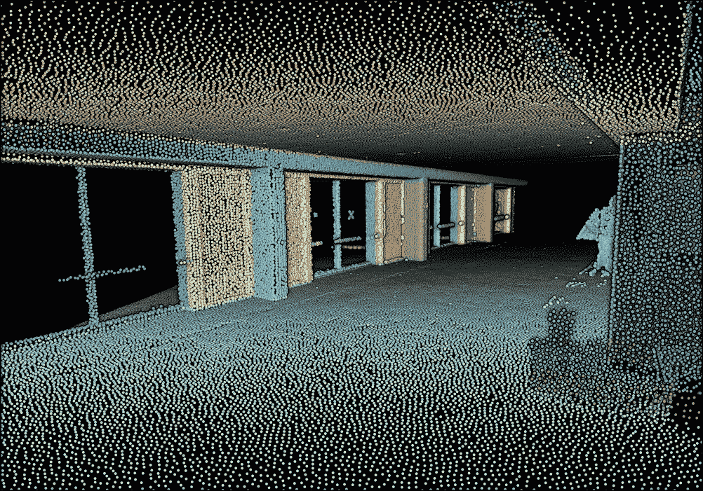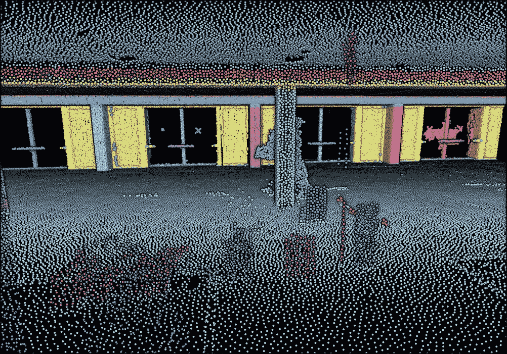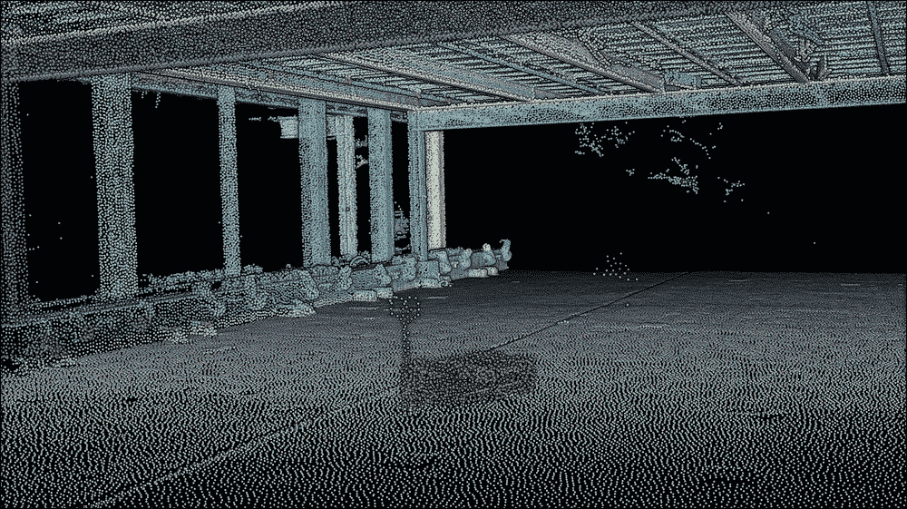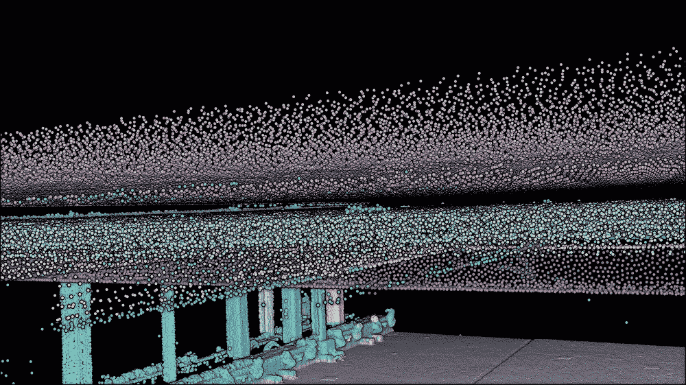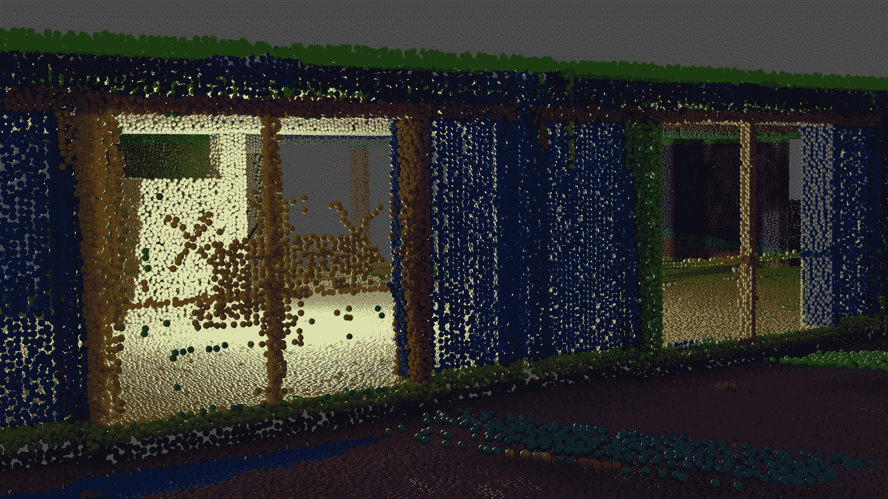

在æˆåŠŸå¯¼å‡ºåˆ†å‰²åŽçš„点云数æ®é›†åŽï¼ŒçŽ°åœ¨çš„é‡ç‚¹æ˜¯å°†ä½“ç´ æ•°æ®é›†å¯¼å‡ºä¸º`.obj`文件。

## 10.2\. 体素模型导出

è¦å¯¼å‡ºä½“素，我们首先必须为æ¯ä¸ªä½“素生æˆä¸€ä¸ªç«‹æ–¹ä½“；这些立方体然åŽåœ¨`voxel_assembly`中组åˆåœ¨ä¸€èµ·ï¼Œå †å ç”Ÿæˆæœ€ç»ˆæ–‡ä»¶ã€‚我们创建了`voxel_modelling(filename, indices, voxel_size)`函数æ¥å®Œæˆè¿™ä¸ªä»»åŠ¡ï¼š

```py
def voxel_modelling(filename, indices, voxel_size):
    voxel_assembly=[]
    with open(filename, "a") as f:
        cpt = 0
        for idx in indices:
            voxel = cube(idx,voxel_size,cpt)
            f.write(f"o {idx}  \n")
            np.savetxt(f, voxel,fmt='%s')
            cpt += 1
            voxel_assembly.append(voxel)
    return voxel_assembly
```

🦚 **注æ„**：*函数* `[cube()](https://drive.google.com/file/d/1kPu85YHl66gQH8Qumxlyd-Sp4PjgvBVm/view?usp=sharing)` *读å–æ供的索引，根æ®ç´¢å¼•å’Œä½“素大å°ç”Ÿæˆä½“素立方体，将体素立方体写入文件，并跟踪在* `*voxel_assembly*` *列表中的组装体素立方体，最终由函数返回。*

然åŽç”¨æ¥å¯¼å‡ºä¸‰ç§ä¸åŒçš„体素组åˆï¼š

```py
vrsac = voxel_modelling("../RESULTS/ransac_vox.obj", filled_ransac, 1)
vrest = voxel_modelling("../RESULTS/rest_vox.obj", filled_rest, 1)
vempty = voxel_modelling("../RESULTS/empty_vox.obj", empty_indices, 1)
```

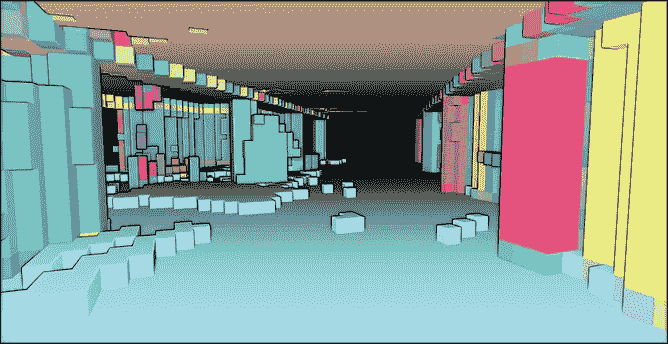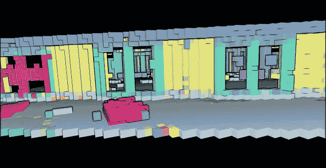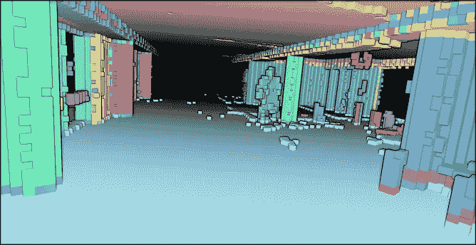

分割和体素建模的结果。© F. Poux

+   💻 在这里获å–代ç è®¿é—®æƒé™ï¼š[代ç ç¤ºä¾‹](https://drive.google.com/drive/folders/1-sGlVvsPcyp9VZ8cw-J8kbhj4-aK_8p8?usp=sharing)

+   🇠在这里获å–æ•°æ®è®¿é—®æƒé™ï¼š[3D æ•°æ®é›†](https://drive.google.com/drive/folders/1sCBT1lc9A8Zn4grpxwFrBrvos86c0HZR?usp=sharing)

+   👨â€ðŸ«3D æ•°æ®å¤„ç†å’Œ AI 课程：[3D 学院](https://learngeodata.eu/)

+   📖 订阅以获得 3D 教程的æå‰è®¿é—®æƒé™ï¼š[3D AI 自动化](https://medium.com/@florentpoux/subscribe)


# 结论

🦊 **Florent**：大规模ç¥è´ºðŸŽ‰ï¼ä½ åˆšåˆšå­¦ä¼šäº†å¦‚何开å‘一个自动形状检测ã€èšç±»ã€ä½“素化和室内建模程åºï¼Œç”¨äºŽå¤„ç†ç”±æ•°ç™¾ä¸‡ä¸ªç‚¹ç»„æˆçš„ 3D 点云，并采用ä¸åŒçš„ç­–ç•¥ï¼çœŸå¿ƒåœ°ï¼Œåšå¾—很好ï¼ä½†é“路显然ä¸æ­¢äºŽæ­¤ï¼Œå› ä¸ºä½ åˆšåˆšè§£é”了一个巨大的智能过程潜力，能够在片段级别进行推ç†ï¼

🤠 **Ville**：那么，你是å¦åœ¨æƒ³æˆ‘们是å¦å¯ä»¥è®© 3D 建模æˆä¸ºå®Œå…¨æ— éœ€äººå·¥å¹²é¢„的过程？凭借我们目å‰çš„技术，我们已ç»å®Œæˆäº†ä¸€åŠã€‚为什么？我们的技术å¯ä»¥æ‰¾åˆ°ï¼Œä¾‹å¦‚，平é¢æ¨¡åž‹çš„å‚数。这就是为什么学术界的人称之为å‚数建模。然而，我们ä»ç„¶éœ€è¦ä»”细选择其他一些å‚数，比如 RANSAC çš„å‚数。我鼓励你å°è¯•åœ¨ä¸åŒçš„点云上应用你的代ç ï¼

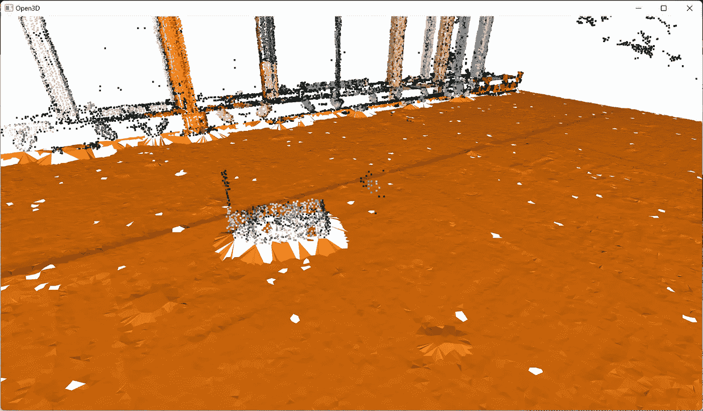

基于地é¢è¯­ä¹‰çš„ 3D 网格示例。© F. Poux

# 更进一步

学习之旅并未结æŸã€‚我们的终身探索æ‰åˆšåˆšå¼€å§‹ï¼Œæœªæ¥çš„步骤将深入到 3D Voxel 工作，探索语义和点云分æžä¸Žæ·±åº¦å­¦ä¹ æŠ€æœ¯ã€‚我们将解é”高级的 3D LiDAR 分æžå·¥ä½œæµç¨‹ã€‚令人兴奋的事情还有很多ï¼

1.  **Lehtola, V.**，Nikoohemat, S.，& Nüchter, A.（2020）。室内 3D：扫æå’Œé‡å»ºæ–¹æ³•æ¦‚述。大地空间数æ®æ‰‹å†Œï¼Œ55–97\. [`doi.org/10.1007/978-3-030-55462-0_3`](https://doi.org/10.1007/978-3-030-55462-0_3)

1.  **Poux, F.**，& Billen, R.（2019）。基于体素的 3D 点云语义分割：无监ç£å‡ ä½•å’Œå…³ç³»ç‰¹å¾ä¸Žæ·±åº¦å­¦ä¹ æ–¹æ³•ã€‚*ISPRS 国际地ç†ä¿¡æ¯æ‚å¿—*。8(5)，213ï¼›[`doi.org/10.3390/ijgi8050213`](https://doi.org/10.3390/ijgi8050213) — Jack Dangermond 奖（[新闻报é“链接](https://www.geographie.uliege.be/cms/c_5724437/en/florent-poux-and-roland-billen-winners-of-the-2019-jack-dangermond-award)）

1.  Bassier, M., Vergauwen, M., **Poux, F.**，（2020）。建筑内部分类中的点云与网格特å¾ã€‚*é¥æ„Ÿ*。12，2224\. https://doi:10.3390/rs12142224
