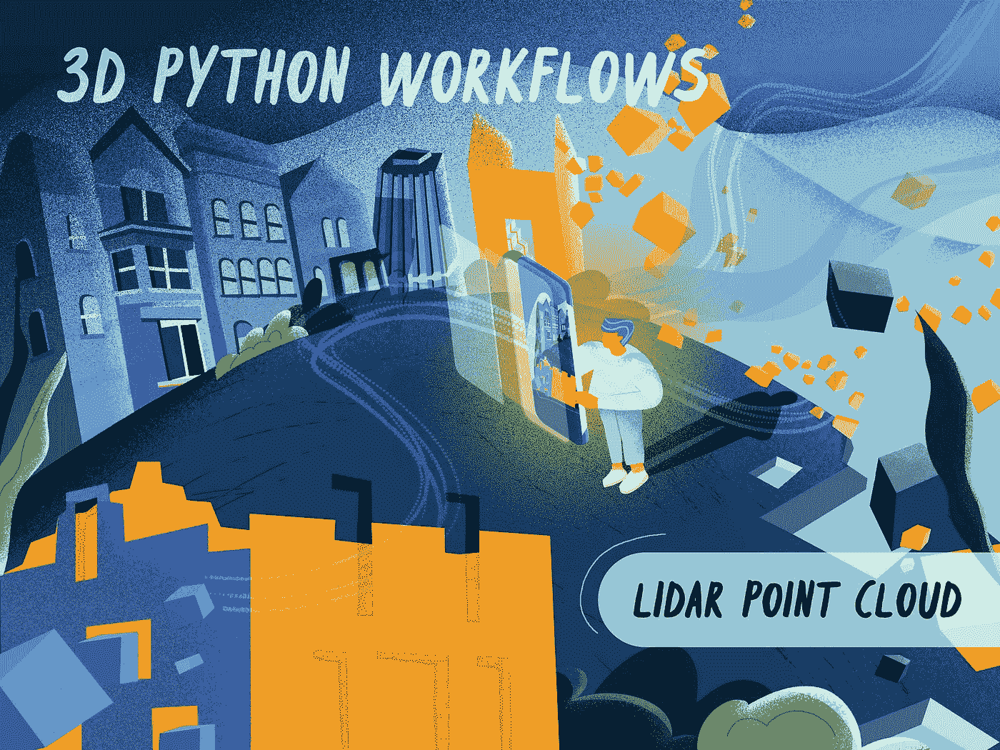

# 《LiDAR 城市模型的 3D Python 工作流：逐步指南》

> 原文：[`towardsdatascience.com/3d-python-workflows-for-lidar-point-clouds-100ff40e4ff0?source=collection_archive---------1-----------------------#2023-04-04`](https://towardsdatascience.com/3d-python-workflows-for-lidar-point-clouds-100ff40e4ff0?source=collection_archive---------1-----------------------#2023-04-04)

## 3D Python

 [Florent Poux, Ph.D.](https://medium.com/@florentpoux?source=post_page-----100ff40e4ff0--------------------------------)

·

[关注](https://medium.com/m/signin?actionUrl=https%3A%2F%2Fmedium.com%2F_%2Fsubscribe%2Fuser%2F8ba7bf4ad784&operation=register&redirect=https%3A%2F%2Ftowardsdatascience.com%2F3d-python-workflows-for-lidar-point-clouds-100ff40e4ff0&user=Florent+Poux%2C+Ph.D.&userId=8ba7bf4ad784&source=post_page-8ba7bf4ad784----100ff40e4ff0---------------------post_header-----------) 发表在 [Towards Data Science](https://towardsdatascience.com/?source=post_page-----100ff40e4ff0--------------------------------) ·38 分钟阅读·2023 年 4 月 4 日

--

解锁 3D 城市建模应用程序的流畅工作流终极指南。教程涵盖了将 3D 点云、网格和体素结合起来进行高级分析的 Python 自动化。

《LiDAR 城市模型的 3D Python 工作流：逐步指南》。这封面来自我的另一半[Marina](https://www.instagram.com/mimatelier_/)，突显了 3D 城市建模的艺术过程。© [Mimatelier](https://mimatelier.com/)。

你之前有没有遇到过“智慧城市”这个术语？或者“智慧某物”？好吧，我们会触及这个话题！把智慧城市想象成一个使用了兴奋剂的面包师🥐：它在你开口之前就知道你需要什么，并会提供最直接的建议，帮助你做出美味的选择。不，这个智慧城市的比喻并不是我今天要讲的全部内容。实际上，要达到这种“智能”水平，我们首先得从基础层开始：3D 城市模型。

如果你曾想创建令人惊叹的 3D 城市模型但发现工作流程令人生畏且复杂，那我来帮忙了！本文探讨了如何通过 Python 和开源软件定义一个强大的 3D 工作流程，帮助你开启 3D 城市建模之旅。对繁琐的手动过程说（几乎）再见，迎接高效、动态和引人注目的创作吧！

我们深入探讨了一个四步骤策略，包括环境设置、3D 数据整理与准备，以及 3D 几何处理，以提取关键见解，比如使用点云数据、网格、体素等来分析你所在社区的建筑覆盖情况，和一些……
