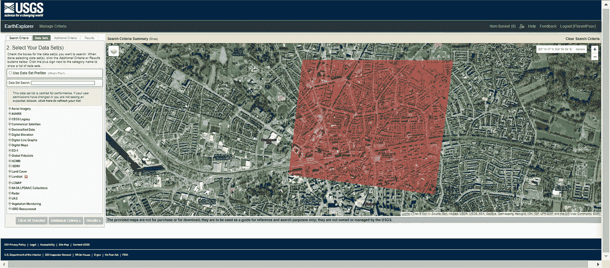

# 使用 Python 进行 3D 地理空间数据集成：终极指南

> 原文：[`towardsdatascience.com/3d-spatial-data-integration-with-python-7ef8ef14589a`](https://towardsdatascience.com/3d-spatial-data-integration-with-python-7ef8ef14589a)

## 3D Python

## 用多模式 Python 工作流整合地理空间数据的教程：结合 3D 点云、CityGML、体素、矢量 + 栅格数据

[](https://medium.com/@florentpoux?source=post_page-----7ef8ef14589a--------------------------------)[](https://towardsdatascience.com/?source=post_page-----7ef8ef14589a--------------------------------) [Florent Poux, Ph.D.](https://medium.com/@florentpoux?source=post_page-----7ef8ef14589a--------------------------------)

·发表于 [Towards Data Science](https://towardsdatascience.com/?source=post_page-----7ef8ef14589a--------------------------------) ·阅读时间 39 分钟·2023 年 11 月 7 日

--

现在的科技进步速度简直疯狂。尤其是当我们看到 3D 数据对地理空间分析和数字双胞胎的重要性时更是如此。能够以三维捕捉和分析数据意味着我们可以创建对现实世界对象和环境的精确表示。


3D 空间数据集成通过理解 3D 数据捕捉的范围来实现。© F. Poux

🦄**米拉**：*一图胜千言。那么数字双胞胎呢？*

这对城市规划、基础设施管理和灾难响应等领域尤为重要。

通过整合 3D 数据，我们可以通过依赖于精确和可靠的数据表示来提高做出明智决策的能力。此外，将这些数据整合到数字双胞胎中可以生成非常逼真的现实资产和系统的复制品，从而提高模拟和分析的效率。

但是（总是有“但是”），有效的地理空间分析和数字双胞胎创建依赖于高效整合和可视化不同的数据格式。为实现这一点，必须全面了解各种数据模式及其如何无缝集成和可视化。在数据方面，我们希望创建一个统一且全面的区域表示，以便数据能够重叠。我们真是太幸运了，因为这正是我们今天要解锁的内容！


要构建一个空间数字世界，我们必须研究 3D 数据集成。许多信息来源，如矢量数据、栅格数据、3D 点云或 3D 城市模型，可以组合形成我们星球上发生事件的统一视图。© F. Poux

在这本动手指南中，我提供了一个面向系统的 3D 数据集成工作流参考，使用 Python。因此，你不需要昂贵的软件或大规模的砖块式流水线！只需我们的 Python 朋友和精心挑选的一小组强大模块与函数。

这个倡议的终极目标是，你将拥有一个全面的指南和伴侣，陪伴你完成 3D 数据之旅！工作流被结构化为七个不同的阶段，如下所示。


使用 Python 的 3D 数据集成工作流。这是一个七步过程，用于生成统一的数据中心视图。© [F. Poux](https://learngeodata.eu/)

每个阶段逐步构建，以确保你可以从头开始或模块化地插入到现有系统中。由于构建得非常全面，目录将使你更容易浏览！

```py
Chapter 1\. 3D Python Setup
1.1\. Environment Setup
1.2\. Base Libraries
1.3\. 3D Data Libraries
1.4\. Geospatial Libraries
1.5\. IDE Setup

Chapter 2\. Multi-Modal Data Curation
2.1\. 3D Data Sourcing
2.2\. Spatial Raster (GIS)
2.3\. Vector Data (GIS)
2.4\. Other Sources

Chapter 3\. Data Analysis and Profiling
3.1\. 3D Point Clouds and voxels
3.2\. 3D mesh and city models
3.3\. Spatial / Raster Imagery
3.4\. DSM, DTM, CHM

Chapter 4\. Registration / Reprojection
4.1\. Selecting a Reference System
4.2\. Data Georeferencing
4.3\. Data Reprojection
4.4\. Rigid Registration

Chapter 5\. Data Pre-Processing
5.1\. Data Cleaning
5.2\. Data Transformation
5.3\. Data Reduction
5.4\. Data Enrichment (Fusion)

Chapter 6\. Data Visualization and Validation
6.1\. 3D Data Inspection
6.2\. Point Cloud Canonical Link
6.3\. Hybrid Multi-Modal Visualization
6.4\. Projection-based Inspection

Chapter 7\. Data Sharing
7.1\. Selection Method Definition
7.2\. Data Organization
7.3\. File Format Definition
7.4 Export and External Use 
```

只要你准备好了，就让我们一起跳入这次精彩的 3D 数据集成探险吧，身边有杯咖啡，但不要离电脑太近 ☕（这是我亲身经历的惨痛教训）

🎵**读者注意**：这本动手指南是* [***UTWENTE***](https://www.itc.nl/) *与合著者* 🦊 ***F. Poux***, 🦄* ***M. Koeva***,* 和* ***🦝 P. Nourian*** *的联合工作的一部分。我们感谢来自数字双胞胎* [*@ITC*](http://twitter.com/ITC) *项目的资助，由特温特大学 ITC 学院提供。所有图片均 © F. Poux*

# 第一步：3D 数据的实施设置


第一步：3D 数据的实施设置。© [F. Poux](https://learngeodata.eu/)

第一个任务是快速建立一个轻量级环境，以开发我们的 3D 数据集成工作流。这是一个简单的阶段，但确保设置正确是可扩展性和复制的关键。让我们把事情做好吧！


环境设置包括基础库、3D 数据库、地理空间库和 IDE。所有这些都建立在虚拟环境管理和 Python 之上。© [F. Poux](https://learngeodata.eu/)

## 轻量级环境设置

使用 Anaconda 进行 Python 环境设置，强大的库和集成开发环境（IDE）不必痛苦。Anaconda 提供了管理 Python 包和环境的便捷方法，然后你可以使用强大的 IDE，如 Jupyter Lab 或 Spyder，让编程变得轻松。关于设置 3D Python 开发环境的详细信息，我建议你查看以下文章：

[](/3d-python-workflows-for-lidar-point-clouds-100ff40e4ff0?source=post_page-----7ef8ef14589a--------------------------------) [## LiDAR 城市模型的 3D Python 工作流：逐步指南]

### 解锁 3D 城市建模应用程序的流畅工作流的终极指南。教程涵盖了 Python……

towardsdatascience.com

🦊 **Florent**：*如果你不想再参加另一个会话，不用担心，我不会抛下你！作为这个终极指南的一部分，这里有一个绝佳的轻量级设置，启动时间少于 5 分钟，计时 ⌚。*

首先，你可以访问 [Anaconda 网站](https://docs.conda.io/en/latest/miniconda.html) 并下载适合你操作系统（Windows、macOS 或 Linux）的 Miniconda 安装程序（一个免费的 conda 最小安装程序），并选择 Python 10 版本。然后，你可以按照 Anaconda 网站上的安装说明在你的计算机上安装 Miniconda。

就这样！你现在已经用轻量级的 miniconda 安装了最简单的 Python，这将使你非常容易隔离一个受控的虚拟环境。在继续下一步之前，我们启动 miniconda 并访问其命令行：


在 Windows 中，搜索“miniconda”应该会得到这个结果。

一旦进入 Anaconda Prompt，我们按照下面所示的简单四步骤过程进行操作。


环境创建工作流程。© [F. Poux](https://learngeodata.eu/)

1.  要创建一个新环境，我们写：`conda create -n GEOTUTO python=3.10`

1.  要切换到新创建的环境，我们写：`conda activate GEOTUTO`

1.  要检查 Python 版本，使用 `python --version`，以及已安装的包：`conda list`。这应该分别显示 Python 3.10 和基本库的列表。

1.  要在新的环境中安装 pip，我们写：`conda install pip`

就这样！我们现在准备好使用 pip 管理器安装 3D 数据集成所需的库：`pip install package-name`，其中你需要逐一更换包名（例如：`numpy`、`matplotlib`、`laspy[lazrs,laszip]`、`open3d`、`rasterio`、`geopandas`）。

## Python 基础库


Python 基础库：Numpy 和 Matplotlib。

第一个包的安装通过提示完成：`pip install numpy`。不需要介绍**NumPy**，这是 Python 的基础数值和科学计算库。它支持大型多维矩阵，并提供了一系列数学函数，方便使用。NumPy 是许多其他科学库的基础，在数据分析、机器学习和科学研究中被广泛使用。

🦝 **Nourian**：*NumPy 全关于线性代数。如果你需要重新学习线性代数并熟悉它，你可以从这里开始：* [*计算机图形学的线性代数基础*](https://www.researchgate.net/publication/335571959_Rudiments_of_Linear_Algebra_Computer_Graphics) *(ResearchGate)*

**Matplotlib** 是一个流行的 Python 绘图库，支持 2D 绘图和基本的 3D 绘图功能。安装方法为：`pip install matplotlib`。它提供了广泛的可定制可视化选项，允许用户创建各种类型的图表，如折线图、散点图、条形图、直方图、3D 图表等。Matplotlib 在科学研究和数据科学工作流中被广泛使用。

## 3D Python 库


Python 3D 库：Open3D 和 Laspy。

**Open3D** 是一个现代的 3D 数据处理和可视化库，主要关注 3D 点云和网格。它提供了处理 3D 数据的功能，如点云配准、几何处理、网格创建和可视化。Open3D 特别适用于与 3D 计算机视觉、机器人技术和增强现实应用相关的任务。安装 Open3D 的方法是：`pip install open3d`。

然后，我们需要安装 **Laspy**：`pip install laspy[lazrs,laszip]`。这个 Python 库用于读取、写入和修改存储在 LAS（激光雷达数据交换格式）和 LAZ（压缩 LAS）文件格式中的 LiDAR 数据。它提供了处理来自 LiDAR 扫描仪的点云数据的工具，并在地理空间应用中（如地形建模、林业、城市规划等）被广泛使用。

## 地理空间库

**Geopandas** 是一个建立在 pandas 和 shapely 之上的库，旨在高效处理地理空间数据。安装方法为：`pip install geopandas`。它扩展了 pandas 的功能，支持地理空间数据类型和操作，使用户能够处理矢量数据（点、线、面）并高效地进行地理空间分析。Geopandas 在 GIS、制图和空间数据分析中被广泛使用。

**Rasterio** 是我们将要安装的最后一个库，安装方法为：`pip install rasterio`。它用于读取和写入地理空间栅格数据。支持各种标准的栅格格式，如 GeoTIFF 或 JPEG，并提供地理空间元数据、空间参考和坐标转换功能。rasterio 对于卫星影像分析、遥感和 GIS（地理信息系统）应用非常有价值。

这些库各自具有协同作用，可以处理科学计算、数据科学和地理空间应用中的各种数据类型。

## 设置 IDE

我们设置的最后一步是安装 IDE。我们仍在环境中的命令行界面中，输入：`pip install jupyterlab`，这将会在我们的环境中安装 jupyterlab。为了清晰使用，我们可以将目录更改为项目的父目录（我们称之为 `INTEGRATION`），其中包含 `CODE` 文件夹和 `DATA` 文件夹：`cd C://COURSES/POUX/INTEGRATION`。然后，我们将从这个位置启动 jupyterlab，通过在控制台输入：`jupyter lab`，这将会在您的网页浏览器中打开一个新的本地页面（Chrome 是首选，但 Firefox 或 Safari 也可以）。

做得好！第一阶段成功完成！🎯我们现在准备进入第二阶段：寻找可以组合以供未来使用的数据集，用于我们的 NASA 评分工作流程。🙃

# 步骤 2. 多模态数据策展


步骤 2. 多模态创建。© [F. Poux](https://learngeodata.eu/)

我们希望整合多模态数据集。但“多模态”这个词是什么意思呢？它指的是跨不同类型和背景的数据，例如图像、点云、文本和声音……


我们使用各种 2D/2.5D/3D 模态。3D 点云、3D 网格、城市模型、体素、空间栅格、360° 图像、表格数据、矢量数据。© F. Poux

🦝 **Nourian**：*此外，这里有一个关于城市规划的基于网络计算平台的极佳指南：* [*必备指南*](https://www.researchgate.net/publication/324088589_Essential_Means_for_Urban_Computing_Specification_of_Web-Based_Computing_Platforms_for_Urban_Planning_a_Hitchhiker's_Guide) *(ResearchGate)*

因此，我们在此阶段的目标是识别一个感兴趣的区域，并收集尽可能多的数据，以帮助我们未来的分析。今天选择的感兴趣区域是荷兰东部 Overijssel 省（Twente 地区）Enschede 市的一部分，这里，大学的知识光芒照耀四方。🌞


确定感兴趣的区域。

🦄 **Mila**：*通过融合 3D 地理空间和遥感数据来解锁我们城市的秘密，我们诞生了城市数字双胞胎，这些双胞胎照亮了过去，导航当前，并塑造未来。如果你想更深入地了解如何使用开源工具在网络上进行数据整合，这里有一篇研究论文：* *3D 数据集成用于基于 Web 的开源 WebGL 互动可视化* *(ISPRS Archives)*

现在我们准备获取不同的数据集。为了清晰起见，我将这些数据源分为四类：3D 数据集、空间栅格、矢量数据集，以及其他来源，如下所示。


多模态数据策展工作流程。© [F. Poux](https://learngeodata.eu/)

## 3D 数据源

第一步是从一些开放数据仓库获取数据集，这些仓库的数据许可允许我们进行一些实验。在这方面，对于荷兰，可以从一个地方获取 LiDAR 数据、地形模型和栅格图像：[geotiles.nl](https://geotiles.nl/)。你可以放大原始图块，并访问各种数据集的下载链接，如下所示。


通过 GeoTiles.nl 提取 AHN4 数据集的 34FN2 图块。© Florent Poux

🦊 **Florent**: *为了更好地服务于你，所有使用的数据都可以在本节末尾共享的驱动器文件夹中找到。AHN 版本是 AHN4。*

你可以探索的第二个获取 CityModels 的地方是 3D BAG，即建筑和地址的 3D 注册（BAG），这是荷兰最详细、开放可用的建筑和地址数据集。它包含多个详细级别的 3D 模型，生成方式是将两个开放数据集结合起来：来自 [BAG](https://docs.3dbag.nl/en/overview/sources/#BAG) 的建筑数据和来自 [AHN](https://docs.3dbag.nl/en/overview/sources/#AHN) 的高度数据。使用 3D Bag Viewer 通过图块查询，你可以探索和访问建筑物。


BAG Viewer。开放数据的许可为 CC BY 4.0，[3DBAG by tudelft3d 和 3DGI](https://docs.3dbag.nl/en/copyright)。

图块范围与我们从 geotiles.nl 获得的不同，这在我们进行集成阶段时显得**有趣**。在这个阶段，我们已经手头有了令人兴奋的数据集。现在我们可以继续探索空间栅格数据集。

## 空间栅格数据源

对于卫星和航空图像，[USGS Earth Explorer](https://earthexplorer.usgs.gov/) 是最大的免费数据源之一。它是全球性的，具有友好的用户界面，使访问遥感数据变得简单。如果你需要下载多个数据集，它甚至有批量下载应用。如果这是你第一次使用，你需要执行一个额外的步骤：创建一个账户，但这是免费的且迅速的（我用不到 2 分钟 ⌚）。



USGS Earth Explorer。开放数据属于美国公共领域，[Credits USGS](https://www.usgs.gov/information-policies-and-instructions/copyrights-and-credits)。

我从 WebUI 绘制了一个多边形，然后请求获取 **Landsat > Landsat Collection 2 — Level 1** 组（最新的 Landsat 图像是 L8–9 OLI/TIRS 和 L7 ETM+）。这些集合之间的差异基于数据质量和处理水平。USGS 已根据质量和处理水平 [将图像分类为不同级别](https://www.usgs.gov/media/videos/landsat-collections-what-are-tiers) ([来源](https://gisgeography.com/usgs-earth-explorer-download-free-landsat-imagery/))。一旦进入结果部分，你可以查看足迹，然后决定哪个最适合你的需求，如下所示。


提取 LandSAT 图像的多边形。© F. Poux

对于数字高程模型，我建议使用 [geotiles.nl](https://geotiles.nl/) 数据服务，因为它提供了 AHN 的最新和最精确的高程模型。我们正在以令人难以置信的速度前进，下一阶段是获取一些优秀的矢量数据集！

## 矢量数据策展

如果你在 GIS 社区中，我希望展示 [OpenStreetMap (OSM)](https://www.openstreetmap.org/#map=17/52.22687/6.88808&layers=G) 的力量不会冒犯你的知识基础。


OpenStreetMap 数据策展门户。数据是开放的，遵循开放数据库许可证（ODbL），[OpenStreetMap 版权](https://www.openstreetmap.org/copyright)。

OSM 提供了不同的地图和图层，具有众包倡议，这使得它非常详尽，但精确度仍然是一个问题。实际上，OSM 对公众开放，由普通大众创建。这意味着准确性可能会根据创作者及其“制图”技能水平而有所不同。然而，OSM 是一个开放许可证街道级 GIS 数据的宝藏。

我们有几种方法可以下载 OpenStreetMap 数据，以获取一些宝贵的数据。方便的是，甚至有一个 [OSM 数据维基页面](https://wiki.openstreetmap.org/wiki/Downloading_data) 列出了所有可用的 OSM 提取数据。我的推荐是使用 [Geofabrik](http://download.geofabrik.de/) 工具。实际上，你可以利用按语义空间范围（例如：国家、州、洲等）组织的数据。你可以快速选择一个地理位置，然后下载 OSM 数据，如下所示。


GeoFabrik 门户以收集矢量数据集。© F. Poux

🦊 **Florent**：*我也喜欢将 OSM 数据下载为形状文件，但稍后会详细说明 😉。* ***Mila*** *让我觉得这其中浓缩了大量的知识* [*Geospatial Data with Python*](https://carpentries-incubator.github.io/geospatial-python/)*。*

现在我们有一些 3D 数据集、一些栅格数据集和矢量形状文件。是时候在互联网世界中挖掘其他宝贵的资源了 💎。

## 其他来源

好吧，在这里，网络是您的盟友。您可以找到任何与分析相关的信息，从网页到新闻，再到声音和实时数据流。我不会夸大地说天空（或您的带宽 😁）是极限！不过，让我再实际一点，向您推荐一个平台：[Mappillary](https://www.mapillary.com/)。

Mappillary 是一个提供街景图像和地图数据的平台。您可以使用地图浏览器探索并下载一些 360° 图像和兴趣点。


Mapillary 数据库通过提供的门户。如果您下载图像，它们由 Mappillary 按 [CC-BY-SA](https://help.mapillary.com/hc/en-us/articles/115001770409-Licenses) 许可。

如果您想仅选择一些感兴趣的元素或与 OSM 数据进行交叉验证，您还可以按类别过滤元素。

现在，好消息来了！为了跟随即将到来的代码行，我为您简化了获取这些数据的过程，您可以直接在这个 [数据驱动仓库](https://drive.google.com/drive/folders/1HNvEHftS0SlCXESM19xd6onxSAGHy5wE?usp=sharing) 中找到它们。一旦您在您的 DATA 文件夹中拥有所需的数据，我们可以开始一次愉快的探索性数据分析。

# 第 3 步：探索性数据分析


第 3 步：探索性数据分析。

在这一阶段，我们已经设置好了 Python 代码和数据，因此我们准备好进入深度集中模式，定时器设置为 15 分钟 ⌚。实际上，我们将使用 Python 探索我们收集的各种数据集。


加载和读取 3D 数据。我们使用 Open3D（点云、网格、体素）、RasterIO 和 Geopandas。© F. Poux

这意味着，对于每种模式，我们将进行读取、分析、协调和分类其内容。通常，这意味着处理库的双向通信。为了保持简洁，我擅自将一些模式归为一组，如下所示。


涵盖的多种模式。© F. Poux

在加载任何内容之前，让我们通过在您的笔记本/脚本中输入以下九行来导入所有已安装的库：

```py
#base libraries
import numpy as np
import matplotlib.pyplot as plt

#3D libraries
import open3d as o3d
import laspy as lp

#geospatial libraries
import rasterio as ra
import geopandas as gpd
```

## 3D 点云

让我们从我的门生开始：3D 点云。它们本质上是一组在 3D 空间中表示物理对象或环境的点。这些点来自各种来源，包括 LiDAR、摄影测量、人工智能（是的，你没看错）、扫描设备等。我们手中的第一个数据集来自 Aerial LiDAR AHN 活动，格式为 LAZ 文件。它从 LAS LiDAR 数据交换格式（LAS）扩展而来，是存储 LiDAR 点云数据的压缩对等格式。它支持 2D 和 3D 点数据及其属性，如强度和分类。为了用 Python 读取该文件，我们使用`laspy`库及其扩展，如下所示：

```py
#Load a las file
las = lp.read("../DATA/34FN2_13.laz")
```

太好了！我们现在已经将文件加载到`las`变量中，可以使用`laspy`函数快速探索，获取可能的属性、`red`通道的`max value`或投影信息：

```py
print([dimension.name for dimension in las.point_format.dimensions])
print(np.max(las.red))
print(las.header.vlrs[2].string)
```

这将产生以下结果：

```py
['X', 'Y', 'Z', 'intensity', ‘return_number’, ‘number_of_returns’, ‘synthetic’, ‘key_point’, ‘withheld’, ‘overlap’, ‘scanner_channel’, ‘scan_direction_flag’, ‘edge_of_flight_line’, ‘classification’, ‘user_data’, ‘scan_angle’, ‘point_source_id’, ‘gps_time’, ‘red’, ‘green’, ‘blue’, ‘nir’, ‘Amplitude’, ‘Reflectance’, ‘Deviation’]
255
COMPD_CS["Amersfoort / RD New + NAP height",PROJCS[“Amersfoort / RD New”,GEOGCS[“Amersfoort”,DATUM[“Amersfoort”,SPHEROID[“Bessel 1841”,6377397.155,299.1528128,AUTHORITY[“EPSG”,”7004"]],AUTHORITY[“EPSG”,”6289"]],PRIMEM[“Greenwich”,0,AUTHORITY[“EPSG”,”8901"]],UNIT[“degree”,0.0174532925199433,AUTHORITY[“EPSG”,”9122"]],AUTHORITY[“EPSG”,”4289"]],PROJECTION[“Oblique_Stereographic”],PARAMETER[“latitude_of_origin”,52.1561605555556],PARAMETER[“central_meridian”,5.38763888888889],PARAMETER[“scale_factor”,0.9999079],PARAMETER[“false_easting”,155000],PARAMETER[“false_northing”,463000],UNIT[“metre”,1,AUTHORITY[“EPSG”,”9001"]],AXIS[“Easting”,EAST],AXIS[“Northing”,NORTH],AUTHORITY[“EPSG”,”28992"]],VERT_CS[“NAP height”,VERT_DATUM[“Normaal Amsterdams Peil”,2005,AUTHORITY[“EPSG”,”5109"]],UNIT[“metre”,1,AUTHORITY[“EPSG”,”9001"]],AXIS[“Gravity-related height”,UP],AUTHORITY[“EPSG”,”5709"]],AUTHORITY[“EPSG”,”7415"]]
```

第三行给我们一个有趣的概况：数据以`Amersfoort / RD New + NAP height`参考系统表示。我们记下来以备后用。

🦊 **Florent**：如你所见，第一行给了我们几个后续使用的属性。很高兴默认情况下我们可以以半结构化的方式存储这么多信息。然而，我们需要整理这些信息的相关性；通常我们默认使用`*X*`、`*Y*`、`*Z*`、`*intensity*`、`*red*`、`*green*`、`*blue*`。我会把其他的称为额外的奖励😁。

在这个阶段，我们没有自然的方法来可视化数据是否正确；我们必须将其转换为我们喜爱的`numpy`对象，然后再转换为`open3d`点云对象，以完成库之间的切换。首先，我们将一些`laspy`对象属性转换为`coords`和`colors` numpy 对象，以保存我们的点云坐标`X`、`Y`、`Z`以及点云颜色：

```py
coords = np.vstack((las.x, las.y, las.z))
colors = np.vstack((las.red, las.green, las.blue))
```

然后我们将 numpy 对象转换为`open3d`对象以可视化点云。不幸的是，从`laspy`到`open3d`没有直接的方法，尽管有😁。

```py
pcd = o3d.geometry.PointCloud()
pcd.points = o3d.utility.Vector3dVector(coords.transpose())
pcd.colors = o3d.utility.Vector3dVector(colors.transpose()/255)
o3d.visualization.draw_geometries([pcd])
```

🦊 **Florent**：这是一个很好的练习，可以看到切换库几乎总是会导致在转换之间丢失一些处理时间，并且也暴露出可能的内存错误。因此，当处理复杂的数据集和工作流程时，我建议总是使用有限数量的库。*


在 Open3D 中可视化的 3D 点云数据集。© [F. Poux](https://learngeodata.eu/)

现在你可以在 Python 中很漂亮地可视化完整的 LiDAR 点云，媲美专业软件！让我们加载另一个点云，以探索另一种广泛使用的文件格式：`.ply`。PLY 格式用于存储 3D 网格数据及其属性，如颜色和法线。它也适用于带有附加信息的点云。

使用`open3d`，这非常简单；你可以执行以下代码，将点云填充到`pcd_itc`变量中，并使用`o3d.visualization`函数绘制点云：

```py
#Load a point cloud and visualize
pcd_itc = o3d.io.read_point_cloud("../DATA/ITC_outdoor.ply")
o3d.visualization.draw_geometries([pcd_itc])
```


在 Open3D 中可视化的 3D 室内点云。© [F. Poux](https://learngeodata.eu/)

这个点云没有显示任何元数据，这意味着我们将认为它以本地参考系统表示，需要以某种方式与参考数据集进行配准。

🦊**Florent**: *剧透警告！点云数据集就像一个特殊的中心岩石，尤其在处理多模态数据时。实际上，正如我稍后将展示的，它可以作为标准参考，将所有其他数据集与之关联。我已经提醒过你有剧透了！*

是时候转向 3D 体素🧊

## 3D 体素

体素是另一种 3D 数据格式。体素本质上是表示空间体积的 3D 像素。它们非常有趣，你可以在以下案例研究中查看它们的实际用途：

[](/3d-python-workflows-for-lidar-point-clouds-100ff40e4ff0?source=post_page-----7ef8ef14589a--------------------------------) ## 3D Python 工作流用于 LiDAR 城市模型：一步一步的指南

### 解锁 3D 城市建模应用的最终指南。该教程涵盖了 Python……

towardsdatascience.com [](/how-to-automate-voxel-modelling-of-3d-point-cloud-with-python-459f4d43a227?source=post_page-----7ef8ef14589a--------------------------------) ## 如何使用 Python 自动化 3D 点云的体素建模

### 实用教程，将大型点云转换为 3D 体素🧊，使用 Python 和 open3d。解锁自动化工作流……

towardsdatascience.com

🦝 **Pirouz**: *体素非常像乐高模型。查看这篇关于空间数据体素化并深入研究数字乐高的论文：* [*地理空间应用的体素化算法*](https://www.researchgate.net/publication/290507635_Voxelization_Algorithms_for_Geospatial_Applications) *(ResearchGate)。如果你对体素情有独钟？那么在 Google 上搜索“体素艺术”，并查看库* [*topoGenesis*](https://github.com/shervinazadi/topogenesis/) *(GitHub)。*

现在，我们将使用以下代码行读取和可视化体素数据集：

```py
vox_read = o3d.io.read_voxel_grid("../DATA/34FN2_13_vox.ply", format='auto')
o3d.visualization.draw_geometries([vox_read])
```


在 Open3D 中可视化的 3D 体素数据集。© [F. Poux](https://learngeodata.eu/)

在这个阶段，我们阅读、分析，并确保有一个单一的库来处理所有这些数据（`numpy`）和一个用于 3D 可视化的库（`open3d`）。

是时候在我们的 Python 实验中加入城市模型了😁

## 城市模型

城市模型通常遵循一种表达标准：CityGML 模型。CityGML 是一种基于 XML 的数据格式，用于表示城市环境的三维几何。CityGML 模型可以包含有关建筑物、道路、桥梁和其他基础设施的信息。城市规划师、建筑师和工程师常常使用这些模型来模拟和分析城市环境。一个优秀的获取地点，我之前故意没有提到的，是由我的同事 Olaf 精心策划的 GitHub 仓库（任何冰雪奇缘的引用禁止 ⛄）：[CityGML Models](https://github.com/OloOcki/awesome-citygml)。

🦊 **Florent**: *基本上，在 Python 中，我们必须确保将这些模型转换为三维网格，同时保留所需的语义/拓扑或其他信息。一个友好的 Python 工具，同样由* [*TUM*](https://www.asg.ed.tum.de/en/gis/home/)* 提供，可以在这里找到：* [*citygml2obj*](https://github.com/tum-gis/CityGML2OBJv2)*。但如果你使用数据，我已经为你完成了繁重的工作，因此继续阅读下一个阅读方式：三维网格。*

## 3D 网格

接下来，让我们谈谈网格。三角网格由顶点、连接顶点的边缘和完成对象“包络”的三角面组成。它们使我们能够描绘三维物体的形状。网格可以使用三维建模软件创建，也可以通过点云、城市模型和专用算法生成，甚至是人工智能！数据集采用 OBJ 格式，通常用于导出表示几何体和纹理坐标的三维网格模型。

🦝 **Pirouz**: *如果你想知道为什么这些花哨的词汇被用来代替点、线和多边形，你需要多了解一点另一个花哨的词汇：***拓扑****。*

🦊 **Florent**: *你可以阅读 Pirouz 写的关于拓扑的故事，这可能是最简单的拓扑故事之一：* [*几何和拓扑基础*](https://www.researchgate.net/publication/344297280_Rudiments_of_Geometry_and_Topology_for_Computational_Design) *(ResearchGate)*

要加载网格并获取其范围，我们将编写以下几行：

```py
mesh = o3d.io.read_triangle_mesh("../DATA/10–976–660-LoD22–3D.obj")
mesh.get_axis_aligned_bounding_box()
```

从输出中我们看到坐标接近于 Amersfoort / RD New 所提供的。这令人欣慰；我们现在在这个参考系统中有了另一个数据集。

从那里开始，为了可视化网格，我们首先计算一些顶点法线，并使用 open3d 的相同可视化函数来进行可视化：

```py
mesh.compute_vertex_normals()
o3d.visualization.draw_geometries([mesh])
```

在三维方面，我们可以开始了！让我们用 Python 和 rasterio 探索我们的空间栅格。

## 空间影像

我们的影像采用 GeoTIFF 格式，这是 TIFF 格式的扩展，包含地理空间元数据，适用于栅格高程数据（DSM/DTM）和影像。要打开和分析我们拥有的空间影像，我们只需使用 rasterio 的以下代码行：

```py
sat_image = ra.open("../DATA/RGB_34FN2.tiff")
sat_image_array = sat_image.read(1)
print(sat_image.meta)
```

这将产生以下输出：

```py
{‘driver’: ‘GTiff’, ‘dtype’: ‘uint8’, ‘nodata’: None, ‘width’: 20002, ‘height’: 25002, ‘count’: 3, ‘crs’: CRS.from_epsg(28992), ‘transform’: Affine(0.25, 0.0, 254999.75,
 0.0, -0.25, 475000.25)}
```

有趣的是，我们可以清楚地看到这是一个`20002x25002`的图像，具有三个通道（`R`、`G`和`B`），其表达在`CRS 28992`中，这再次对应于 Amersfoort！这太棒了！

现在，为了使用 numpy 和 matplotlib 绘图，下面是获取图像的最小代码行，以避免内存错误，结果如图所示：

```py
plt.imshow(sat_image_array)
plt.axis("off")
plt.show()
```

与此同时，rasterio 还提供了`[show()](https://rasterio.readthedocs.io/en/latest/api/rasterio.plot.html#rasterio.plot.show)`函数，以执行日常任务，例如将多波段图像显示为 RGB，并用适当的地理参考范围标记坐标轴。这使得绘图变得更加简单，如下所示：

```py
from rasterio.plot import show
cir_image = ra.open("../DATA/CIR_34FN2.tiff")
show(cir_image)
show(sat_image)
```


使用 matplotlib 和 rasterio 的绘图函数可视化的各种光栅。© [F. Poux](https://learngeodata.eu/)

这真是太棒了！我们有多个 3D 数据集（3D 点云、体素、3D 网格）和卫星图像（包括红外和 R、G、B），我们可以用 numpy 处理这些数据，并且大多数可以用一个通用 CRS 表示。让我们转向其他光栅，重点关注高程数据（2.5D）。

## 高程光栅（DSM，DTM）

高程模型通常以光栅文件的形式出现，其中每个像素都有一个可以转换为其高程的值。这就是为什么我们称之为 2.5D 数据，因为它是一个纯粹的俯视图或单点视角，当它不在任何 GIS 投影系统中时也称为深度图像。我们可以用相同的代码行导入高程模型：

```py
dtm = ra.open("../DATA/DTM5_34FN2.TIF")
```

现在我们有了一个保存了高程数据的`dtm`变量，我们可以通过`dtm.meta`提取其整体元数据，或者更专业地使用`dtm.shape`、`dtm.crs`、`dtm.bounds`、`dtm.overviews(1)`：

```py
print(dtm.meta)
print(dtm.shape, dtm.crs, dtm.bounds, dtm.overviews(1))
```

这给我们带来了以下结果：

```py
{‘driver’: ‘GTiff’, ‘dtype’: ‘float32’, ‘nodata’: 3.4028234663852886e+38, ‘width’: 1000, ‘height’: 1250, ‘count’: 1, ‘crs’: CRS.from_epsg(28992), ‘transform’: Affine(5.0, 0.0, 255000.0,
 0.0, -5.0, 475000.0)}
(1250, 1000) EPSG:28992 BoundingBox(left=255000.0, bottom=468750.0, right=260000.0, top=475000.0)
```

再次令人感兴趣的是，我们看到这个数据集使用的是相同的 CRS Amersfoort / RD New。

为了绘制图形并了解我们正在处理的内容，我们可以将数据集转换为 numpy 数组，并使用索引选择其中的一部分到选择变量中：

```py
dtm_array = dtm.read(1).astype(‘float64’)
selection = dtm_array[300:800,300:800]
```

最后，我们使用两种方式绘图：`rasterio`和`matplotlib`，分别绘制全尺度数据集和放大的选择区域：

```py
#For the dtm plot with rasterio
show(dtm)

#For the dtm zoomed-in plot with matplotlib
fig, ax = plt.subplots(1, figsize=(15, 15))
ra.plot.show(selection, cmap=’Greys_r’, ax=ax)
plt.axis(‘off’)
plt.show()
```


使用 RasterIO 和 matplotlib 绘制的 DTM 图。© [F. Poux](https://learngeodata.eu/)

最后，我们不能在不深入探讨矢量空间数据的情况下讨论光栅数据集。

## 空间矢量数据

在这个阶段，必须一次性明确，如果你看到的是像素，那么你并不是在谈论矢量数据。相反，矢量数据集由顶点和路径组成，这些顶点和路径以点（X，Y 坐标）、线（连接这些标记的顶点）和多边形（连接顶点以闭合由线组成的路径）的形式存在。


GIS 系统中的矢量数据。© [F. Poux](https://learngeodata.eu/)

🌱 **成长**：*考虑到这一点，你的直觉把 3D 点云放在哪里？体素模型？3D 网格？这些都是有深远意义的有趣问题，但有助于更好地定位 2D 与 3D 的协同作用*。

有趣的是，制图师（不仅仅是制图师）将这些用作“符号”来在地图上描绘现实世界的组件。这意味着他们必须不断确定实体所代表的“详细程度” (LoD)，这赋予这些实体如此多的符号意义（一个点可以是一个国家、一个城市、一个公民或一个特定地点，……）。

为了处理这些矢量数据集，我们主要使用一种开放规范——shapefile 格式。这允许我们空间描述几何形状并附加一些额外的信息。在我们的计算机上，shapefile 文件格式实际上是多个文件的集合，用于表示地理数据的不同方面（[*参考*](https://wiki.openstreetmap.org/wiki/Shapefiles)）：

+   `.shp` — 形状文件，包含特征几何本身。

+   `.shx` — 形状索引格式，包含特征几何的定位索引。这对于大型文件非常有用，因为它利用巧妙的“索引”实现快速搜索。

+   `.dbf` — 属性格式，以表格方式（dBase IV 格式）存储每个形状的各种属性。

在顶部，我们可能会有与 shapefile 格式配套的可选文件。最值得注意的是“`.prj`”文件。这个额外的文件实际上定义了坐标系统和任何必要的投影信息。因此，拥有这些文件使我们能够使用 geopandas 加载 Overijssel 区域的街道数据：

```py
vector_data = gpd.read_file("../DATA/gis_osm_roads_free_1.shp")
```


矢量数据输出。© [F. Poux](https://learngeodata.eu/)

现在让我们通过探索其坐标参考系统（CRS）来进一步了解其投影系统：

```py
print(vector_data.crs)
```

这导致了以下结果：

```py
<Geographic 2D CRS: EPSG:4326>
Name: WGS 84
Axis Info [ellipsoidal]:
- Lat[north]: Geodetic latitude (degree)
- Lon[east]: Geodetic longitude (degree)
Area of Use:
- name: World.
- bounds: (-180.0, -90.0, 180.0, 90.0)
Datum: World Geodetic System 1984 ensemble
- Ellipsoid: WGS 84
- Prime Meridian: Greenwich
```

如我们所见，该数据集以 ESPG 4326 表达，这代表 WGS84\. 因此，与我们之前的数据集有所不同。

**Florent**：*geopandas 是 pandas 和 shapely 的完美结合。因此，如果你对这两者都很熟悉，使用 geopandas 将会非常轻松！一些有用的命令是* `vector_data.columns` *或* `vector_data.describe()` *，可以让你快速了解其内容*。

但现在让我们通过可视化我们的数据集来查看其内容：

```py
vector_data.plot()
```

这导致了以下图示：


来自 OpenStreetMap 的矢量数据。© [F. Poux](https://learngeodata.eu/)

这非常有趣！我们还可以使用 Matplotlib 来显示矢量数据。该区域人口密集，道路网络广泛且非常密集！现在让我们从另一个数据源中提取一些兴趣点。

## 矢量：兴趣点

数据集包中包含一个 GeoJSON 文件，这是一个轻量级且流行的矢量数据格式，具有几何体和属性，适用于基于 Web 的应用程序和数据交换。要加载该文件，我们也使用 geopandas，代码如下：

```py
trashcan_data = gpd.read_file("../DATA/mapillary-trashcan_points.json")
```

我们分析其 CRS：

```py
trashcan_data.crs
```

这给我们的答案是它仍然在 WGS84 CRS 中。最后，我们绘制以检查任何异常：

```py
trashcan_data.plot()
```


关注点。© [F. Poux](https://learngeodata.eu/)

没有更多上下文，这可能有点平淡；因此，首先选择叠加栅格影像。但在此之前，让我们探索另一个可以尝试的数据集：360° 影像！

## 360° 影像

从 mappillary 平台，我们可以提取一些附有特定许可的 360° 图像。你仍然可以使用 geopandas 来读取这些影像：

```py
image = ra.open("../DATA/An8XJdYJkSXycbyDWiVyw8dfVi2IzZ-jr9z7IxneeEXnOJPt0K1C89cMdXNkl5FZT0x6aVuPFRpda6eWV9fcnpgJkPfWjrd7k9harUP48csXGFf2azE1qF7FhkYK4h__j9t6Vd3aUfKcEdlqF_rsVO4.jpg")
print(image.meta)
```

这将输出：

```py
Dataset has no geotransform, gcps, or rpcs. The identity matrix will be returned.
  dataset = DatasetReader(path, driver=driver, sharing=sharing, **kwargs)
{'driver': 'JPEG', 'dtype': 'uint8', 'nodata': None, 'width': 2048, 'height': 1024, 'count': 3, 'crs': None, 'transform': Affine(1.0, 0.0, 0.0,
       0.0, 1.0, 0.0)}
```

在这里，我们可以看到（当然）这张图像没有地理变换数据。这是正常的：这不是空间栅格！然而，如果我们愿意，我们可以添加一个位置，以便数据点表示拍摄照片的位置，这暗示了通过数据整合来叠加数据模态。但在去到那里之前，让我们绘制图像：

```py
ra.plot.show(image)
```

结果如下：


来自 Mapillary 的 360° 影像。© [F. Poux](https://learngeodata.eu/)

我们现在已经成功加载了 3D 点云、作为 3D 网格的 3D 城市模型、3D 体素数据集、空间栅格（卫星影像、航拍影像和高程栅格）、矢量数据集（线条和点）以及 360° 影像。第一个目标现在显然已经成功！但我们需要检查如何将这些数据整合在一起，首先需要检查的是它们是否都表示在相同的坐标参考系统（CRS）中。为此，我将我们的分析步骤的结果汇总在下面的表格中。

```py
| Data | Lidar Point Cloud                | TLS Point Cloud | 3D City Mesh                     | Satellite Imagery   | Digital Terrain Model | Streets (Vector)         | Trashcans                      |
|------|----------------------------------|-----------------|----------------------------------|---------------------|-----------------------|--------------------------|--------------------------------|
| Name | 34FN2_13.laz                     | ITC_outdoor.ply | 10-976-660-LoD22-3D.obj          | RGB_34FN2.tiff      | DTM5_34FN2.TIF        | gis_osm_roads_free_1.shp | mapillary-trashcan_points.json |
| CRS  | Amersfoort / RD New + NAP height | None            | Amersfoort / RD New + NAP height | Amersfoort / RD New | Amersfoort / RD New   | WGS 84                   | WGS 84                         |
| CRSC | 7415                             |                 | 7415                             | 28992               | 28992                 | 4326                     | 4326                           |
```

我们看到混合了 EPSG:7415、28992、4326 或缺失 EPSG。下一阶段是澄清并为所有数据集使用统一的系统。

# 数据注册和重投影


步骤 4：注册和重投影

在整合之前，我们必须确保所有数据集都处于兼容的格式和坐标参考系统（CRS）中。如果不是这样，我们会执行数据重投影，将它们带入一个共同的 CRS。这通过四个主要阶段实现：（1）选择参考系统，（2）地理配准主要数据集，（3）重投影其他数据集，以及（4）严格对齐本地数据集，如下所示。


已覆盖 4 个步骤工作流。© [F. Poux](https://learngeodata.eu/)

让我们逐步了解这些阶段。

## 选择参考系统

好的，让我们深入探索参考系统的激动人心的世界吧！想象一下参考系统就像是引导你的数据穿越地球广阔景观的 GPS 坐标。参考系统定义了一组规则和参数，以一种对我们这些凡人有意义的方式来表示地球表面。这就像选择一种数据流利使用的秘密语言，让它找到自己在世界上的位置。那么，我们如何选择正确的参考系统呢？让我们务实一些，首先尝试勾画项目的范围和关注区域。


投影经典案例：一个标准线，一个标准圆锥和一个标准点。© [F. Poux](https://learngeodata.eu/)

不同的参考系统在全球不同区域表现更佳。例如，Amersfoort / RD New 对于荷兰的本地项目可能是一个绝佳的选择。值得信赖的 WGS84 或全球横轴墨卡托（UTM）可能是你全球项目的最佳伙伴。因此，我们使用 Amersfoort / RD New + [NAP 高程](https://epsg.io/5709)（用于高程信息）作为我们的 CRS。

记住，在选择参考系统时，让你的项目性质和地区来指导你的决策。选择一个能与数据语言相通的系统，并为你的地理空间工作带来和谐。🗺️

## 数据地理参考

好的，我们定义了 CRS；这一步确保数据标记为 EPSG:7415 的 3D 数据和 EPSG:28992 的 2D 数据。在分析时，我们可以检查这些数据集是否已经一致：

+   LiDAR 3D 点云

+   栅格影像（包括空间栅格和高程栅格）

然而，体素数据集和城市模型数据集中的网格看起来似乎在相同的 CRS 中，但没有元数据。因此，我们迅速叠加这些数据集以检查任何可能的不一致：

```py
o3d.visualization.draw_geometries([pcd,vox_read,mesh])
```

结果如下：


点云、建筑物和体素数据集被合并在一起并可视化。© [F. Poux](https://learngeodata.eu/)

🦊**弗洛朗**：*一切都对齐得很好，如图所示。各种数据集被故意裁剪以显示它们之间的重叠。你还可以看到点云在表示建筑物的 3D 模型上有些许粗糙和“分辨率”差异。*

剩余的数据集需要处理如下：

+   表示为 WGS84 的矢量数据集（包括 OSM 和 Mappillary）

+   ITC 点云数据集没有地理参考。

让我们首先处理数据投影。

## 数据重投影

空间数据重投影是一个基本过程，涉及将空间数据从一个坐标参考系统转换到另一个系统，通常是为了匹配特定空间分析的投影和坐标单位。重投影确保具有不同投影的数据集可以准确地叠加、集成或分析。

该过程涉及将地理坐标（纬度和经度）从一个基准转换到另一个基准的数学计算，考虑参数如比例、旋转和畸变。空间数据重新投影对于实现数据一致性、促进不同数据集之间的互操作性，以及在各种制图系统和应用中进行准确的地理空间分析至关重要。

在参考系统之间重新投影空间数据时，必须仔细考虑几个重要因素，以确保结果的准确性和意义。以下是一些关键考虑因素：

1.  坐标系统和投影：了解源系统和目标系统的坐标系统和投影。确保它们兼容；如果不兼容，选择合适的转换方法。

1.  基准和椭球体：检查源系统和目标系统中使用的基准和椭球体。基准的差异可能会导致坐标的显著偏移。如有需要，应用基准转换以正确对齐数据。如果你感到有些困惑，这里有一个不错的[基准和椭球体讲座](https://www.tamiu.edu/cees/courses/fall2018/geol4460_labs/lecture4.pdf) (tamia.edu)

1.  准确性/精度：虽然这些指向两个不同的特征（这扩展了我们文章的范围），了解你特定分析所需的“水平”很重要。重新投影可能会引入一些错误，特别是在大规模转换中。确实，任何数据“错误”都有可能影响我们分析的结果。

1.  畸变：不同的地图投影可能会引入形状、面积、距离或角度的畸变。注意这些畸变及其对数据解释的影响。

1.  覆盖区域：某些投影适合特定区域，但可能不适合全球数据集。选择一种在整个覆盖区域内保持数据属性的投影。

1.  元数据和文档：记录重新投影过程，并记录应用于数据的转换。妥善记录源坐标系统和目标投影以备将来参考。

通过仔细考虑这些因素，我们确保重新投影准确执行，得到的数据适用于我们的预期应用。必须注意在重新投影过程中可能出现的错误和伪影，并验证结果以保持数据的质量和可靠性。在我们的案例中，我们需要重新投影两个矢量数据集。为此，我们使用以下步骤：

```py
trashcan_data_georeferenced = trashcan_data.to_crs(‘epsg:28992’)
trashcan_data_georeferenced.plot(color=’red’)
vector_data_georeferenced = vector_data.to_crs(‘epsg:28992’)
vector_data_georeferenced.plot(edgecolor=’green’)
```

这导致了以下结果：


生成的图表。© [F. Poux](https://learngeodata.eu/)

🦊 **Florent**: *3D 重投影也是可能的，但目前超出了本指南的范围。然而，您可以浏览课程库，其中会找到一些很好的代码和示例，用于在“Segment Anything”语境下进行 3D 重投影。*

注意我们图表坐标轴上的变化！在这一阶段，我们似乎只有一个数据需要注册：ITC 的 3D 点云。

## 数据刚性注册


3D 数据注册经典工作流程。© [F. Poux](https://learngeodata.eu/)

在 3D 集成中，数据注册变得至关重要。点云注册方法通常由两个阶段组成：粗略对齐，将两个点云相对快速地定位得较近。然后是精细注册，如迭代最近点（ICP）或基于特征的注册，以更高的精度对齐多个点云。为了给您一个关于全局注册的提示，我们可以通过选择三对公共点的列表来对齐 ITC 点云，以获得初步估计，然后用 ICP 进行精细化。这允许我们获得叠加的点云。这些内容大大扩展了当前指南的范围，将在另一个会议中讨论。😉

我们现在拥有一个在一致的坐标参考系统（CRS）中对齐的数据集。下一阶段是看看我们是否能“提炼数据”，以便从中建立一个智能的分析工作流程。

# 第 5 步。数据处理、转换和融合


第 5 步。数据预处理

这一阶段也可以在注册和重投影部分之前完成。实际上，由于我们主要按数据集工作，这是一种解决方案，并可能影响（无论是好是坏）前面步骤的结果。

空间数据集成将不同类型的空间数据（2D、3D 或 2.5D）结合起来，以**创建一个统一且全面的区域数据重叠表示**。这一过程使我们能够利用每种数据类型的优点，从集成的数据集中获得更有价值的见解。以下是空间数据集成的一些处理策略的快速视图：


3D 数据预处理的主要领域：数据清理、数据转换、数据减少和数据丰富。© [F. Poux](https://learngeodata.eu/)

现在，让我们探讨一下这四个主要阶段的实际代码实现。

## 数据清理（栅格数据集）

第一阶段是仔细处理缺失或错误的数据点。可以使用插值或外推等数据清理技术来填补空白或替换错误值。在我们的案例中，我们可以从数字地形模型（DTM）中填补空白的栅格值。

我通过对每个空白区域的相邻像素进行插值，试图用以下代码片段为我们的数据集提供更好的结构：

```py
#We import a specific function
from rasterio.fill import fillnodata

#We transform to a numpy array
dtm_array = dtm.read(1)

#We interpolate
interpolated_dtm = fillnodata(dtm_array, mask=dtm.read_masks(1), max_search_distance=100, smoothing_iterations=0)

#We plot the results
fig, ax = plt.subplots(1, figsize=(15, 15))
ra.plot.show(interpolated_dtm, cmap='Greys_r', ax=ax)
plt.axis('off')
plt.show()
```

🌱 **Growing**: *你会如何使用这些来提取你区域的等高线？*

这会导致以下结果：


DTM 可视化结果。© [F. Poux](https://learngeodata.eu/)

## 数据转换（3D 点云）

除了文件格式之间的转换，数据转换还指的是确保结构和内容完整性的各种过程，以便于一个或多个处理步骤。例如，在许多特征工程任务中，这对于提升 3D 机器学习模型的性能至关重要。

一种关键的数据转换方法是缩放，确保数据集中的所有值都在特定范围内，例如 0 到 1。要对点云执行此操作，我们按以下步骤进行：

```py
#We compute a MinMaxScaler bounds
coords_itc = np.array(pcd_itc.points)
min_itc = np.min(coords_itc, axis=0)
max_itc = np.max(coords_itc, axis=0)

#MinMaxScaling
coords_itc_mmscaling = (coords_itc - min_itc) / (max_itc - min_itc)
```

这将我们原始的点云转换为所有点的坐标在 0 和 1 之间。因此，如果我们要绘制它们沿三个轴的分布，我们会使用以下内容：

```py
n_bins = 20
fig, ax = plt.subplots(1, 3, sharey=True, tight_layout=True)
ax[0].hist(coords_itc_mmscaling[:,0], bins=n_bins, color = "skyblue")
ax[1].hist(coords_itc_mmscaling[:,1], bins=n_bins, color = "salmon")
ax[2].hist(coords_itc_mmscaling[:,2], bins=n_bins,color = "purple")
```

获得：


3D 点云分布分析。© [F. Poux](https://learngeodata.eu/)

如你所见，我们的点云现在拥有 X、Y 和 Z 坐标，这些坐标的范围在 0 和 1 之间。

🍇 **注意**：*这在另一种口味上很有趣。实际上，我们会根据 Z 分布的模式来寻找线索，这样的 Z 驱动算法是有意义的，例如，用于区分屋顶和地面点*。

## 数据减少：裁剪掩码，点云采样

数据减少包括各种技术，通过这些技术数据被简化到最简单的形式，以便进行最佳的分析任务。

其中之一是数据裁剪：减少数据集的空间范围。一个明确的例子是在栅格数据集上执行，以限制内存占用，当我们想要关注更小的区域时加载一个巨大的区域。为此，使用 rasterio，我们首先需要创建一个 geopandas 边界框，作为过滤掩码：

```py
from shapely.geometry import Polygon

BBlidar=[np.min(coords, axis=1),np.max(coords, axis=1)]

minx=BBlidar[0][0]
miny=BBlidar[0][1]
maxx=BBlidar[1][0]
maxy=BBlidar[1][1]
areabbox = gpd.GeoDataFrame({'geometry':Polygon([(minx,maxy),(maxx,maxy),(maxx,miny),(minx,miny),(minx,maxy)])},index=[0],crs="EPSG:28992")
```

然后，我们得到一个漂亮的区域框，将其用作原始文件（或任何栅格文件）的掩码，同时确保将原始文件的元数据复制到裁剪后的版本中：

```py
from rasterio.mask import mask

in_raster = ra.open("../DATA/CIR_34FN2.tiff")

# Do the clip operation
out_raster, out_transform = mask(in_raster, areabbox.geometry, filled=False, crop=True)

# Copy the metadata from the source and update the new clipped layer 
out_meta=in_raster.meta.copy() 
out_meta.update({
    "driver":"GTiff",
    "height":out_raster.shape[1], # height starts with shape[1]
    "width":out_raster.shape[2], # width starts with shape[2]
    "transform":out_transform})

# Plot the CIR raster
ra.plot.show(out_raster)
```

这会导致以下结果：


裁剪 CIR 图像。© [F. Poux](https://learngeodata.eu/)

另一种明确的数据减少技术是数据采样。在我们的案例中，就是试图减少点云中的点数。这可以通过几种方法来实现（这些方法也超出了本文的范围），其中一种方法是使用预定义的体素数据结构：我们希望每个体素保留一个最佳候选点：

```py
voxel_size = 1

pcd_downsampled = pcd.voxel_down_sample(voxel_size = voxel_size)
o3d.visualization.draw_geometries([pcd_downsampled])
```

这会导致以下下采样点云：


3D 点云下采样结果。© [F. Poux](https://learngeodata.eu/)

最后，我们可以通过各种方式丰富我们的数据集。

## 数据丰富：将 POI 近似值注入点云

根据应用需求，可以采用各种融合技术来合并数据集。对于 2D 和 2.5D 集成，可以使用基于栅格的方法，如加权平均或多数投票，来结合多个数据层。在 3D 集成中，使用点云融合技术，如合并、平均或体素化，来创建一个代表整个区域的单一合成 3D 点云。

🦊 **Florent**: *使用数据增强（融合）技术，我们将来自多个来源的信息结合起来（这些来源可以是基于网络的、来自数据采集任务的，或任何相关的数据收集方式）。这使得我们能够创建更全面、更准确的基础现象表示。这些技术包括栅格加权平均（涉及对来自多个栅格层的像素值进行加权平均，其中权重代表每个栅格层的重要性或可靠性）、多数投票（通过将多数类别分配给每个像素位置来结合分类栅格数据，对土地覆盖分类非常有帮助）。但这些内容留到以后再讲。* 😉

扩展数据集的快速方法是计算额外的特征。例如，这可以通过从点云中提取从邻域计算出的法线来完成，这样可以提取最佳拟合平面，然后计算法线。我们使用以下代码自动完成此操作：

```py
nn_distance = np.mean(pcd.compute_nearest_neighbor_distance())
print(nn_distance)

#setting the radius search to compute normals
radius_normals=nn_distance*4
pcd_downsampled.estimate_normals(search_param=o3d.geometry.KDTreeSearchParamHybrid(radius=radius_normals, max_nn=16), fast_normal_computation=True)

# Visualizing the point cloud
pcd_downsampled.paint_uniform_color([0.6, 0.6, 0.6])
o3d.visualization.draw_geometries([pcd_downsampled])
```

如下所示，我们可以在互动窗口查看器中按下“`n`”键来可视化我们新的点云，无论是否显示法线：


从 3D 点云中计算和可视化法线。© [F. Poux](https://learngeodata.eu/)

# 步骤 6\. 多模态数据可视化


步骤 6\. 多模态数据可视化。

多模态数据可视化是一种强大的方法，可以无缝集成我们多样的地理空间数据，包括矢量数据、空间栅格影像、数字表面模型（DSM）、数字地形模型（DTM）、点云和城市模型。


用于 3D 数据可视化的库：Matplotlib、Open3D 和 RasterIO（2D/2.5D）。© [F. Poux](https://learngeodata.eu/)

数据类型的全面融合使我们能够对环境有更全面的理解，为更明智的决策和复杂的分析奠定基础。现在，让我们深入探讨一个 Python 解决方案，展示如何实现这一卓越的可视化效果！

诀窍在于了解我们每个库的优点和限制！事实上，我们将专注于 Open3D，以检查数据模态（网格、3D 点云和体素）之间的一致性，并使用**点云数据集作为标准参考，然后将所有其他数据集链接到它**。


点云作为标准参考框架。© [F. Poux](https://learngeodata.eu/)

因此，第一步是分析 3D 模态：

```py
o3d.visualization.draw_geometries([pcd,vox_read,mesh])
```


组合的 3D 数据集。© [F. Poux](https://learngeodata.eu/)

🦊 **Florent**：*虽然图像可能令人困惑，但请注意，当你在一张图中可视化这三者时，什么也没有出错。事实上，数据集的范围不同，使我们能够更好地在视觉上区分模态。*

太好了！接下来，我们使用 Numpy 对点云数据集进行自上而下的视图，以检查 X-Y 一致性，例如，与矢量数据一起：

```py
# Plot the Georeferenced Shapefile and Point Cloud together using matplotlib
vector_data_clipped_pc = vector_data_georeferenced.cx[257000:258000, 471200:472400]
fig, ax = plt.subplots(figsize=(15, 15))
vector_data_clipped_pc.plot(ax=ax, color='yellow', edgecolor='yellow')
# Plot the point cloud
ax.scatter(coords[0][::100], coords[1][::100], c=coords[2][::100])
# Customize the plot (add labels, titles, legends, etc. if needed)
ax.set_xlabel('X (meters)')
ax.set_ylabel('Y (meters)')
ax.set_title('Shapefile and Point Cloud Visualization')
# Show the plot
plt.show()
```

这明显地将矢量数据集叠加到我们的点云上，为使这两个数据集相互交流开辟了可能性：


集成矢量和栅格数据集。© [F. Poux](https://learngeodata.eu/)

然后，我们通过将矢量数据集（重投影）与空间影像连接，继续我们的链接：

```py
#Clipping vector data
vector_data_clipped = vector_data_georeferenced.cx[255000:260000, 469000:475000]

#Plot the Raster Imagery with Vector Dataset
fig, ax = plt.subplots(figsize=(15, 15))
ra.plot.show(sat_image, ax=ax)
vector_data_clipped.plot(ax=ax, facecolor='none', edgecolor='green')

#Zooming-in
fig, ax = plt.subplots(figsize=(15, 15))
plt.axis([258000, 258500, 471000, 471500])
#The line above actually define the extent of the plot using the coordinates in the CRS.
ra.plot.show(sat_image, ax=ax)
vector_data_clipped.plot(ax=ax, facecolor='none', edgecolor='cyan')
```

这导致了可视化结果，需要稍微放大，如代码中所示，以更好地定位两个数据集的适配情况。


栅格和矢量数据集的集成结果，带有 LiDAR 重投影。© [F. Poux](https://learngeodata.eu/)

对 Mappillary 的位置重复相同的过程，使用如下代码。

```py
#Overlaying Raster with Vector data
fig, ax = plt.subplots(figsize=(15, 15))
plt.axis([257600, 260000, 471000, 471500])
ra.plot.show(sat_image, ax=ax)
trashcan_data_georeferenced.plot(ax=ax, facecolor='none', edgecolor='green')
```


Mappillary 的兴趣点视图。© [F. Poux](https://learngeodata.eu/)

最终，我们希望使用 Numpy 将栅格、矢量和点云模态叠加在一个图中：

```py
# Plot the Shapefile and Point Cloud together using matplotlib
vector_data_clipped_pc = vector_data_georeferenced.cx[257000:258000, 471200:472400]
fig, ax = plt.subplots(figsize=(15, 15))

# plot the sattelite imagery
ra.plot.show(sat_image, ax=ax)

# Plot the shapefile
vector_data_clipped_pc.plot(ax=ax, color='blue', edgecolor='blue')

# Plot the point cloud
ax.scatter(coords[0][::100], coords[1][::100], c=coords[2][::100])

# Customize the plot (add labels, titles, legends, etc. if needed)
ax.set_xlabel('X (meters)')
ax.set_ylabel('Y (meters)')
ax.set_title('Shapefile and Point Cloud Visualization')

# Show the plot
plt.show()
```

这段小代码（注意其中使用的快捷方式和聪明的技巧以缩短代码）使我们能够对我们各种模态的数据集成做出最终的说明。


使用 DTM 的 Shapefile 和点云可视化。© [F. Poux](https://learngeodata.eu/)

我们接近我们系统方法的结束！

通过仔细应用这些处理技术，空间数据集成使我们能够创建环境的整体表示，促进更好的决策和洞察力，适用于广泛的应用。不过，我们还必须考虑最后一步：分享新处理的数据。

# 第 7 步：数据共享


第 7 步：数据共享。© [F. Poux](https://learngeodata.eu/)

空间数据导出在地理空间数据工作流中至关重要，使我们能够无缝地共享、可视化和分析 2D 和 3D 数据模态。在这方面，我们可以从更高的角度，几乎是空中视角，以更好地定位数据共享的影响范围。我选择与学术界和发布新科学发现的证据相关联。确实，我下面所示的这个过程是一个道德且强健的研发周期的关键。正如你所看到的，标准格式的数据导出，我们在这里介绍，是在推动自动化解决方案之前数据浏览的核心环节。


3D 数据共享工作流。我们从实验开始，以填充一个数据库。然后使用该数据库来探索或导出结果，以进行筛选和发布。结果随后用于重新填充和更新 3D 数据库。© [F. Poux](https://learngeodata.eu/)

因此，导出过程必须创建各种适用于应用程序和软件环境的文件格式。每种文件格式都有其特定性，满足不同的使用案例和先前表达的需求。对于深入的 3D 数据导出，我建议参考以下文章：

[](/3d-python-workflows-for-lidar-point-clouds-100ff40e4ff0?source=post_page-----7ef8ef14589a--------------------------------) ## LiDAR 城市模型的 3D Python 工作流：逐步指南

### 解锁 3D 城市建模应用程序的精简工作流的终极指南。教程涵盖了 Python…

towardsdatascience.com

了解如何在矢量和栅格数据集上进行相同的操作是至关重要的。像往常一样，越简单越好：让我们专注于最后的导出步骤。要导出栅格图像，你可以使用 rasterio 执行以下操作：

```py
with ra.open("../RESULTS/CIR_34FN2_cropped.tiff",'w',**out_meta) as wf:
    wf.write(out_raster)
```

关于矢量数据集，geopandas 使得从我们的处理阶段导出地理参考和裁剪结果变得轻而易举：

```py
vector_data_clipped_pc.to_file("../RESULTS/roads.shp")
```

最后，你可以将这些数据导入到像 QGIS 或 CloudCompare 这样的软件中，结果如下：


3D 点云、3D 体素、3D 城市模型、3D DTM、栅格和矢量数据集的叠加。它们与提出的方法论进行了整合。© [F. Poux](https://learngeodata.eu/)

这是 3D、栅格和矢量数据集的完美层叠！

# 结论

我们开始了一段激动人心的旅程，探索使用 Python 进行 3D 数据集成的世界。在这份全面的指南中，我们揭示了将各种 3D 数据模态（如点云、网格、城市模型、DSM、DTM 和体素）结合起来，以创建空间环境的统一和全面表示的巨大潜力。


本 3D 数据集成指南中介绍的工作流。© [F. Poux](https://learngeodata.eu/)

总结一下，我在下面列出了我们所涵盖的七个步骤的关键要点：

+   在 Python 中设置多模态编码环境需要配备尽可能少的强大库。

+   在获取数据集时，最好仔细考虑通过网络接口提供的具有明确许可选项的开放数据集，这样您可以轻松收集相关样本。

+   独立地对每种模态进行分析并评估其主要特性（坐标参考系统、精度、分辨率等）是一项优秀的实践，建议通过快速分析方案来实现。

+   掌握坐标参考系统，并了解如何从一个系统转换到另一个系统，以及特定的转换意味着什么，对于具有空间数据集的可扩展工作流是强制性的。

+   预处理算法和技术通常是优化和组织的数据集与具有混乱管理系统的数据仓库之间的关键所在。

+   nD 数据可视化对成功的数据集成工作流至关重要，并要求您仔细考虑哪个数据集/数据模态充当您的标准锚点。

+   数据共享作为最终阶段，允许确保一个从 A 到 Z 的系统，考虑实际和操作性的因素，即使在学术界或研发活动中，生产阶段也可能被忽视。


在结束本指南时，我无法不对 3D 数据处理的未来感到兴奋。目前，凭借 Python 的多功能性和不断增长的地理空间技术，我们有了更多的机会来更好地理解复杂的空间现象（并对此采取行动）。

因此，您可以期待更深入的高效算法、创新可视化技术和与前沿技术无缝集成的指南。通过探索我们能够利用集成的 3D 数据工作流完成的任务，我们为新应用铺平了道路，其中一些应用很快就会到来。这使我说，您正走在塑造空间分析和可视化未来的正确轨道上，改变我们感知和互动的方式。

# 参考文献

1.  Cárdenas, Ivan L., Morales, Luis Rodrigoandrés, **Koeva**, Mila, Atun, Funda, & Pfeffer, Karin. (2023 年 8 月 31 日). 《用于生理等效温度计算的数字双胞胎指南》。Zenodo. [`doi.org/10.5281/zenodo.83064562.`](https://doi.org/10.5281/zenodo.83064562.)

1.  Kumalasari, D.; **Koeva**, M.; Vahdatikhaki, F.; Petrova Antonova, D.; Kuffer, M. 《规划可步行城市：面向数字双胞胎实施的生成设计方法》。遥感. 2023, 15, 1088\. [`doi.org/10.3390/rs150410883.`](https://doi.org/10.3390/rs150410883.)

1.  Rajan, V.; **Koeva**, M.; Kuffer, M.; Da Silva Mano, A.; Mishra, S. 《通过多时相遥感数据对过去和现在的沙贾汉纳巴德进行三维建模》。遥感. 2023, 15, 2924\. [`doi.org/10.3390/rs151129244.`](https://doi.org/10.3390/rs151129244.)

1.  Ying, Y.; **科娃**，M.; Kuffer, M.; Zevenbergen, J. 关于三维属性估值——城市三维建模方法在数字孪生创建中的综述。《国际地理信息科学期刊》，2023，12，2\. [`doi.org/10.3390/ijgi120100025.`](https://doi.org/10.3390/ijgi120100025.)

1.  La Guardia, M.; **科娃**，M. 朝向网络上的数字孪生：基于开源结构的异构三维数据融合。《遥感》，2023，15，721\. [`doi.org/10.3390/rs150307216.`](https://doi.org/10.3390/rs150307216.)

1.  Khawte, S. S., **科娃**，M. N., Gevaert, C. M., Oude Elberink, S., 和 Pedro, A. A.：基于无人机数据的巴西贫民窟数字孪生创建，《国际摄影测量与遥感档案》，XLVIII-4/W4–2022，75–81，[`doi.org/10.5194/isprs-archives-XLVIII-4-W4-2022-75-2022,`](https://doi.org/10.5194/isprs-archives-XLVIII-4-W4-2022-75-2022,) 2022
