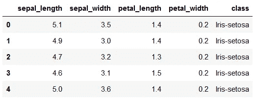
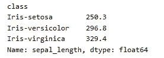
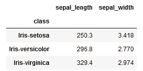
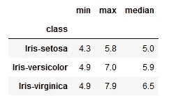
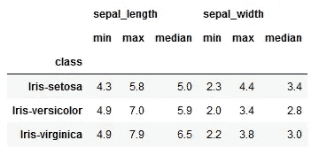
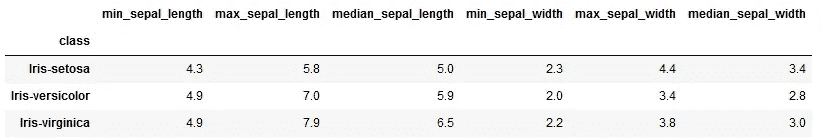
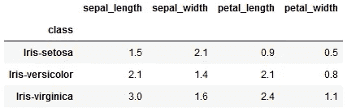
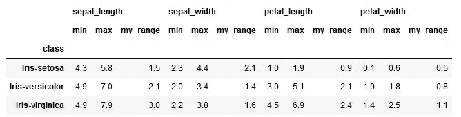
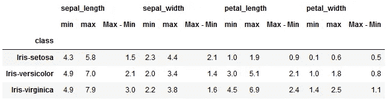

# 4 个历来最有用的 pandas groupby 技巧

> 原文：[`towardsdatascience.com/4-all-time-useful-use-cases-of-pandas-group-by-77aae706322b`](https://towardsdatascience.com/4-all-time-useful-use-cases-of-pandas-group-by-77aae706322b)

## 数据科学

## 一站式解决方案：解答你关于使用 pandas groupby 进行数据汇总的所有问题

[](https://medium.com/@17.rsuraj?source=post_page-----77aae706322b--------------------------------)[](https://towardsdatascience.com/?source=post_page-----77aae706322b--------------------------------) [Suraj Gurav](https://medium.com/@17.rsuraj?source=post_page-----77aae706322b--------------------------------)

·发表在 [Towards Data Science](https://towardsdatascience.com/?source=post_page-----77aae706322b--------------------------------) ·阅读时间 8 分钟·2023 年 3 月 24 日

--


图片由 [Hands off my tags! Michael Gaida](https://pixabay.com/users/652234-652234/?utm_source=link-attribution&amp%3Butm_medium=referral&amp%3Butm_campaign=image&amp%3Butm_content=1422182) 提供，来自 [Pixabay](https://pixabay.com//?utm_source=link-attribution&amp%3Butm_medium=referral&amp%3Butm_campaign=image&amp%3Butm_content=1422182)

在 Python 中，pandas 是一个常用的数据分析库。凭借其众多内置函数和方法，它使数据分析变得更快、更简单。

数据分析中最重要的方面之一是数据汇总，它帮助你按一个变量对数据进行分组，并将其余的数值数据汇总以获取摘要统计信息。最终，你可以使用这些摘要统计信息来回答业务问题。

这就是 pandas 函数 `**groupby()**` 的用途，它根据分类或非数值列的值对数据进行分组，并帮助你按这些新形成的组分析数据。

在我之前的一篇文章中 — **你应该知道的 5 个 pandas groupby 技巧**— 你可以了解什么是 `groupby` 以及如何使用它。

在本文中，我将解释 4 个非常有用且常被搜索的 pandas `groupby` 技巧，并附有示例，这是你进行数据分析时必须了解的。

本文末尾我还附上了一个包含所有示例的完整 Jupyter Notebook。

让我们开始吧！

在这篇文章中，我使用了 [UC Irvine Machine Learning Repository](https://archive-beta.ics.uci.edu/) 上最受欢迎的数据集 — [**Iris**](https://archive-beta.ics.uci.edu/dataset/53/iris) — 该数据集由 R.A. Fisher 创建，并在 [CC BY 4.0](https://creativecommons.org/licenses/by/4.0/legalcode) 许可证下提供。

让我们将数据集导入 pandas DataFrame — `**df**`

```py
import pandas as pd
df = pd.read_csv("iris.data",
                 header=None,
                 names=["sepal_length", "sepal_width",
                        "petal_length","petal_width","class"])
df.head()
```



Iris 数据集 | 作者图片

这是一个简单的 150 x 5 数据集，包含 3 种 Iris 植物的相关信息。

我们先从第一个用例开始，假设你已经探索了***如何使用*** `***groupby***`，如上文所述。

# 对不同列应用不同函数

在 Pandas `groupby` 中，你可以通过分类/非数值列对数据集中的所有行进行分组，并对其他所需的数值列应用函数以进行聚合。

例如，假设你想获取每个 Iris 植物类别的花萼长度。你可以简单地在`groupby`中传递列*class*，并对列*sepal_length*使用`sum()`函数，如下所示。

```py
df.groupby('class')['sepal_length'].sum()
```



简单的 pandas groupby | 作者图片

这非常简单。

> 但是如果你想获取每个类别的总花萼长度和平均花萼宽度呢？

这时，`**agg()**`函数就派上用场了，它用于对通过使用`pandas.DataFrame.groupby`获得的 pandas DataFrame `groupby` 对象应用聚合函数。

当然，你不需要多次使用`groupby()`，而是可以创建一个单独的 groupby 对象，将列及其聚合函数作为键值对传递给`agg()`函数。

让我们看看如何实现。

在这里，你想对其应用聚合函数的两列是 — *sepal_length* 和 *sepal_width* — 实际上你要对这些列应用的聚合函数是 `sum` 和 `mean`

因此，键值对，即字典，将如下所示

```py
dict1 = {'sepal_length':'sum', 'sepal_width':'mean'}
```

而 `groupby` 对象将被创建为：

```py
groupby_object = df.groupby(["class"])
```

然后你可以对这个 groupby 对象应用`agg()`函数，如下所示，

```py
groupby_object.agg(dict1)
```

以以下输出为例 —



对不同列应用多个函数 | 作者图片

好吧，你不需要将代码拆分成 3 行，我这样做只是为了简化问题。

通过将所有内容合并到以下单行代码中，你将得到完全相同的输出。

```py
df.groupby(["class"]).agg({'sepal_length':'sum', 'sepal_width':'mean'})
```

扩展相同的逻辑，你可以在同一列上应用多个函数，但方式略有不同。

# 对同一列应用多个函数

通常，你需要为同一列在类别间找到多个统计数据，例如计算最小值和最大值。为此，你可以将**函数列表**传递给`agg()`方法。

举个例子，假设你想获取每个 Iris 植物类别的花萼长度的最小值、最大值和中位数。

你要对这列应用的实际聚合函数是 `min`、`max` 和 `median`，这些必须作为列表传递，如下所示。

```py
df.groupby('class')['sepal_length'].agg(['min', 'max', 'median'])
```



在同一列上应用多个函数 | 图片来源：作者

按照相同的方法，你可以同时在多个列上应用多个函数。

例如，除了上述计算之外，你还可以获得 sepal width 的相同度量。

由于这是一个多列场景，你应该像在前一个方法中那样切换回**列名和函数名的键值对**。然而，这次你将传递函数名的列表，如下所示。

```py
df.groupby(["class"]).agg({'sepal_length':['min', 'max', 'median'],
                           'sepal_width':['min', 'max', 'median']})
```



在多列上应用多个函数 | 图片来源：作者

因此，你将得到一个易于理解的 DataFrame。

然而，它仍然有两行作为列标题，你可以通过简单地重命名聚合列来去掉它们。

# 自定义聚合列名称

你可以为列聚合使用你选择的名称，以便轻松识别返回的列聚合，并去掉列标题中的第二行。

你需要做的就是创建**列名和聚合函数的元组**，并将这个元组分配给列名。

继续上述示例，你希望在列 *sepal_length* 上应用函数 `‘min’`，因此元组将是 `(‘sepal_length’, ‘min’)`，你将把这个元组分配给名为 *min_sepal_length* 的列，如下所示。

```py
min_sepal_length = ('sepal_length','min')
```

同样，你可以为所有列聚合创建元组，并将它们分配给自定义名称。

```py
min_sepal_length = ('sepal_length','min')
max_sepal_length = ('sepal_length','max')
median_sepal_length = ('sepal_length','median')

min_sepal_width = ('sepal_width','min')
max_sepal_width = ('sepal_width','max')
median_sepal_width = ('sepal_width','median')
```

最后，将它们用逗号分隔传递给 `agg()` 函数，如下所示。

```py
df.groupby(["class"]).agg(min_sepal_length = ('sepal_length','min'),
                          max_sepal_length = ('sepal_length','max'),
                          median_sepal_length = ('sepal_length','median'),
                          min_sepal_width = ('sepal_width','min'),
                          max_sepal_width = ('sepal_width','max'),
                          median_sepal_width = ('sepal_width','median'))
```



在 Pandas 聚合函数中命名返回的列 | 图片来源：作者

快速解决！

现在，这看起来简化了很多，易于阅读。

到目前为止，你仅在一个或多个列上应用了标准或内置函数。然而，有时你需要应用一个用户定义的函数，使用聚合函数你可以轻松做到这一点。

# 应用自定义或用户定义的函数

通常，pandas 中内置的聚合函数不能满足你的需求，你需要为分析定义自己的自定义函数。

现在，你可以使用 `agg` 方法将这些用户定义或自定义函数应用于分组数据。

例如，假设你定义了一个自定义函数来计算列的范围，如下所示。

```py
def my_range(x):
    return x.max() - x.min()
```

现在你希望计算鸢尾花的 sepal length、sepal width、petal length 和 petal width 的范围，并按其类别进行区分。

再次这是多列场景，因此你必须使用**键值对**，其中**键是列名**，**值是用户定义函数的名称**，如下所示。

```py
df.groupby(["class"]).agg({'sepal_length':my_range,
                           'sepal_width':my_range,
                           'petal_length':my_range,
                           'petal_width':my_range})
```

这将快速给出如下输出 —



在多列上应用用户定义的函数 | 图片来源：作者

然而，对于上述 DataFrame 的查看者来说，理解这些数字使用了哪种聚合函数将会比较困难。

因此，添加更多上下文是有意义的，可以通过添加每列的最大值和最小值来实现。

有趣的是，你还可以将自定义函数与内置函数结合使用，并将它们应用于`agg()`函数中的多个列。

让我们再看一个例子。

假设你想计算数据集中所有数值列的最小值、最大值和自定义函数。

现在这是**多列——多函数**的情况，这意味着你仍然会使用键值对，但将函数列表作为值，如下所示。

```py
df.groupby(["class"]).agg({'sepal_length':['min', 'max', my_range],
                           'sepal_width':['min', 'max', my_range],
                           'petal_length':['min', 'max', my_range],
                           'petal_width':['min', 'max', my_range]})
```

以快速输出为例 —



在多个列上应用多个函数 | 作者提供的图片

有趣，对吧？

但仍然很难说`my_range`函数的内容以及在该函数中发生了什么计算。

给这个函数一个有意义的名称，然后再次使用该函数进行聚合更为合理。

你可以使用下面的代码轻松为函数指定名称。

```py
my_range.__name__ = 'Max - Min'
```

然后在所有需要的列上重新应用`my_range`函数，如下所示，

```py
df.groupby(["class"]).agg({'sepal_length':['min', 'max', my_range],
                           'sepal_width':['min', 'max', my_range],
                           'petal_length':['min', 'max', my_range],
                           'petal_width':['min', 'max', my_range]})
```



pandas groupby agg 自定义函数 多列 | 作者提供的图片

现在，这个输出看起来更有用，因为它准确地告诉你对每列进行了什么类型的计算。

这就是关于使用 pandas `groupby`的数据聚合！ 🏆

我希望你觉得这篇文章有用，并将其保存为 pandas `.groupby()`用例的**一站式解决方案**。

了解关于使用 pandas `.groupby()`的数据聚合的这些灵活特性无疑可以提升你的生产力。它还帮助你以更好和易于理解的方式汇总和表示数据。

> *对阅读更多 Medium 上的故事感兴趣吗？*

💡 考虑 [**成为 Medium 会员**](https://medium.com/@17.rsuraj/membership) 以**无限访问**Medium 上的故事和每日有趣的 Medium 摘要。我将从你的费用中获得一小部分，并且你无需额外付费。

💡 确保 [**注册我的邮件列表**](https://medium.com/subscribe/@17.rsuraj) 以免错过有关数据科学指南、技巧和窍门、SQL 和 Python 的其他文章。

💡 这是一个完整的 [**Notebook**](https://github.com/17rsuraj/data-curious/blob/master/TowardsDataScience/4_Use_cases_Pandas_Group_By.ipynb) 包含所有示例。

**感谢阅读！**
