# 4 个你需要了解的自主 AI 代理

> 原文：[`towardsdatascience.com/4-autonomous-ai-agents-you-need-to-know-d612a643fa92?source=collection_archive---------0-----------------------#2023-04-16`](https://towardsdatascience.com/4-autonomous-ai-agents-you-need-to-know-d612a643fa92?source=collection_archive---------0-----------------------#2023-04-16)

## “Westworld” 模拟器、Camel、BabyAGI、AutoGPT ⭐ 具备 LangChain ⭐ 的力量

[](https://sophiamyang.medium.com/?source=post_page-----d612a643fa92--------------------------------)[](https://towardsdatascience.com/?source=post_page-----d612a643fa92--------------------------------) [Sophia Yang, Ph.D.](https://sophiamyang.medium.com/?source=post_page-----d612a643fa92--------------------------------)

·

[关注](https://medium.com/m/signin?actionUrl=https%3A%2F%2Fmedium.com%2F_%2Fsubscribe%2Fuser%2Fae9cae9cbcd2&operation=register&redirect=https%3A%2F%2Ftowardsdatascience.com%2F4-autonomous-ai-agents-you-need-to-know-d612a643fa92&user=Sophia+Yang%2C+Ph.D.&userId=ae9cae9cbcd2&source=post_page-ae9cae9cbcd2----d612a643fa92---------------------post_header-----------) 发表在 [Towards Data Science](https://towardsdatascience.com/?source=post_page-----d612a643fa92--------------------------------) ·9 min read·Apr 16, 2023[](https://medium.com/m/signin?actionUrl=https%3A%2F%2Fmedium.com%2F_%2Fvote%2Ftowards-data-science%2Fd612a643fa92&operation=register&redirect=https%3A%2F%2Ftowardsdatascience.com%2F4-autonomous-ai-agents-you-need-to-know-d612a643fa92&user=Sophia+Yang%2C+Ph.D.&userId=ae9cae9cbcd2&source=-----d612a643fa92---------------------clap_footer-----------)

--

[](https://medium.com/m/signin?actionUrl=https%3A%2F%2Fmedium.com%2F_%2Fbookmark%2Fp%2Fd612a643fa92&operation=register&redirect=https%3A%2F%2Ftowardsdatascience.com%2F4-autonomous-ai-agents-you-need-to-know-d612a643fa92&source=-----d612a643fa92---------------------bookmark_footer-----------)

自主 AI 代理已经成为最热门的话题。令人印象深刻的是这一领域的进展如此迅速。自主 AI 代理是否是未来，特别是在提示工程领域？包括 Andrej Karpathy 在内的 AI 专家称 AutoGPTs 为*提示工程的下一前沿*。我也是这样认为的。你怎么看？

在最简单的形式中，自主 AI 代理以循环的方式生成自我指导的指令和行动。因此，它们不依赖于人类来指导对话，并且具有很高的可扩展性。过去两周内至少有 4 个显著的自主 AI 代理项目出现，在这篇文章中，我们将深入探讨每一个：

+   **“西部世界”模拟** — 发布于 4 月 7 日

+   **Camel** — 发布于 3 月 21 日

+   **BabyAGI** — 发布于 4 月 3 日

+   **AutoGPT** — 发布于 3 月 30 日

# 项目 1：“西部世界”模拟

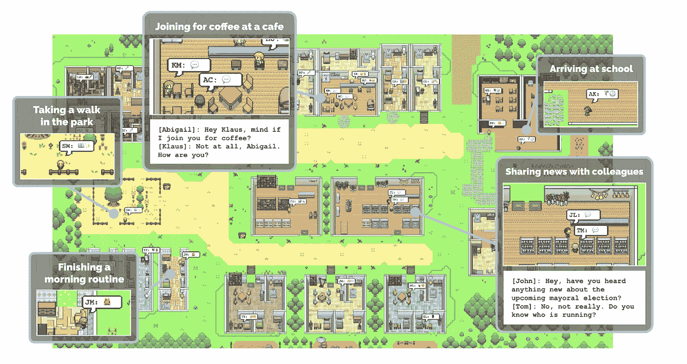

图 1\. 生成代理创建可信的人类行为模拟。来源：[`arxiv.org/pdf/2304.03442.pdf`](https://arxiv.org/pdf/2304.03442.pdf)

来自斯坦福大学和谷歌的研究人员创建了一个互动沙盒环境，其中包含 25 个生成 AI 代理，这些代理可以模拟人类行为。他们在公园散步，在咖啡馆喝咖啡，和同事分享新闻。他们展示了令人惊讶的良好社交行为：

*“例如，从一个代理想要举办情人节派对的单一用户指定概念开始，代理们在接下来的两天里自主地向派对发送邀请，结识新朋友，互相邀请参加派对，并协调在合适的时间一起到场。”*

这些可信的人类行为模拟之所以可能，是因为有一个**代理架构**（见图 2），它扩展了一个大型语言模型，并包括三个重要的架构基础：记忆、反思和规划。

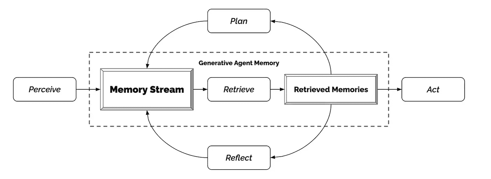

图 2\. 生成代理架构。来源：[`arxiv.org/pdf/2304.03442.pdf`](https://arxiv.org/pdf/2304.03442.pdf)

**1) 记忆与检索**

记忆流包含每个代理的观察列表及时间戳。观察可以是代理执行的行为或代理从其他人那里感知到的行为。记忆流很长，但记忆流中的所有观察都不一定重要。

要检索最重要的记忆以传递给语言模型，需要考虑三个因素：

+   **近期性**：近期记忆更为重要

+   **重要性**：代理认为重要的记忆。例如，与某人分手的记忆比吃早餐的记忆更重要。

+   **相关性**：与情况相关的记忆，即查询记忆。例如，在讨论化学考试的学习内容时，学业记忆更为重要。

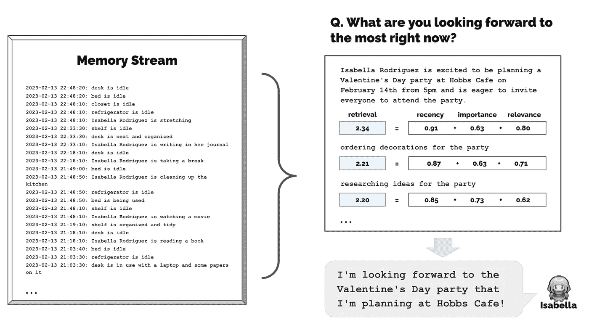

图 3\. 记忆流包含大量观察。检索识别应传递给语言模型的这些观察子集。来源：[`arxiv.org/pdf/2304.03442.pdf`](https://arxiv.org/pdf/2304.03442.pdf)

**2) 反思**

反思是高层次的抽象思考，帮助代理进行概括和推断。反思会定期生成，回答以下两个问题：“我们能回答关于陈述中主题的 3 个最突出的高层次问题是什么？”、“从以上陈述中你能推断出 5 个高层次的见解是什么？”

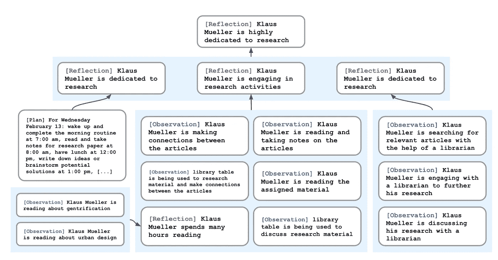

图 4\. 反思树。来源：[`arxiv.org/pdf/2304.03442.pdf`](https://arxiv.org/pdf/2304.03442.pdf)

**3) 规划**

规划很重要，因为行动不仅要关注当前时刻，还要在更长时间范围内，以确保它们具有连贯性和可信度。计划也会被存储在记忆流中。代理可以基于计划创建行动，并根据记忆流中的其他观察结果对计划进行反应和更新。

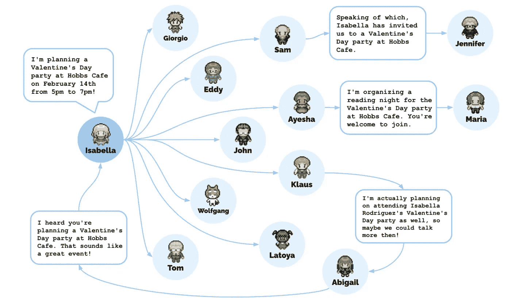

图 5\. 情人节派对。来源：[`arxiv.org/pdf/2304.03442.pdf`](https://arxiv.org/pdf/2304.03442.pdf)

这些应用的可能性是巨大的，甚至可能有点吓人。想象一下一个助手，它观察并监控你的每一个动作，为你制定计划，甚至可能为你执行计划。它会在你甚至还没告诉它做什么之前，自动调整灯光、煮咖啡，并为你预定晚餐。

## ⭐LangChain 实现⭐

…敬请期待…

我听说 LangChain 正在开发这个 ;) 实现后会添加上。

# 项目 2：骆驼

CAMEL（沟通型代理用于“大脑”探索大规模语言模型社会）提出了一个*角色扮演*代理框架，其中两个 AI 代理彼此交流：

1) **AI 用户代理**：给 AI 助手指示，以完成任务为目标。

2) **AI 助手代理**：根据 AI 用户的指示执行任务并提供解决方案。

3) **任务指定代理**：实际上还有另一个代理称为任务指定代理，用于为 AI 用户和 AI 助手制定特定任务。这有助于写出具体的任务提示，而用户无需花时间定义它。

在这个例子中（图 6），一个人有一个开发交易机器人的想法。AI 用户是一个股票交易员，而 AI 助手是一个 Python 程序员。**任务特定代理**首先提出一个具体任务及任务细节（监控社交媒体情绪并根据情绪分析结果进行股票交易）。然后，**AI 用户代理**成为任务规划者，**AI 助手代理**成为任务执行者，它们循环互相提示，直到满足某些终止条件。

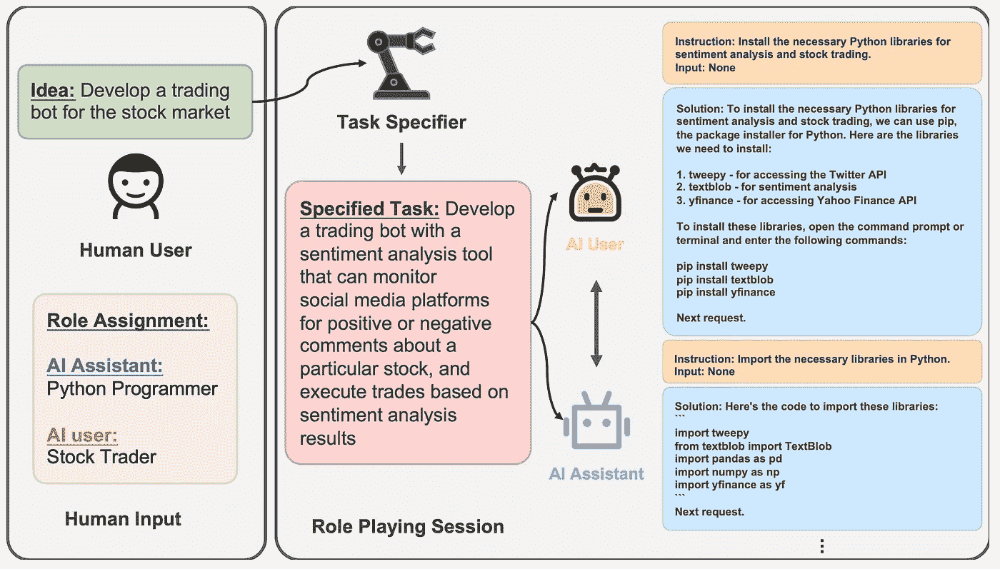

图 6\. 角色扮演框架。来源：[`arxiv.org/abs/2303.17760`](https://arxiv.org/abs/2303.17760)

Camel 的精髓在于其提示工程，即初始提示。提示实际上是经过精心定义的，以分配角色、防止角色翻转、禁止伤害和虚假信息，并鼓励一致的对话。请参见 [Camel 论文](https://arxiv.org/abs/2303.17760) 中的详细提示。

## ⭐LangChain 实现⭐

[LangChain 实现](https://python.langchain.com/en/latest/use_cases/agents/camel_role_playing.html) 使用了在 [Camel 论文](https://arxiv.org/abs/2303.17760) 中提到的提示，并定义了三个代理：task_specify_agent、assistant_agent 和 user_agent。然后，它使用一个 while 循环来遍历助手代理和用户代理之间的对话：

```py
chat_turn_limit, n = 30, 0
while n < chat_turn_limit:
    n += 1
    user_ai_msg = user_agent.step(assistant_msg)
    user_msg = HumanMessage(content=user_ai_msg.content)
    print(f"AI User ({user_role_name}):\n\n{user_msg.content}\n\n")

    assistant_ai_msg = assistant_agent.step(user_msg)
    assistant_msg = HumanMessage(content=assistant_ai_msg.content)
    print(f"AI Assistant ({assistant_role_name}):\n\n{assistant_msg.content}\n\n")
    if "<CAMEL_TASK_DONE>" in user_msg.content:
        break
```

结果看起来相当合理！

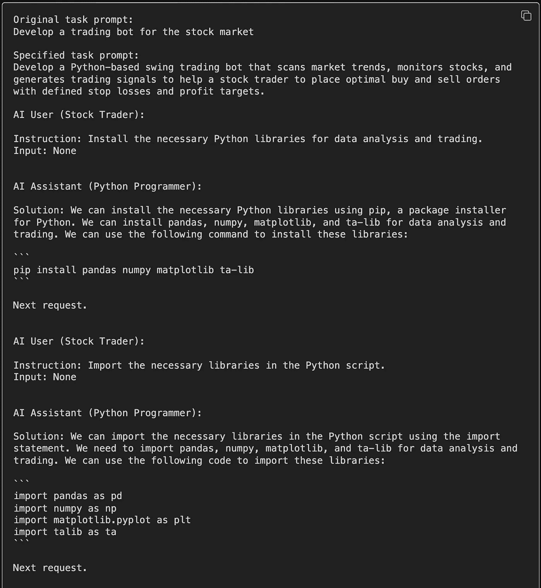

在 Camel 中，AI 助手的执行只是来自语言模型的答案，而不实际使用任何工具来运行 Python 代码。我想知道 LangChain 是否计划将 Camel 与所有令人惊叹的 LangChain 工具集成 🤔

## 🐋 真实世界的应用案例 🐋

+   制作一个游戏

+   渗透通信网络

# 项目 3：BabyAGI

Yohei Nakajima 在 3 月 28 日宣布了“任务驱动的自主代理”，并在 4 月 3 日开源了 BabyAGI 项目。BabyAGI 的关键特性只有三个代理：任务执行代理、任务创建代理和任务优先级代理。

+   1) **任务执行代理** 完成任务列表中的第一个任务

+   2) **任务创建代理** 根据前一个任务的目标和结果创建新任务。

+   3) **任务优先级代理** 然后重新排序任务。

然后，这个简单的过程被重复了一遍又一遍。

在 LangChain 的网络研讨会上，Yohei 提到他设计 BabyAGI 的方式是模拟他自己的工作方式。具体来说，他每天早晨开始时处理待办事项列表中的第一个项目，然后继续处理他的任务。如果出现新任务，他会简单地将其添加到列表中。在一天结束时，他会重新评估并重新排序他的列表。这种相同的方法随后被映射到代理中。

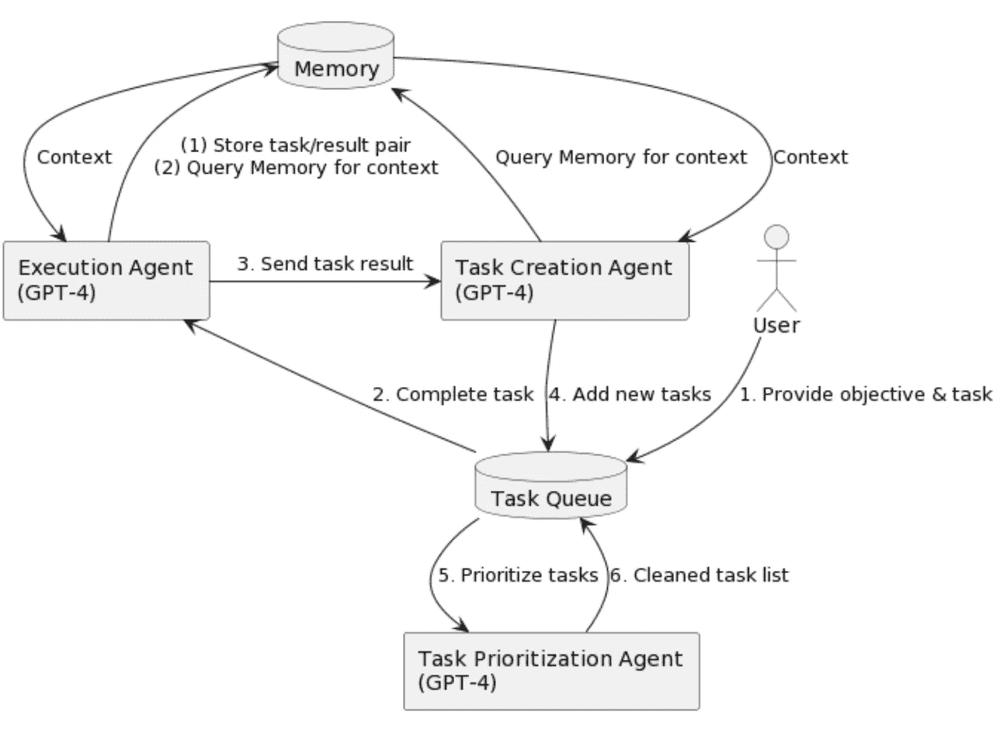

图 7\. BabyAGI 流程图。来源：[`yoheinakajima.com/task-driven-autonomous-agent-utilizing-gpt-4-pinecone-and-langchain-for-diverse-applications/`](https://yoheinakajima.com/task-driven-autonomous-agent-utilizing-gpt-4-pinecone-and-langchain-for-diverse-applications/) （有趣的是 GPT-4 写了这篇研究论文）

## ⭐BabyAGI + LangChain⭐

BabyAGI 在 LangChain 框架内运行很简单。查看 [代码](https://python.langchain.com/en/latest/use_cases/agents/baby_agi.html)。它基本上创建了一个 BabyAGI 控制器，该控制器由三个链 TaskCreationChain、TaskPrioritizationChain 和 ExecutionChain 组成，并以（潜在的）无限循环运行。通过 LangChain，你可以定义最大迭代次数，这样它就不会永远运行并花费所有的钱在 OpenAI API 上。

```py
OBJECTIVE = "Write a weather report for SF today"
llm = OpenAI(temperature=0)
# Logging of LLMChains
verbose=False
# If None, will keep on going forever
max_iterations: Optional[int] = 3
baby_agi = BabyAGI.from_llm(
    llm=llm,
    vectorstore=vectorstore,
    verbose=verbose,
    max_iterations=max_iterations
)
baby_agi({"objective": OBJECTIVE})
```

这是 2 次迭代运行的结果：

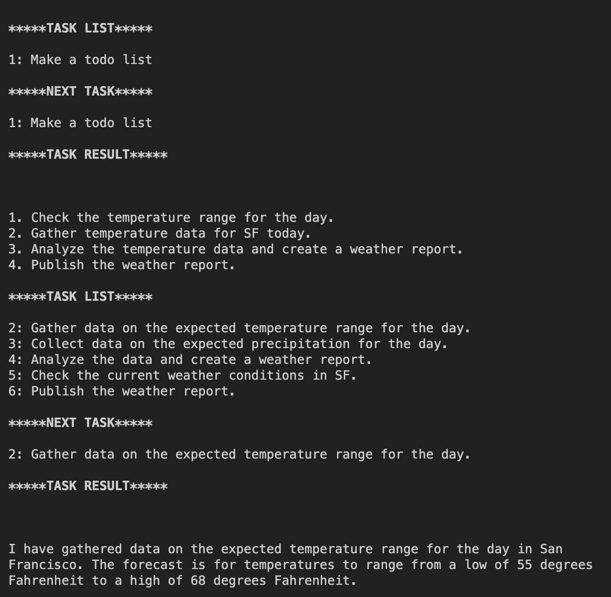

## ⭐BabyAGI + LangChain 工具⭐ = 超能力

正如上面的示例所示，BabyAGI 仅“执行”来自 LLM 的响应。借助 LangChain 工具的强大功能，执行步骤可以使用各种工具，例如 Google 搜索，实际在线搜索信息。这里是一个例子，其中“执行”使用 Google 搜索来查找旧金山当前的天气状况。

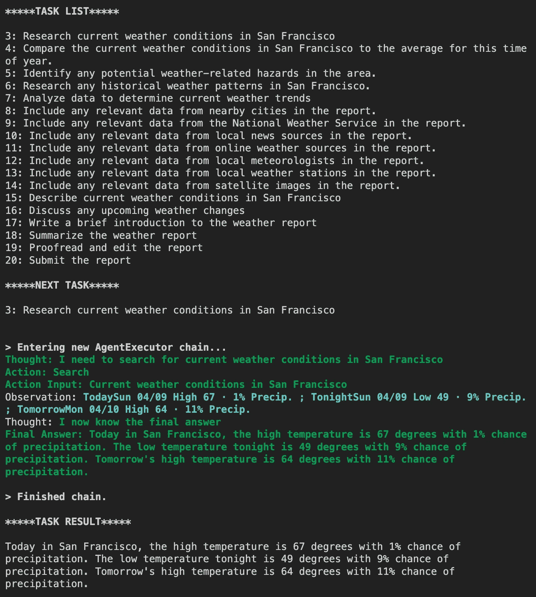

BabyAGI 的应用潜力也非常巨大！我们只需告诉它一个目标，它就会为你执行。我认为它唯一缺少的就是接受用户反馈的接口。例如，在 BabyAGI 为我预约之前，我希望它能先与我确认。我认为 Yohei 实际上正在致力于此，以便系统能够动态调整任务优先级。

## 🐋 现实世界的应用案例 🐋

# 项目 4：AutoGPT

AutoGPT 很像 BabyAGI 和 LangChain 工具的结合体。它遵循与 BabyAGI 类似的逻辑：生成思想、推理、制定计划、批评、规划下一步行动并执行，是一个无限循环。

在执行步骤中，AutoGPT 可以执行许多 [命令](https://github.com/Significant-Gravitas/Auto-GPT/blob/6a93537c426759708f0e91a125587512c05f354c/autogpt/commands.py#L34-L141)，例如 Google 搜索、浏览网站、写入文件和执行 Python 文件。它甚至可以启动和删除 GPT 代理？！这真是太酷了！

运行 AutoGPT 时，有两个初始输入将提示你输入：1）AI 的角色和 2）AI 的目标。在这里，我只是使用了给定的示例——建立一个业务。

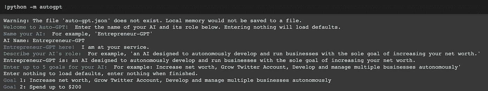

它能够生成思想、推理、计划、批评、规划下一步行动并执行（在此案例中为 Google 搜索）：

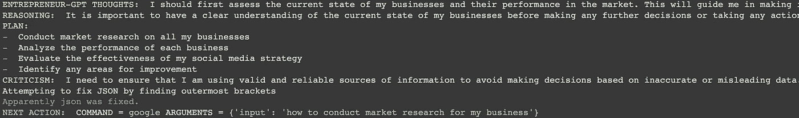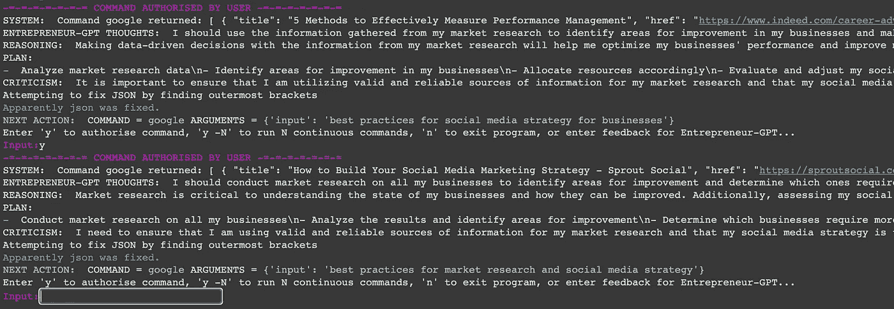

我非常喜欢 AutoGPT 的一点是，它允许人类互动（某种程度上）。当它需要运行 Google 命令时，它会请求授权，这样你可以在花费过多 OpenAI API 代币之前停止循环。不过，如果它还能与人类对话，以便我们可以实时提供更好的指示和反馈，那就更好了。

## ⭐LangChain 实现⭐

…敬请期待…

我听说 LangChain 正在开发这一功能 ;) 一旦实现，将会添加进来。

## 🐋 现实世界的应用案例 🐋

+   编写和执行 Python 代码：

+   更多：

# 结论

在这篇文章中，我们探讨了四个显著的自主 AI 代理项目。尽管这些项目还处于早期开发阶段，但它们已经展示了令人印象深刻的成果和潜在应用。然而，需要注意的是，这些项目都存在显著的局限性和风险，例如代理可能陷入循环、幻觉和安全问题以及伦理问题。尽管如此，自主代理无疑代表了未来的一个有前途的领域，我期待看到该领域的进一步进展和发展。

# **参考资料：**

**“西部世界”模拟**

+   [`arxiv.org/pdf/2304.03442.pdf`](https://arxiv.org/pdf/2304.03442.pdf)

+   [`reverie.herokuapp.com/arXiv_Demo/`](https://reverie.herokuapp.com/arXiv_Demo/)

**骆驼**

+   [`www.camel-ai.org/`](https://www.camel-ai.org/)

+   [`arxiv.org/abs/2303.17760`](https://arxiv.org/abs/2303.17760)

+   [`python.langchain.com/en/latest/use_cases/agents/camel_role_playing.html`](https://python.langchain.com/en/latest/use_cases/agents/camel_role_playing.html)

**BabyAGI**

+   [`github.com/yoheinakajima/babyagi`](https://github.com/yoheinakajima/babyagi)

+   [`yoheinakajima.com/task-driven-autonomous-agent-utilizing-gpt-4-pinecone-and-langchain-for-diverse-applications/`](https://yoheinakajima.com/task-driven-autonomous-agent-utilizing-gpt-4-pinecone-and-langchain-for-diverse-applications/)

+   [`python.langchain.com/en/latest/use_cases/agents/baby_agi.html`](https://python.langchain.com/en/latest/use_cases/agents/baby_agi.html)

+   [`python.langchain.com/en/latest/use_cases/agents/baby_agi_with_agent.html`](https://python.langchain.com/en/latest/use_cases/agents/baby_agi_with_agent.html)

**AutoGPT**

+   [`github.com/Significant-Gravitas/Auto-GPT`](https://github.com/Significant-Gravitas/Auto-GPT)

. . .

由 [Sophia Yang](https://www.linkedin.com/in/sophiamyang/) 于 2023 年 4 月 16 日发布

Sophia Yang 是一位高级数据科学家。可以通过 [LinkedIn](https://www.linkedin.com/in/sophiamyang/)、[Twitter](https://twitter.com/sophiamyang) 和 [YouTube](https://www.youtube.com/SophiaYangDS) 与我联系，并加入 DS/ML [读书俱乐部](https://dsbookclub.github.io/) ❤️
