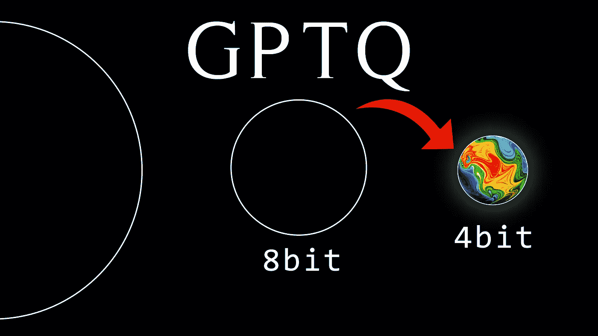
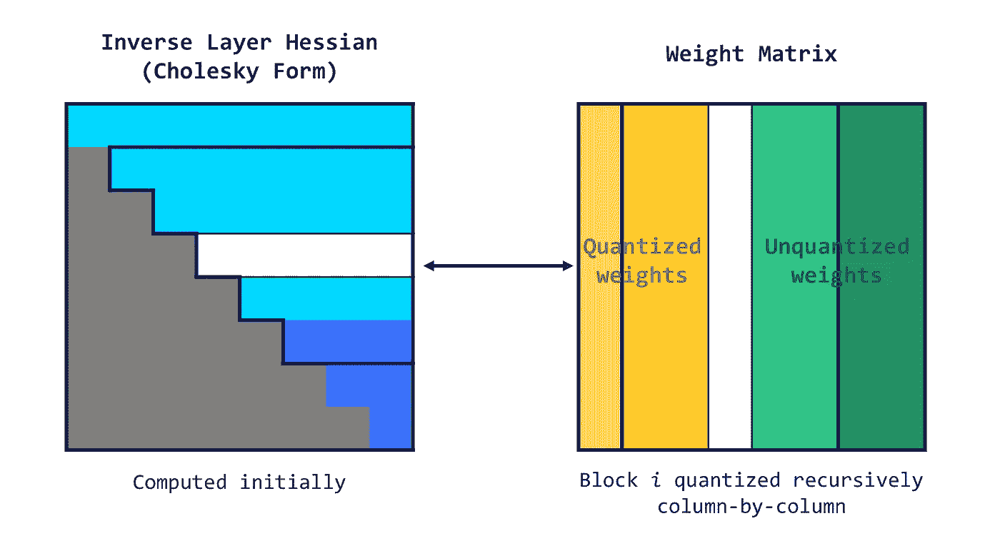
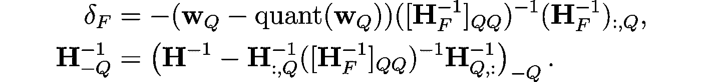

# 4 位量化与 GPTQ

> 原文：[`towardsdatascience.com/4-bit-quantization-with-gptq-36b0f4f02c34?source=collection_archive---------0-----------------------#2023-07-31`](https://towardsdatascience.com/4-bit-quantization-with-gptq-36b0f4f02c34?source=collection_archive---------0-----------------------#2023-07-31)

## 使用 AutoGPTQ 量化你自己的 LLM

[](https://medium.com/@mlabonne?source=post_page-----36b0f4f02c34--------------------------------)[](https://towardsdatascience.com/?source=post_page-----36b0f4f02c34--------------------------------) [Maxime Labonne](https://medium.com/@mlabonne?source=post_page-----36b0f4f02c34--------------------------------)

·

[关注](https://medium.com/m/signin?actionUrl=https%3A%2F%2Fmedium.com%2F_%2Fsubscribe%2Fuser%2Fdc89da634938&operation=register&redirect=https%3A%2F%2Ftowardsdatascience.com%2F4-bit-quantization-with-gptq-36b0f4f02c34&user=Maxime+Labonne&userId=dc89da634938&source=post_page-dc89da634938----36b0f4f02c34---------------------post_header-----------) 发表在[Towards Data Science](https://towardsdatascience.com/?source=post_page-----36b0f4f02c34--------------------------------) · 10 分钟阅读 · 2023 年 7 月 31 日[](https://medium.com/m/signin?actionUrl=https%3A%2F%2Fmedium.com%2F_%2Fvote%2Ftowards-data-science%2F36b0f4f02c34&operation=register&redirect=https%3A%2F%2Ftowardsdatascience.com%2F4-bit-quantization-with-gptq-36b0f4f02c34&user=Maxime+Labonne&userId=dc89da634938&source=-----36b0f4f02c34---------------------clap_footer-----------)

--

[](https://medium.com/m/signin?actionUrl=https%3A%2F%2Fmedium.com%2F_%2Fbookmark%2Fp%2F36b0f4f02c34&operation=register&redirect=https%3A%2F%2Ftowardsdatascience.com%2F4-bit-quantization-with-gptq-36b0f4f02c34&source=-----36b0f4f02c34---------------------bookmark_footer-----------)

图片由作者提供

最近的权重量化进展使我们能够在消费者硬件上运行大规模语言模型，例如在 RTX 3090 GPU 上运行 LLaMA-30B 模型。这得益于新颖的 4 位量化技术，性能降级最小，如[GPTQ](https://arxiv.org/abs/2210.17323)、[GGML](https://github.com/ggerganov/ggml)和[NF4](https://huggingface.co/blog/4bit-transformers-bitsandbytes)。

在[上一篇文章](https://medium.com/towards-data-science/introduction-to-weight-quantization-2494701b9c0c)中，我们介绍了朴素的 8 位量化技术和优秀的 LLM.int8()。在本文中，我们将深入探讨流行的**GPTQ 算法**，了解其工作原理，并使用[AutoGPTQ](https://github.com/PanQiWei/AutoGPTQ)库进行实现。

你可以在 [Google Colab](https://colab.research.google.com/drive/1lSvVDaRgqQp_mWK_jC9gydz6_-y6Aq4A?usp=sharing) 和 [GitHub](https://github.com/mlabonne/llm-course/tree/main) 上找到代码。

# 🧠 最优脑量化

首先介绍我们要解决的问题。对于网络中的每一层 ℓ，我们希望找到原始权重 **Wₗ** 的量化版本 **Ŵₗ**。这称为 **逐层压缩问题**。更具体地，为了最小化性能降级，我们希望这些新权重的输出 (**Ŵ**ᵨ**X**ᵨ) 尽可能接近原始权重的输出 (**W**ᵨ**X**ᵨ)。换句话说，我们希望找到：


已提出了不同的方法来解决这个问题，但我们在这里关注的是 [**最优脑量化器**](https://arxiv.org/abs/2208.11580)（OBQ）框架。

该方法的灵感来源于一种 **剪枝技术**，用于从完全训练的密集神经网络中小心地去除权重（最优脑外科医生）。它使用了一种近似技术，并提供了最佳单个权重 *w𐞥* 的显式公式以去除，并通过最佳更新 *δ*ꟳ 来调整剩余未量化权重 *F*，以弥补去除的影响：


其中 quant(*w*) 是由量化给出的权重舍入，**H**ꟳ 是 Hessian。

使用 OBQ，我们可以先量化最简单的权重，然后调整所有剩余的未量化权重以 **补偿这种精度损失**。然后我们选择下一个要量化的权重，依此类推。

这种方法的一个潜在问题是，当存在异常权重时，可能导致高 **量化误差**。通常，这些异常值会在量化最后处理，当剩下的未量化权重较少时，可以调整以弥补大误差。当一些权重通过中间更新被推到网格之外时，这种效应可能会加剧。一个简单的启发式方法是尽快量化出现的异常值。

这个过程可能计算量很大，特别是对于 LLM。为了解决这个问题，OBQ 方法使用了一种技巧，避免了每次简化权重时重新进行整个计算。量化一个权重后，它通过 **去除与该权重相关的行和列**（使用高斯消元法）来调整计算中使用的矩阵（Hessian）：


该方法还采用了向量化处理一次处理多个权重矩阵的行。尽管效率很高，但随着权重矩阵大小的增加，OBQ 的计算时间显著增加。这种立方增长使得在具有数十亿参数的大型模型上使用 OBQ 变得困难。

# 🧮 GPTQ 算法

由 Frantar 等人（2023 年）提出的[GPTQ 算法](https://arxiv.org/abs/2210.17323)从 OBQ 方法中获得灵感，但对其进行了重大改进，以使其适用于（非常）大的语言模型。

## 第一步：任意顺序洞察

OBQ 方法按一定顺序选择要量化的权重（模型中的参数），该顺序由**增加最少额外误差**的权重决定。然而，GPTQ 观察到，对于大型模型，按任何固定顺序量化权重的效果都一样。这是因为即使某些权重可能单独引入更多误差，它们会在处理过程中较晚的阶段进行量化，此时可能没有其他权重可以增加误差。因此，顺序并不像我们想象的那样重要。

基于这一洞察，GPTQ 旨在对矩阵的**所有行使用相同的顺序量化所有权重**。这使得过程更快，因为某些计算只需要对每一列进行一次，而不是对每个权重进行一次。



图片由作者提供

## 第二步：懒惰批量更新

这个方案不会很快，因为它需要更新一个**巨大的矩阵**，每个条目的计算量非常少。这种操作无法利用 GPU 的全部计算能力，并且会受到内存限制（内存吞吐瓶颈）的影响。

为了解决这一问题，GPTQ 引入了“懒惰批量”更新。结果发现，给定列的最终舍入决策只受该列上的更新影响，而不受后续列的影响。因此，GPTQ 可以将算法应用于**一次处理一批列**（如 128 列），仅更新这些列及矩阵中的相应块。一个块完全处理后，算法对整个矩阵进行全局更新。



## 第三步：Cholesky 重构

不过，还有一个问题需要解决。当算法扩展到非常大的模型时，数值不准确可能成为问题。具体来说，某些操作的重复应用可能会**积累数值误差**。

为了解决这个问题，GPTQ 使用了[Cholesky 分解](https://en.wikipedia.org/wiki/Cholesky_decomposition)，这是一种数值稳定的数学问题解决方法。它涉及使用 Cholesky 方法从矩阵中预计算一些所需的信息。这种方法，加上轻微的“减震”（向矩阵对角线元素中添加一个小常数），有助于算法避免数值问题。

完整算法可以总结为几个步骤：

1.  GPTQ 算法以 Hessian 逆矩阵的 Cholesky 分解开始（该矩阵有助于决定如何调整权重）。

1.  然后它以循环的方式运行，每次处理一批列。

1.  对于每个批次中的每一列，它对权重进行量化，计算误差，并相应地更新块中的权重。

1.  处理批次后，它会根据块的错误更新所有剩余的权重。

GPTQ 算法在各种语言生成任务中进行了测试。它与其他量化方法进行了比较，比如将所有权重舍入到最近的量化值（RTN）。GPTQ 与 BLOOM（176B 参数）和 OPT（175B 参数）模型系列一起使用，并且模型是使用**单个 NVIDIA A100 GPU**进行量化的。

# 💻 使用 AutoGPTQ 对 LLM 进行量化

GPTQ 在创建可以高效运行于 GPU 上的 4 位精度模型方面非常受欢迎。你可以在 Hugging Face Hub 上找到许多示例，特别是来自[TheBloke](https://huggingface.co/TheBloke)。如果你在寻找更适合 CPU 的方案，[GGML](https://github.com/ggerganov/ggml)目前是你的最佳选择。最后，`transformers`库与`bitsandbytes`允许你在加载模型时通过`load_in_4bit=true`参数进行量化，这需要下载完整的模型并将其存储在你的 RAM 中。

让我们使用 AutoGPTQ 库实现 GPTQ 算法，并对 GPT-2 模型进行量化。这需要一个 GPU，但 Google Colab 上的免费 T4 就足够了。我们从加载库和定义要量化的模型（在这种情况下是 GPT-2）开始。

```py
!BUILD_CUDA_EXT=0 pip install -q auto-gptq transformers
```

```py
import random

from auto_gptq import AutoGPTQForCausalLM, BaseQuantizeConfig
from datasets import load_dataset
import torch
from transformers import AutoTokenizer

# Define base model and output directory
model_id = "gpt2"
out_dir = model_id + "-GPTQ"
```

我们现在要加载模型和分词器。分词器使用`transformers`库中的经典`AutoTokenizer`类加载。另一方面，我们需要传递一个特定的配置（`BaseQuantizeConfig`）来加载模型。

在此配置中，我们可以指定要量化的位数（这里是`bits=4`）和组大小（懒批次的大小）。请注意，这个组大小是可选的：我们也可以为整个权重矩阵使用**一组参数**。实际上，这些组通常能以非常低的成本提高量化的质量（特别是使用`group_size=1024`时）。`damp_percent`值用于帮助 Cholesky 重整化，不应更改。

最后，`desc_act`（也称为 act order）是一个棘手的参数。它允许你**根据递减的激活处理行**，意味着最重要或影响最大的行（由采样的输入和输出决定）首先处理。这种方法旨在将大部分量化误差（不可避免地在量化过程中引入）放在不太重要的权重上。通过确保最重要的权重以更高的精度处理，这种方法可以提高量化过程的整体准确性。然而，当与组大小一起使用时，`desc_act`可能会导致性能下降，因为需要频繁重新加载量化参数。因此，我们在这里不会使用它（不过它可能会在未来得到修复）。

```py
# Load quantize config, model and tokenizer
quantize_config = BaseQuantizeConfig(
    bits=4,
    group_size=128,
    damp_percent=0.01,
    desc_act=False,
)
model = AutoGPTQForCausalLM.from_pretrained(model_id, quantize_config)
tokenizer = AutoTokenizer.from_pretrained(model_id)
```

量化过程**严重依赖样本**来评估和提升量化质量。样本提供了一个比较原始模型和新量化模型输出的方法。提供的样本数量越多，比较的潜力就越大，从而提高量化质量。

在本文的背景下，我们使用了[**C4 (Colossal Clean Crawled Corpus) 数据集**](https://huggingface.co/datasets/c4)来生成样本。C4 数据集是一个大规模、多语言的网页文本集合，来自 Common Crawl 项目。这个庞大的数据集已经被清理和准备好，专门用于训练大规模语言模型，使其成为类似任务的极佳资源。WikiText 数据集是另一个受欢迎的选择。

在以下代码块中，我们从 C4 数据集中加载 1024 个样本，对其进行分词和格式化。

```py
# Load data and tokenize examples
n_samples = 1024
data = load_dataset("allenai/c4", data_files="en/c4-train.00001-of-01024.json.gz", split=f"train[:{n_samples*5}]")
tokenized_data = tokenizer("\n\n".join(data['text']), return_tensors='pt')

# Format tokenized examples
examples_ids = []
for _ in range(n_samples):
    i = random.randint(0, tokenized_data.input_ids.shape[1] - tokenizer.model_max_length - 1)
    j = i + tokenizer.model_max_length
    input_ids = tokenized_data.input_ids[:, i:j]
    attention_mask = torch.ones_like(input_ids)
    examples_ids.append({'input_ids': input_ids, 'attention_mask': attention_mask})
```

现在数据集已经准备好，我们可以开始量化过程，批量大小为 1。可选地，我们还使用了[OpenAI Triton](https://github.com/openai/triton)，这是 CUDA 的替代方案，用于与 GPU 进行通信。一旦完成，我们将分词器和模型保存为 safetensors 格式。

```py
# Quantize with GPTQ
model.quantize(
    examples_ids,
    batch_size=1,
    use_triton=True,
)

# Save model and tokenizer
model.save_quantized(out_dir, use_safetensors=True)
tokenizer.save_pretrained(out_dir)
```

像往常一样，模型和分词器可以从输出目录中加载，使用`AutoGPTQForCausalLM`和`AutoTokenizer`类。

```py
device = "cuda:0" if torch.cuda.is_available() else "cpu"

# Reload model and tokenizer
model = AutoGPTQForCausalLM.from_quantized(
    out_dir,
    device=device,
    use_triton=True,
    use_safetensors=True,
)
tokenizer = AutoTokenizer.from_pretrained(out_dir)
```

让我们检查模型是否正常工作。AutoGPTQ 模型（大多数情况下）作为一个普通的`transformers`模型工作，这使得它与推理管道兼容，如以下示例所示：

```py
from transformers import pipeline

generator = pipeline('text-generation', model=model, tokenizer=tokenizer)
result = generator("I have a dream", do_sample=True, max_length=50)[0]['generated_text']
print(result)
```

```py
I have a dream," she told CNN last week. "I have this dream of helping my mother find her own. But, to tell that for the first time, now that I'm seeing my mother now, just knowing how wonderful it is that
```

我们成功地从量化后的 GPT-2 模型中获得了令人信服的结果。更深入的评估将需要**测量量化模型与原始模型的困惑度**。不过，这超出了本文的范围。

# 结论

在本文中，我们介绍了 GPTQ 算法，这是一种最先进的量化技术，用于在消费者级硬件上运行 LLMs。我们展示了它如何解决基于改进的 OBS 技术的层级压缩问题，结合了任意顺序洞察、惰性批量更新和 Cholesky 重构。这种新颖的方法**显著减少了内存和计算需求**，使 LLMs 可以被更广泛的受众使用。

此外，我们在免费的 T4 GPU 上**量化了我们自己的 LLM 模型**并运行它以生成文本。你可以在 Hugging Face Hub 上发布你自己的 GPTQ 4-bit 量化模型。正如引言中提到的，GPTQ 并不是唯一的 4-bit 量化算法：[GGML](https://github.com/ggerganov/ggml)和[NF4](https://huggingface.co/blog/4bit-transformers-bitsandbytes)是具有稍微不同范围的优秀替代方案。我鼓励你了解更多，并尝试一下！

如果你对更多关于 LLMs 的技术内容感兴趣，可以在 Twitter 上关注我 [@maximelabonne](https://twitter.com/maximelabonne)。

# 参考文献

+   B. Hassibi, D. G. Stork 和 G. J. Wolff, [**“优化脑外科医生和通用网络修剪”**](https://ieeexplore.ieee.org/document/298572)，IEEE 国际神经网络大会，旧金山，美国，1993 年，页码 293–299，doi: 10.1109/ICNN.1993.298572。

+   Elias Frantar, Sidak Pal Singh 和 Dan Alistarh. (2023). [**优化脑压缩：准确的训练后量化和修剪框架**](https://arxiv.org/abs/2208.11580)。

+   Elias Frantar, Saleh Ashkboos, Torsten Hoefler 和 Dan Alistarh. (2023). [**GPTQ：生成预训练变换器的准确训练后量化**](https://arxiv.org/abs/2210.17323)。

+   Colin Raffel, Noam Shazeer, Adam Roberts, Katherine Lee, Sharan Narang, Michael Matena, Yanqi Zhou, Wei Li 和 Peter J. Liu. (2020). [**探索统一的文本到文本变换器的迁移学习极限**](https://arxiv.org/abs/1910.10683v3)。

# 相关文章

[](/introduction-to-weight-quantization-2494701b9c0c?source=post_page-----36b0f4f02c34--------------------------------) [## **权重量化简介**](https://towardsdatascience.com/introduction-to-weight-quantization-2494701b9c0c?source=post_page-----36b0f4f02c34--------------------------------)

### 使用 8 位量化减少大型语言模型的大小

towardsdatascience.com [](/fine-tune-your-own-llama-2-model-in-a-colab-notebook-df9823a04a32?source=post_page-----36b0f4f02c34--------------------------------) [## **在 Colab Notebook 中微调你的 Llama 2 模型**](https://towardsdatascience.com/fine-tune-your-own-llama-2-model-in-a-colab-notebook-df9823a04a32?source=post_page-----36b0f4f02c34--------------------------------)

### 关于 LLM 微调的实用介绍

towardsdatascience.com

*了解更多关于机器学习的内容，并通过一键支持我的工作 — 现在成为 Medium 会员：*

[](https://medium.com/@mlabonne/membership?source=post_page-----36b0f4f02c34--------------------------------) [## **通过我的推荐链接加入 Medium — Maxime Labonne**](https://medium.com/@mlabonne/membership?source=post_page-----36b0f4f02c34--------------------------------)

### 作为 Medium 会员，你的会员费用的一部分将会分配给你阅读的作者，并且你可以全面访问每个故事……

[medium.com](https://medium.com/@mlabonne/membership?source=post_page-----36b0f4f02c34--------------------------------)

*如果你已经是会员，你可以* [*在 Medium 上关注我*](https://medium.com/@mlabonne)*。*
