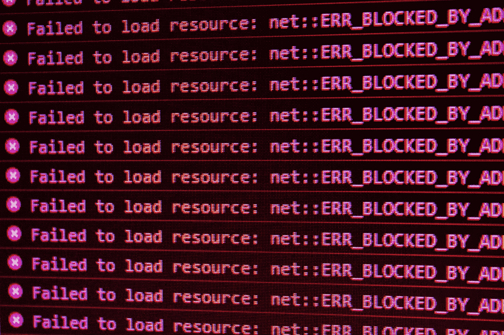

# 4 个初学者应避免的常见 Python 错误

> 原文：[`towardsdatascience.com/4-common-python-mistakes-you-should-avoid-as-a-beginner-bd28feb6162b?source=collection_archive---------2-----------------------#2023-01-13`](https://towardsdatascience.com/4-common-python-mistakes-you-should-avoid-as-a-beginner-bd28feb6162b?source=collection_archive---------2-----------------------#2023-01-13)

## 以及如何在不经意间破坏面试之前纠正自己。

 [Murtaza Ali](https://murtaza5152-ali.medium.com/?source=post_page-----bd28feb6162b--------------------------------)

·

[关注](https://medium.com/m/signin?actionUrl=https%3A%2F%2Fmedium.com%2F_%2Fsubscribe%2Fuser%2F607fa603b7ce&operation=register&redirect=https%3A%2F%2Ftowardsdatascience.com%2F4-common-python-mistakes-you-should-avoid-as-a-beginner-bd28feb6162b&user=Murtaza+Ali&userId=607fa603b7ce&source=post_page-607fa603b7ce----bd28feb6162b---------------------post_header-----------) 发布于[Towards Data Science](https://towardsdatascience.com/?source=post_page-----bd28feb6162b--------------------------------) ·7 min read·2023 年 1 月 13 日

--

图片由[David Pupaza](https://unsplash.com/@dav420?utm_source=medium&utm_medium=referral)提供，发布在[Unsplash](https://unsplash.com/?utm_source=medium&utm_medium=referral)。

Python 是一个非常适合初学者的语言，但这并不意味着没有错误。尤其是在学习编程的早期阶段，很容易写出在技术上正确但风格上欠佳的代码。

如果你要学习编程，掌握好编程技能是至关重要的。无论是在学术界还是在工业界，你的代码质量都很重要。它不仅影响你自己，还影响每一个将来会阅读和使用你代码的人。更自私一点，它也影响到你的招聘前景。

在这篇文章中，我将讨论初学 Python 程序员常犯的四个错误。在我早期学习 Python 时，了解这些陷阱对我极有帮助，希望对你也能有所裨益。

让我们深入探讨吧。

## 传统的布尔条件

这是初学程序员常犯的一个错误。这也是那些虽然不是初学者但缺乏正式编程背景的程序员常犯的错误，因为他们仅仅将代码作为工具。我在看你们，数据科学家们。
