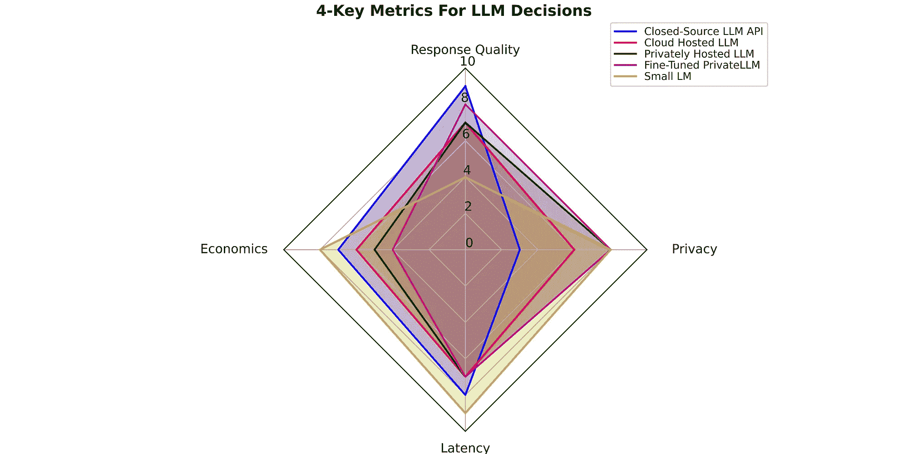
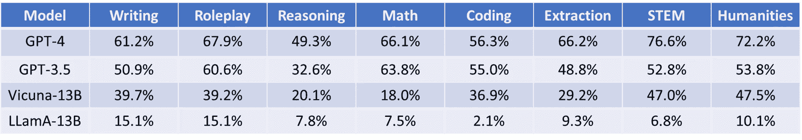
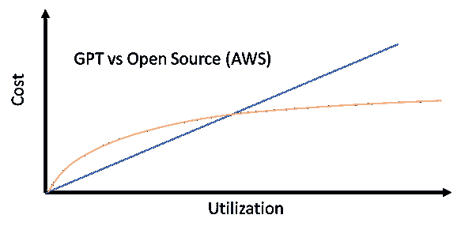

# 评估行业应用中的大型语言模型的 4 个关键因素

> 原文：[`towardsdatascience.com/4-crucial-factors-for-evaluating-large-language-models-in-industry-applications-f0ec8f6d4e9e`](https://towardsdatascience.com/4-crucial-factors-for-evaluating-large-language-models-in-industry-applications-f0ec8f6d4e9e)

## 每个用例都是不同的——根据客户需求和行业特定的指南。学习如何通过 4 个关键标准做出正确的 LLM 选择

[](https://skanda-vivek.medium.com/?source=post_page-----f0ec8f6d4e9e--------------------------------)[](https://towardsdatascience.com/?source=post_page-----f0ec8f6d4e9e--------------------------------) [Skanda Vivek](https://skanda-vivek.medium.com/?source=post_page-----f0ec8f6d4e9e--------------------------------)

·发表于 [Towards Data Science](https://towardsdatascience.com/?source=post_page-----f0ec8f6d4e9e--------------------------------) ·8 分钟阅读·2023 年 8 月 1 日

--



LLM 决策指标 | Skanda Vivek

在过去几个月里，我有机会与来自法律、医疗、金融、科技、保险等行业的人士交流 LLM 的应用。每个行业都有独特的需求和挑战。例如，在医疗领域——隐私至关重要。在金融领域，准确的数据至关重要。律师需要为起草法律文件等任务提供专业的、精细调整的模型。

在本文中，我将探讨帮助你为特定案例选择合适模型的关键决策因素。

# 响应质量

正如 Satya Nadella 在他 2023 年 [Microsoft Inspire 的主题演讲](https://www.youtube.com/watch?v=RhwVMt_XCUE&ab_channel=Microsoft) 中所述，生成式 AI 引入了两个主要的范式转变：

1.  更自然的语言计算机界面

1.  一个位于所有自定义文档之上的推理引擎

在这两类使用场景中，响应质量极其重要。我们与计算机的界面正变得越来越接近自然语言（想想 Python 相对于 C++的友好程度，或者 C++相对于机器语言的友好程度）。然而，这些编程语言的可靠性从未真正成为问题——如果有问题，我们称之为编程错误，并归因于人为错误。然而，更自然的 LLM 界面带来了新问题，因为 LLM 会出现幻觉或给出错误答案，从而引入了新类型的“AI 错误”。因此，响应质量变得极其重要。

第二种用例也是如此。虽然我们都习惯使用 Google 搜索，但在幕后，Google 使用向量嵌入和其他匹配技术来确定哪个页面最有可能包含你所问问题的答案。如果页面列出了错误的结果——这也是人为错误，因为人们列出了不正确的信息。然而，LLM 再次引入了答案可能更加定制化的可能性，但也可能是错误的。

最近，出现了许多新的开源 LLM 进展，如 Llama2、Falcon 等。最近有一个具有挑战性的多基准测试引入了一种方法，使用[强大的 LLM 作为评审来评估其他 LLM](https://arxiv.org/abs/2306.05685)在更开放性的问题上的表现。如你所见，它们根据任务有不同类型的表现。值得查看各种模型——无论你的组织是在寻找定制聊天机器人，还是从文本中提取信息，生成自定义代码，创意写作等。



模型按类别的胜率 | Skanda Vivek（数据来自 MT-Bench [LLM-as-a-judge](https://arxiv.org/abs/2306.05685) 论文）

# LLM 经济学

各种 LLM 解决方案的费用取决于你拥有的用例类型。我在这里详细讨论了这个问题：

[](/llm-economics-chatgpt-vs-open-source-dfc29f69fec1?source=post_page-----f0ec8f6d4e9e--------------------------------) [## LLM 经济学：ChatGPT 与开源]

### 部署像 ChatGPT 这样的 LLM 需要多少钱？开源 LLM 的部署是否更便宜？有什么权衡？

towardsdatascience.com](/llm-economics-chatgpt-vs-open-source-dfc29f69fec1?source=post_page-----f0ec8f6d4e9e--------------------------------)

TL;DR：对于每天请求量在 1000 次范围内的低使用情况，ChatGPT 比在 AWS 上部署的开源 LLM 更便宜。对于每天数百万次请求，部署在 AWS 上的开源模型更便宜。



比较 LLM 成本的卡通示意图 | Skanda Vivek

# 延迟

如果你正在处理实时请求，例如面向客户的聊天机器人，那么延迟是很重要的。可能和响应质量一样重要（甚至更多）。让我们来看一下不同 OpenAI 模型的延迟情况：GPT-3/3.5/4。多个基准测试表明，与 GPT-3.5（ChatGPT）相比，GPT-4 具有更优越的性能，而 GPT-3.5 则在 GPT-3 之上带来了革命性的变化。

假设作为一个创意机构，你希望使用 LLM 模型为企业家提供创意建议——比如为冰淇淋店新项目写一个标语。我在下面写了一些示例代码，从三个 GPT 模型生成这个标语：

```py
#GPT-3

import time
t0=time.time()

response_gpt3 = openai.Completion.create(
  model="text-davinci-003",
  prompt="Write a tagline for an ice cream shop."
)

t1=time.time()

gpt_3_time=t1-t0

#GPT-3.5
import time
t0=time.time()
response_gpt3p5=openai.ChatCompletion.create(
  model="gpt-3.5-turbo",
  messages=[
        {"role": "system", "content": "Write a tagline for an ice cream shop."}

    ]
)

t1=time.time()

gpt_3p5_time=t1-t0

#GPT-4

import time
t0=time.time()
response_gpt4=openai.ChatCompletion.create(
  model="gpt-4",
  messages=[
        {"role": "system", "content": "Write a tagline for an ice cream shop."}
    ]
)

t1=time.time()

gpt_4_time=t1-t0
```

响应如下。就个人而言，我更喜欢 GPT-4 的输出，但其他的也还不错。

```py
"Cool off with all the flavor you can imagine!" ---- GPT 3 
"Scoop up happiness, one flavor at a time!" ---- GPT 3.5 
"Scooping Happiness One Cone at a Time" ---- GPT 4
```

现在，让我们来看一下延迟。令人惊讶的是，GPT-3.5 返回的结果最快（比 GPT-3 快），而 GPT-4 最慢，比 GPT-3.5 慢 1.4 倍。

```py
print(gpt_3_time,gpt_3p5_time,gpt_4_time)

0.8402369022369385 0.7697513103485107 1.0829169750213623
```

如果基于行业特定的指标来看结果相似，而 1.4 倍的延迟不可接受，那么 GPT-3.5 是优于 GPT-4 的选择。但也许延迟不是一个大问题——比如用户收到定制报告的电子邮件，而不是实时看到响应，响应的质量更为重要。在这种情况下，GPT-4 可能是更优选项。

# 隐私与安全

许多来自医疗行业的人对 LLM 和从大量数据中精确定位详细医疗信息的创新非常感兴趣。然而，这些人对隐私也极为担忧。他们不喜欢使用与其他人相同的 API 处理私人数据的想法。此外，将个人健康数据共享给像 ChatGPT 这样的 API 可能会带来严重后果。

还有另外两个选择——一个是在 AWS、Azure 或 Google Cloud 等云提供商上托管开源 LLM。云提供商在遵守医疗指南和法律方面有着悠久的历史，例如《健康保险流通与问责法案》（HIPAA）。例如，AWS 有一份专门的白皮书，介绍了[如何在 AWS 上架构 HIPAA 合规的应用程序](https://docs.aws.amazon.com/pdfs/whitepapers/latest/architecting-hipaa-security-and-compliance-on-aws/architecting-hipaa-security-and-compliance-on-aws.pdf)。我也写了一些关于如何在私有云实例上托管 LLM 作为 API 的博客：

[](https://skanda-vivek.medium.com/deploying-open-source-llms-as-apis-ec026e2187bc?source=post_page-----f0ec8f6d4e9e--------------------------------) [## 部署开源 LLM 作为 API

### 开源的 LLM（大语言模型）现在非常流行，但对于封闭源 LLM API 的数据隐私问题也引起了关注。这个教程…

[skanda-vivek.medium.com](https://skanda-vivek.medium.com/deploying-open-source-llms-as-apis-ec026e2187bc?source=post_page-----f0ec8f6d4e9e--------------------------------) [](https://skanda-vivek.medium.com/deploy-llms-using-azure-ml-804c40f8635e?source=post_page-----f0ec8f6d4e9e--------------------------------) [## 使用 Azure ML 部署 LLM

### 这是一个关于如何使用微软 Azure ML 目录部署 LLM 端点为 API 的教程，并与 AWS 进行比较

[skanda-vivek.medium.com](https://skanda-vivek.medium.com/deploy-llms-using-azure-ml-804c40f8635e?source=post_page-----f0ec8f6d4e9e--------------------------------)

第二种更为私密的选择是将 LLM 部署在本地的私人服务器上。与在云端托管或使用像 ChatGPT 这样的封闭源 API 不同，部署在本地需要公司投资建设自己的私人数据中心，并组建团队来管理这些数据中心。

注意到在上段中我提到本地 LLM 托管是更私密的选择，但没有谈到安全性。这是因为两者都有各自的安全优缺点。使用云服务的好处是云服务提供商有严格的安全标准。此外，云基础应用程序通常更具弹性，因为提供商在多个地点拥有冗余的数据中心。但也存在恶意攻击者利用云系统访问客户数据的风险。

另一方面，本地数据中心在物理安全性方面更有保障——如果离工作地点较近。然而，这些数据中心需要良好管理，如果没有合适的团队，安全漏洞可能会随处可见。此外，单一的本地数据中心代表了一个单点故障，缺乏备份。

# 收获

选择“正确”的 LLM 在很大程度上取决于应用和行业。我将这个选择分解为 4 个关键因素——质量、价格、延迟和隐私/安全。在你开始将 LLM 纳入工作流程时，这可以作为决定从哪个 LLM 开始的良好准则。不过，请注意，这些因素未来可能会有所变化。

新的语言模型（LLMs）可能会出现，这些模型在性能上远优于现有模型，并且成本更低。此外，数据需求也可能发生变化。最初你可能估计客户每天需要~1k 次请求，但未来可能会增加到~10k 次，在这种情况下，使用按使用量收费的闭源 API 可能不如使用低成本的私有托管开源 API 经济。

但如果你面临一种“鸡与蛋”的情况，因为不知道使用哪个模型而不愿开始，我建议不要在分析瘫痪中花费太多时间。Andrej Karpathy（前特斯拉 AI 总监，OpenAI 联合创始人）在他的[GPT 状态演讲](https://www.youtube.com/watch?v=bZQun8Y4L2A&ab_channel=MicrosoftDeveloper)中提供了一些好的建议。他说，开始的最佳方式是使用像 ChatGPT 这样的现成 API，并通过提示工程/检索增强生成使其表现更好（我写了一篇相关文章）：

[## 使用检索增强生成构建特定行业的 LLMs](https://example.org/build-industry-specific-llms-using-retrieval-augmented-generation-af9e98bb6f68?source=post_page-----f0ec8f6d4e9e--------------------------------)

### 各组织正在竞相采用大型语言模型。让我们深入探讨如何构建特定行业的 LLMs…

[towardsdatascience.com](https://example.org/build-industry-specific-llms-using-retrieval-augmented-generation-af9e98bb6f68?source=post_page-----f0ec8f6d4e9e--------------------------------)

如果这不起作用 — 尝试对你的数据进行开源模型微调（或者如果你有资源和勇气的话，从头开始训练！）。我会对展示或探索 LLM 在你所在行业中的潜在应用持这种观点。即使你知道 ChatGPT 可能不适合你的应用，你也可以在代表性样本数据上进行测试。一旦你对探索的可能性感到满意，你可以更换 LLM。这样，你可以开始进行概念验证，给利益相关者留下深刻印象，并产生影响！

我希望这对你在应用 LLM 创建出色产品的过程中有所帮助，并期待在评论中听到你的反馈！

*如果你喜欢这篇文章，关注我 — 我会写关于生成式 AI 在现实世界中的应用，更多地是数据与社会交叉的内容。*

*随时在* [*LinkedIn*](https://www.linkedin.com/in/skanda-vivek-01619311b/) *上与我联系！*

*如果你还不是 Medium 会员，并且想支持像我这样的作者，可以通过我的推荐链接注册：* [*https://skanda-vivek.medium.com/membership*](https://skanda-vivek.medium.com/membership)

**以下是一些相关文章：**

[何时应对 LLM 进行微调？](https://medium.com/towards-data-science/when-should-you-fine-tune-llms-2dddc09a404a)

[LLM 经济学：ChatGPT 与开源的对比](https://medium.com/towards-data-science/llm-economics-chatgpt-vs-open-source-dfc29f69fec1)

[将开源 LLM 部署为 API](https://skanda-vivek.medium.com/deploying-open-source-llms-as-apis-ec026e2187bc)

[你如何构建一个 ChatGPT 驱动的应用？](https://medium.com/geekculture/how-do-you-build-a-chatgpt-powered-app-89c83f3e2143)

[提取式与生成式问答 — 哪种更适合你的业务？](https://medium.com/towards-data-science/extractive-vs-generative-q-a-which-is-better-for-your-business-5a8a1faab59a)

[对定制数据进行问答的 Transformer 模型微调](https://medium.com/towards-data-science/fine-tune-transformer-models-for-question-answering-on-custom-data-513eaac37a80)

[释放生成式 AI 对你客户的潜力](https://medium.com/geekculture/unleashing-the-power-of-generative-ai-for-your-customers-70297f1c9698)

[使用 Azure ML 部署 LLM](https://medium.com/@skanda-vivek/deploy-llms-using-azure-ml-804c40f8635e)
