# 4 种简单方法立即提升你的数据可视化

> 原文：[`towardsdatascience.com/4-easy-ways-to-instantly-improve-your-data-visualisations-2a5fc3a22182`](https://towardsdatascience.com/4-easy-ways-to-instantly-improve-your-data-visualisations-2a5fc3a22182)

## 改善使用 Matplotlib 创建的图表的示例

[](https://andymcdonaldgeo.medium.com/?source=post_page-----2a5fc3a22182--------------------------------)[](https://towardsdatascience.com/?source=post_page-----2a5fc3a22182--------------------------------) [Andy McDonald](https://andymcdonaldgeo.medium.com/?source=post_page-----2a5fc3a22182--------------------------------)

·发表于 [Towards Data Science](https://towardsdatascience.com/?source=post_page-----2a5fc3a22182--------------------------------) ·阅读时间 9 分钟·2023 年 7 月 21 日

--

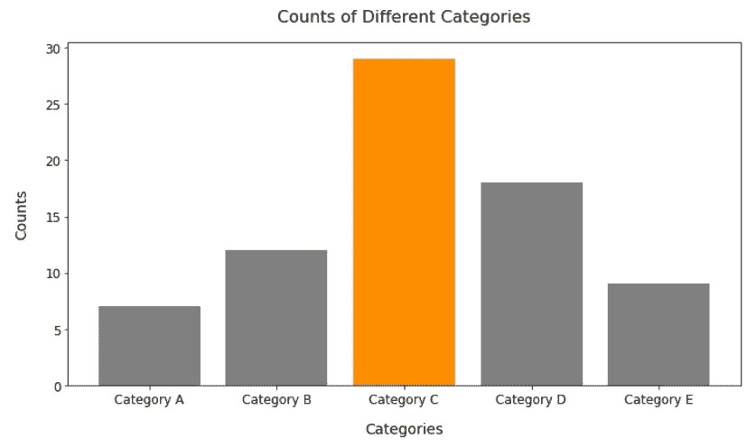

Matplotlib 条形图在改变了单个条形的颜色以引起注意之后的效果。数据是随机生成的。图像由作者提供。

创建有效的数据可视化是许多学科中的关键技能，无论是商业分析、数据科学还是地球科学。美观且易于理解的数据可视化可以帮助激发目标受众的想法，或促使他们根据我们展示的信息采取行动。

在 Python 世界中，有几个数据可视化库可供使用。然而，许多 Python 和数据科学的学习者都是从 matplotlib 开始的。

[**Matplotlib**](https://matplotlib.org/) 提供了一种多功能的方法来呈现你的数据。 在我之前的文章中，我展示了各种数据可视化，这些可视化在默认图表的基础上更进一步。

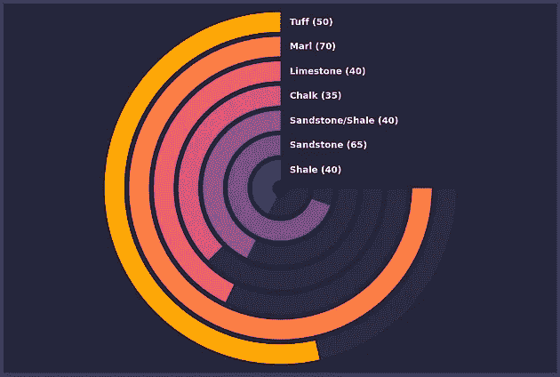

[使用 matplotlib 创建的径向条形图示例。](https://medium.com/towards-data-science/create-eye-catching-radial-bar-charts-with-matplotlib-fd03ff732048) 图像由作者提供。

然而，创建这些图形确实需要耐心和额外的 Python 代码。这通常会导致在 [StackOverflow](https://stackoverflow.com/) 或通过库文档进行大量搜索，以寻找修改图形中最小部分的可能解决方案。

通过遵循一些简单的指南，我们可以立即改善任何使用 matplotlib 创建的图形。

在这篇文章中，我分享了四条我在创建用于分享的图形（无论是在 Medium 还是在学术出版物中）时常用的指南。

这些指南不仅限于 matplotlib；它们同样适用于任何允许你创建图表的软件，如 Excel 或 Tableau。

# 去除图表垃圾并保持简单

改善 matplotlib 图表的最快和最简单的方法之一是减少显示的“图表垃圾”量。

图表垃圾指的是那些在图表上不必要和令人困惑的元素，它们实际上并没有增加读者或展示数据的价值。

在构建图表时，你应该确保只包含那些有助于读者更好理解数据的元素。

这里有一些可以让你的图表更清晰的建议：

+   适当但有效地使用标题和标签

+   避免复杂的词汇和术语

+   移除不必要的网格线和边框

+   移除背景图片

+   避免过于华丽的字体

+   避免使用不必要的特殊效果，如 3D 效果和阴影

作为一个例子，我们有下图，用于说明收入与年龄的关系。这个图表有几个元素使得阅读和解释变得困难，比如网格线、点标签以及背景和点之间的颜色冲突。

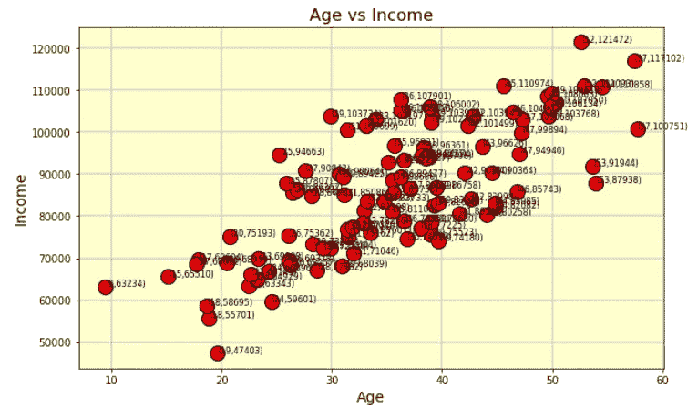

一个杂乱的散点图，包含大量图表垃圾——数据随机生成。图片由作者提供。

如果我们花一点时间去除这些不必要的图表垃圾，我们可能会得到如下图表。

这使得图表看起来更加整洁且易于解读。我们还添加了线性回归线，这可以帮助显示数据的整体趋势。

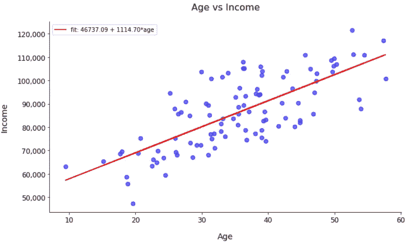

去除图表垃圾后的散点图——数据随机生成。图片由作者提供。

这是另一个例子，展示了去除多余图表垃圾的过程。

创建有效图表的关键之一是让数据本身说话。这意味着优先考虑数据的展示方式，超过图表上的其他元素，以清晰地传达数据分析的预期见解。

# 选择适当的颜色

选择图表的适当颜色可能看起来是一个简单的任务。然而，它很快可能成为一个巨大的时间消耗点，你可能会花费几个小时来决定合适的蓝色阴影或是否存在足够的颜色对比。

选择正确且最合适的颜色可以极大地影响图表的可读性，从而影响读者对数据的解读。

例如，在下图中，我们有五个不同的类别，都用单一颜色表示。虽然图表可读，但由于颜色使用不够有效，我们没有吸引读者关注数据的任何特定方面。

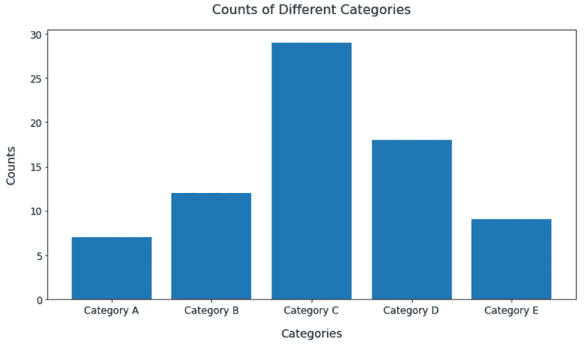

基本的 matplotlib 柱状图，颜色一致。数据随机生成。图片由作者提供。

如果我们将颜色更改为让类别 C 突出显示为橙色，我们立即抓住读者的注意力，并暗示这个特定类别很重要。


Matplotlib 条形图在更改单个条形颜色以吸引注意力后。数据随机生成。图像由作者提供。

另一方面，如果我们采取相反的方法，为每个类别使用随机颜色，那么最终可能会得到一个繁忙且令人困惑的图表。然而，也有可能你希望为每个条形使用不同的颜色，例如，当区分不同公司品牌时。

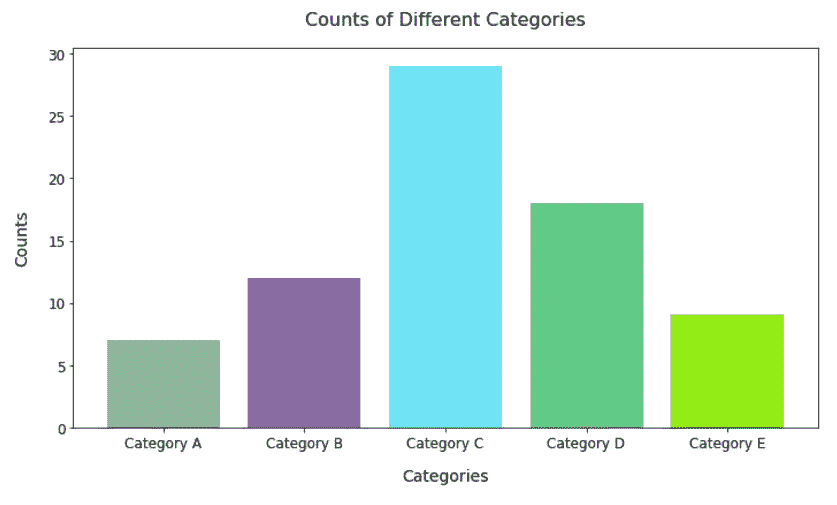

Matplotlib 条形图在使用过多颜色时，使整体图表难以阅读。数据随机生成。图像由作者提供。

在选择颜色时，有许多细微差别，这些差别将取决于许多因素，包括图表类型、数据和你想传达的信息。

然而，有一些通用规则可以帮助使你的图表看起来更加精致和专业：

+   **使用颜色突出信息，而不是分散注意力：** 颜色应当用于吸引对数据中最关键部分的关注。

+   **保持一致性：** 在创建多个可视化时，保持一致性有助于观众快速理解基于以往经验的新可视化。例如，如果在一个图表中使用蓝色表示某个类别，那么在其他图表中也尽量使用相同的颜色表示该类别。

+   **考虑颜色视觉问题/色盲：** 在创建图表时，考虑色盲人士是非常重要的。例如，避免使用已知存在问题的颜色，如红色和绿色或蓝色和黄色。

+   **理解颜色心理学：** 颜色背后的含义可能具有重要的影响，并且在不同文化中可能会有所不同。例如，红色通常被视为负面颜色或危险的警告，而绿色被视为积极的或增长的指示符。

我强烈推荐查看以下文章，以便更深入地了解颜色选择：

+   [**如何为数据可视化选择颜色**](https://chartio.com/learn/charts/how-to-choose-colors-data-visualization/)

+   [**如何为数据可视化选择更美丽的颜色**](https://blog.datawrapper.de/beautifulcolors/)

+   [**颜色使用的常见陷阱**](https://clauswilke.com/dataviz/color-pitfalls.html)

还有许多颜色调色板生成器可以帮助选择最合适的调色板。通过使用这些工具，你可以节省大量时间，并确保最大限度地提高可读性，尤其是对于有颜色视觉问题的人群。

这里有一些你应该查看的资源：

+   [**Coolors**](https://coolors.co/)

+   [**ColorBrewer 2.0**](https://colorbrewer2.org/#type=sequential&scheme=BuGn&n=3)

+   [**Paletton**](https://paletton.com/)

+   [**Leonardo**](https://leonardocolor.io/#)

+   [**Adobe 色轮**](https://color.adobe.com/create/color-wheel)

# 通过应用 Matplotlib 主题节省时间和代码

如果你是我文章的常客，[你会发现我在最近几个月中介绍了几个 matplotlib 主题库](https://medium.com/towards-data-science/upgrade-your-data-visualisations-4-python-libraries-to-enhance-your-matplotlib-charts-74361bc3b92e)。这些主题库使你能够立即将图形从 matplotlib 的无聊标准色彩方案转变为更加美观的形式。

这些不仅有助于改善图形的外观，还有助于提高解释性。

有许多 matplotlib 主题库可供选择，包括 [mplcyberpunk](https://github.com/dhaitz/mplcyberpunk)，它可以将你的 matplotlib 图形转换为带有发光霓虹色的未来感图表。

例如，为了创建一个 Cyberpunk 主题的图像，我们可以使用以下代码：[mplcyberpunk](https://github.com/dhaitz/mplcyberpunk)。

```py
import mplcyberpunk
import numpy as np

# Generate x values
x = np.linspace(0, 10, 20)

# Generate y values
y = np.sin(x)
y2 = np.cos(x)

plt.style.use('cyberpunk')
plt.figure(figsize = (8,8))

plt.plot(x, y, marker = 'o')
plt.plot(x, y2, marker = 'o', c='lime')

mplcyberpunk.add_gradient_fill(alpha_gradientglow=0.5, gradient_start='zero')

plt.xlabel('X-Axis')
plt.ylabel('Y-Axis')

plt.show()
```

要生成以下图像：

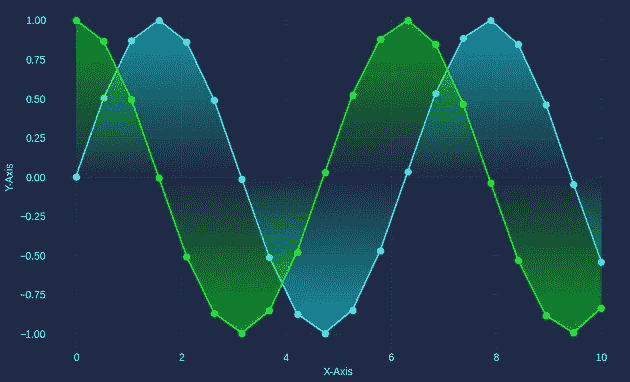

示例线图，带有渐变填充，由 CyberPunk matplotlib 主题生成。图片由作者提供。

尽管 [mplcyberpunk](https://github.com/dhaitz/mplcyberpunk) 主题可以创建引人注目的图形，但应谨慎使用。它可能会被一些人视为不专业，并且可能会遮掩数据和你想传达的信息。

如果你在寻找适合纳入学术出版物的内容，[那么 SciencePlots 库可能会引起你的兴趣。](https://medium.com/p/d86a62e2ab46)

SciencePlots 库包含了众多样式，方便你在撰写科学或期刊文章时设置图表。它还支持多种语言，包括中文和日语。

例如，下面的图显示了我们在 Cyberpunk 主题图表中使用的相同数据在适合纳入学术期刊文章的形式下的表现。

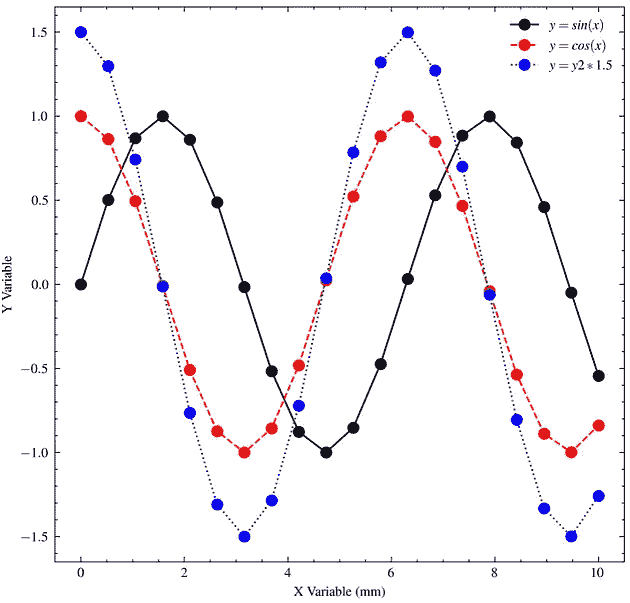

应用科学图表 IEEE 风格后的 Matplotlib 线图。图片由作者提供。

你可以在我下面的文章中了解更多关于 SciencePlots 库的信息：

[](/creating-scientific-plots-the-easy-way-with-scienceplots-and-matplotlib-d86a62e2ab46?source=post_page-----2a5fc3a22182--------------------------------) ## 使用 scienceplots 和 matplotlib 轻松创建科学图表

### 使用几行 Python 代码立即转换你的 Matplotlib 图形

[towardsdatascience.com

如果你对我上面提到的一些常见主题库的概述感兴趣，你可以查看我下面的其他文章。

[](/upgrade-your-data-visualisations-4-python-libraries-to-enhance-your-matplotlib-charts-74361bc3b92e?source=post_page-----2a5fc3a22182--------------------------------) ## 升级您的数据可视化：4 个 Python 库来增强您的 Matplotlib 图表

### 使用这些易于使用的 Matplotlib 样式库来改进您的数据可视化

towardsdatascience.com

# 考虑您的观众和您讲述的故事

在创建数据可视化时，最重要的一点是考虑你的观众是谁以及你想讲述的故事是什么。

与其向用户展示大量复杂且混乱的图表，不如将数据和信息提炼成最相关的部分。这将取决于数据分析的目标，这可能由客户、研究项目或事件组织者定义。

此外，我们还需要考虑观众的背景。

他们是技术导向的高数据素养人员，还是我们的可视化需要简化以适应更广泛的非技术观众？

例如，如果我们被要求展示来自挪威大陆架一系列井的 Hugin 组的平均孔隙率值信息。

我们的第一次尝试可能是这样的：

```py
fig, ax = plt.subplots(figsize=(8,8))

bars = plt.barh(df['well'], df['porosity'])

plt.show()
```

这将创建以下条形图。

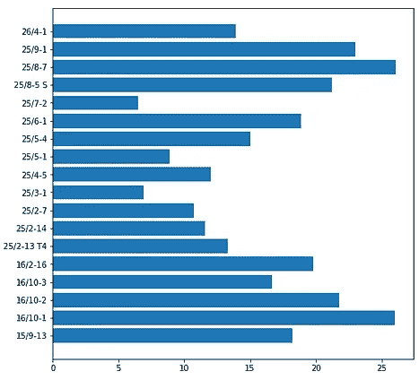

基本的 matplotlib 水平条形图。数据来自 Xeek / Force 2020\. 图片由作者提供。

然而，当读者查看此图时，他们必须做很多工作才能弄清楚发生了什么。

他们会问：

+   条形图代表什么？

+   哪口井的孔隙率最高？

+   井 16/10–1 和井 25/8–7 之间有差异吗？

+   哪些井被认为具有“良好”的孔隙率？

尝试回答这些问题需要相当大的努力，大多数人会跳过图形直接继续。

如果我们尝试改进图形并在不让读者费力的情况下回答这些问题，我们可以得到如下结果。

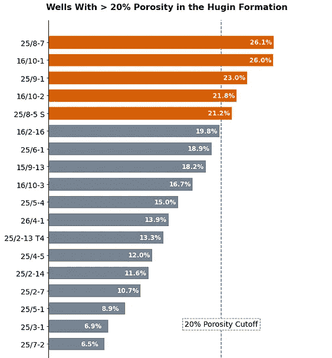

对图形进行几次调整后的水平条形图，以向读者讲述特定的故事。数据来自 Xeek / Force 2020\. 图片由作者提供。

立即，我们可以回答这些问题：

+   条形图代表什么？

    **Hugin 组的平均孔隙率值**

+   哪口井的孔隙率最高？

    **25/8–7，孔隙率为 26.1%**

+   井 16/10–1 和井 25/8–7 之间有差异吗？

    **是的，差异为 0.1%**

+   哪些井被认为具有“良好”的孔隙率？

    **橙色突出显示的井在 20% 截断值以上**

我们通过简化图形并改善美学，使读者的工作变得更轻松。

我们还可以通过突出显示一根柱子来改变图形的叙事。例如，下面的图表可能是关于 well 16/2–16 的更大信息图的一部分，通过突出显示该柱子，我们立即引起注意。

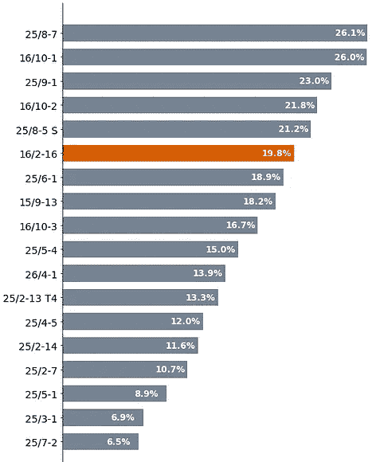

应用颜色突出显示单根柱子的 Matplotlib 水平条形图，以吸引读者的注意。数据来源于 Xeek / Force 2020\. 图片由作者提供。

# 摘要

创建有效的数据可视化是一项高质量的技能，特别是如果你涉及数据科学或数据分析。

在本文中，我分享了四个我最喜欢的创建有效可视化的指导原则。还有许多其他方法可以用来改进图形。

我很想在本文的评论区了解你创建有效数据可视化的最爱规则。

# 本文使用的数据集

作为 Xeek 和 FORCE 2020 机器学习竞赛的一部分使用的训练数据集 *(Bormann et al., 2020)*。该数据集依据知识共享署名 4.0 国际许可协议授权。

完整的数据集可以通过以下链接访问: [`doi.org/10.5281/zenodo.4351155`](https://doi.org/10.5281/zenodo.4351155)。

*感谢阅读。在离开之前，你一定要订阅我的内容，将我的文章直接送到你的邮箱。* [***你可以在这里做到这一点！***](https://andymcdonaldgeo.medium.com/subscribe)

*其次，你可以通过注册会员获得完整的 Medium 体验，并支持我和其他数千名作家。只需每月$5，你便可以完全访问所有精彩的 Medium 文章，并有机会通过写作赚钱。*

*如果你通过* [***我的链接***](https://andymcdonaldgeo.medium.com/membership)***注册***，*你将通过你的一部分费用直接支持我，这不会额外增加你的开支。如果你这样做，非常感谢你的支持。*
