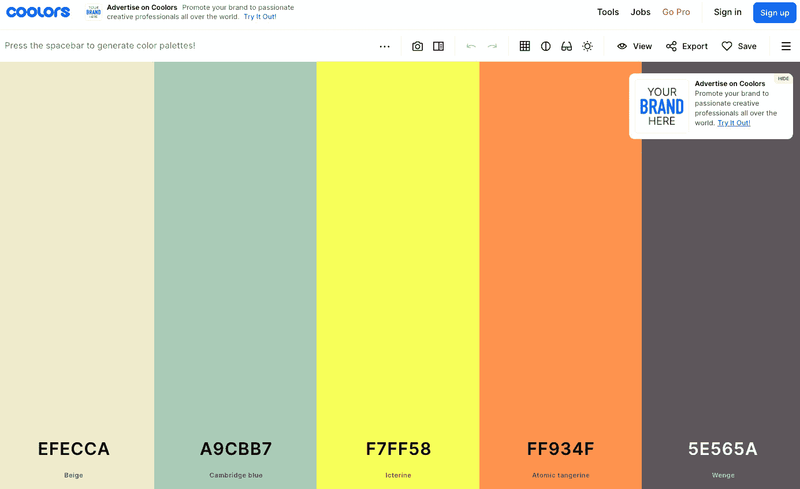
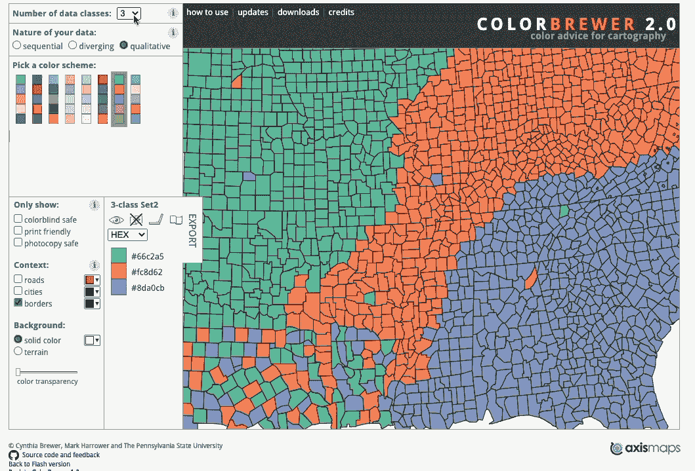
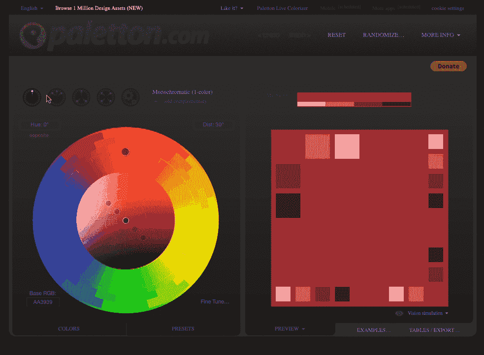
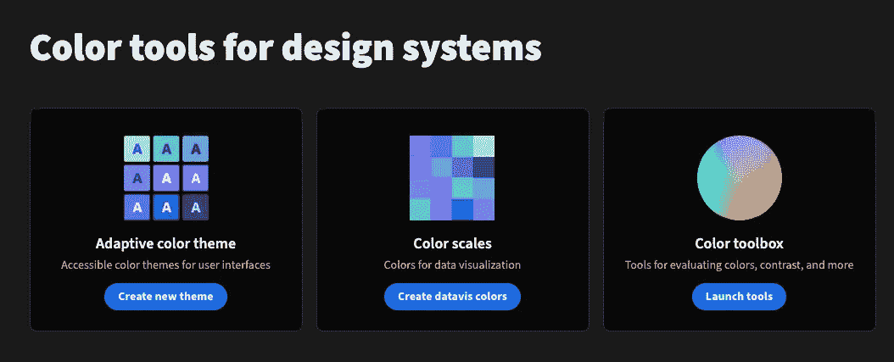
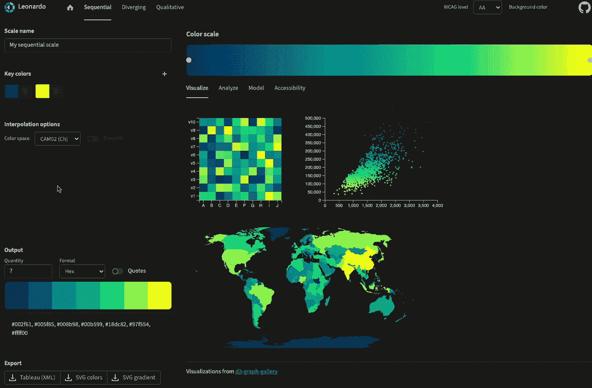

# 选择数据可视化颜色调色板的 4 个必备工具

> 原文：[`towardsdatascience.com/4-essential-tools-to-help-you-select-a-colour-palette-for-your-data-visualisation-ddb2ec92a08`](https://towardsdatascience.com/4-essential-tools-to-help-you-select-a-colour-palette-for-your-data-visualisation-ddb2ec92a08)

## 让颜色调色板选择变得简单的工具

 [Andy McDonald](https://andymcdonaldgeo.medium.com/?source=post_page-----ddb2ec92a08--------------------------------)

·发表于 [Towards Data Science](https://towardsdatascience.com/?source=post_page-----ddb2ec92a08--------------------------------) ·阅读时间 5 分钟·2023 年 3 月 15 日

--

照片由[Daniele Levis Pelusi](https://unsplash.com/it/@yogidan2012?utm_source=medium&utm_medium=referral)拍摄，来源于[Unsplash](https://unsplash.com/?utm_source=medium&utm_medium=referral)。

有时，最小的事情可能比我们想象的花费更多时间。在构建数据可视化时，我们会遇到需要决定颜色方案的阶段——这看起来简单但非常重要，可能会让你的数据可视化效果大相径庭。在这一阶段，我们经常会花费几个小时来选择合适的蓝色或检查颜色之间是否有足够的对比度。

在选择数据可视化的合适颜色调色板时，我们需要考虑许多因素，包括可视化的类型、受众、颜色对比、色盲等。了解这些不同的因素可以确保我们通过数据可视化讲述的故事能够以最佳方式传达给读者。

网上有许多工具可以帮助简化颜色选择过程。在这篇文章中，我们将介绍四个强大的工具，你可以将它们添加到数据科学家/分析师的工具箱中。

# Coolors.co

[**Coolors.co**](https://coolors.co/) 提供了一个非常易于使用的工具，允许你为项目生成颜色方案。尽管它主要针对品牌设计，但也可以轻松用于数据可视化。

在应用程序中，你只需按空格键即可生成新的调色板。你可以重复此操作直到找到你喜欢的调色板。如果你发现喜欢某种颜色但不喜欢其他颜色，你可以锁定那种颜色，按空格键重新生成其余颜色。

在免费版本中，你只能生成包含五种颜色的调色板，并且可用的工具也有限，例如不能使用颜色理论规则。

Coolors.co 用于生成数据可视化和其他项目的颜色方案。图片由作者提供。

除了生成调色板，你还可以浏览其他用户生成并与颜色社区分享的调色板。这允许你看到当前的趋势和热门颜色。

# ColorBrewer 2.0

如果你计划在数据可视化中使用地图，你可能需要查看 [**ColorBrewer 2.0**](https://colorbrewer2.org/)。这个免费的在线工具由宾夕法尼亚州立大学的辛西娅·布鲁尔教授设计和开发，旨在为参与制图的任何人创建引人注目且易于访问的颜色地图。

你可以选择从顺序、发散和定性颜色方案中挑选调色板。选择哪一种将取决于你计划在数据可视化中展示什么内容。

由于它是考虑到制图师设计的，你可以在地图的背景下预览每个可用的颜色调色板。

当你将颜色调色板并排查看时，可能很容易区分每种颜色。然而，在处理地图时，调色板上不相邻的颜色可能在地图上相邻。因此，了解你选择的调色板是否适合你的地图数据是很重要的。

ColorBrewer 用于为地图数据选择颜色调色板。图片由作者提供。

# Paletton

[**Paletton**](https://paletton.com/) 是一个免费的工具，帮助你为设计、可视化和演示选择颜色调色板。当你访问该网站时，你会看到一个互动的颜色轮，提供了各种选项。

刚开始时，最好有一个你希望使用的基础颜色。例如，这可能基于你或你工作的公司的现有品牌。然后你可以探索不同的颜色关系，包括单色、邻近、三色和四色。这些都会改变你选择的颜色调色板的感觉。

Paletton 的一个优点是可以预览你选择的颜色方案应用到一个简单的网站或图形上。这帮助你了解所选颜色调色板的效果。此外，它还提供了模拟色盲的选项，这对于确保你的可视化对所有人都可及是至关重要的。

Paletton 用于选择颜色调色板。图片由作者提供。

# Leonardo

[**Adobe 的 Leonardo**](https://leonardocolor.io/#) 是一个很棒的开源工具，允许设计师、数据科学家和工程师选择、可视化和分析选定的颜色调色板。

Leonardo 似乎是我查看过的用于生成颜色调色板的工具中最全面和技术性的。它允许您分析颜色空间中的颜色、对比度和可访问性。

当您访问网站时，您可以选择专注于用户界面的颜色设计、数据可视化，或使用工具来比较和评估颜色。

Adobe Leonardo 中的可用工具。图片由作者提供。

在“颜色尺度”部分，我们可以在三个关键数据图表上可视化顺序、发散和定性方案的颜色调色板：热图、散点图和地图。这提供了一个清晰的指示，说明您的可视化与所选方案的效果如何。

Leonardo 在为数据可视化选择颜色调色板时的实际应用。图片由作者提供。

若想深入了解 Leonardo，请查看以下文章：

[## 使用 Leonardo 创建基于对比的主题](https://uxdesign.cc/creating-contrast-based-themes-with-leonardo-32b6219a090f?source=post_page-----ddb2ec92a08--------------------------------)

### 对 Leonardo 的功能增强，Adobe 的开源工具，用于创建美观、可访问和自适应的颜色…

[uxdesign.cc](https://uxdesign.cc/creating-contrast-based-themes-with-leonardo-32b6219a090f?source=post_page-----ddb2ec92a08--------------------------------) [## 使用 Leonardo 创建基于对比的主题

### 创建用于数据可视化的自定义颜色尺度有时可能会很繁琐。使用 Leonardocolor.io，它变得更加轻松…

[medium.com](https://medium.com/@NateBaldwin/color-scales-for-data-visualization-in-leonardo-bf206feb61b9?source=post_page-----ddb2ec92a08--------------------------------) [## 数据可视化中的颜色尺度

# 摘要

在这篇文章中，我们介绍了四种强大的工具，可以帮助您在最终确定数据可视化之前选择和分析您所选择的颜色调色板。这些工具将为您的工具集提供很好的补充，并可以加快选择适当颜色的过程，使其对所有人都易于访问。

*感谢阅读。在您离开之前，您一定要订阅我的内容，将我的文章发送到您的收件箱中。* [***您可以在这里做到这一点！***](https://andymcdonaldgeo.medium.com/subscribe)*或者，您也可以* [***注册我的通讯***](https://fabulous-founder-2965.ck.page/2ca286e572) *以便免费将更多内容直接发送到您的收件箱。*

*其次，您可以通过注册会员来获得完整的 Medium 体验，并支持我和其他成千上万的作者。只需每月 $5，您即可完全访问所有精彩的 Medium 文章，并有机会通过写作赚取收入。如果您使用* [***我的链接***](https://andymcdonaldgeo.medium.com/membership)***,*** *您将直接通过您的费用的一部分支持我，而且不会增加额外费用。如果您这样做，非常感谢您的支持！*
