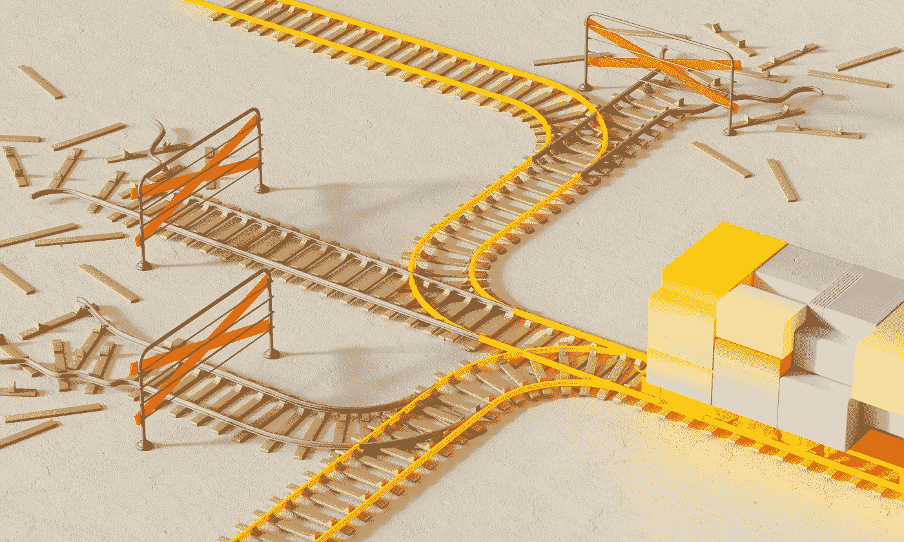

# 4 个失败的物理信息神经网络的创意

> 原文：[`towardsdatascience.com/4-ideas-for-physics-informed-neural-networks-that-failed-ce054270e62a?source=collection_archive---------1-----------------------#2023-02-11`](https://towardsdatascience.com/4-ideas-for-physics-informed-neural-networks-that-failed-ce054270e62a?source=collection_archive---------1-----------------------#2023-02-11)

## 这里列出了几种对 PINNs 的扩展，它们要么没有提高性能，要么完全破坏了性能——因此你无需亲自尝试。

 [Rafael Bischof](https://rabischof.medium.com/?source=post_page-----ce054270e62a--------------------------------)

·

[关注](https://medium.com/m/signin?actionUrl=https%3A%2F%2Fmedium.com%2F_%2Fsubscribe%2Fuser%2F913c6c1e6a94&operation=register&redirect=https%3A%2F%2Ftowardsdatascience.com%2F4-ideas-for-physics-informed-neural-networks-that-failed-ce054270e62a&user=Rafael+Bischof&userId=913c6c1e6a94&source=post_page-913c6c1e6a94----ce054270e62a---------------------post_header-----------) 发表在[Towards Data Science](https://towardsdatascience.com/?source=post_page-----ce054270e62a--------------------------------) · 9 分钟阅读 · 2023 年 2 月 11 日

--

照片由[DeepMind](https://unsplash.com/es/@deepmind?utm_source=medium&utm_medium=referral)在[Unsplash](https://unsplash.com/?utm_source=medium&utm_medium=referral)提供

在[物理信息神经网络（PINNs）](https://www.sciencedirect.com/science/article/pii/S0021999118307125)的世界中，就像在任何其他新兴的机器学习领域一样，每个人似乎都急于分享他们发现的改进这些模型的惊人技术。我自己也不例外，已经发表了三篇关于提升 PINNs 性能的有用扩展的文章。

+   [通过自适应损失平衡改进 PINNs](https://medium.com/@rafael.bischof07/improving-pinns-through-adaptive-loss-balancing-55662759e701)

+   [PINNs 的专家混合模型（MoE-PINNs）](https://medium.com/@rafael.bischof07/mixture-of-experts-for-pinns-moe-pinns-6520adf32438)

+   [改善物理信息神经网络（PINNs）的 10 个实用提示和技巧](https://medium.com/@rafael.bischof07/10-useful-hints-and-tricks-for-improving-pinns-1a5dd7b86001)

然而，常常未被提及的是那些未能实现的无数创意。现实是，提升 PINNs 的过程并不总是直截了当的，许多有前景的想法最终都被抛在了路边。

> 我没有失败。我只是找到了 10,000 种行不通的方法。——**托马斯·爱迪生**
