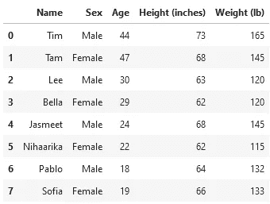

# 如何批判性地评估你遇到的下一个数据科学项目

> 原文：[`towardsdatascience.com/4-powerful-unique-ways-to-help-you-critically-evaluate-the-next-data-science-project-you-come-112cc246c5cf`](https://towardsdatascience.com/4-powerful-unique-ways-to-help-you-critically-evaluate-the-next-data-science-project-you-come-112cc246c5cf)

## 意见

## 定性方法、数据处理和媒体来源——以及对数字可能欺骗的详细探讨

 [Murtaza Ali](https://murtaza5152-ali.medium.com/?source=post_page-----112cc246c5cf--------------------------------)

·发表于 [Towards Data Science](https://towardsdatascience.com/?source=post_page-----112cc246c5cf--------------------------------) ·9 分钟阅读·2023 年 3 月 9 日

--

照片由 [Laurenz Kleinheider](https://unsplash.com/@laurlenz?utm_source=medium&utm_medium=referral) 提供，来源于 [Unsplash](https://unsplash.com/?utm_source=medium&utm_medium=referral)

数据科学的热潮大多集中在炫目和奢华的方面：跟踪你每一个动作的大数据、预测地球状态的强大模型、能够比我们曾经想象的更好地模拟人类思维的智能系统。

尽管这些杰出的成就确实是数据科学的一部分，但不应盲目接受。无论你是积极从事自己的数据科学项目，还是浏览其他数据科学家快速开发的产品，了解如何批判性地评估其中的数据至关重要。

之所以称之为数据科学，是有原因的。在任何项目中，基础的*数据*都是至关重要的。在这篇文章中，我们将探讨四种强有力的方法，以确保我们尽可能有效地分析数据。

## 以人为本的数据科学

随着人工智能（AI）的日益普及（例如 ChatGPT），人们终于开始更加关注数据科学的伦理问题。

当你与大多数 AI 系统互动时，它们会声称因为它们是机器，所以没有意见。然而，这并不是真的。所有人工智能系统都受到用于训练它们的数据中的固有偏见的强烈驱动。因此，数据中的任何偏见都会转移到模型中。这就是为什么许多 AI 系统可能具有歧视性的原因——一个著名的例子是[面部识别技术中的偏见](https://www.theregreview.org/2021/03/20/saturday-seminar-facing-bias-in-facial-recognition-technology/) [1]。此外，在许多情况下，原始的定量数据不足以捕捉数据的重要方面。

[Sourojit Ghosh(G)](https://medium.com/u/723ccab1a2ed?source=post_page-----112cc246c5cf--------------------------------)，我长期合作的专家，专注于社会推荐算法（SRA），在他最近的出版物 [4] 中提出了以下观点：

> “SRA 的运作和发展中一个共同的主题是将用户非人性化，通过将表达丰富的个体简化为数据和存档到数据库中的元数据。这些算法学习并被教导将人类表达仅视为‘内容’和‘变量’。然而，人类不仅仅是他们的数据，还有许多背景和情况涉及内容的创建。”
> 
> …
> 
> 我们设想将社会和个人背景整合到 SRA 对用户生成内容的理解中，可以在多个层面上改善最终结果。在用户创建内容和与推荐内容互动的不同时间点，系统提示可以询问有关创建内容的可选定性问题，例如社会和本地背景，以及用户创建内容背后的动机等几种可能性。如果用户选择回答这些问题，额外的定性内容可以被纳入 SRA 的推荐选择中，因为它致力于为用户提供更有意义的内容。这种功能可以让用户确定他们提供给 SRA 的额外信息和背景的层级，以便推断和融入建议中。

上述内容从高层次上展示了定性分析技术如何与传统的定量方法相结合，以获得对数据的更深入见解。数据科学中有许多定性技术的例子——这里有两个常见的：

+   **民族志**：民族志涉及通过仔细观察和*积极参与*某个特定群体的社会和文化经历，寻找可预测的模式 [2]。

+   **用户访谈**：这是构建某种产品或模型过程中的一个中间步骤，涉及到对最终用户的实际子集进行测试 [3]。

未来已来，未来是以人为本的。不要被落在后面。

## 理解如何正确操作数据

如果你是经验丰富的数据科学家，这可能看起来很明显，但对于刚刚开始的人来说并不一定清楚。

说明这一点的最佳方式是通过一个特定的数据科学工作流程的示例。在这里，我们将使用分析数据并通过数据可视化将其呈现给某些观众的过程。

新手可能会倾向于查看数据集，然后仅生成已可用的度量的图表。例如，假设我们有以下数据集：

作者提供的图片

我们为了简化数据集保持较小，但你可以想象，类似的数据集可以为更大范围的人群收集——比如大学或城市。

看着上面的内容，我们可以制作一个所有人身高的条形图。也许我们可以绘制年龄分布的直方图。更好的是，我们可以使用两个变量，制作身高与体重的散点图。

这些想法本身并没有错；事实上，我们可能希望在此数据集的可视化仪表板中构建这些图表。不过，这些问题的范围有限。如果我们想要*深入探讨*呢？

+   当按性别分组时，平均身高和体重是多少？如果按年龄分组呢？是否存在某种关系？

+   如果我们的主要观众在美国以外，是否可以将身高图表以厘米为单位？

+   我们能否制作筛选出不在特定年龄范围内的人的图表，从而更好地将我们的图表概括到我们的目标人群中？

这些问题的答案*确实*存在于数据集中，但在数据的原始形式中无法获取。为了获得这些问题的答案，我们需要通过各种转换、[聚合](https://medium.com/towards-data-science/breaking-down-the-powerful-magic-behind-the-pandas-groupby-function-b94cc2427eb9)和过滤器来操作数据，然后再开始生成可视化。掌握这种操作技巧是你成为数据科学家所必需的技能。

你可以使用许多工具来操作数据：

+   如果你熟悉编程，那么[你最好的选择是使用 Pandas](https://medium.com/towards-data-science/master-data-transformation-in-pandas-with-these-three-useful-techniques-20699f03e51d)，这是 Python 强大的数据科学模块。

+   如果你更偏向于定性 UX，那么你可以使用任务特定的工具。例如，如果你使用[Tableau](https://www.tableau.com/)进行数据可视化，你应该知道它也有许多功能来促进数据操作。

+   如果你只是想在将数据导出到任何外部工具之前修复其初始格式，那么 Excel 或 Google Sheets 提供了许多功能，可能符合你的需求。

要点是，学习*至少*一种可以操作数据的工具。

越多越好，但至少需要一个。

## 如果可能的话，回到数据源

在他优秀的书籍《*图表如何欺骗*》[5]中，信息设计师阿尔贝托·卡伊罗提出了以下媒体素养的一般规则：

> “不信任任何没有明确提及或链接到其发布故事来源的出版物。”

从数据科学的角度来看，我们应该采纳一个重要的心态：**如果任何模型、可视化或其他数据相关的交付物在没有提供数据来源的情况下做出主张，你应该立即持怀疑态度。**

用简单的语言来说，这似乎是常识。当然，我们应该不信任那些没有明确提供数据的主张。谁会做出这样的事情呢？

很多人，碰巧其中一些人相当有影响力。

卡伊罗在他的书中提供了以下示例，这是一张 2017 年 12 月由白宫推特发布的图形[6]：

公开推文，特朗普白宫档案中的图形

上述图像实际上很需要视觉上的批评，但由于这篇文章不是关于可视化的，我们暂时先不讨论它们。有一点你应该特别关注。

这张图形，简而言之，是完全虚构的。

没有数据来源链接，这也符合实际，因为构建该可视化并没有使用任何数据。所示的三进制指数增长充其量是随机的，最坏的情况则是严重夸张。

尽管如此，仍有数百万人看到了这张图形，其中许多人可能从中得出了强烈的结论，尽管实际情况是上述图像中没有呈现任何事实。应该不难理解这为什么不好，甚至可能是危险的。

下次你检查一个数据科学项目时，检查其来源。这很重要。

## 数学正确 ≠ 准确

这怎么可能是正确的？如果某事在数学上是正确的，那它必然是准确的。

在这里定义我们所说的*准确*是重要的。对于数据科学——它本质上嵌入在社会结构中——准确性包括对数据的*解释*。也就是说，**背景很重要**。

因此，我们所说的准确性是指我们从数据中得出的主张不能对更广泛的观众产生误导。这用一个例子会更有意义，所以让我们看一个来自优秀在线教材的例子，[*计算与推理思维*](https://inferentialthinking.com/chapters/18/2/Making_Decisions.html)[7]。

考虑一个大规模的群体，其中只有一小部分人受到疾病的影响。具体来说，每 1000 人中有 4 人感染了这种疾病。我们还有一个医疗测试可以高准确度地预测一个人是否患有该疾病：假阳性率为 5/1000，假阴性率为 1/100。

**考虑到这一点，请思考以下问题：如果从人群中随机选取一个人，并且他们对疾病测试呈阳性，那么他们实际上患有这种疾病的概率是多少？**

在继续滚动之前，请花点时间思考一下。

那么，你怎么看？考虑到我们的测试如此准确，也许大约 80%？85%？

实际的答案可能会让你吃惊：大约来说，这个人实际上有 44%的机会真正患有这种疾病。我们在这里略过数学细节，但如果你对此感兴趣，建议点击上面的链接。

在这里，我们专注于理解为什么会出现这种情况。数学中是否存在错误？正如你可能从本小节的标题中猜到的那样，实际上是没有错误的。

这种令人困惑的结果的原因在于，这种假设性疾病在基础人群中的发病率非常低，尽管我们的测试表面上很准确，但假阳性比真阳性更多。换句话说，患病人数很少，即使是看似小的假阳性率也对应了一个相当高的原始数字。

当我们说某些东西在数学上可能是正确的，但仍然不够准确时，这就是我们的意思。如果这样的测试被盲目地进行，而没有讨论基本的背景因素，可能会导致大量误导或甚至惊慌的人。背景——在这种情况下是基础人群的分布——在处理数据时极为重要。

## 最终思考 + 回顾

在处理数据时，至关重要的是要对每一个方面进行批判性评估。以下是你的备忘单：

1.  数据科学并不总是只关注数字。**以人为本的数据科学**是未来的发展方向。

1.  原始数据几乎总是不够的。**学会如何处理数据**。

1.  可交付成果的质量仅与数据有关。**严格检查数据源。**

1.  数字确实会说谎。**当数学看起来正确但结论值得怀疑时，寻找背景解释**。

如果你没有足够仔细地考虑你的数据，人们很容易误导你。

不要让那个成为你。保持信息灵通。

直到下一次，我的朋友们。

**想在 Python 方面脱颖而出？** [**在这里获得独家免费的简单易读的指南**](https://witty-speaker-6901.ck.page/0977670a91)**。想在 Medium 上阅读无限制的故事？请使用下面的推荐链接注册！**

 [## Murtaza Ali - Medium

### 在 Medium 上阅读 Murtaza Ali 的文章。他是华盛顿大学的博士生，感兴趣于人机交互…

[murtaza5152-ali.medium.com](https://murtaza5152-ali.medium.com/?source=post_page-----112cc246c5cf--------------------------------)

## 参考文献

[1] [面向面部识别技术中的偏见](https://www.theregreview.org/2021/03/20/saturday-seminar-facing-bias-in-facial-recognition-technology/)

[2] [质性研究的现状](https://nsuworks.nova.edu/cgi/viewcontent.cgi?article=1071&context=tqr)

[3] [如何进行用户访谈](https://www.interaction-design.org/literature/article/how-to-conduct-user-interviews)

[4] [不仅仅是数据集中的单元：想象一种以人为本的数据科学方法来进行社交推荐算法](https://drive.google.com/file/d/17XKySYg-cR0clxC1E4YNkSWEX-2-5OWQ/view)

*图表如何误导*，阿尔贝托·卡伊罗

[6] [终结链式移民的时机？](https://trumpwhitehouse.archives.gov/articles/time-end-chain-migration/?utm_source=twitter&utm_medium=social&utm_campaign=wh_20171218_Chain-migration_v2)

[7] [决策制定](https://inferentialthinking.com/chapters/18/2/Making_Decisions.html)
