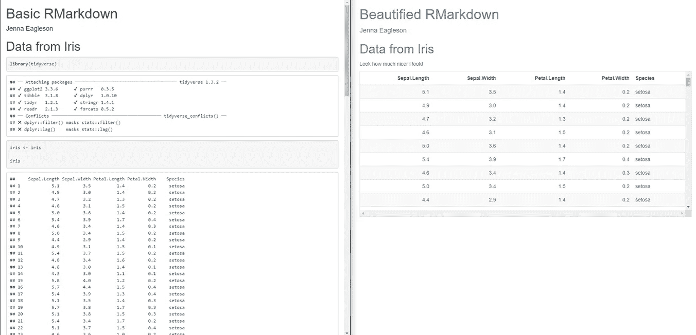

# 4 个快速简单的步骤来美化 R Markdown

> 原文：[`towardsdatascience.com/4-quick-and-easy-steps-to-beautify-r-markdown-f2bdccb358b2?source=collection_archive---------17-----------------------#2023-01-05`](https://towardsdatascience.com/4-quick-and-easy-steps-to-beautify-r-markdown-f2bdccb358b2?source=collection_archive---------17-----------------------#2023-01-05)

## 只需不到两分钟，即可通过几个简单的调整让您的报告看起来更精致

 [Jenna Eagleson](https://jeagleson.medium.com/?source=post_page-----f2bdccb358b2--------------------------------)

·

[关注](https://medium.com/m/signin?actionUrl=https%3A%2F%2Fmedium.com%2F_%2Fsubscribe%2Fuser%2F8300cae51c6c&operation=register&redirect=https%3A%2F%2Ftowardsdatascience.com%2F4-quick-and-easy-steps-to-beautify-r-markdown-f2bdccb358b2&user=Jenna+Eagleson&userId=8300cae51c6c&source=post_page-8300cae51c6c----f2bdccb358b2---------------------post_header-----------) 发表在 [Towards Data Science](https://towardsdatascience.com/?source=post_page-----f2bdccb358b2--------------------------------) · 5 分钟阅读 · 2023 年 1 月 5 日

--

照片由 [Greyson Joralemon](https://unsplash.com/@greysonjoralemon?utm_source=medium&utm_medium=referral) 提供，来源于 [Unsplash](https://unsplash.com/?utm_source=medium&utm_medium=referral)

首先，我喜欢 R Markdown。它是一个奇妙、强大、令人惊叹的工具。它也可能看起来很糟糕，糟糕到你的精美作品可能会因难看的格式而丢失，尤其是在与技术水平较低的观众分享时。这不是对 R Markdown 本身的介绍（一些好的入门地方是[这里](https://rmarkdown.rstudio.com/lesson-1.html)和[这里](https://bookdown.org/yihui/rmarkdown-cookbook/)），而是针对那些已经在 R Markdown 中创建了作品，并希望花额外的几分钟时间使其更加精致和可展示的人。你已经完成了艰苦的工作，现在是让它闪耀的时候了。

这里是我们要去的地方的预览，你可以在本文底部找到完整的代码：

图片由作者提供

按照几乎所有其他 R 教程的风格，我将使用内置的 iris 数据集。

# 1\. 格式化。你的。代码。块。

我不知道包消息和类似信息默认显示是什么残酷的玩笑，但我们今天要停止这种情况。
