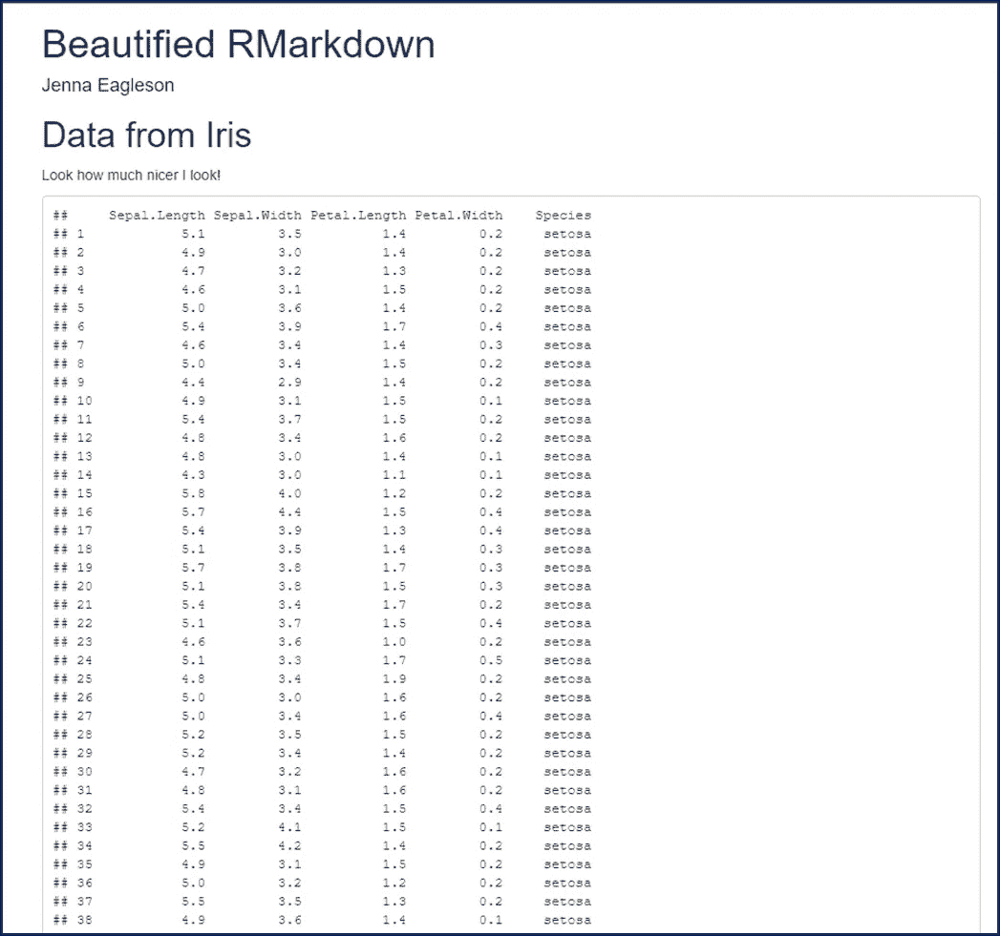
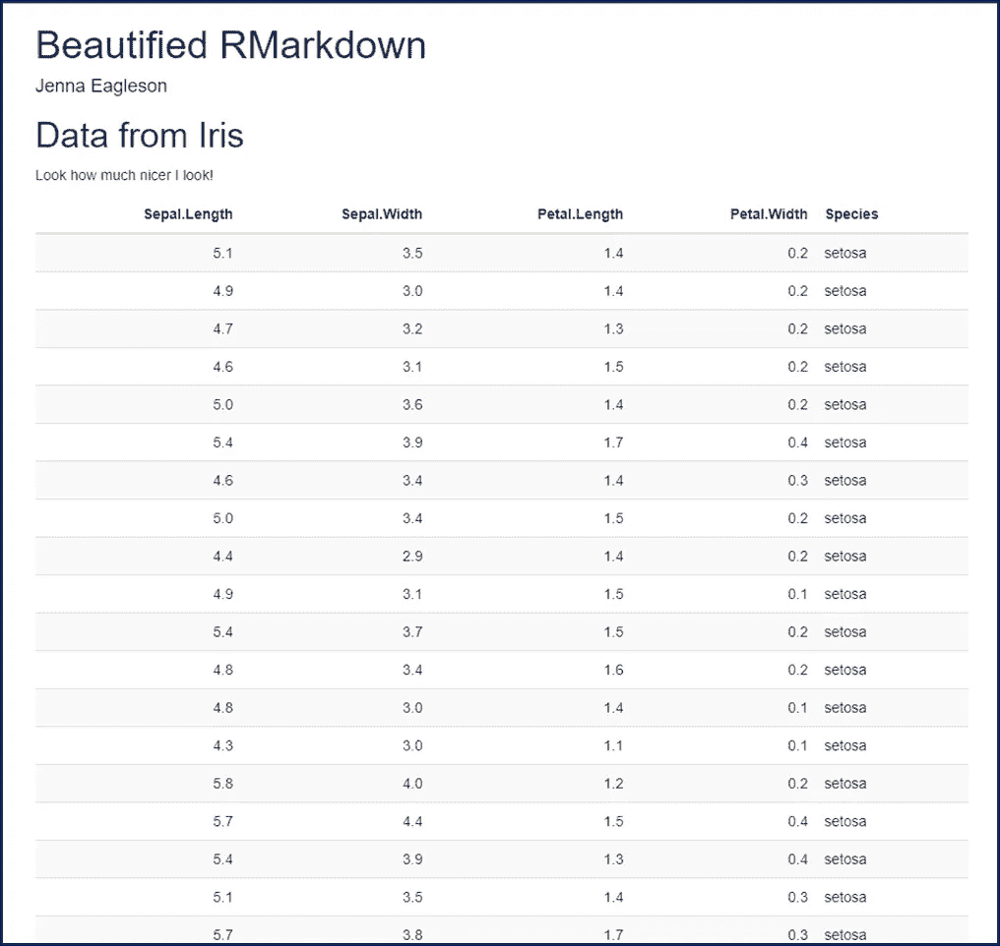
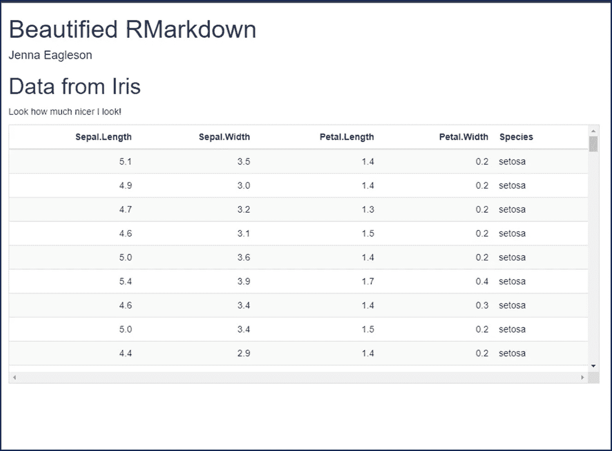
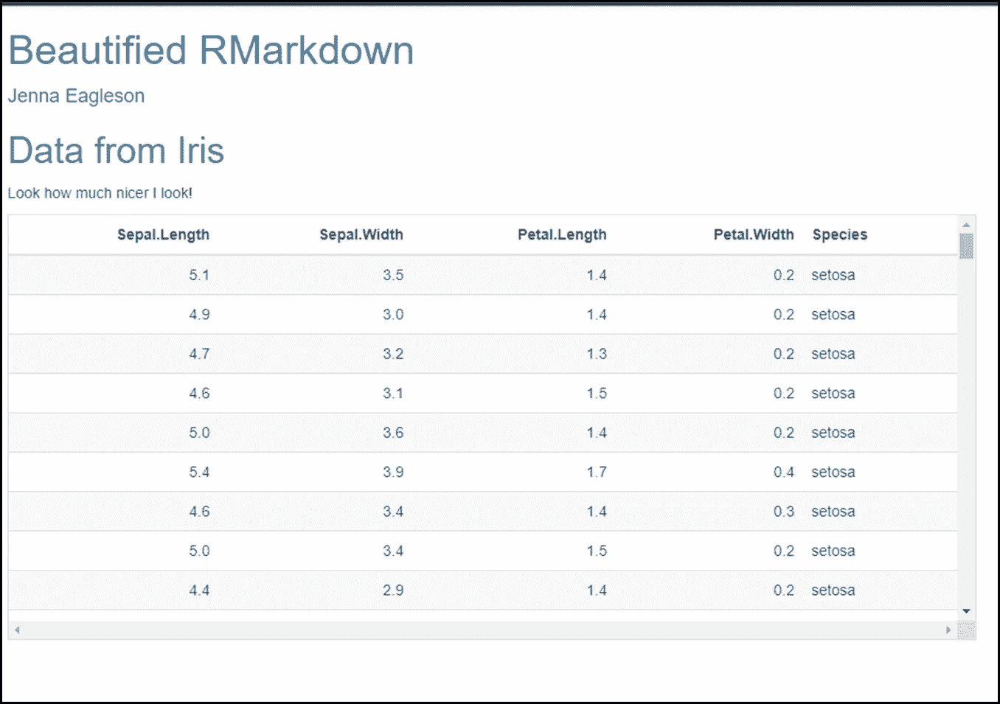

# 4 个快速且简单的步骤来美化 R Markdown

> 原文：[`towardsdatascience.com/4-quick-and-easy-steps-to-beautify-r-markdown-f2bdccb358b2`](https://towardsdatascience.com/4-quick-and-easy-steps-to-beautify-r-markdown-f2bdccb358b2)

## 只需不到两分钟，通过一些简单的调整就能让你的报告看起来更精致

[](https://jeagleson.medium.com/?source=post_page-----f2bdccb358b2--------------------------------)[](https://towardsdatascience.com/?source=post_page-----f2bdccb358b2--------------------------------) [Jenna Eagleson](https://jeagleson.medium.com/?source=post_page-----f2bdccb358b2--------------------------------)

·发布在 [Towards Data Science](https://towardsdatascience.com/?source=post_page-----f2bdccb358b2--------------------------------) ·5 分钟阅读·2023 年 1 月 5 日

--


图片由 [Greyson Joralemon](https://unsplash.com/@greysonjoralemon?utm_source=medium&utm_medium=referral) 提供，来源于 [Unsplash](https://unsplash.com/?utm_source=medium&utm_medium=referral)

首先，我喜欢 R Markdown。它是一个奇妙、强大、令人难以置信的工具。它也可能看起来很糟糕，糟糕到你的美丽辛勤工作可能会因为丑陋的格式而丢失，尤其是与技术水平较低的观众分享时。这不是 R Markdown 本身的介绍（一些好的入门资源可以在 [这里](https://rmarkdown.rstudio.com/lesson-1.html) 和 [这里](https://bookdown.org/yihui/rmarkdown-cookbook/) 找到），而是为那些已经在 R Markdown 中创建了作品并希望花额外几分钟来使其精致和可展示的人。你已经完成了艰苦的工作，是时候让它光彩夺目了。

这里是我们要去的方向的预览，你可以在本文底部找到完整的代码：


作者提供的图片

在几乎所有其他 R 教程的风格中，我将使用内置的 iris 数据集。

# 1\. 格式化你的代码块。

我不知道为什么包消息之类的默认情况下会显示，但我们今天已经停止了这一点。



作者提供的图片。

你可以选择将块选项应用于整个文档，也可以为特定块指定选项。

要设置全局选项，请创建一个这样的代码块：

```py
{r setup, include=FALSE}
knitr::opts_chunk$set(echo = FALSE, 
                      message = FALSE) 
```

如果你想为特定的代码块设置不同的选项，可以在任何块的第一行像这样做：

```py
```{r message = TRUE}

# 你想运行的代码以及要显示的消息

```py
```

有很多[选项](https://www.rstudio.com/wp-content/uploads/2015/03/rmarkdown-reference.pdf?_ga=2.181448033.732613274.1672259951-41030069.1668534778)和规范可以进行尝试，但仅这两个就可以产生很大的不同。

# 2\. 为表格添加样式

如果你将表格保留在默认的 tibble 格式中，你的读者可能会感到困惑。[有许多包可以立即提升表格的可读性](https://rmarkdown.rstudio.com/lesson-7.html)。



图片作者提供。

我个人最喜欢的是 kableExtra 包。[完整的 kableExtra 指南可以在这里找到](https://haozhu233.github.io/kableExtra/awesome_table_in_html.html#Table_Styles)。

```py
iris %>%
  kableExtra::kable() %>%
  kableExtra::kable_styling("striped")
```

只需多加两行，就能从 ICK 变成 ahhh。

再次强调，kableExtra 中的格式化可能性几乎是无限的，所以我鼓励你[查看这份指南](https://haozhu233.github.io/kableExtra/awesome_table_in_html.html#Table_Styles)并尝试一些适合你的样式。

# 3\. 为长表格添加滚动条

是的，我知道这与#2 相关，尽管如此，我仍然认为值得单独提及。

令我烦恼的是，表格在.Rmd 文件中的显示方式通常与我希望它们在 html 文件中显示的方式完全一致。例如，我非常喜欢长表格在显示 10 行后被裁剪，然后可以用箭头查看额外的行。但是，当你编织你的文件时，整个表格会展开，你整洁的报告突然变成了一千页的无尽行。

我希望读者能够选择查看额外的数据行，但我不想强迫他们。



图片作者提供。

你猜是谁又来救场了？kableExtra（我保证我没有赞助）。进入[scroll_box](https://search.r-project.org/CRAN/refmans/kableExtra/html/scroll_box.html)。

```py
iris %>%
  kableExtra::kable() %>%
  kableExtra::kable_styling("striped") %>% 
  kableExtra::scroll_box(width = "100%", height = "400px")
```

如你所见，你可以以像素或百分比指定宽度和高度。我喜欢宽度占满整个屏幕，所以我通常将宽度设置为 100%，400 像素可以显示大约 9 行以及列标题，这对我来说感觉刚好。

# 4\. 添加主题

最后，终极技巧。如果你忽略我说的其他一切，这一调整可以让你从零到英雄，一秒钟就实现。优雅的天才们创造了 CSS 主题奇迹，使报告立刻显得更加专业。[你可以在这里找到现成的主题示例](https://www.datadreaming.org/post/r-markdown-theme-gallery/)。



图片作者提供。

我个人最喜欢的是天蓝色。对你的 YAML 进行轻微调整，可以为报告添加主题：

```py
title: Beautified RMarkdown
author: Jenna Eagleson
output: 
  html_document: 
    theme: cerulean
```

最后一行代码才是关键所在。

我们只是触及了表面，大家。正如所有 R 相关的事物一样，可能性确实是无限的。有没有你特别喜欢的 R Markdown 格式化技巧？有没有什么例子令你所有的审美感官都得到满足？

[***Jenna Eagleson***](https://medium.com/@jeagleson) *我的背景是工业组织心理学，我在人员分析领域找到了归属。数据可视化使我的工作充满生机。我喜欢使用 Power BI、R、Tableau 以及其他遇到的工具进行学习和开发。我很想了解更多关于你的经历！可以通过* [*Linkedin*](https://www.linkedin.com/in/jenna-eagleson/) *或* [*Twitter*](https://twitter.com/JennaEagleson)*与我联系。*

如果你想要更多这样的内容，可以使用我的链接以每月 5 美元的价格注册 Medium（我将获得少量佣金，对你没有额外费用）。

[](https://jeagleson.medium.com/membership?source=post_page-----f2bdccb358b2--------------------------------) [## 通过我的推荐链接加入 Medium - Jenna Eagleson

### 阅读 Jenna Eagleson 的每一篇故事（以及 Medium 上的其他数千位作家的故事）。你的会员费直接支持……

jeagleson.medium.com](https://jeagleson.medium.com/membership?source=post_page-----f2bdccb358b2--------------------------------)

完整代码：

```py
---
title: "Beautified RMarkdown"
author: Jenna Eagleson
output: 
  html_document:
    theme: cerulean
---

```{r setup, include=FALSE}

knitr::opts_chunk$set(echo = FALSE,

                    message = FALSE)

```py

# Data from Iris

Look how much nicer I look!

```{r}

library(tidyverse)

iris <- iris

iris %>%

kableExtra::kable() %>%

kableExtra::kable_styling("striped") %>%

kableExtra::scroll_box(width = "100%", height = "400px")

```py
```
