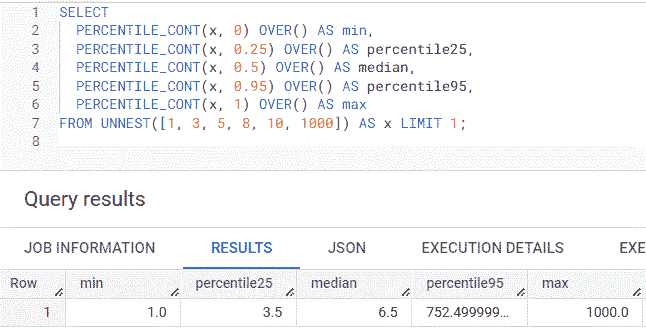
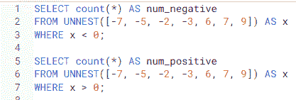
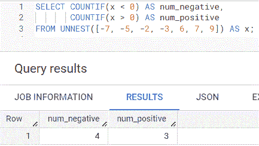
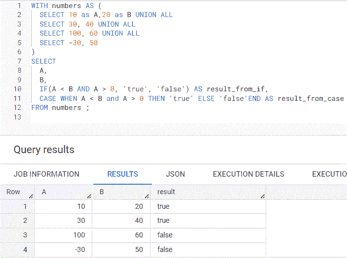
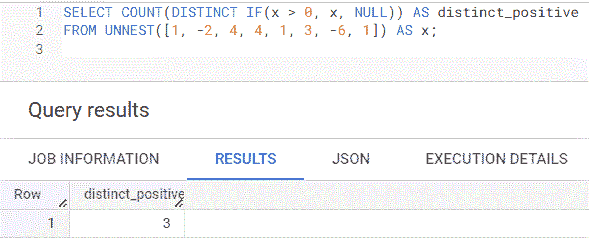
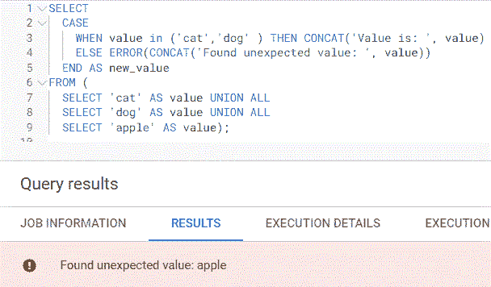

# 4 个你可能不知道的有用 BigQuery SQL 函数

> 原文：[`towardsdatascience.com/4-useful-bigquery-sql-functions-you-may-not-know-82e830d994ca`](https://towardsdatascience.com/4-useful-bigquery-sql-functions-you-may-not-know-82e830d994ca)

## 以及如何使用它们

 [Vicky Yu](https://madfordata.medium.com/?source=post_page-----82e830d994ca--------------------------------)

·发表于 [Towards Data Science](https://towardsdatascience.com/?source=post_page-----82e830d994ca--------------------------------) ·4 分钟阅读·2023 年 1 月 26 日

--

图片来源：[Priscilla Du Preez](https://unsplash.com/@priscilladupreez?utm_source=medium&utm_medium=referral) 在 [Unsplash](https://unsplash.com/?utm_source=medium&utm_medium=referral)

作为长期的 SQL 用户，我总是在寻找简化 SQL 数据分析的方法。在上一篇文章中，我回顾了 6 个 BigQuery SQL 函数我希望自己早些知道的函数，今天我想分享另外 4 个希望你会觉得有用的函数。

## 1\. PERCENTILE_CONT

[PERCENTILE_CONT](https://cloud.google.com/bigquery/docs/reference/standard-sql/navigation_functions#percentile_cont) 计算列中值的百分位数。BigQuery 没有 **MEDIAN** 函数，但你可以使用 **PERCENTILE_CONT** 来计算[中位数，因为它等同于第 50 百分位数](https://www.statisticshowto.com/probability-and-statistics/percentiles-rank-range/)。计算中位数和百分位数对于了解数据分布和确定可能影响分析的异常值非常有用。

在下面的示例中，我有一个包含 6 个数字（1, 3, 5, 8, 10 和 1000）的数组，这些数字通过 **UNNEST** 函数展开成行。第 4 行使用 0.5 作为参数来计算中位数，表示第 50 百分位数，第 5 行使用 0.95 来计算第 95 百分位数。注意结果显示 **95 百分位数** 是 **752**，而 **25 百分位数** 是 **3.5**，**中位数** 是 **6.5**。这表明异常值可能需要在分析中被去除，因为差异非常大。

使用 PERCENTILE_CONT 查询示例的截图由作者创建

## 2\. COUNTIF

[COUNTIF](https://cloud.google.com/bigquery/docs/reference/standard-sql/aggregate_functions#countif) 函数在满足条件时计数。这在从表中获取不同条件的计数时很有用，而不必运行多个 SQL 查询。

在下面的示例中，为了获取负数和正数的计数，我可以使用两种不同的 where 条件在第 3 行和第 7 行运行查询两次。

作者创建的包含 COUNT 查询示例的截图

然而，使用**COUNTIF**我可以一次运行这个查询，以在第 1 行和第 2 行获取正负数的计数。

作者创建的包含 COUNTIF 查询示例的截图

## 3\. IF

[IF](https://cloud.google.com/bigquery/docs/reference/standard-sql/conditional_expressions#if) 是一种替代 [CASE](https://cloud.google.com/bigquery/docs/reference/standard-sql/conditional_expressions#case) 的方法，当你只需要评估一个条件是否为真或假时。在第 10 行，如果 A 小于 B 且 A 大于 0，则**result_from_if**列设置为**true**，否则**result_from_if**设置为**false**。在第 11 行，使用 CASE 可以得到相同的结果，但与使用 IF 函数相比，表达式更长。

作者创建的包含 IF 和 CASE 查询示例的截图

***注意***：你可以将 [COUNT](https://cloud.google.com/bigquery/docs/reference/standard-sql/aggregate_functions#count) 和 IF 与 DISTINCT 结合使用，以获取满足条件的唯一值计数。在下面的示例中，仅计数正数（1、3 和 4），DISTINCT 返回计数为 3。

作者创建的包含 COUNT、IF 和 DISTINCT 查询示例的截图

## 4\. ERROR

[ERROR](https://cloud.google.com/bigquery/docs/reference/standard-sql/debugging_functions#error) 对于警告数据中的意外值非常有用。在下面的示例中，当 CASE 遇到除**cat**或**dog**之外的值时，在第 4 行使用了**ERROR**函数。这在故障排除时很有用，尤其是在 ETL 管道中，你可能希望 SQL 失败，如果列中出现需要调查的意外值。

作者创建的包含 ERROR 查询示例的截图

## 最终思考

虽然我提到的函数在 BigQuery 中可用，但它们可能在其他数据库中也可用，但名称不同。例如，COUNTIF 在 Snowflake 中是 COUNT_IF。如果你有几分钟时间，我强烈建议阅读你的数据库文档，因为你永远不知道会发现哪些有用的函数。

*注意：上述所有查询均在* [*BigQuery sandbox*](https://cloud.google.com/bigquery/docs/sandbox) *上运行，任何拥有 Google 账户的人均可免费使用。*

 ## 4 个 BigQuery SQL 快捷键可以简化你的查询

### 检查你的数据库是否也有这些函数

towardsdatascience.com  ## 6 个 BigQuery SQL 函数每个用户都应该知道

### 检查你的数据库是否也有这些函数

towardsdatascience.com  ## BigQuery SQL 程序语言以简化数据工程

### 介绍

towardsdatascience.com
