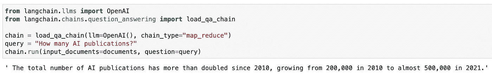
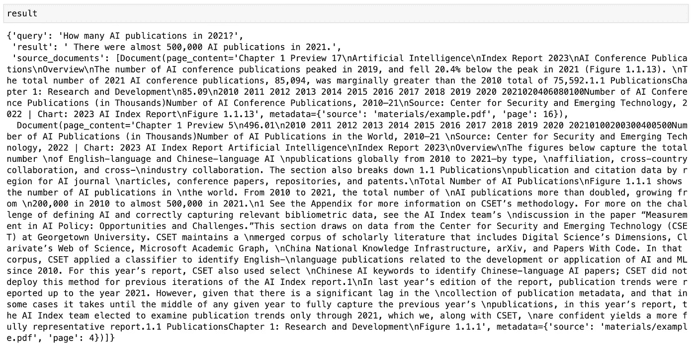
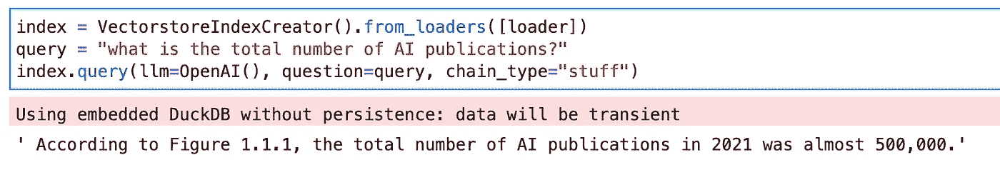
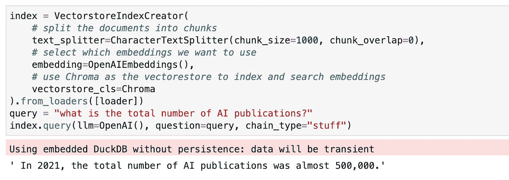
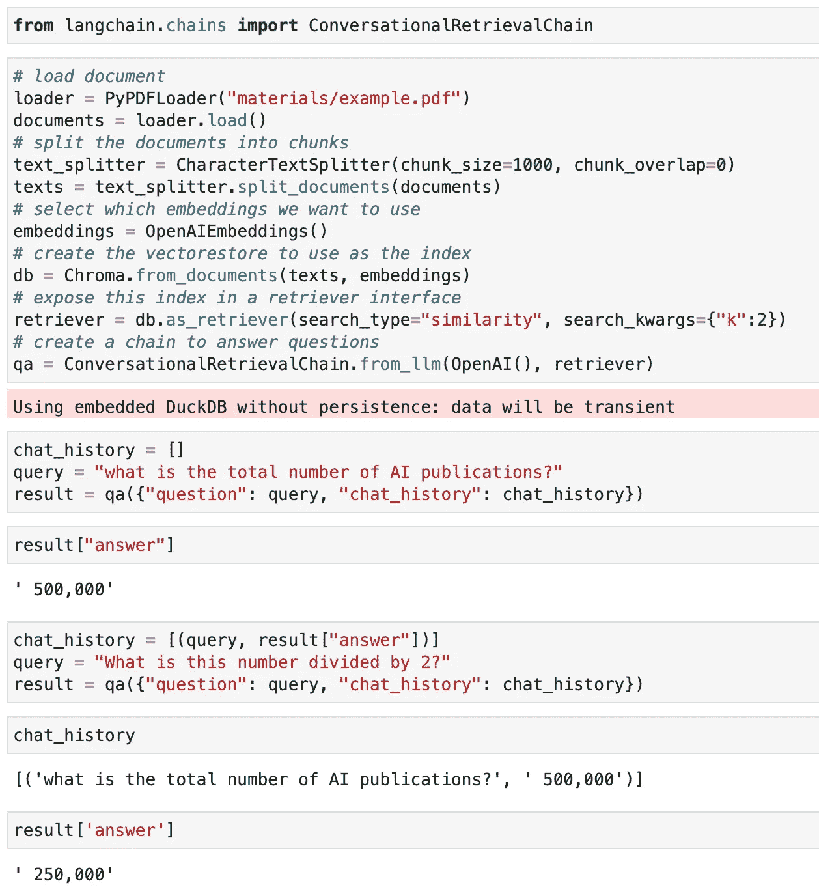

# LangChain 中的 4 种问题回答方式

> 原文：[`towardsdatascience.com/4-ways-of-question-answering-in-langchain-188c6707cc5a?source=collection_archive---------0-----------------------#2023-04-08`](https://towardsdatascience.com/4-ways-of-question-answering-in-langchain-188c6707cc5a?source=collection_archive---------0-----------------------#2023-04-08)

## **与长 PDF 文档对话：load_qa_chain、RetrievalQA、VectorstoreIndexCreator、ConversationalRetrievalChain**

[](https://sophiamyang.medium.com/?source=post_page-----188c6707cc5a--------------------------------)[](https://towardsdatascience.com/?source=post_page-----188c6707cc5a--------------------------------) [Sophia Yang, Ph.D.](https://sophiamyang.medium.com/?source=post_page-----188c6707cc5a--------------------------------)

·

[关注](https://medium.com/m/signin?actionUrl=https%3A%2F%2Fmedium.com%2F_%2Fsubscribe%2Fuser%2Fae9cae9cbcd2&operation=register&redirect=https%3A%2F%2Ftowardsdatascience.com%2F4-ways-of-question-answering-in-langchain-188c6707cc5a&user=Sophia+Yang%2C+Ph.D.&userId=ae9cae9cbcd2&source=post_page-ae9cae9cbcd2----188c6707cc5a---------------------post_header-----------) 发表在 [Towards Data Science](https://towardsdatascience.com/?source=post_page-----188c6707cc5a--------------------------------) ·6 分钟阅读·2023 年 4 月 8 日[](https://medium.com/m/signin?actionUrl=https%3A%2F%2Fmedium.com%2F_%2Fvote%2Ftowards-data-science%2F188c6707cc5a&operation=register&redirect=https%3A%2F%2Ftowardsdatascience.com%2F4-ways-of-question-answering-in-langchain-188c6707cc5a&user=Sophia+Yang%2C+Ph.D.&userId=ae9cae9cbcd2&source=-----188c6707cc5a---------------------clap_footer-----------)

--

[](https://medium.com/m/signin?actionUrl=https%3A%2F%2Fmedium.com%2F_%2Fbookmark%2Fp%2F188c6707cc5a&operation=register&redirect=https%3A%2F%2Ftowardsdatascience.com%2F4-ways-of-question-answering-in-langchain-188c6707cc5a&source=-----188c6707cc5a---------------------bookmark_footer-----------)

你是否对与自己的文档对话感兴趣，无论是文本文件、PDF 还是网站？LangChain 使得在文档中进行问题回答变得简单。但你知道在 LangChain 中至少有 4 种方式可以进行问题回答吗？在这篇博客文章中，我们将深入探讨四种不同的提问方式以及你可以考虑的各种选项。

在我们深入探讨问答之前，你可能会问：什么是 LangChain？好问题！在我看来，LangChain 是与语言模型互动并构建应用程序的最简单方法。它是一个**开源**工具，封装了许多 LLM 和工具。查看我之前的 博客文章 和 [视频](https://www.youtube.com/watch?v=kmbS6FDQh7c) 以了解 LangChain 的概述。

好的，现在让我们开始对外部文档进行问答。

**代码**：查看本博客文章的代码 [这里](https://github.com/sophiamyang/tutorials-LangChain/blob/main/LangChain_QA.ipynb)。

# 设置 OpenAI API

在 OpenAI 上创建一个帐户并生成 API 密钥：[`platform.openai.com/account`](https://platform.openai.com/account)。请注意，OpenAI API 并非免费。你需要在此处设置账单信息才能使用 OpenAI API。或者，你可以使用 HuggingFace Hub 或其他地方的模型。查看我之前的 博客文章 和 [视频](https://www.youtube.com/watch?v=kmbS6FDQh7c) 来了解如何使用其他模型。

```py
import os 
os.environ["OPENAI_API_KEY"] = "COPY AND PASTE YOUR API KEY HERE"
```

# 加载文档

LangChain 支持许多 [文档加载器](https://python.langchain.com/en/latest/modules/indexes/document_loaders.html)，例如 Notion、YouTube 和 Figma。在这个例子中，我想与我的 PDF 文件进行对话。因此，我使用了 PyPDFLoader 来加载我的文件。我实际使用的是 [AI index report](https://aiindex.stanford.edu/report/) 的第一章，其中包括 55 页，并将其保存在我 GitHub [库](https://github.com/sophiamyang/tutorials-LangChain) 的材料目录中。

```py
# load document
from langchain.document_loaders import PyPDFLoader
loader = PyPDFLoader("materials/example.pdf")
documents = loader.load()
```

# **方法 1：load_qa_chain**

`load_qa_chain` 提供了最通用的问答接口。它加载一个链，你可以对输入文档进行问答，并使用文档中的所有文本。



它还允许你对一组文档进行问答：

```py
### For multiple documents 
loaders = [....]
documents = []
for loader in loaders:
    documents.extend(loader.load())
```

🤔***但如果我的文档非常长，超出了令牌限制怎么办？***

有两种解决方法：

## **解决方案 1：链式类型**

默认的 `chain_type="stuff"` 使用了文档中所有的文本。实际上，它不适用于我们的例子，因为它超出了令牌限制并导致速率限制错误。这就是为什么在这个例子中，我们不得不使用其他链式类型，比如 `"map_reduce"`。还有哪些其他链式类型？

+   `map_reduce`：它将文本分成批次（例如，你可以在 `llm=OpenAI(batch_size=5)` 中定义批次大小），分别将每个批次的问题传递给 LLM，并根据每个批次的答案得出最终答案。

+   `refine`：它将文本分成批次，将第一个批次传递给 LLM，然后将答案和第二个批次传递给 LLM。它通过处理所有批次来完善答案。

+   `map-rerank`：它将文本分成批次，逐个批次地输入到 LLM 中，返回每个批次对问题的回答完整程度的评分，并根据每个批次中高评分的回答得出最终答案。

## 解决方案 2：RetrievalQA

使用所有文本的一个问题是，成本可能非常高，因为你将所有文本都传送给 OpenAI API，而 API 是按令牌数量收费的。更好的解决方案是先检索相关文本块，然后仅在语言模型中使用相关文本块。接下来，我将详细介绍 RetrievalQA。

# 方法 2：RetrievalQA

`RetrievalQA` 链实际上在底层使用 `load_qa_chain`。我们检索最相关的文本块，并将这些文本块输入到语言模型中。

其工作原理如下：

```py
from langchain.chains import RetrievalQA
from langchain.indexes import VectorstoreIndexCreator
from langchain.text_splitter import CharacterTextSplitter
from langchain.embeddings import OpenAIEmbeddings
from langchain.vectorstores import Chroma

# split the documents into chunks
text_splitter = CharacterTextSplitter(chunk_size=1000, chunk_overlap=0)
texts = text_splitter.split_documents(documents)
# select which embeddings we want to use
embeddings = OpenAIEmbeddings()
# create the vectorestore to use as the index
db = Chroma.from_documents(texts, embeddings)
# expose this index in a retriever interface
retriever = db.as_retriever(search_type="similarity", search_kwargs={"k":2})
# create a chain to answer questions 
qa = RetrievalQA.from_chain_type(
    llm=OpenAI(), chain_type="stuff", retriever=retriever, return_source_documents=True)
query = "How many AI publications in 2021?"
result = qa({"query": query})
```

在结果中，我们可以看到答案和两个源文档，因为我们将 k 定义为 2，这意味着我们只关心获取两个相关的文本块。



## 选项：

在这个过程中你可以选择各种选项：

+   [嵌入](https://python.langchain.com/en/latest/reference/modules/embeddings.html)：在示例中，我们使用了 OpenAI 嵌入。但还有许多其他嵌入选项，如 Cohere Embeddings 和来自特定模型的 HuggingFaceEmbeddings。

+   [文本分割器](https://python.langchain.com/en/latest/modules/indexes/text_splitters.html)：在示例中，我们使用了按单个字符分割的 Character Text Splitter。你也可以使用不同的文本分割器和不同的令牌，具体请参见此 [文档](https://python.langchain.com/en/latest/modules/indexes/text_splitters.html)。

+   [向量存储](https://python.langchain.com/en/latest/modules/indexes/vectorstores.html)：我们使用了 Chroma 作为我们的向量数据库，用于存储嵌入的文本向量。其他流行的选项包括 FAISS、Milvus 和 Pinecone。

+   [检索器](https://python.langchain.com/en/latest/modules/indexes/retrievers.html)：我们使用了一个 VectoreStoreRetriver，它由 VectorStore 支持。为了检索文本，你可以选择两种搜索类型：[search_type](https://python.langchain.com/en/latest/modules/indexes/vectorstores/examples/chroma.html#mmr)：“similarity” 或 “mmr”。`search_type="similarity"` 使用检索器对象中的相似性搜索，其中选择最与问题向量相似的文本块向量。`search_type="mmr"` 使用最大边际相关性搜索，它在优化查询相似性和选择文档的多样性之间取得平衡。

+   [链类型](https://python.langchain.com/en/latest/modules/chains/index_examples/question_answering.html)：与方法 1 相同。你也可以将链类型定义为四种选项之一：“stuff”、“map reduce”、“refine”、“map_rerank”。

# **方法 3：VectorstoreIndexCreator**

VectorstoreIndexCreator 是上述功能的封装器。它在底层功能上完全相同，但提供了更高级的接口，让你可以用三行代码开始使用：



当然，你也可以在这个包装器中指定不同的选项。



# **方法 4：ConversationalRetrievalChain**

ConversationalRetrievalChain 与方法 2 RetrievalQA 非常相似。它增加了一个额外的参数 `chat_history` 用于传递聊天记录，这可以用于后续的问题。

*ConversationalRetrievalChain = 对话记忆 + RetrievalQAChain*

如果你希望你的语言模型记住之前的对话，可以使用这种方法。在我下面的例子中，我询问了 AI 发表的数量，并得到了 500,000 的结果。然后我让 LLM 将这个数字除以 2。由于它拥有所有聊天记录，模型知道我指的是 500,000，因此返回的结果是 250,000。



# 结论

现在你知道了四种使用 LangChain 中 LLM 进行问答的方法。总结起来，load_qa_chain 使用所有文本并接受多个文档；RetrievalQA 在底层使用 load_qa_chain，但首先检索相关的文本块；VectorstoreIndexCreator 与 RetrievalQA 相同，但提供了更高层次的接口；ConversationalRetrievalChain 在你想将聊天记录传递给模型时非常有用。

# **致谢**：

感谢 Harrison Chase 的指导！


照片由 [FLY:D](https://unsplash.com/@flyd2069?utm_source=unsplash&utm_medium=referral&utm_content=creditCopyText) 提供，来源于 [Unsplash](https://unsplash.com/photos/ZNOxwCEj5mw?utm_source=unsplash&utm_medium=referral&utm_content=creditCopyText)。

. . .

由 [Sophia Yang](https://www.linkedin.com/in/sophiamyang/) 提供，日期为 2023 年 4 月 8 日

Sophia Yang 是高级数据科学家。可以在 [LinkedIn](https://www.linkedin.com/in/sophiamyang/)、[Twitter](https://twitter.com/sophiamyang) 和 [YouTube](https://www.youtube.com/SophiaYangDS) 上与我联系，并加入 DS/ML [书友会](https://dsbookclub.github.io/) ❤️
