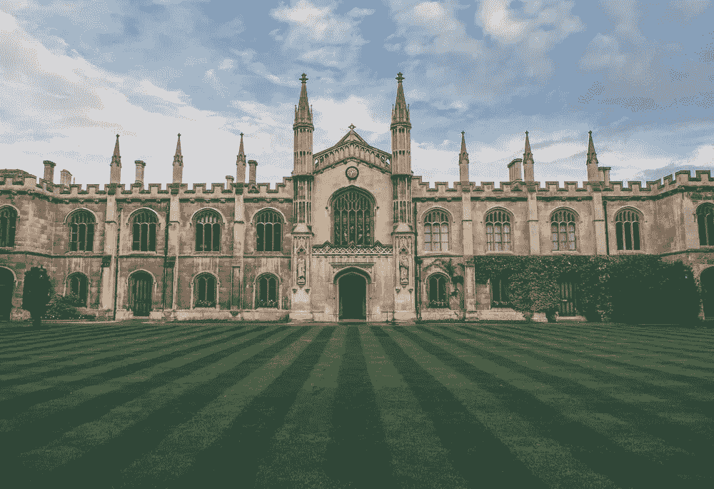

# 如何最大化利用你的数据科学学位

> 原文：[`towardsdatascience.com/4-ways-to-get-the-most-out-of-your-data-science-degree-40815f6a311d?source=collection_archive---------9-----------------------#2023-05-23`](https://towardsdatascience.com/4-ways-to-get-the-most-out-of-your-data-science-degree-40815f6a311d?source=collection_archive---------9-----------------------#2023-05-23)

## 我如何平衡 (1) 享受我的学位和 (2) 为大学后的“现实世界”做好准备的这两方面

 [Matt Chapman](https://medium.com/@mattchapmanmsc?source=post_page-----40815f6a311d--------------------------------)

·

[关注](https://medium.com/m/signin?actionUrl=https%3A%2F%2Fmedium.com%2F_%2Fsubscribe%2Fuser%2Fbf7d13fc53db&operation=register&redirect=https%3A%2F%2Ftowardsdatascience.com%2F4-ways-to-get-the-most-out-of-your-data-science-degree-40815f6a311d&user=Matt+Chapman&userId=bf7d13fc53db&source=post_page-bf7d13fc53db----40815f6a311d---------------------post_header-----------) 发表在 [Towards Data Science](https://towardsdatascience.com/?source=post_page-----40815f6a311d--------------------------------) ·9 min read·2023 年 5 月 23 日

--

图片来自 [Vadim Sherbakov](https://unsplash.com/@madebyvadim) 在 [Unsplash](https://unsplash.com/photos/d6ebY-faOO0)

那是 2021 年 3 月，我刚刚收到一封即将改变我人生轨迹的电子邮件。

“我写信通知你，我们希望向你提供 2021 年进入牛津大学的录取。”

我想我可能尖叫了一下，或者做了个傻乎乎的舞蹈，也许两者都有。

能进入牛津大学对我来说是一个巨大的成就。我早就知道我想要转行进入数据科学领域，与我的一些同学不同，我并不是直接从本科毕业就开始这条路。我已经工作了几年，自毕业以来，我进入这个领域时有两个非常明确的目标：

1.  享受它

1.  为在行业中担任数据科学家做好准备

然而，我很快发现，在你的学位课程中平衡这两个目标是相当困难的。在这篇文章中，我将分享 4 个对我有效的方法，希望它们也能对你有所帮助。

# 与现实生活中的组织合作撰写论文
