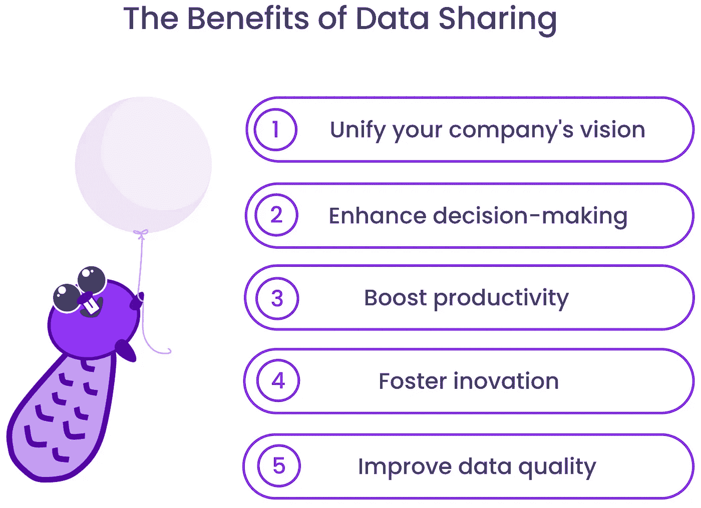

# 数据共享的 5 个好处

> 原文：[`towardsdatascience.com/5-benefits-of-data-sharing-5ad8efde3385?source=collection_archive---------16-----------------------#2023-01-13`](https://towardsdatascience.com/5-benefits-of-data-sharing-5ad8efde3385?source=collection_archive---------16-----------------------#2023-01-13)

## 使数据民主化以释放其全部潜力

 [Louise de Leyritz](https://medium.com/@louise.de.leyritz?source=post_page-----5ad8efde3385--------------------------------)

·

[关注](https://medium.com/m/signin?actionUrl=https%3A%2F%2Fmedium.com%2F_%2Fsubscribe%2Fuser%2Fa926de8a6b3f&operation=register&redirect=https%3A%2F%2Ftowardsdatascience.com%2F5-benefits-of-data-sharing-5ad8efde3385&user=Louise+de+Leyritz&userId=a926de8a6b3f&source=post_page-a926de8a6b3f----5ad8efde3385---------------------post_header-----------) 发表在 [Towards Data Science](https://towardsdatascience.com/?source=post_page-----5ad8efde3385--------------------------------) · 6 分钟阅读 · 2023 年 1 月 13 日 

--

数据共享在许多组织中正成为常态，因为对从数据中提供价值的压力越来越大。事实上，[2023 年是工作场所投资回报率之年，](https://www.forbes.com/sites/ericmosley/2023/01/04/2023-is-the-year-of-roi-in-the-workplace/?sh=5b13d3bb6c98) 这也包括数据。

无论你称之为数据网格、数据操作化、数据激活还是数据民主化，其核心理念是相同的：即向**业务团队**提供数据，帮助他们自主做出基于数据的决策。

数据共享的原则很简单：

1.  **每个人**都应该能够访问他们所需的数据，而不仅仅是某些角色或职位。

1.  应该**没有障碍**阻止人们获取他们所需的数据。

1.  数据应以一种便于任何人**访问、理解和使用**的方式组织和结构化。

数据共享与自助服务的概念相一致，因为它消除了手动数据传递的需求。

有些人认为数据共享令人望而生畏。如果这导致混乱和混沌怎么办？好消息是，适当实施数据共享的好处通常会超过任何潜在的负面结果。

在这篇文章中，我将分享 5 个理由，说明为什么你应该开始与业务团队共享数据，以及你可以预期的积极影响。在即将到来的文章中，我将进一步探讨数据共享的正确实施方法。

数据共享可以为您的组织带来许多显著的好处，包括统一公司愿景、改善决策制定和提高生产力。此外，数据共享还可以帮助促进创新，并推动公司内部数据质量的提升。让我们深入了解一下！

‍

数据共享的好处 — 图片由[Castor](https://www.castordoc.com/)提供

# 1 — 统一公司的愿景

数据共享有潜力通过创建一个员工可以自主访问和使用所需数据的市场，来使不同团队围绕公司战略达成一致。

在实践中，这意味着所有部门都可以访问相同的数据及其相关背景。也就是说，它让每个人在定义、指标计算方式和最佳数据集使用方面达成共识。这确保了每个人使用相同的语言，基于共享的定义和词汇。这会导致不同部门产生的一致报告。

在缺乏数据共享的情况下，各部门可能会孤立运作，它们的报告经常出现不一致的情况。其风险在于，各单位可能对相同概念使用不同的定义和计算方法。当人们有不同的定义时，他们的报告内容也会不同。相互矛盾的报告会减慢决策速度，并导致信任的侵蚀。数据共享使公司能够消除这种不一致。

此外，数据共享提供了对组织运作方式的更大透明度。每个部门可以跟踪进展，看到全局。这可以促进合作，帮助大家朝着相同的目标努力，而不是专注于各自孤立的观点。

# 2 - 提升决策能力

一旦你开放数据访问，通常会看到决策能力的提升。

当业务部门能够访问相关数据时，他们能够做出有根据和准确的决策。不再需要猜测或依赖直觉。

数据共享确保业务团队在日常操作中整合数据而不妨碍速度。这样，数据可以支持所有部门的实时决策，并通过报告促进长期战略决策。

此外，数据民主化消除了决策过程中的传统瓶颈。当只有技术团队能够访问数据时，其他团队必须寻求他们的帮助来获取信息。

在许多组织中，向各种用户分发数据仍然是手动进行的。首先，业务用户请求一个数据集。然后，分析团队接收请求，解读请求，并尝试与业务团队确认请求。当解释错误时，这种小范围的来回交流可能会持续一段时间。

这延迟了决策过程并加重了技术团队的负担。此外，需要跟上业务人员请求的数据团队扩展性差。

数据共享解放了分析团队，使其能够进行更深入、更有意义的数据分析。当分析可以脱离基本报告 — 向其他团队提供数据事实，和回答票务问题 — 时，他们可以专注于我们真正需要分析师技能的地方。

总的来说，数据共享改善了决策制定，同时释放了技术团队宝贵的时间。简而言之，这意味着每个人都能做出更好、更快、更聪明的决定。还有什么不喜欢的呢？

# 3 — 提高生产力

这还不止于此。数据共享还影响到所有团队的**生产力**。

当利益相关者能够访问单一真实来源时，他们可以更快地完成任务。

依赖手动过程来请求和交付数据时，速度是一个主要问题。通过数据共享，利益相关者不需要花时间寻找数据或等待他人提供数据。这也减少了错误的风险，因为员工可以访问最新和最准确的数据。

数据共享还消除了重复的工作和仪表板的重建。如果某些东西已经存在，利益相关者会知道。他们会在现有的基础上进行改进，而不是从头开始一个新项目。而且，重用比重建更高效。

当部门孤立运行时，不同团队会花时间重建相同的东西。这是因为他们没有检查某个材料是否已经存在的方式。

数据共享因此使组织能够利用其集体知识。这节省了时间和资源，使组织更高效、更具生产力。

# 4- 促进创新

数据共享通过增加跨部门协作和消除团队之间的壁垒来促进创新。

正如之前所述，数据共享使员工能够访问和使用他们可能无法自己获得的数据。这可以激发他们之前未曾考虑过的新想法和方法。

例如，如果市场部门的员工可以访问销售部门的数据，他们可能会发现新的方法来定位潜在客户或优化他们的营销策略。

其次，数据共享促进了团队之间的合作。它使个人可以看到其他人正在做什么，并分享他们自己的想法和见解。这可以带来新的视角和方法。这些通常不会在团队各自独立时出现。

因此，数据共享可以创造一个有利于创新的环境。它为员工提供了与同事合作和分享见解所需的信息。这将带来更好的产品、服务和流程。

# 5 — 改善数据质量

分享就是关心，特别是当涉及到数据时。事实上，数据共享可以帮助提高数据质量。数据共享增加了对数据准确性和完整性的审查和验证。

随着更多的人查看数据，更容易发现错误或数据质量差的地方。这带来了更大的**数据质量**责任，并能够修复可能出现的任何问题。

数据共享还增强了对数据可靠性的信任。当小组控制数据时，其他人可能很难验证其**准确性**或理解其收集的背景。

这可能导致对数据的怀疑和不信任，从而成为决策的障碍。因此，数据共享使每个人更容易**理解和信任**他们使用的数据。

因此，数据共享意味着更好的数据质量、增强的决策能力和改进的背景。这一切可以导致更智能的决策和不同部门之间更大的协调。这对我来说毫无疑问。

# 结论

数据共享将因两个原因继续获得关注：

1.  公司希望充分利用其数据，因为从数据中获得投资回报的压力在增加。

1.  越来越多的工具正在开发，以使数据对业务用户更容易访问。

数据共享有潜力改善战略对齐和增强决策过程。它还可以提高生产力、促进创新和改善数据质量。

然而，需要注意的是，如果实施不当，数据共享可能会导致混乱和混沌。我的下一篇文章将重点探讨如何以避免这些陷阱的方式建立数据共享，并帮助组织实现数据民主化的最终好处。敬请关注！

*最初发布于* [*https://www.castordoc.com*](https://www.castordoc.com/blog/5-benefits-of-data-sharing)*。*
