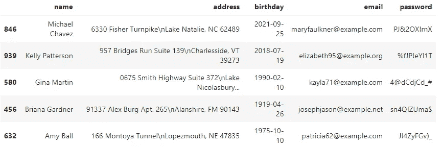
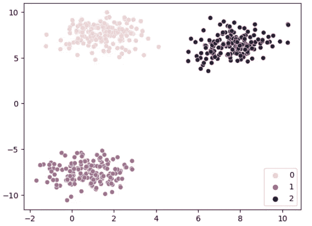
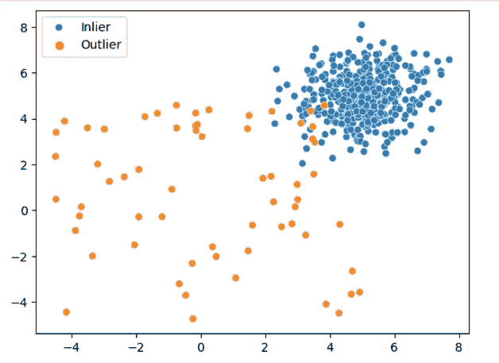
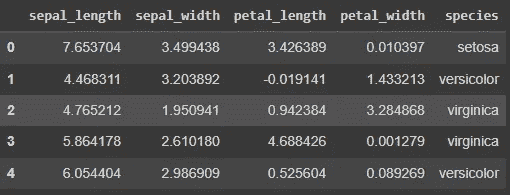
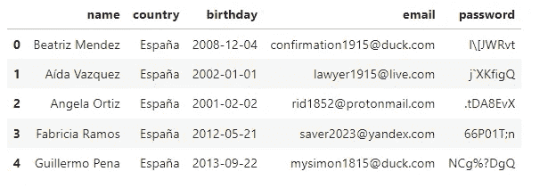
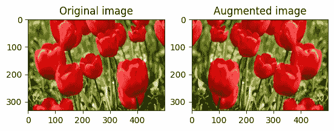
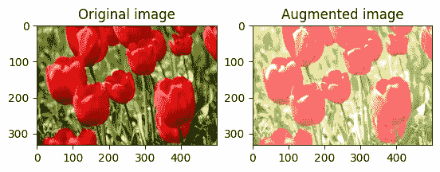

# 5 种最佳 Python 合成数据生成器及如何在数据不足时使用它们

> 原文：[`towardsdatascience.com/5-best-python-synthetic-data-generators-and-how-to-use-them-when-you-lack-data-f62bcf62d43c`](https://towardsdatascience.com/5-best-python-synthetic-data-generators-and-how-to-use-them-when-you-lack-data-f62bcf62d43c)

## 获取更多数据

[](https://ibexorigin.medium.com/?source=post_page-----f62bcf62d43c--------------------------------)[](https://towardsdatascience.com/?source=post_page-----f62bcf62d43c--------------------------------) [Bex T.](https://ibexorigin.medium.com/?source=post_page-----f62bcf62d43c--------------------------------)

·发表于[Towards Data Science](https://towardsdatascience.com/?source=post_page-----f62bcf62d43c--------------------------------) ·阅读时间 8 分钟·2023 年 1 月 23 日

--


**图片来源** [**Maxim Berg**](https://unsplash.com/@maxberg?utm_source=unsplash&utm_medium=referral&utm_content=creditCopyText)

2021 年，每天产生了 2.5 万亿字节（2.5 百万 TB）的数据。今天的量更大。但显然，这还不够，因为 Python 生态系统中有许多库用于生成合成数据。有些可能是为了生成合成数据而创建的，但大多数都有有益的应用，例如：

+   机器学习：当真实数据不可用或难以获得用于模型训练时

+   数据隐私和安全：用真实但非实际的数据替换数据集中的敏感信息

+   测试和调试：在受控环境中使用合成数据测试和调试软件

+   数据增强：使用机器学习或统计方法从现有数据中人工生成更多数据点

本文将展示六个用于上述目的的 Python 库及其使用方法。

## 使用 Faker 生成随机用户信息

Faker 是最早的 Python 库之一，用于生成各种随机信息。一些常用的 Faker 生成的属性包括：

+   个人信息：姓名、生日、电子邮件、密码、地址

+   各种日期和时区信息

+   财务细节：信用卡、社会安全号码、银行信息

+   杂项：URLs、句子、语言代码

诸如此类。

它也有一个直观的 API。在初始化一个`Faker`类后，你可以通过调用它的方法来生成一个新的虚假项目：

```py
from faker import Faker

fake = Faker()

>>> fake.name()
'Nicole Perkins'

>>> fake.address()
'11669 Foster Cliffs Suite 161\nPort Elizabethfurt, OK 47591'

>>> fake.url()
'http://www.wade.com/'
```

所有这些方法在每次调用时都会返回新的项目，因此使用如下的代码片段构建一个人工 CSV 数据集非常简单：

```py
import pandas as pd

df = pd.DataFrame(
    [
        {
            "name": fake.name(),
            "address": fake.address(),
            "birthday": fake.date_of_birth(),
            "email": fake.email(),
            "password": fake.password(),
        }
        for _ in range(1000)
    ]
)

df.to_csv("data/fake.csv", index=False)
```

```py
df.sample(5)
```



作者提供的图片

如果你注意到，姓名和电子邮件地址不匹配。这是使用 Faker 的一个缺点——Faker 生成的数据集在公开使用时很容易被识别。

了解更多内容，请访问 [文档](https://faker.readthedocs.io/en/master/)。

## Sklearn 用于机器学习任务的合成数据集

Sklearn 是一个如此广泛且出色的库，它专门支持合成数据生成。

其 `datasets` 模块包含了许多生成各种机器学习任务的人工数据集的函数。最受欢迎的函数是 `make_classification` 和 `make_regression`。

两者都有 `n_samples` 和 `n_features` 参数来控制生成的合成数据集的行数和特征数。

```py
from sklearn.datasets import make_classification, make_regression

X, y = make_classification(
    n_samples=5000, n_features=20, n_informative=15, n_classes=3, n_clusters_per_class=3
)

X, y = make_regression(n_samples=5000, n_features=20, n_informative=10)
```

为了控制任务的难度，你可以指定多少特征是有用的或冗余的，使用 `n_informative`（相关）或 `n_redundant`（信息特征的线性组合）参数。

`make_classification` 还提供了对分类目标的多种控制，即类别数、每个类别的簇数以及类别权重。

下面还有 `make_blobs` 函数用于生成聚类任务：

```py
import seaborn as sns
from sklearn.datasets import make_blobs

X, y = make_blobs(n_samples=500, n_features=2)

sns.scatterplot(X[:, 0], X[:, 1], hue=y);
```



作者提供的图像

如果你在寻找一些花哨的功能，还有其他函数，如 [make_checkerboard](https://scikit-learn.org/stable/modules/generated/sklearn.datasets.make_checkerboard.html)、[make_circles](https://scikit-learn.org/stable/modules/generated/sklearn.datasets.make_circles.html)、[make_moons](https://scikit-learn.org/stable/modules/generated/sklearn.datasets.make_moons.html) 和 [make_s_curve](https://scikit-learn.org/stable/modules/generated/sklearn.datasets.make_s_curve.html)。

## PyOD 中的离群值数据集

异常检测是数据科学中的一个普遍问题。但如果你想进行练习，质量高的带有离群值的数据集很难获得。幸运的是，Python Outlier Detection (PyOD) 库提供了一个生成带离群值的合成数据的实用函数：

```py
from pyod.utils.data import generate_data
import seaborn as sns
import matplotlib.pyplot as plt

X, y = generate_data(
    n_train=500, contamination=0.13, n_features=2, train_only=True, random_state=1
)

# Plot
sns.scatterplot(X[:, 0], X[:, 1], hue=y)

# Modify the damn legend
legend = plt.legend(labels=['Inlier', 'Outlier'])
legend.legendHandles[1].set_color("orange")
```



作者提供的图像

`generate_data` 提供了对训练集和测试集行数的控制，并且可以调整结果集中离群值的百分比（`contamination`）。

PyOD 还拥有 Python 生态系统中最大的异常检测算法套件。要了解更多信息，你可以查看 [我的异常检测课程](https://app.datacamp.com/learn/courses/anomaly-detection-in-python)。

## 使用 CTGAN 在另一个数据集之上生成合成数据

现在，进入精彩内容。

当数据有限时，机器学习模型很难很好地泛化而不会过拟合。在这种情况下，你可以使用条件生成对抗网络——CTGAN。

在你将其拟合到任何数据集后，CTGAN 可以从数据集的信息空间中生成高度匿名的合成样本。这是一种有效增加数据安全性和数据集规模的方法。

[CTGAN](https://github.com/sdv-dev/CTGAN)由[合成数据库 (SDV) 项目](https://github.com/sdv-dev)提供。它的 Python API 公开了一个`CTGAN`类，该类需要学习的数据集和其分类列的列表。

然后，你可以使用`sample`函数从中抽取任意数量的样本。下面，我们从陈词滥调的鸢尾花数据集中抽取了 20k 个合成样本：

```py
import seaborn as sns
import pandas as pd
from ctgan import CTGAN

# Extract categorical data types
iris = sns.load_dataset("iris")
categoricals = iris.select_dtypes(exclude="number").columns.tolist()

# Fit CTGAN
ctgan = CTGAN(epochs=10)
ctgan.fit(iris, categoricals)

# Generate the data
synthetic_iris = ctgan.sample(20000)
synthetic_iris.head()
```



作者提供的图像。 [鸢尾花数据集 (CC By 4.0).](https://archive-beta.ics.uci.edu/dataset/53/iris)

## Mimesis — 高级伪造工具

Mimesis 是一个建立在 Faker 基础上的完整随机信息生成器。它可以生成比 Faker 更多的随机属性：

```py
from mimesis import Generic
from mimesis.locales import Locale

# Spanish locale
fake = Generic(Locale.ES)

print(dir(fake))
```

```py
address     code           development  food      locale   payment  text     
binaryfile  cryptographic  file         hardware  numeric  person   transport
choice      datetime       finance      internet  path     science
```

它的随机生成器被分为 20 个类别，这使得 Mimesis 更加有条理。

它还大力支持 32 个地区（语言）的国家特定信息。下面，我们生成了一千行虚假的西班牙数据：

```py
from mimesis import Generic
from mimesis.locales import Locale
import pandas as pd

# Spanish locale
fake = Generic(Locale.ES)

df = pd.DataFrame(
    [
        {
            "name": fake.person.full_name(),
            "country": fake.address.country(),
            "birthday": fake.datetime.date(),
            "email": fake.person.email(),
            "password": fake.person.password(),
        }
        for _ in range(1000)
    ]
)

df.head()
```



作者提供的图像

你还可以创建自定义地区，其中你可以结合多种语言以获取区域特定的信息，即特定于西欧的数据。

从其[大量文档](https://mimesis.name/en/v6.0.0/index.html)中了解更多信息。

## 使用 TensorFlow 进行图像增强

在计算机视觉问题中，人工增加图像数据集规模的最有效方法之一是数据增强。

这个方法很简单：当你拥有一个小的图像数据集，数据量太小以至于神经网络无法有效训练时，你可以通过使用各种随机图像转换来增加图像数量。这样，网络将有更多多样的例子进行训练。常见的图像转换有：

+   几何变换：旋转、平移、缩放、翻转——改变图像中物体的大小、方向和位置



图像来自[TensorFlow 文档 (Apache License)](https://www.tensorflow.org/tutorials/images/data_augmentation)

+   颜色和亮度：随机改变亮度和对比度，以引入更多的光照和颜色条件变化



图像来自[TensorFlow 文档 (Apache License)](https://www.tensorflow.org/tutorials/images/data_augmentation)

+   噪声和模糊：添加随机噪声和模糊效果以模拟不同水平的图像质量

这种转换可以通过引入相似但不完全相同的图像变体显著增加数据集的大小。这反过来会提升神经网络的性能。

在 TensorFlow 中，可以通过多种方式执行图像增强。对于图像分类任务，有一个`ImageDataGenerator`类：

```py
import tensorflow as tf

train_datagen = tf.keras.preprocessing.image.ImageDataGenerator(
    rescale=1.0 / 255,
    rotation_range=10,
    width_shift_range=0.1,
    height_shift_range=0.1,
    zoom_range=0.15,
    horizontal_flip=True,
    fill_mode="nearest",
)
```

你初始化它并设置你想要的转换。然后，你可以使用其`flow_from_directory`方法从指定的数据目录中批量读取图像：

```py
train_generator = train_datagen.flow_from_directory(
    "data/raw/train",
    target_size=(50, 50),
    batch_size=32,
    class_mode="categorical",
)
```

之后，你可以将`train_generator`传递给 Keras 模型的`fit`。生成器异步工作——当模型在处理一批数据时，生成器在后台应用变换并调整下一批图像的大小。

为了使`flow_from_directory`正常工作，数据集文件夹的结构应具有如下层次：

```py
$ tree -L 3 data/raw/train

data/raw/
├── train
│   ├── 0
│   ├── 1
│   ├── 2
|   ...
├── validation
│   ├── 0
│   ├── 1
│   ├── 2
|   ...
```

数据集必须包含训练和验证（以及测试）目录，且图像应按类别名称分组到不同的文件夹中。

如果你不能将数据集强制成这样的结构，还有其他替代方案。例如，当你使用 Keras Sequential API 构建模型时，你可以使用转换层：

```py
from tensorflow.keras import layers

resize_and_rescale = tf.keras.Sequential([
  layers.Resizing(IMG_SIZE, IMG_SIZE),
  layers.Rescaling(1./255)
])

image_augmentation = tf.keras.Sequential([
  layers.RandomFlip("horizontal_and_vertical"),
  layers.RandomRotation(0.2),
])

model = tf.keras.Sequential([
  # Add the preprocessing layers you created earlier.
  resize_and_rescale,
  data_augmentation,
  layers.Conv2D(16, 3, padding='same', activation='relu'),
  layers.MaxPooling2D(),
  # Rest of your model.
])
```

## 结论

尽管全球已有如此多的数据，合成数据正变得越来越受欢迎。这一点在新兴的合成数据初创公司数量中有所体现。根据[这份市场分析](https://www.grandviewresearch.com/industry-analysis/synthetic-data-generation-market-report)，2021 年全球合成数据生成行业的价值超过了 1 亿，并预计以 34.8%的年增长率增长。

在这篇文章中，我们只是浅尝辄止地了解了一些最受欢迎的开源替代方案。除非你在寻找企业解决方案，否则这些库足以满足你的基本需求。

感谢阅读！

喜欢这篇文章以及它那奇特的写作风格吗？想象一下能够访问到更多类似的文章，都是由一个才华横溢、迷人风趣的作者（顺便说一下，就是我 :)）所写。

只需 4.99 美元的会员费，你将不仅能访问我的故事，还能获取来自 Medium 上最优秀和最聪明的思想者的知识宝库。如果你使用[我的推荐链接](https://ibexorigin.medium.com/membership)，你将赢得我的超级感激和一个虚拟的击掌来支持我的工作。

[](https://ibexorigin.medium.com/membership?source=post_page-----f62bcf62d43c--------------------------------) [## 使用我的推荐链接加入 Medium — Bex T。

### 获取对我所有⚡高级⚡内容的独享访问权限，在 Medium 上畅游无阻。通过请我喝一杯来支持我的工作…

ibexorigin.medium.com](https://ibexorigin.medium.com/membership?source=post_page-----f62bcf62d43c--------------------------------) 
