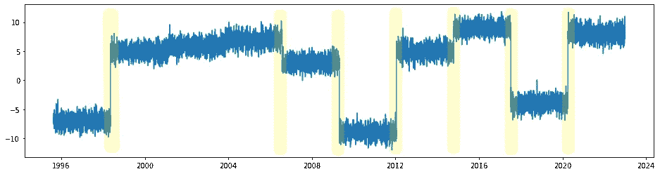

# 每个数据科学家都应该知道的 5 种变点检测算法

> 原文：[`towardsdatascience.com/5-changepoint-detection-algorithms-every-data-scientist-should-know-e2ebb83d215f?source=collection_archive---------1-----------------------#2023-03-07`](https://towardsdatascience.com/5-changepoint-detection-algorithms-every-data-scientist-should-know-e2ebb83d215f?source=collection_archive---------1-----------------------#2023-03-07)

## 时间序列分析的变点检测算法必备指南

 [Satyam Kumar](https://satyam-kumar.medium.com/?source=post_page-----e2ebb83d215f--------------------------------)

·

[关注](https://medium.com/m/signin?actionUrl=https%3A%2F%2Fmedium.com%2F_%2Fsubscribe%2Fuser%2F3d8bf96a415f&operation=register&redirect=https%3A%2F%2Ftowardsdatascience.com%2F5-changepoint-detection-algorithms-every-data-scientist-should-know-e2ebb83d215f&user=Satyam+Kumar&userId=3d8bf96a415f&source=post_page-3d8bf96a415f----e2ebb83d215f---------------------post_header-----------) 发表在 [Towards Data Science](https://towardsdatascience.com/?source=post_page-----e2ebb83d215f--------------------------------) ·3 min read·Mar 7, 2023

--

图片由 [Gerd Altmann](https://pixabay.com/users/geralt-9301/?utm_source=link-attribution&amp%3Butm_medium=referral&amp%3Butm_campaign=image&amp%3Butm_content=2110761) 提供，来源于 [Pixabay](https://pixabay.com//?utm_source=link-attribution&amp%3Butm_medium=referral&amp%3Butm_campaign=image&amp%3Butm_content=2110761)

时间序列分析是数据科学家必须接触的一个主题。时间序列分析包括用于查看时间序列数据的过程和数学工具集，以了解发生了什么、何时发生以及为什么发生，以及未来最有可能发生什么。

变更点是时间序列数据中的突然变化，可能代表状态之间的过渡。在处理时间序列预测用例时，检测变更点以识别随机过程或时间序列的概率分布何时发生变化是至关重要的。

在样本时间序列图中的可能变更点（已突出显示）

本文将讨论并实现 4 种此类变更点检测技术，并对其性能进行基准测试。

## 1\. 分段线性回归：

当变更点发生时，时间序列数据的模式或趋势会发生变化。分段线性回归模型的基本思想是识别这种模式或趋势的变化…
