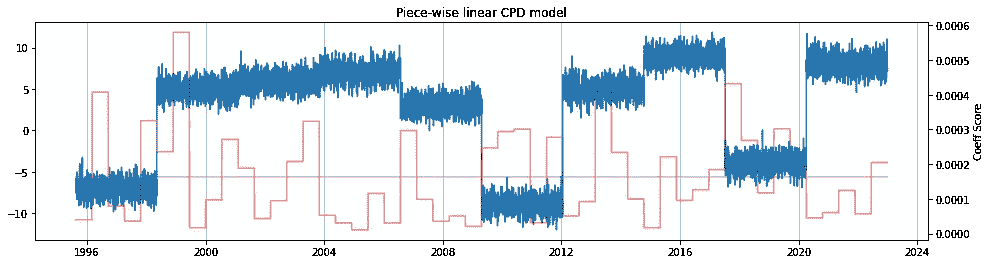
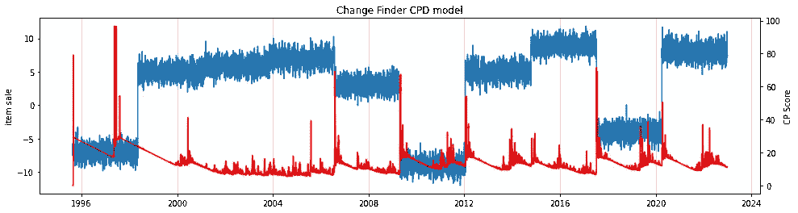
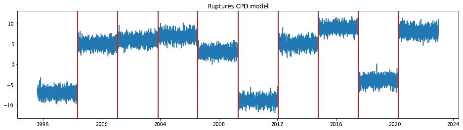

# 每个数据科学家都应该知道的 5 种变点检测算法

> 原文：[`towardsdatascience.com/5-changepoint-detection-algorithms-every-data-scientist-should-know-e2ebb83d215f`](https://towardsdatascience.com/5-changepoint-detection-algorithms-every-data-scientist-should-know-e2ebb83d215f)

## 时间序列分析中变点检测算法的基本指南

[](https://satyam-kumar.medium.com/?source=post_page-----e2ebb83d215f--------------------------------)[](https://towardsdatascience.com/?source=post_page-----e2ebb83d215f--------------------------------) [Satyam Kumar](https://satyam-kumar.medium.com/?source=post_page-----e2ebb83d215f--------------------------------)

·发表于 [Towards Data Science](https://towardsdatascience.com/?source=post_page-----e2ebb83d215f--------------------------------) ·3 分钟阅读·2023 年 3 月 7 日

--


图片由 [Gerd Altmann](https://pixabay.com/users/geralt-9301/?utm_source=link-attribution&amp%3Butm_medium=referral&amp%3Butm_campaign=image&amp%3Butm_content=2110761) 提供，来自 [Pixabay](https://pixabay.com//?utm_source=link-attribution&amp%3Butm_medium=referral&amp%3Butm_campaign=image&amp%3Butm_content=2110761)

时间序列分析是数据科学家必须了解的主题之一。时间序列分析包括用于查看时间序列数据的过程和数学工具集，以了解发生了什么、何时发生以及为什么发生，并预测未来最有可能发生的情况。

变点是时间序列数据中的突然变化，可能表示状态之间的过渡。在处理时间序列预测用例时，检测变点对于识别随机过程或时间序列的概率分布何时发生变化至关重要。


在样本时间序列图中可能的变点（已突出显示）

本文将讨论和实现 4 种变点检测技术，并对它们的性能进行基准测试。

## 1\. 分段线性回归：

当变点发生时，时间序列数据的模式或趋势会发生变化。分段线性回归模型的基本思想是识别不同数据区域内的模式或趋势变化。在存在变点的情况下，系数的值通常会比邻近区域的值高或低。

```py
**Pseudo-code of the Implementation:** 1\. Divide the time-series data into sub-sections of x (say 100) days
2\. Iterate through each sub-section of the data:
    - Train data: enumerate of the data
    - Target data: raw time-series value
    - Train a linear regression model on train and target data
    - compute coeffcient of the trained LR model
3\. Plot the coefficients
```



(作者提供的图片)，线性分段变点检测算法的结果

上述图像中的红线代表每个线性回归模型在该时间序列数据子集或部分上的系数值。系数是乘以预测值的值，因此预测值越高，系数也越高，反之亦然。

（作者提供的代码），分段线性回归换点检测算法的实现

## 2. Change Finder:

Change finder 是一个开源的 Python 包，提供实时或在线换点检测算法。它使用 SDAR（Sequentially Discounting AutoRegressive）学习算法，期望换点前后的 AR 过程会有所不同。

SDAR 方法有两个学习阶段：

+   *第一学习阶段*：生成一个称为异常分数的中间分数

+   *第二学习阶段*：生成能够检测换点的换点分数



（作者提供的图像），change finder 换点检测算法的结果

（作者提供的代码），change finder 换点检测算法的实现

## 3. Ruptures:

Ruptures 是一个开源的 Python 库，提供离线换点检测算法。该包通过分析整个序列并分割非平稳信号来检测换点。

Ruptures 提供了 6 种算法或技术来检测时间序列数据中的换点：

+   动态规划

+   PELT (*修剪精确线性时间*)

+   核心换点检测

+   二分法分割

+   自下而上的分割

+   窗口滑动分割



（作者提供的图像），ruptures 换点检测算法的结果

（作者提供的代码），ruptures 换点检测算法的实现

# 结论：

在本文中，我们讨论了 3 种流行的实践技术来识别时间序列数据中的换点。换点检测算法有广泛的应用，包括医疗状况监测、人类活动分析、网站跟踪等。

除了上述讨论的换点检测算法，还有其他监督式和无监督式的 CPD 算法。

# 参考文献：

1.  Change finder 文档：[`pypi.org/project/changefinder/`](https://pypi.org/project/changefinder/)

1.  Ruptures 文档：[`centre-borelli.github.io/ruptures-docs/`](https://centre-borelli.github.io/ruptures-docs/)

> 感谢阅读
