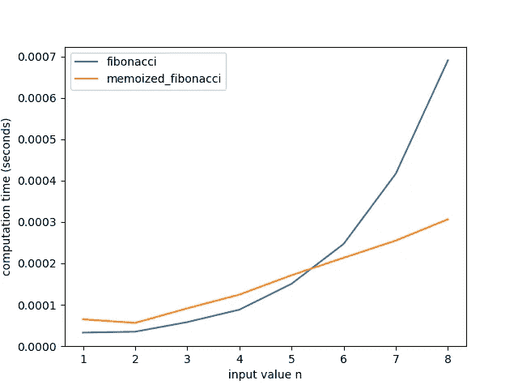
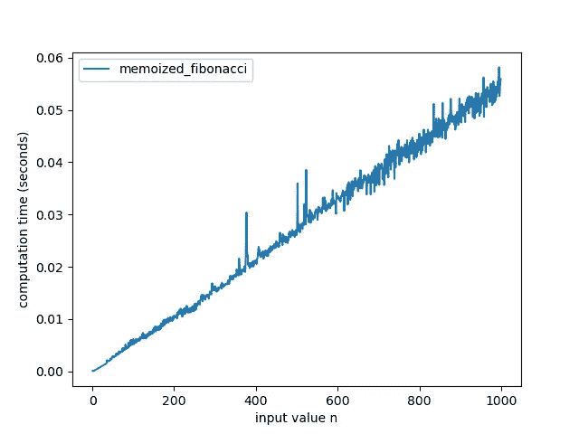

# 5 种代码优化技术，提高程序运行速度

> 原文：[`towardsdatascience.com/5-code-optimization-techniques-to-speed-up-your-programs-cc7740381bcb`](https://towardsdatascience.com/5-code-optimization-techniques-to-speed-up-your-programs-cc7740381bcb)

## 使用这些与语言无关的方法使你的代码更高效、更专业

[](https://medium.com/@nic-obert?source=post_page-----cc7740381bcb--------------------------------)[](https://towardsdatascience.com/?source=post_page-----cc7740381bcb--------------------------------) [尼古拉斯·奥伯特](https://medium.com/@nic-obert?source=post_page-----cc7740381bcb--------------------------------)

·发布于 [Towards Data Science](https://towardsdatascience.com/?source=post_page-----cc7740381bcb--------------------------------) ·7 分钟阅读·2023 年 11 月 29 日

--


图片来源于 [Shubham Dhage](https://unsplash.com/@theshubhamdhage?utm_source=medium&utm_medium=referral) 的 [Unsplash](https://unsplash.com/?utm_source=medium&utm_medium=referral)

先使其工作，然后使其更快。这是许多专业程序员遵循的一个常见原则。起初，你可能会使用看起来最直观的方法编写代码，以节省草稿开发时间。在你获得一个可运行的实现后，你可能会希望通过仔细选择哪些技术数据结构在你的具体情况下效果最佳来优化代码。

在本文中，我们将探讨五种与语言无关的方法，你可以用来改善代码的运行时间。以下概念是通用的，可以应用于任何编程语言。

## 循环不变项提取

请考虑以下 Python 代码，它检查一个字符串列表与正则表达式的匹配情况：

```py
import regex as re

# Get some strings as input
strings = get_strings()
# List to store all the matches
matches = []

# Iterate over the input strings
for string in strings:

  # Compile the regex
  rex = re.compile(r'[a-z]+')

  # Check the string against the regex
  matches = rex.findall(string)

  # Finally, append the matches to the list
  matches.extend(matches)
```

循环会将一组指令反复应用于变化的输入。考虑到这一点，你能在上面的代码中找到任何不变的操作吗？

语句 ``rex = re.compile(r’[a-z]+’)`` 在一个常量输入上操作：正则表达式字符串。在每次循环迭代中，这个语句都会做完全相同的事情，与循环的输入无关。如果我们将这个不变的语句提取出来，并在循环之前执行一次，代码仍然会保持相同的整体行为，同时节省一些 CPU 周期。

```py
import regex as re

# Get some strings as input
strings = get_strings()
# List to store all the matches
matches = []

# Compile the regex only once before the loop
rex = re.compile(r'[a-z]+')

# Iterate over the input strings
for string in strings:

  # Check the string against the regex
  matches = rex.findall(string)

  # Finally, append the matches to the list
  matches.extend(matches)
```

一般来说，每个循环不变的变量或操作（不依赖于循环的输入或状态）都应该从循环中提取出来，只要代码逻辑保持不变。

有时，编译器会自动对你的代码应用这种优化。然而，它们并不总是能够检测到冗余语句，而且解释型语言没有提前优化的特权，因此你应该关注循环不变代码。

## 枚举状态和类型

在表示变量对象状态时，初学者程序员可能会想到使用字符串。考虑以下 Rust 代码：

```py
struct Door {
    pub state: &'static str,
}

impl Door {
    fn new() -> Door {
        Door { state: "closed" }
    }
}

fn main() {
    // Create a new door objetc
    let mut door = Door::new();

    // Set the door state to open
    door.state = "open";

    // Check if the door is open
    if door.state == "open" {
        println!("The door is open!");
    }

    // Set the door to another state
    door.state = "semi-closed";

    // Commit a typing mistake
    if door.state == "semi-clsed" {
        println!("This won't get printed!");
    }
}
```

虽然字符串是一个直观的解决方案，但存在一些问题。首先，字符串状态容易出现输入错误，如最后一个 if 语句所示。此外，可能的状态有哪些？

不管怎样，我们来谈谈优化。字符串比较非常慢，因为你必须检查每一个字符以确定它们是否相等。此外，字符串需要比其他替代方案更多的字节来存储。例如，你可以使用枚举来表示对象状态，而无需担心输入错误，同时利用整数比较的速度。

```py
struct Door {
    pub state: DoorState
}

impl Door {
    fn new() -> Door {
        Door {
            state: DoorState::Closed
        }
    }
}

enum DoorState {
    Open,
    Closed,
    SemiClosed,
    Locked,
}

fn main() {
    // Create a new door object
    let mut door = Door::new();

    // Set the door state to open
    door.state = DoorState::Open;

    // Check the door state
    if matches!(door.state, DoorState::Open) {
        println!("The door is open!");
    }

    // Match all possible states
    match door.state {
        DoorState::Open => println!("The door is open!"),
        DoorState::Closed => println!("The door is closed!"),
        DoorState::SemiClosed => println!("The door is semi-closed!"),
        DoorState::Locked => println!("The door is locked!"),
    }
}
```

枚举是一种基于整数的抽象，所需存储的内存非常少。除此之外，枚举通常是按值传递的，从而避免了在比较等操作时的解引用开销。许多语言原生支持枚举，大多数语言允许这种模式。

## 代数和布尔操作

考虑以下包含条件语句的代码片段：

```py
def is_zero(number):
    if number == 0:
        return True
    else:
        return False

def count():
    counter = 0
    MAX = 10

    for i in range(100):
        counter += 1
        # Reset the counter when it reaches MAX
        if counter == MAX:
            counter = 0
```

如果语句被编译为条件跳转指令，与线性分支执行相比，这可能会显著降低你的代码速度。有时，可以用等效的表达式替代条件语句，**通常**更快，具体取决于其长度和操作。

以下是使用布尔和算术表达式优化过的前面的函数，而不是条件语句：

```py
def is_zero_algebra(number):
    # The result of comparison is already a boolean
    return number == 0

def count_algebra():
    counter = 0
    MAX = 10

    for i in range(100):
        # Use the remainder operator to reset the counter
        # when it reaches MAX
        counter = (counter + 1) % MAX
```

然而，你应该始终对任何假定的优化替代方案进行基准测试，以检查它是否确实更快。

## 备忘录化

不，这不是拼写错误。备忘录化是一种算法优化技术，它包括记住函数的输出及其输入。当处理那些需要多次调用的资源密集型函数时，你可以将输入和结果存储在映射数据结构中，这样如果输入相同，就不需要重新计算函数。

一个可以通过备忘录化来改进的经典例子是计算斐波那契数列。考虑下面的代码，它计算斐波那契数列中的第 n 个数字：

```py
def fibonacci(n):
    if n <= 1:
        return n
    else:
        return fibonacci(n-1) + fibonacci(n-2)

R = 30
for i in range(R):
    fibonacci(i)
```

对于较小的输入`n`，函数的执行时间不会很长。然而，由于其时间复杂度为 O(2ⁿ)，较大的输入值将导致显著更长的运行时间。

现在考虑另一种利用备忘录化的方式：

```py
# Use a class to implement the memoization technique
class MemoizedFibonacci:
    def __init__(self):
        # When the object is created, initialize a map
        self.memo = {}

    def fibonacci(self, n):
        if n <= 1:
            return n
        elif n not in self.memo:
            # Store the input-output pair in a map data structure
            self.memo[n] = self.fibonacci(n-1) + self.fibonacci(n-2)
        # Return the stored output value that corresponds to the given input
        return self.memo[n]

memoized_fibonacci = MemoizedFibonacci()
for i in range(R):
    memoized_fibonacci.fibonacci(i)
```

从下图中可以看出，备忘录化极大地改善了函数的运行时间：



常规斐波那契函数和经过记忆化优化的替代函数的基准测试（数值越低越快）

这是因为这个记忆化函数的时间复杂度大致是线性的。



记忆化斐波那契函数的时间复杂度

## 使用特定案例的数据结构

数据结构选择的一个常见例子是普遍存在的链表与数组困境。你需要链表的 O(1)插入时间，还是需要数组的快速随机索引？在选择数据结构时，你必须比较每个选项的优缺点，以找到最适合你的情况的结构。有时，你甚至可能想要实现一个定制的数据结构，以完全符合你的要求。

下面是一些优化中常见的数据结构选择的其他示例：

+   [写时复制](https://en.wikipedia.org/wiki/Copy-on-write)实现（COW）。实现 COW 的结构允许你通过共享不可变引用高效且安全地传递数据。只有在你实际尝试修改数据时，它才会被复制，从而节省了不必要的操作时间。

+   [循环缓冲区](https://en.wikipedia.org/wiki/Circular_buffer)是实现队列行为或缓存数据时，常见的传统数组替代方案。

+   [查找表](https://en.wikipedia.org/wiki/Lookup_table)和[哈希表](https://en.wikipedia.org/wiki/Hash_table)用于快速索引数据或高效处理不同情况而无需分支。

+   解析表是一种将查找表和哈希表组合在树状结构中的方式，这使你能够高效且简洁地解析结构化数据，而无需编写复杂且易出错的代码。它们在编译器和分类算法中被广泛使用。

## 主要要点

优化代码不是一项简单的工作。你需要首先找到相关的瓶颈。然后，仔细检查是否存在冗余操作或是否有更直接的方法来解决问题。你可能需要将你的想法草绘到纸上，以更好地可视化算法、内存布局和数据结构。最后，进行基准测试和测试，看看你是否真正改进了代码，或者破坏了某些功能。

我希望你喜欢这篇文章。如果你有任何想法，请在评论中分享。感谢阅读！

如果你有兴趣了解更多关于代码优化的信息，请查看以下关于查找表和哈希表的文章：

[](https://betterprogramming.pub/get-rid-of-excessive-if-else-statements-with-lookup-and-hash-tables-c7dbed808996?source=post_page-----cc7740381bcb--------------------------------) [## 使用查找表和哈希表摆脱过多的 if-else 语句

### 一种在专业代码库中普遍使用的代码性能实践。通过这些简单的示例学习如何使用它们。

[betterprogramming.pub](https://betterprogramming.pub/get-rid-of-excessive-if-else-statements-with-lookup-and-hash-tables-c7dbed808996?source=post_page-----cc7740381bcb--------------------------------)
