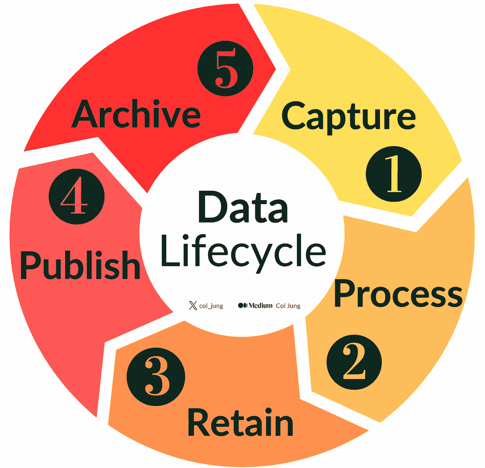
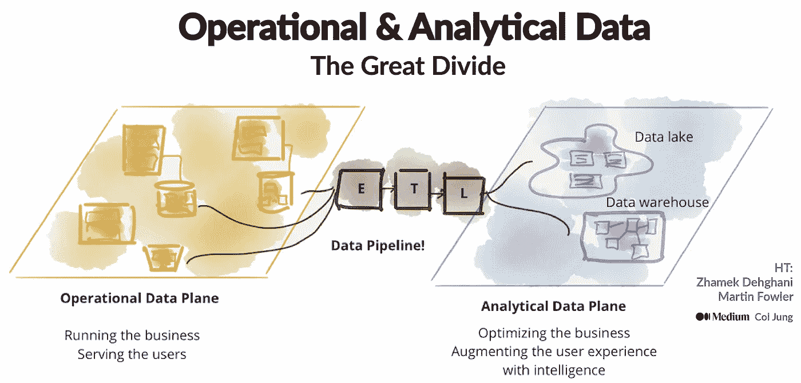
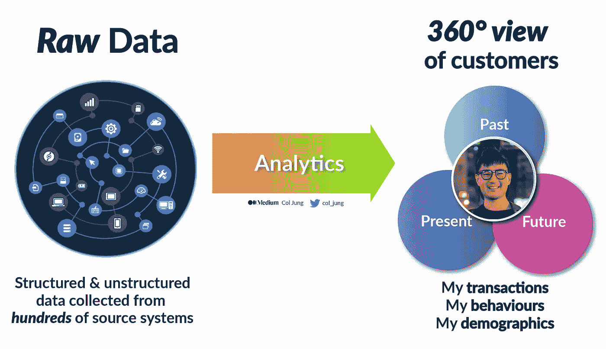

# 分析师和数据科学家的 5 个常见数据治理痛点

> 原文：[`towardsdatascience.com/5-common-data-governance-pain-points-for-analysts-data-scientists-8efe8a007ac2`](https://towardsdatascience.com/5-common-data-governance-pain-points-for-analysts-data-scientists-8efe8a007ac2)

## 理解支持创新的保护措施

 [Col Jung](https://col-jung.medium.com/?source=post_page-----8efe8a007ac2--------------------------------)

·发表于[Towards Data Science](https://towardsdatascience.com/?source=post_page-----8efe8a007ac2--------------------------------) ·阅读时间 14 分钟·2023 年 8 月 24 日

--

图片：[Headway](https://unsplash.com/photos/5QgIuuBxKwM)（Unsplash）

你是大型组织的分析师还是数据科学家？

如果你曾遇到过这些让人挠头的问题，请举手：

+   **寻找数据**就像是进行一次*福尔摩斯*探险。

+   **理解数据血统**非常令人沮丧。

+   **访问数据**成为了与官僚主义怪兽的对决。

这是我常听到的一个普遍的调侃：

> “那些数据治理的家伙真知道怎么让生活有趣……”

是时候对他们宽容一些了。

从我在澳大利亚一家大型银行担任工程师和数据科学家的经验来看，已经有半个十年，我有幸在这场激烈的争论中跨越两方：既是数据的饥渴消费者，又同时作为他人的守门员。

**更新**：我现在在[YouTube](https://www.youtube.com/@col_builds)上聊数据分析。

在这篇文章中，我将进行三部分的深入探讨……

1.  *基础知识*：数据如何在组织中**流动**。*这很混乱！*

1.  *理解* **数据用户常遇到的痛点**。

1.  *启示*：欣赏**保护措施如何支持创新**。

第三点非常重要。

全球组织都在[争相](https://generativeai.pub/modern-enterprise-data-strategy-a-guide-for-analysts-data-scientists-engineers-2d4b45a31427)成为数据驱动型公司。创新与适当控制之间的张力不断存在，以保障公司客户、员工和声誉的安全。

随着新的数据使用案例不断出现——这几乎是*随时都在发生*——数据治理结构*尝试*同步演进。而这通常是一个挑战，因为无拘无束的创新没有自然的速度限制。

无限量的数据自助餐听起来不错，直到你的公司因客户数据泄漏到暗网而被监管机构罚款数百万美元。

*哎呀，应该有这些控制措施。*

# 数据的**生命之圈**！

数据像下游的河流一样流经一个组织。

从捕获到使用，演变中的数据需要进行管理。

数据生命周期。图像由作者提供

这个**数据生命周期**的每个阶段都有其自身的...

+   利益相关者；

+   独特的风险；

+   商业和技术考虑；

+   道德困境；

+   监管要求...

…所有这些都需要被仔细管理。

让我们简要回顾一下每个阶段。我将从我的银行和金融行业中举一些例子。

## 1\. 捕获

第一个阶段描述了数据在公司内部的*诞生*。

数据可以在操作源系统中创建，例如新的客户姓名或地址。它可以是前线银行人员在分行计算机中保存的*客户 ID*或*员工 ID*。或者可能是一个计算的指标，例如总利润或风险加权资产，这些数据汇集了其他维度表中的数据。它甚至可能是外部数据，例如中央银行的新现金利率，这将对我们的储蓄和抵押贷款产品产生连锁反应。

在捕获过程中，关键是*定义*我们正在捕获的内容，并*定义*对**数据质量**的期望。

如果一个数字代表某种货币，我们需要知道它是美元、英镑、人民币等。是否可以有空字段？是否总是需要有一定数量的数字，例如邮政编码（ZIP 码）？

这决定了我们需要具备的*控制措施*，以确保未来的数据符合期望。数据控制的目的是减少**数据风险**。

最后是**隐私**和**合规性**。如果数据涉及我们的客户和个人——这些数据可能是敏感的，可能会被用来识别他们——我们是否拥有捕获这些数据的*同意*？

如果处理不当，当发生重大黑客事件时，可能会摧毁业务。

## **2\. 过程**

现在我们正在*处理*这些数据。

它可能是在系统之间移动数据而不进行更改，例如将副本导入企业**数据湖**中供数据科学家稍后使用。（但领导者需要确保数据不会*过时*！）

或者应用业务规则来过滤、聚合或以其他方式转换数据——通常将其与其他数据源集成——以生成一个精细化的输出数据集，存储在企业**数据仓库**中，准备供业务使用。

企业数据格局的 30,000 英尺视图。来源：Z. Dehghani 于[MartinFowler.com](https://martinfowler.com/articles/data-mesh-principles.html)，作者进行了一些修订

在这个阶段，重要的是要考虑以下几点：

+   **数据质量**：在处理过程中没有引入错误；

+   **可追溯性**：跟踪**数据来源**，以便清楚地了解随时间的变化；

+   **效率**：战略性地设计转换以减少冗余的 ETL 管道，最小化技术债务；

+   **问责制**：为公司的不断变化的数据指定一个**数据所有者**。这至关重要，因为数据来源中的任何问责缺口都可能影响数据质量并导致可预防的风险。

猜猜看？大公司在[所有这些方面](https://from-data-lakes-to-data-mesh-a-guide-to-the-latest-enterprise-data-architecture-d7a266a3bc33)都遇到困难。

错误会发生，找出错误的根源可能很麻烦——特别是当没有正确的流程和技术来有效跟踪数据来源时。

此外，大多数组织有一个不健康的习惯，让一堆数据管道累积，因为各个团队在孤岛中为每个新项目制作一个新的 ETL 管道。（这就是企业[数据产品](https://generativeai.pub/data-products-why-your-organisation-needs-them-4ac7bf2e5953)的作用所在。）

最终，*分配*数据所有权和让数据用户*查找*它们可能是一个长期存在的挑战——稍后会详细讨论。

近年来，像微软这样的公司推出了[一体化](https://generativeai.pub/azure-synapse-analytics-in-action-7-real-world-use-cases-explored-c73ef231b408)分析平台。这些云解决方案提供了数据摄取、处理、分析和管理的无缝统一体验，从而使处理企业数据变得更简单。

## 3. 保留

在这里，我们关注的是数据*存储*。（但也包括备份和恢复！）

这些可能听起来无聊，但搞错的后果是灾难性的。一些关键考虑因素：

+   **可用性**。保存数据很容易。检索数据，尤其是批量或*实时*——**大规模**——则很困难。此外，数据是否对所有知识工作者无缝可发现和可访问？数据本身的价值很小；通过人力输入和分析从数据中提取的信息和见解才真正解锁价值。

+   **架构**。我们是将数据存储为适合 SQL 爱好者的*写时模式*数据仓库中的表格？数据应该如何建模？或者我们将数据存储为*读时模式*数据湖中的非结构化平面文件，这提供了更多的灵活性，但在处理较小数据集时性能较差？我们应该如何组织分区？实时处理和分析是否可能？如果平台出现故障，我们是否有足够的备份和恢复措施？

+   **隐私与安全**。我们的数据是否经过加密，并且在防止未经授权的访问和黑客攻击方面安全存储？尤其是我们那些*受保护和敏感的数据*，这些数据可能被用来识别我们的客户和人员。我们是否拥有正确的基于角色的访问权限（RBAC），以确保只有正确的人拥有正确的访问权限？在受监管的行业中，这些领域的泄露通常会导致巨额的数百万美元罚款、股价暴跌以及对公司声誉的重大打击。这不是开玩笑——我有过这样的经验。

## 4\. 发布

啊，激动人心的部分。

这就是我们将数据转化为见解，并将其发布为信息或报告，以供内部和外部利益相关者消费的地方。

**数据质量**在这里至关重要，因为*垃圾进垃圾出（GIGO）*。

你是什么你吃的，报告和机器学习模型也是如此。

不良数据会导致不可靠的见解，这代表了任何组织中的主要数据风险来源。

由于确保公司所承担的庞大数据量的良好数据质量几乎是不可能的，大型公司通常会采用有针对性的策略，专注于其数据质量检查中的*关键数据元素（CDEs）*。

公司的关键数据元素（CDEs）构成了它们满足客户、投资者和监管要求所需的关键数据，并且这些数据需要最高级别的治理和审查。

目前，我的银行正在跟踪 1500 个 CDE，这些 CDE 在 1700 多个系统中流动。在之前的澳大利亚政府对整个银行业进行打击后，我们建立了一个由多个平台组成的‘操作系统’，该系统 24/7 监控这些 CDE 的数据质量，并在情况开始滑坡时自动创建事件。这是非常严肃的事务。

我所说的数据质量是什么意思？

以下是一些关键数据质量*维度*，按严重程度递减：

+   **完整性**：不完整的数据意味着我们可能缺少维持业务运转和满足合规要求的关键性信息。这就是你如何破产的。

+   **有效性**：虽然我们有记录，但它们可能并不*有效*——这意味着它们与我们在第 1 步中建立的定义模式不一致。这包括现实世界的限制（如负高度）和表特定规则（如唯一键）。

+   **准确性**：数据可以存在且有效，但完全错误。想象一下，你的银行不小心将 1000 万美元存入你的账户。（那会是一个令人愉快的惊喜吗？）

+   **一致性**：如果你处理的数据准确有效，但以多种方式表示，那么你会面临一致性问题。这是技术债务的一个来源，阻碍组织拥有单一的真实来源。一个经典的例子是地址在不同的源系统中被不同地书写。这会在下游产生多米诺效应，因为同一客户可能会在相同（但不同*表示形式*）的地址下出现多次。真糟糕。

另一个关键考虑因素是**合规性**和**数据的伦理使用**。

某个特定的数据分析项目是否通过了*酒吧测试*？它是否合法？我们是否需要获得同意才能将客户数据用于特定目的？

一个好的例子是一个市场分析项目的结果，可能涉及向客户发送有针对性的优惠。然而，他们可能没有给我们必要的同意来将我们的洞察用于营销目的。

大数据被用来理解客户偏好，[比他们自己更了解](https://generativeai.pub/modern-enterprise-data-strategy-a-guide-for-analysts-data-scientists-engineers-2d4b45a31427)。图片由作者提供

这些都是可能且常常使公司陷入困境的情况，导致重大财务和声誉损失。

## 5\. 归档

最后一阶段是经常被忽视的数据归档或处理，即数据到达其生命周期的潜在终点时。

一般规则是应该*清除*不必要的数据。然而，某些数据出于监管目的必须保留，通常在澳大利亚的金融服务行业中需保留 7 年。

问题在于公司通常难以确保及时清除数据，而延长保留期限只会加大数据风险。

想象一下：发生数据泄露，20 年的客户数据被盗，尽管其中 13 年数据在使用期限到期后应已删除。这是一个常见的场景，完全可以通过良好的数据治理加以预防。

# 治理看门人与分析师的愿望

我会听你倾诉。

在讨论了数据生命周期以了解各个阶段面临的各种治理挑战后，让我们深入探讨分析师和数据科学家在追寻数据过程中提出的一些**常见抱怨**！

> ***“为什么我找不到我想要的数据？我瞎了吗？！”***

不！完全可以理解。大多数组织在建立必要的基础设施以应对不断扩展的数据海洋和在分析洞察方面的竞争压力时，都经历了艰难的过程。

随着数十年的技术债务以庞大的 ETL 管道和数据仓库的混乱形式出现，以及现代数据湖中倾倒的海量数据，找到数据已演变成一项*艰巨*的任务——即使是治理人员有时也不例外。

与全球公司一致，我的银行依赖于[数据产品](https://generativeai.pub/data-products-why-your-organisation-needs-them-4ac7bf2e5953)和数据民主化策略来应对这些生产力杀手。

> ***“这些表格的数据拥有者是谁？这应该很简单吗？”***

答案分为三个部分。这是具有挑战性的……

1.  ***分配***谁应该负责数据。数据在组织内流动并与其他来源整合时，谁应该拥有这些数据？我们公司的数据管理专家最近引入了一个“*生产者、处理者和消费者*”框架。这个方法将整个数据旅程——从捕获到消费——划分为不同的区域，确保在每个阶段都有一个人对数据负责。**数据驱动型组织的基础始于端到端的数据责任。**

1.  ***说服***人们他们应该负责数据。这是因为拥有数据意味着承担***数据被不当使用***的风险，加上协助管理数据的额外劳动。这要求很高，却没有多少回报。（数据拥有者通常不会因为这个角色得到额外的津贴。）因此，一些自然的数据拥有者不愿意承担这个角色。

1.  ***维护***数据拥有者的名单。同事们来来去去。人员换岗。而且他们没有太多的动力来卸任他们的数据拥有者角色。这导致已经负担过重的治理团队在试图跟踪谁是组织内成千上万数据集的*当前*拥有者。

这是一场挣扎。

> ***“为什么治理相关方总是要求我做这么多文书工作才能访问数据？团队资源稀缺，我们必须花费大量精力在繁琐的程序上！”***

因为急于从数据中挤压见解的分析师的目标与保持数据使用合规的需求并不自然对齐。

数据创新者在加速推进，而注重风险的人则踩着刹车。

以我的银行为例。任何尝试处理敏感客户数据的举动都触发了需要进行新的*隐私影响评估*。是的，这需要时间，也确实很烦人，但这是*法律*要求，追溯到欧洲发起并随后全球采用的[通用数据保护条例](https://en.wikipedia.org/wiki/General_Data_Protection_Regulation) (GDPR)法律。

而且这里有个关键点：这份 PIA 文档作为防线，抵御着主要监管机构对我们开出的高达$50 百万的罚款，因为它展示了我们在推进之前已经考虑了数据使用案例的影响。*因为*每一次违规行为都是需要承担巨额罚款的。

保险听起来很贵……直到你需要它。

> ***“为什么我的数据发现环境上有这么多条件？感觉像是被限制在狭小的空间里。我只想要一个良好的环境和我想要的所有数据。”***

*因为*你在发现环境中做的**所有**事情都涉及***风险***。

数据可能会被泄露、不道德使用，甚至导致误导性的见解，损害公司。

这就是为什么数据治理团队会要求你在一开始就*非常具体*地说明你的数据和环境需求，以便他们能了解你的数据发现沙盒的风险概况。

这些游乐场应该根据用例（*用例隔离*原则）进行设置和组织，并在项目完成后立即退役。

听起来可能很苛刻，但数据发现环境因其…

1.  ***范围蠕变***，即项目团队试图在相同环境中挤入更多的用例——因此更多的分析师和数据。这意味着更多的人看到他们不该看到的数据，从而增加了数据风险。

1.  ***寿命蠕变***，即团队不断延长其环境的使用寿命，这增加了其工作支持业务正常运行（BAU）过程而缺乏适当控制和治理的可能性。这意味着，是的，你猜对了，更多的数据风险。

一切都是为了理解和最小化数据风险。

> ***“为什么从数据发现环境中提取数据这么难？”***

因为你可以*做*的事情，坦率地说，对于那些注重风险的人来说，是一场噩梦。

想象一下泄露、滥用，或数据影响决策，从而对数百万客户产生不利影响，或使我们陷入监管机构的困境。

这是一片雷区。

流行的一体化分析平台，在大型公司中受到严格管理。图片由作者提供

这就是为什么发现环境就像是受保护的沙箱，仅供实验使用。如果你希望你的见解达到最佳状态——即生产类似的过程，运行正常的业务——准备好接受一些严格的审查。

锁定数据是一种减少大量数据风险的全面控制措施。

# 最后的话

似乎我对上述痛点的回答只突显了数据治理控制与分析师和数据科学家所要求的迭代工作风格之间的脱节。

当你面临最后期限时，很容易把治理团队视为敌人。

但没有这些人员，炉子上的火最终会吞噬整个厨房。你的数据治理团队最终确保…

1.  你的公司的数据资产是**管理和组织**的，因此在公司数据资产扩展时，你可以找到并访问你所需要的东西。（至少，这是目标。）

1.  **保护措施**到位以确保数据的适当使用，并防止可能毁掉客户生活和年终奖金的悲剧性数据泄露。（是的，这是真的。）

更深入地反思，这种创新与监管之间的紧张关系存在于*每一个*努力中，无论大小。没有束缚的飞跃通常会跟随着一个恢复和反思的时期，为下一次跳跃奠定基础。

请耐心等待。

在全球宏观层面，我们看到像中国和美国这样的强国让他们的大型科技部门在几乎没有监督的情况下飞速发展，直到一代人后才收紧对企业家的监管。在个人层面，我们知道在剧烈身体运动后适当恢复的重要性，这是一个逻辑上的停顿点。

在企业数据环境中存在这种*阴阳*的动态并不令人惊讶。

随着全球数据量的指数级增长、数据使用案例的日益多样化以及计算能力的不断提升，企业必须定期休整、进行一些清理，确保数据堆栈得到适当的管理和控制。

在大型公司中，通常存在两个相互竞争的目标：

首先，利用数据进行**进攻性策略**，使公司能更有效地竞争。这种攻击角度通常由一位激进的首席数据官（CDO）、首席数字官（另一个 CDO）或更广泛的分析社区采取。

其次，以**防御性**的方式管理数据，重点关注合规性。目标是通过对齐流程和系统，解决业务绩效和监管问题，从前台和源系统到后台数据平台和报告工具，简化数据流动。

最顶尖的专家在这一精细平衡行为中表现得相当出色：给予他们的分析师和数据科学家探索和创新的自由，同时确保组织在数据使用方面保持合规和伦理，尊重客户数据。

你在数据治理方面有什么经验？

在 [Twitter](https://twitter.com/col_jung) 和 YouTube [这里](https://youtube.com/@col_builds)、[这里](https://youtube.com/@col_invests) 和 [这里](https://youtube.com/@col_shoots) 找到我。

# 我的热门 AI、ML 和数据科学文章

+   人工智能与机器学习：快速入门 — [这里](https://col-jung.medium.com/ai-revolution-your-fast-paced-introduction-to-machine-learning-914ce9b6ddf)

+   机器学习与机械建模 — [这里](https://medium.com/swlh/differential-equations-versus-machine-learning-78c3c0615055)

+   数据科学：现代数据科学家的新兴技能 — 这里

+   生成性 AI：大公司如何争先恐后地采纳 — [这里](https://generativeai.pub/how-big-companies-are-scrambling-to-adopt-generative-ai-d52456fb4c69)

+   ChatGPT & GPT-4: OpenAI 如何赢得自然语言理解之战 — [这里](https://col-jung.medium.com/the-road-to-chatgpt-gpt-4-how-deep-learning-revolutionised-natural-language-processing-835d89560577)

+   GenAI 艺术：DALL-E、Midjourney 和 Stable Diffusion 解析 — [这里](https://col-jung.medium.com/generative-ai-art-the-road-to-dall-e-midjourney-stable-diffusion-3b3219d97f02)

+   超越 ChatGPT：寻找真正智能的机器 — [查看这里](https://col-jung.medium.com/from-chatgpt-to-singularity-the-search-for-a-truly-intelligent-machine-856c8f4c5e63)

+   现代企业数据战略解析 — [查看这里](https://generativeai.pub/modern-enterprise-data-strategy-a-guide-for-analysts-data-scientists-engineers-2d4b45a31427)

+   从数据仓库与数据湖到数据网格 — 查看这里

+   从数据湖到数据网格：最新架构指南 — 查看这里

+   Azure Synapse Analytics 实战：7 个用例解析 — [查看这里](https://generativeai.pub/azure-synapse-analytics-in-action-7-real-world-use-cases-explored-c73ef231b408)

+   云计算入门：为您的业务利用云 — [查看这里](https://generativeai.pub/cloud-computing-unleashed-how-to-harness-the-power-of-cloud-for-your-business-f72e8e23be9)

+   数据仓库与数据建模 — 快速入门课程 — 查看这里

+   数据产品：为分析构建坚实的基础 — [查看这里](https://generativeai.pub/data-products-why-your-organisation-needs-them-4ac7bf2e5953)

+   数据民主化：5 种“数据普及”策略 — 查看这里

+   数据治理：分析师常见的 5 个痛点 — 查看这里

+   数据讲故事的力量 — 销售故事，而不是数据 — [查看这里](https://medium.com/swlh/power-of-storytelling-in-business-data-analytics-your-data-is-only-half-the-story-f50fadf9712b)

+   数据分析入门：谷歌方法 — 查看这里

+   Power BI — 从数据建模到惊艳报告 — 查看这里

+   回归分析：使用 Python 预测房价 — 查看这里

+   分类：使用 Python 预测员工离职 — 查看这里

+   Python Jupyter 笔记本与 Dataiku DSS — 查看这里

+   常见机器学习性能指标解析 — 查看这里

+   在 AWS 上构建 GenAI — 我的首次体验 — [查看这里](https://generativeai.pub/how-big-companies-are-scrambling-to-adopt-generative-ai-d52456fb4c69)

+   数学建模与 COVID-19 机器学习 — [查看这里](https://medium.com/swlh/math-modelling-and-machine-learning-for-covid-19-646efcbe024e)

+   未来工作：在人工智能时代您的职业安全吗 — [查看这里](https://col-jung.medium.com/future-of-work-is-your-career-safe-in-the-age-of-chatgpt-gpt-4-122d5996bd57)
