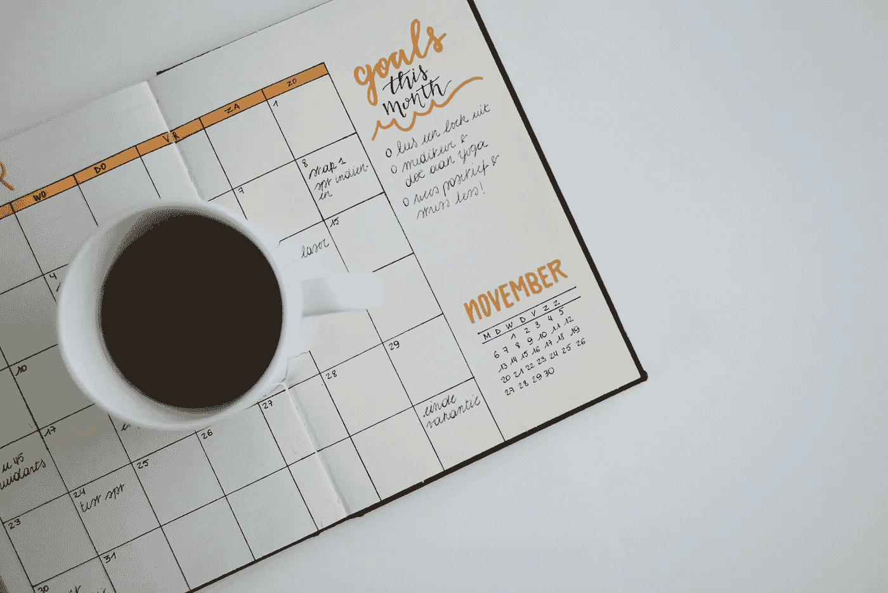

# 5 个促进数据科学家/分析师参与的想法，而不至于在会议中窒息

> 原文：[`towardsdatascience.com/5-ideas-to-foster-data-scientists-analysts-engagement-without-suffocating-in-meetings-a57db1e2aa34`](https://towardsdatascience.com/5-ideas-to-foster-data-scientists-analysts-engagement-without-suffocating-in-meetings-a57db1e2aa34)

## 作者分享了他们成功实现这一平衡的策略

 [Guillaume Colley](https://medium.com/@guillaume.colley?source=post_page-----a57db1e2aa34--------------------------------)

·发表于 [Towards Data Science](https://towardsdatascience.com/?source=post_page-----a57db1e2aa34--------------------------------) ·阅读时间 8 分钟·2023 年 10 月 21 日

--

图片由 [Aziz Acharki](https://unsplash.com/@acharki95?utm_source=medium&utm_medium=referral) 拍摄，来源于 [Unsplash](https://unsplash.com/?utm_source=medium&utm_medium=referral)

在管理数据科学或数据分析团队时，找到为团队成员提供不受干扰的专注时间与促进参与、合作和团队精神之间的良好平衡可能是一项挑战。在我的团队领导经历中，我尝试了许多迭代和方法来实现这一平衡。在这篇文章中，我将概述我当前拥有的五个有效的关键点。

无论你是寻求灵感的分析团队领导，还是渴望摆脱“过多会议”的数据科学家，我希望这些见解能够激励你自己的职业旅程。

# 1 — 早晨站会

+   **节奏：每日**

+   **时长：15 分钟**

早晨站会直接来源于 [敏捷方法论](https://scrumguides.org/scrum-guide.html#daily-scrum)，这是一个简短但至关重要的每日聚会，每天早晨的第一个环节（在固定时间）。尽管有些人可能会更早开始他们的一天，但站会作为整个团队的统一起点。在这个会议中，每个人，包括经理，轮流提供简洁的更新，内容包括：

+   他们昨天完成的工作，

+   他们今天计划达成的目标，

+   需要与相关方进行线下讨论的任何障碍或问题

**为什么要进行早晨站会？**

*→ 促进专注与承诺：它培养了对团队日常目标的目的感和承诺感。*

*→ 提升意识和协作：它让团队成员了解彼此的项目和进展，促进联系和合作。*

*→ 早期识别阻碍因素：在早期识别障碍可以防止浪费精力，确保顺利进展。*

*→ 让经理及时了解：会议使经理充分了解团队的进展，从而有效监督。*

除非涉及整个团队，否则更深入的讨论应与相关方离线进行。

这个简短的会议也是经理进行小型公告或提醒以完成行政任务的机会。（有关早晨站会的更多细节 [请点击这里](https://www.charma.com/resources/what-is-a-daily-standup-meeting)）。

## 关于替代方法的反思：

在完全敏捷模式下，使用 [冲刺](https://www.scrum.org/resources/what-is-a-sprint-in-scrum) 节奏：

这种方法已被 [证明](https://image.zenn.net/REPLACE/CLIENT/1000047/1000150/application/pdf/MahColumbusAgilearticleinProjectsatWork.pdf) 对于专注于单一产品或项目的开发团队非常有效。然而，它在分析/数据科学实践中的应用却面临挑战。根本问题在于团队成员通常参与各种项目或分析，许多项目无法与标准的冲刺周期对接——数据科学项目往往超出典型的 2 到 3 周的冲刺周期。

项目时间表和范围的这种差异也意味着，只有一小部分敏捷仪式（规划和待办事项整理会议）与个别数据科学家的具体需求对接。显而易见，将各种复杂的数据科学任务强行融入传统敏捷冲刺的严格结构中存在显著低效。

[Mimi Thian](https://unsplash.com/@mimithian?utm_source=medium&utm_medium=referral) 的照片，来源于 [Unsplash](https://unsplash.com/?utm_source=medium&utm_medium=referral)

# 2 — 周五“进行中的工作”展示

+   **节奏：每周**

+   **持续时间：15 分钟+**

我们最近实施了这种方法，以促进合作，而不需要在日历上预订额外的时间槽。这个举措取代了标准的每周五每日站会，具有迷你 [braintrust](https://www.fastcompany.com/3027135/inside-the-pixar-braintrust) 的本质。会议定为 15 分钟，但由于周五早晨通常较少会议，如果需要，讨论可以延长。

这是一个志愿者可以非正式地展示一个正在进行的工作，并寻求团队集体智慧的空间，例如：

+   “我正在做这个模型，想听听你的想法。”

+   “我在考虑两种解决方案，哪个选项最好？”

+   “这是我即将向利益相关者展示的内容，我如何才能使其更好？”

**为什么要有“进行中的工作”展示？**

*→ 沟通技巧：这个环节提供了一个定期的平台来磨练总结和沟通技巧。*

*→ 更深入的洞察：它为团队提供了一个了解正在进行的项目和任务技术复杂性的窗口*

*→ 协作解决问题：它鼓励团队成员互相交流和碰撞想法*

这种格式取得了良好的平衡，促进了积极参与和协作，同时为那些对主题有更深兴趣的人提供了进一步探索的灵活性。

## 替代方法的反思：

起初，我将这些智囊会议作为单独的 1 小时会议进行，这种格式本可以允许更深入的技术讨论。然而，事实证明，参与者往往选择跳过这些会议，以完成任务或项目，从而导致出席率不尽如人意。此外，1 小时的时间有时也成为志愿者主动分享他们正在进行的工作的障碍。

图片由[Estée Janssens](https://unsplash.com/@esteejanssens?utm_source=medium&utm_medium=referral)拍摄，来源于[Unsplash](https://unsplash.com/?utm_source=medium&utm_medium=referral)

# **3 — 数据科学团队会议**

+   **节奏：每月一次**

+   **时间：1 小时**

这种更正式的聚会每月举行一次（请参见下文关于节奏选择的说明），是从日常任务/项目中退后一步，反思团队的工作方式和未来机会的机会。我们还尝试邀请来自不同职能领域的人介绍他们的工作，并讨论潜在的协同效应。我们的会议结构遵循以下框架：

+   5 分钟：快速更新行政事务和必要的提醒。

+   25 分钟：A) [回顾](https://www.scrum.org/resources/what-is-a-sprint-retrospective)，提供了反思我们过去经验的机会

    或

    B) 战略/路线图更新和项目规划，使我们能够展望未来

+   30 分钟：来自组织的嘉宾

**为什么要召开数据科学团队会议？**

*→ 反思与规划：这次会议提供了一个机会，让我们退后一步，反思过去，展望未来*

*→ 工作方式的责任：它赋予我们的数据科学家掌控权，分析哪些做法有效，哪些无效，并致力于改进*

*→ 项目可见性：它使团队了解即将开展的项目，并有机会与那些符合他们兴趣和专长的项目对接。*

*→ 拓宽视野：它拓宽了我们团队对组织的理解，培养了与不同业务职能的联系和合作关系*

## 替代方法的反思：

这些会议最初是每两个月一次，专注于回顾，因为我们通过其他接触点处理其他元素。然而，随着我们团队表达了对项目分配和战略的更多见解的需求，我们合并了一些其他接触点，从而允许独立的每月团队会议。

在没有早晨站会和不太定期的一对一会议的不同环境下，我发现每周的团队会议节奏是有效的。这种格式包括了行政更新、看板审查以及团队成员每周项目或技术见解的展示。

图片由 [airfocus](https://unsplash.com/@airfocus?utm_source=medium&utm_medium=referral) 提供，来源于 [Unsplash](https://unsplash.com/?utm_source=medium&utm_medium=referral)

# **4 — 个人一对一**

+   **节奏：每周**

+   **时长：30 分钟**

这是每周日程中专门为数据科学家或数据分析师留出的时间。[这里](https://hbr.org/2022/11/make-the-most-of-your-one-on-one-meetings) 是一个关于如何设立和进行成功的一对一会议的极好资源。我已将其调整为以下结构：

+   JIRA/看板审查和更新（5 分钟或更少）

+   讨论的重点不是谈论具体的项目或任务，而是提供机会让个人提出他们想要讨论的内容。

+   反馈、辅导、职业发展

+   季度目标检查和规划

+   如果时间允许，可以进行项目或任务的讨论

**为何进行个人一对一会议？**

→ *关系建设：它建立并培养了数据科学家/分析师与其经理之间的关系，建立了信任*

*→ 成长与发展：它通过个性化反馈和辅导促进数据科学家/分析师的成长与发展，同时通过互惠反馈来培养管理能力。有关不同级别的数据科学家/分析师期望的详细信息，请参见* [*这篇文章*](https://medium.com/towards-data-science/decoding-the-data-scientist-hierarchy-from-junior-to-senior-what-sets-them-apart-566158a0d5ff) *。*

每季度末，我们的关注点转向评估我们的年度目标，包括组织/项目目标和个人职业发展目标，并检查我们实现这些目标的进展。

## 替代方法的反思：

我们探讨了每两周一次 45 分钟的对话选项，但对于我们来说效果不佳。我们的对话通常在 30 分钟内结束，两周一次的间隔似乎过长，难以保持强烈的联系。

看板板块回顾：我们最初为看板回顾安排了单独的会议。后来我们将其并入了稍长的早间站立会议。由于数据科学家/分析师任务和项目的个体性质，两个选项都未能达到与完全敏捷运营相同的效果：会议的有限部分对每个人而言相关。因此，将这种个性化的接触点与单对单会议结合，作为进入核心讨论之前的快速管理事项，显得更为合理。

[Chris Montgomery](https://unsplash.com/@cwmonty?utm_source=medium&utm_medium=referral) 的照片，来自 [Unsplash](https://unsplash.com/?utm_source=medium&utm_medium=referral)

# 5 — 部门团队会议

+   **频率：每月**

+   **持续时间：1 小时-1.5 小时**

促进数据科学家/分析师参与和团队精神的最后一件事，我自己不做——就是更广泛的团队每月会议。它通常包括以下几个元素：

+   介绍新团队成员

+   认可成功的项目或团队成员

+   来自部门主任或副总裁的更新

+   商业更新

+   趣味活动

+   项目分享

+   组织文化活动

**为什么要进行部门团队会议？**

*它让数据科学家/分析师接触到更广泛的部门，并建立归属感*

*→ 它让个人理解他们的工作如何融入部门中*

*→ 它帮助识别部门中的专业知识和用于当前或未来障碍的资源*

**结论：**

这就是我认为的必要接触点——它们不会过度增加工作负担，但能促进参与感和团队精神。当然，它仍然需要不断的完善和调整！

你认为这 5 项中哪些是多余或不必要的？你和你的团队有哪些不同的方法效果良好？请在下面的评论中告诉我！

# 参考文献

[1],[3]K Schwaber & J Sutherland，《Scrum 指南》(2020)。 [链接](https://scrumguides.org/scrum-guide.html#daily-scrum)。

[2]M. Oster，《什么是每日站立会议以及如何有效地进行》(2023)。 [链接](https://www.charma.com/resources/what-is-a-daily-standup-meeting)。

[4]M. Mah，《哥伦布发现敏捷》(2012)。 [链接](https://image.zenn.net/REPLACE/CLIENT/1000047/1000150/application/pdf/MahColumbusAgilearticleinProjectsatWork.pdf)。

[5]E. Catmull，《皮克斯智囊团内部揭秘》(2014)。 [链接](https://www.fastcompany.com/3027135/inside-the-pixar-braintrust)。

[6] Scrum.org，《什么是冲刺回顾》。 [链接](https://www.scrum.org/resources/what-is-a-sprint-retrospective)。

[7] S. Rogelberg，《充分利用你的单对单会议》(2022)。 [链接](https://hbr.org/2022/11/make-the-most-of-your-one-on-one-meetings)。
