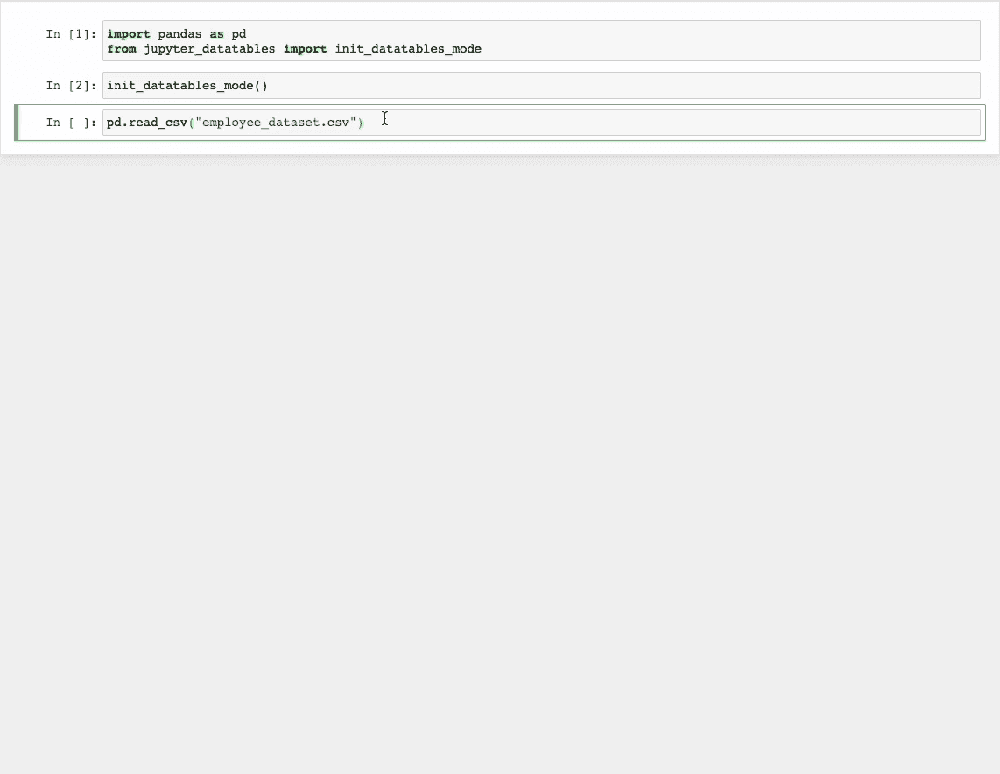
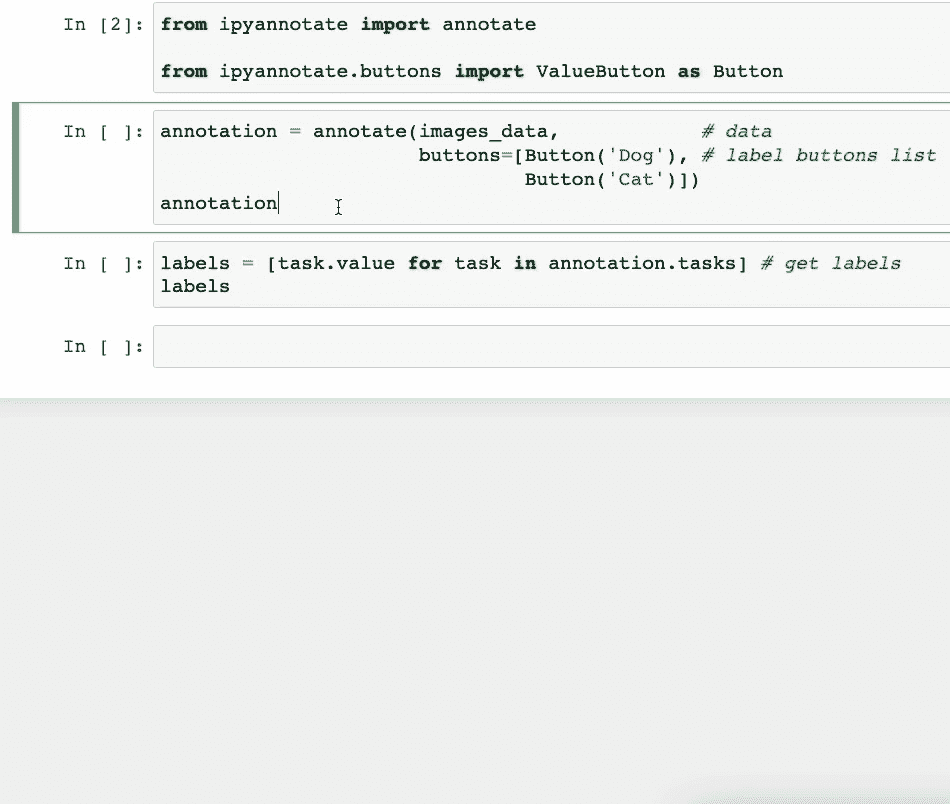
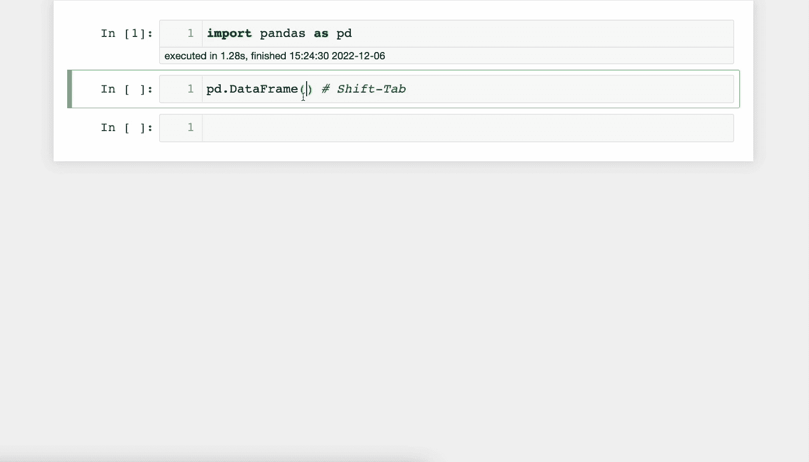
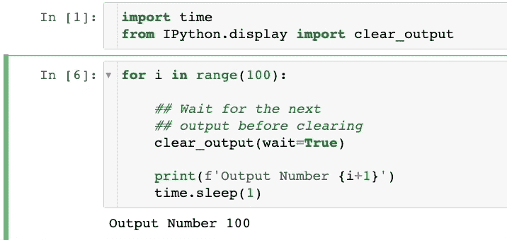

# 你从未知道的 5 个 Jupyter 小技巧

> 原文：[`towardsdatascience.com/5-jupyter-hacks-that-you-never-knew-even-existed-9dc0a08fd90a`](https://towardsdatascience.com/5-jupyter-hacks-that-you-never-knew-even-existed-9dc0a08fd90a)

## 提供一个额外的小贴士

 [Avi Chawla](https://medium.com/@avi_chawla?source=post_page-----9dc0a08fd90a--------------------------------)

·发表于 [Towards Data Science](https://towardsdatascience.com/?source=post_page-----9dc0a08fd90a--------------------------------) ·阅读时长 6 分钟·2023 年 3 月 1 日

--

图片来源于 [Sigmund](https://unsplash.com/@sigmund?utm_source=medium&utm_medium=referral) 在 [Unsplash](https://unsplash.com/?utm_source=medium&utm_medium=referral)

Jupyter Notebook 是几乎所有与 Python 相关的编程任务（如数据科学、机器学习、科学计算等）中最受欢迎的 IDE 之一。

它的交互式编码功能使其成为初学者和专家的首选工具。

尽管其广泛使用，但许多用户并没有充分利用它的全部潜力。

结果是，他们往往使用 Jupyter 的默认界面/功能，而在我看来，这些功能可以显著改进，以提供更丰富的体验。

因此，在本文中，我将介绍 5 个你可能从未知道的酷炫 Jupyter 小技巧。

这些将允许你在这个强大的工具上解锁新的生产力和创造力水平。

让我们开始吧 🚀！

# #1 停止预览原始 DataFrame

当我们在 Jupyter 中加载 DataFrame 时，通常通过打印来预览。这如下所示：

然而，这几乎没有告诉我们数据内部的情况。

因此，你必须通过分析来深入挖掘，这涉及简单但重复的代码。

相反，使用 [Jupyter-DataTables](https://bit.ly/jupyter-datatables)。你可以按如下方式安装：

要使用它，请在 Jupyter 中运行以下代码：

它通过许多有用的功能极大增强了 DataFrame 的默认预览。

结果是，每当你打印 DataFrame 时，它将显得更加优雅，如下所示。

这种更丰富的预览提供了排序、过滤、导出和分页操作，同时显示列分布和数据类型。

# #2 一键标记你的数据

不是所有的数据都是预先标记的。

因此，通常对于未标记的数据，可能需要花费一些时间进行注释/标记。

不必在外部预览文件并标记它们或构建复杂的注释管道，你可以使用`ipyannotate`仅用几行代码进行注释。

它提供了一个专门用于数据注释的 Jupyter 小部件。

运行以下命令来安装它：

通过点击按钮，数据注释变得更容易。因此，`ipyannotate` 允许你将数据标签附加到按钮上。

假设我们有一些猫和狗的图片（未标记）。我们可以创建如下的注释管道：

如上所示，你可以通过简单地点击相应的按钮来注释数据。

更重要的是，你还可以检索标签并根据需要将它们用于你的数据管道。

# #3 在 Jupyter 中查看文档

在 Jupyter 中工作时，忘记函数的参数并访问官方文档（或 StackOverflow）是很常见的。

然而，你可以在笔记本中查看文档。

按下`Shift-Tab`会打开文档面板。这非常有用，可以节省时间，因为你不必每次都打开官方文档。

下面展示了一个演示：

此功能也适用于你的自定义函数。

# #4 Jupyter 单元格执行完成时接收通知

在 Jupyter 单元格中运行一些代码后，我们经常会离开去做其他工作。

在这里，你需要反复返回到 Jupyter 标签页来检查单元格是否已执行。

为了避免这种情况，你可以使用来自`jupyternotify`扩展的`%%notify`魔法命令。

正如名称所示，它会在 Jupyter 单元格完成（无论成功还是失败）时通过浏览器通知用户。

要安装它，运行以下命令：

接下来，加载扩展：

完成了！

现在，每当你想要接收通知时，在单元格顶部输入以下魔法命令：

每当单元格完成执行时，你将收到以下通知：

点击通知将带你回到 Jupyter 标签页。

# #5 在 Jupyter Notebook 运行时清除单元格输出

在使用 Jupyter 时，我们通常会打印很多细节来跟踪代码的进展。

然而，当输出面板积累了一堆细节，而我们只对最新的输出感兴趣时，可能会感到沮丧。

此外，每次滚动到输出的底部也可能很烦人。

要清除单元格的输出，你可以使用来自`IPython`包的`clear_output`方法。

IPython 已预装在 Python 中，因此无需安装。

你可以按如下方式导入该方法：

当调用时，它会移除单元格当前的输出，然后你可以打印最新的细节。

下面展示了一个演示：

如上所示，我们只能看到单元格中的最新输出。之前的输出被删除了。

# 额外提示

尽管上述提示会显著丰富你的 Jupyter 体验，但我仍然面临许多在 Jupyter 上难以解决的问题。

比如说，Jupyter 在协作方面表现糟糕。由于它在本地运行，因此无法嵌入实时协作功能，让团队可以一起工作、添加评论、跟踪进展等。

更有甚者，分享同样令人痛苦。如果我需要与他人分享我的 notebook，唯一的方式就是通过电子邮件发送或在 GitHub 等网站上托管并分享链接。

最后，许多数据科学任务不仅仅局限于 Python。它们同样涉及 SQL，SQL 在与组织数据库交互时被广泛使用。

然而，在 Jupyter 中集成 SQL 是可行的，但过程繁琐。

## 解决方案

对这些限制感到沮丧，我开始寻找替代方案，并且很高兴我发现了 Deepnote。

在无需学习任何新知识的情况下，它迅速解决了 Jupyter 的所有限制，并始终为我提供了丰富的类似 Jupyter 的体验。

分享、协作、使用 SQL、无需代码创建图表、连接数据库等，所有这些都在 Deepnote 中无缝集成。

虽然我理解 Jupyter 旨在为所有 Python 用户提供一个通用的体验，但它在解决数据科学家的所有痛点方面做得非常糟糕，尤其是对团队工作的那些用户。

在我看来，Deepnote 是 Jupyter 的增强版，适用于所有数据驱动的项目，你一定要去试试。

# 结论

这篇博客到此结束。

恭喜你学会了一些 Jupyter notebook 的绝妙技巧。我相信这些提示会提升你的 Python 编程生产力。

此外，我很想知道你在使用 Jupyter notebook 时喜欢哪些技巧。

一如既往，感谢阅读！
