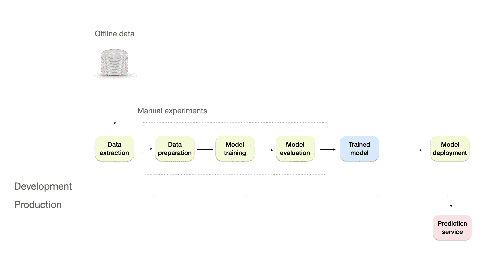
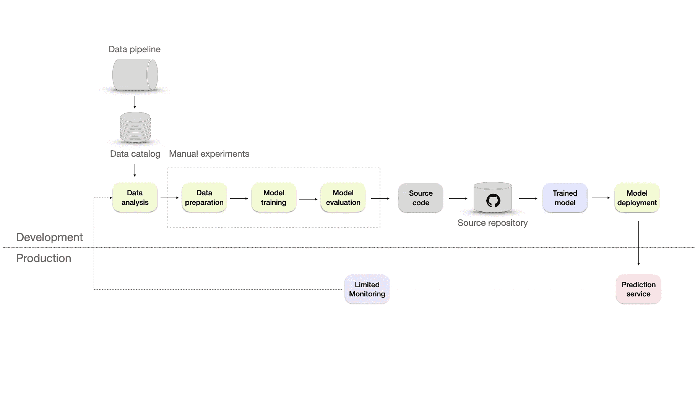
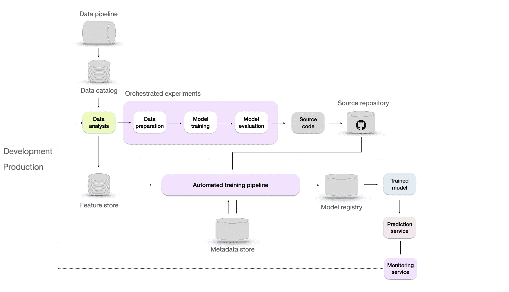
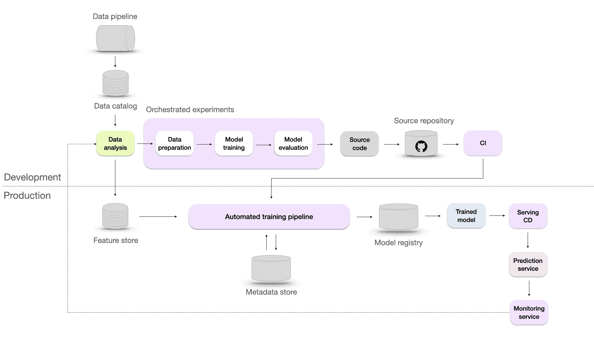
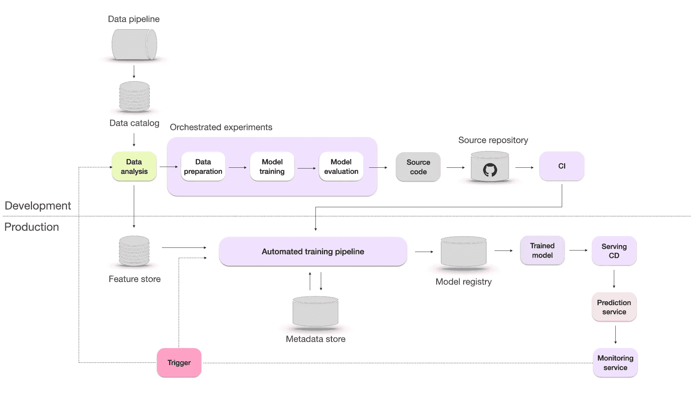

# 5 个 MLOps 成熟度级别

> 原文：[`towardsdatascience.com/5-levels-of-mlops-maturity-9c85adf09fe2`](https://towardsdatascience.com/5-levels-of-mlops-maturity-9c85adf09fe2)

 [Maciej Balawejder](https://maciejbalawejder.medium.com/?source=post_page-----9c85adf09fe2--------------------------------)

·发表于 [Towards Data Science](https://towardsdatascience.com/?source=post_page-----9c85adf09fe2--------------------------------) ·10 分钟阅读·2023 年 6 月 15 日

--

ML 基础设施从 1 级成熟度到 5 级的进展。图片由作者提供。

# 介绍

构建稳固的 ML 系统基础设施至关重要。它需要确保 ML 应用程序的开发和部署是有序且可靠的。但问题在于——每个公司的基础设施需求不同。这取决于他们有多少 ML 应用程序、需要多快部署，或者需要处理多少请求。

例如，如果一家公司只有一个生产模型，那么部署过程可以手动处理。在光谱的另一端，如 Netflix 或 Uber 这样有数百个生产模型的公司，需要高度专业化的基础设施来支持它们。

现在你可能会问自己一个问题：你的公司在这个光谱中处于什么位置？

[Google](https://cloud.google.com/architecture/mlops-continuous-delivery-and-automation-pipelines-in-machine-learning) 和 [Microsoft](https://learn.microsoft.com/en-us/azure/architecture/example-scenario/mlops/mlops-maturity-model) 分享的 MLOps 成熟度级别旨在提供帮助。它们描述了基于行业最佳实践的 ML 基础设施的发展和复杂性。

本博客文章旨在综合并提取两个框架中的最佳实践。首先，我们将分析五个成熟度级别，并展示从手动流程到高级自动化基础设施的进展。然后，在最后一部分，我们将论证 Microsoft 和 Google 提出的某些观点不应盲目遵循，而应根据你的需求进行调整。这将帮助你在了解自己的基础设施现状和发现潜在改进领域时更加自觉。

好的，让我们深入探讨吧！

# 什么是 MLOps？

MLOps 是一组实践，用于建立一个标准化和可重复的流程，管理整个机器学习生命周期，从数据准备、模型训练、部署到监控。它借鉴了在软件工程中广泛采用的 DevOps 实践，后者关注于为团队提供快速和持续迭代的软件应用交付方法。

然而，DevOps 工具对机器学习世界来说是不够的，并且在几个方面有所不同：

+   MLOps 需要一个具有多学科技能的团队。这个团队包括负责数据收集和存储的数据工程师，开发模型的数据科学家，部署模型的机器学习工程师（MLE），以及将其与产品集成的软件工程师。

+   数据科学本质上是实验性的，通过探索不同的模型、数据分析、训练技术和超参数配置来持续改进。支持 MLOps 的基础设施应包括跟踪和评估成功和失败的方法。

+   即使模型在生产中正常运行，它仍可能由于输入数据的变化而失败。这被称为静默模型失败，由数据和概念漂移引起。因此，机器学习基础设施需要一个监控系统来不断检查模型的性能和数据，以防止这个问题。

现在让我们探索 MLOps 基础设施的不同成熟度级别。

# 级别 1 — 手动

手动机器学习基础设施。设计灵感来自谷歌的博客文章。图片由作者提供。

在这个级别，数据处理、实验和模型部署过程完全是手动的。微软将这一级别称为‘*没有 MLOps*’，因为机器学习生命周期难以重复和自动化。

整个工作流程高度依赖于熟练的数据科学家，并且在需要时，数据工程师协助准备数据，软件工程师协助将模型与产品/业务流程集成。

这种方法在以下情况中效果很好：

+   早期阶段的初创公司和概念验证项目——在这些情况下，重点是实验，资源有限。在扩大运营规模之前，开发和部署机器学习模型是主要关注点。

+   小规模的机器学习应用——对于范围有限或用户基础较小的机器学习应用（如小型在线时尚商店），手动方法可能是足够的。数据科学家可以手动处理数据处理、实验和部署过程，因数据依赖性较小且实时要求不高。

+   临时机器学习任务——在特定场景如营销活动中，一次性的机器学习任务或分析可能不需要全面的 MLOps 实施。

根据谷歌和微软的说法，这种方法也面临一些局限性，包括：

+   缺乏监控系统——没有关于模型性能的可视性。如果性能下降，将会对业务产生负面影响。此外，还需要在部署后进行数据科学分析，以了解模型在生产中的表现。

+   生产模型没有频繁的重训练——模型没有适应最新的趋势或模式。

+   发布过程痛苦且不频繁——由于是手动完成，模型发布每年只有几次。

+   缺乏对模型性能的集中跟踪，使得比较不同模型的性能、重复结果或更新变得困难。

+   有限的文档和缺乏版本控制——带来了一些挑战，比如引入意外代码更改的风险、有限的回滚到工作版本的能力和缺乏可重复性。

# 级别 2——可重复

可重复的机器学习基础设施，配有额外的源代码仓库和监控。图片来源于作者。

接下来，我们通过将实验转换为源代码并使用像 Git 这样的版本控制系统将其存储在源代码仓库中，引入 DevOps 方面的内容。

微软建议通过添加以下内容来修改数据收集过程：

+   数据管道——允许从不同来源提取数据并将其合并。然后，通过清理、汇总或过滤操作对数据进行转换。它使基础设施比手动处理更具可扩展性、效率和准确性。

+   数据目录——一个集中存储的数据仓库，包含数据源、数据类型、数据格式、所有者、使用情况和数据源流等信息。它有助于以可扩展和高效的方式组织、管理和维护大量数据。

为了提升基础设施，我们必须引入一些自动化测试以及版本控制。这意味着使用单元测试、集成测试或回归测试等实践。这些将帮助我们更快地部署，并通过确保代码更改不会引起错误或漏洞来提高可靠性。

在这些变化到位后，我们可以重复数据收集和部署过程。然而，我们仍然需要一个适当的监控系统。微软简单提到这一点，称“关于模型在生产中表现如何的反馈有限”，但他们没有详细说明。

# 级别 3——可重复

可重复的机器学习基础设施，配有自动化训练和协调实验。图片来源于作者。

可重复性至关重要的两个关键原因是：故障排除和协作。设想一种情况，你最近部署的模型性能下降，导致预测不准确。在这种情况下，你需要保留数据和模型的先前版本，以便在找到根本问题之前回滚到其他版本的模型。

此外，可重复性使不同团队成员更容易理解他人的工作并在彼此的工作基础上进行改进。这种协作方式和知识共享可以带来更快的创新和更好的模型。

为了实现可重复性，我们可能需要通过四种方式提升架构：

+   自动化训练管道 — 处理从数据准备到模型评估的端到端训练过程。

+   元数据存储库 — 一个数据库，用于跟踪和管理元数据，包括数据源、模型配置、超参数、训练运行、评估指标及所有实验数据。

+   模型注册表 — 是一个存储机器学习模型、其版本及其部署所需工件的仓库，这有助于在需要时检索到确切的版本。

+   特征存储 — 旨在帮助数据科学家和机器学习工程师通过提供集中存储、管理和服务特征的地点，更高效地开发、测试和部署机器学习模型。它还可以用于跟踪特征随时间的演变，并根据需要对特征进行预处理和转换。

在这一阶段，提供了监控服务，实时反馈模型的性能。然而，除了确认存在外，微软和谷歌均未提供更多信息。

# Level 4 — 自动化

自动化机器学习基础设施与 CI/CD。图片来自作者。

这一自动化水平帮助数据科学家高效探索特征工程、模型架构和超参数的新想法，通过自动化机器学习管道（包括构建、测试和部署）。为实现这一点，微软建议加入两个额外的组件：

+   CI/CD — 在持续集成（CI）中，确保来自不同团队成员的代码变更集成到共享的代码库中，而持续部署（CD）则自动化将经过验证的代码部署到生产环境中。这允许快速部署模型更新、改进和修复漏洞。

+   模型的 A/B 测试 — 这种模型验证方法涉及比较现有模型和候选模型之间的预测和用户反馈，以确定更好的模型。

# Level 5 — 持续改进

通过自动重新训练持续改进的机器学习基础设施。图片来自作者。

在这一阶段，模型会根据监控系统的触发器自动重新训练。这个重新训练的过程也称为持续学习。持续学习的目标包括：

+   应对可能出现的突发数据漂移，确保模型在面对数据的意外变化时仍然有效。

+   适应诸如黑色星期五等稀有事件，在这些事件中，数据中的模式和趋势可能会显著偏离常规。

+   克服冷启动问题，即模型需要为缺乏历史数据的新用户做出预测

# 推动自动化

微软和谷歌是云计算市场的主要参与者，[Azure 占据了 22% 的市场份额，而谷歌为 10%。](https://www.notion.so/772f4586aa2d49e1a0ad13a1b3da20ea?pvs=21) 他们提供了广泛的服务，包括计算、存储和开发工具，这些都是构建先进的机器学习基础设施的重要组成部分。

像任何业务一样，他们的主要目标是通过销售这些服务来创造收入。这也是他们的博客强调进步和自动化的部分原因。然而，更高的成熟度水平并不保证你的业务会有更好的结果。最优的解决方案是与公司特定需求和适当的技术栈相一致的方案。

尽管成熟度级别可以帮助你确定当前的进展，但不应盲目遵循，因为微软和谷歌的主要动机是销售他们的服务。一个具体的例子是他们推动自动再培训的过程。这个过程需要大量的计算，但通常是不必要的或有害的。再培训应在需要时进行。对于你的基础设施来说，更重要的是拥有一个可靠的监控系统和一个有效的根本原因分析过程。

## 监控应该从手动级别开始

在描述的成熟度级别中，第 2 级出现了一个有限的监控系统。实际上，一旦基于模型的输出做出业务决策，你就应该对模型进行监控，无论成熟度级别如何。这可以帮助你降低失败的风险，并查看模型在实现业务目标方面的表现。

监控的初步步骤可以简单到仅仅比较模型的预测值与实际值。这种基本的比较是对模型性能的基线评估，也是进一步分析模型失败时的良好起点。此外，还需要考虑数据科学工作的评估，包括投资回报率（ROI）的衡量。这意味着评估数据科学技术和算法带来的价值。理解这些努力在生成业务价值方面的有效性至关重要。

评估投资回报率可以为你提供洞察和信息，帮助你更好地做出资源分配和未来投资的决策。随着基础设施的发展，监控系统可能会变得更加复杂，具有更多的功能和能力。然而，你仍然应该关注在成熟度的第一个级别上应用基本监控设置的重要性。

## 再培训的风险

在第 5 级的描述中，我们列出了生产中自动再培训的好处。然而，在将其添加到基础设施之前，你应该考虑与之相关的风险：

1.  **延迟数据上的再培训**

在一些现实场景中，例如贷款违约预测，标签可能会延迟数月甚至数年。实际情况仍在变化，但你却在用旧数据重新训练模型，这可能无法很好地代表当前的现实。

**2\. 无法确定问题的根本原因**

如果模型的性能下降，并不总是意味着需要更多的数据。模型失败的原因可能有多种，例如下游业务流程的变化、训练-服务偏差或数据泄露。你应该首先调查以找到潜在的问题，然后在必要时重新训练模型。

**3\. 更高的失败风险**

重新训练增加了模型失败的风险。除了它增加了基础设施的复杂性之外，更新的频率越高，模型失败的机会就越多。数据收集或预处理中的任何未检测到的问题都会传递到模型中，导致在缺陷数据上重新训练的模型。

**4\. 更高的成本**

重新训练不是一个无需成本的过程。它涉及到与以下方面相关的费用：

+   存储和验证重新训练的数据

+   重新训练模型所需的计算资源

+   测试一个新模型，以确定它是否比当前模型表现更好

# 总结

机器学习系统非常复杂。以可重复和可持续的方式构建和部署模型是很有挑战性的。在这篇博客文章中，我们探讨了基于谷歌和微软行业最佳实践的五个 MLOps 成熟度水平。我们讨论了从手动部署到自动化基础设施的演变，强调了每个水平带来的好处。然而，理解这些实践不应盲目跟随至关重要。相反，它们的适应应基于公司特定的需求和要求。
