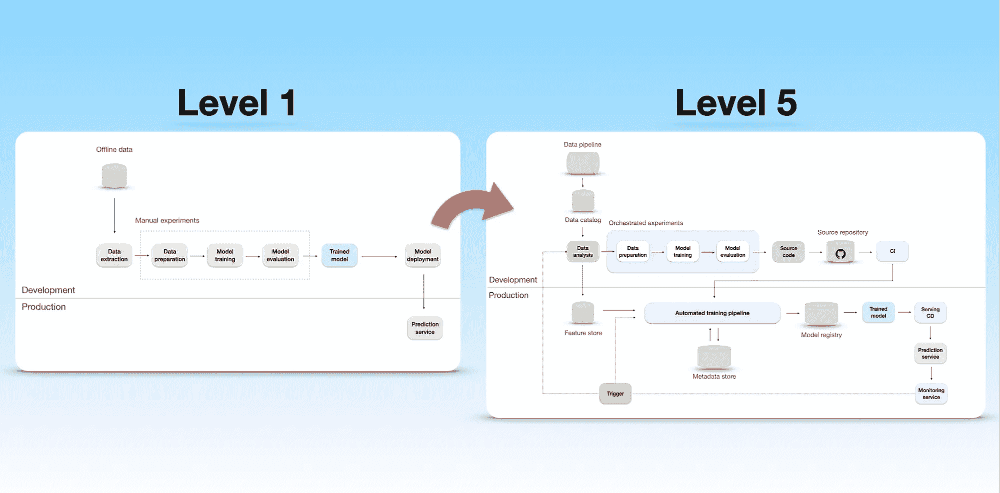

# MLOps 成熟度的 5 个层级

> 原文：[`towardsdatascience.com/5-levels-of-mlops-maturity-9c85adf09fe2?source=collection_archive---------3-----------------------#2023-06-15`](https://towardsdatascience.com/5-levels-of-mlops-maturity-9c85adf09fe2?source=collection_archive---------3-----------------------#2023-06-15)

 [Maciej Balawejder](https://maciejbalawejder.medium.com/?source=post_page-----9c85adf09fe2--------------------------------)

·

[关注](https://medium.com/m/signin?actionUrl=https%3A%2F%2Fmedium.com%2F_%2Fsubscribe%2Fuser%2F20c0457a86b0&operation=register&redirect=https%3A%2F%2Ftowardsdatascience.com%2F5-levels-of-mlops-maturity-9c85adf09fe2&user=Maciej+Balawejder&userId=20c0457a86b0&source=post_page-20c0457a86b0----9c85adf09fe2---------------------post_header-----------) 发表在 [Towards Data Science](https://towardsdatascience.com/?source=post_page-----9c85adf09fe2--------------------------------) ·10 分钟阅读·2023 年 6 月 15 日

--

从第 1 级成熟度到第 5 级成熟度的机器学习基础设施进展。图片由作者提供。

# 介绍

为机器学习系统建立一个坚实的基础设施是非常重要的。它需要确保机器学习应用程序的开发和部署是有组织且可靠的。但问题是——每家公司对基础设施的需求不同。这取决于他们拥有多少机器学习应用程序，他们需要多快部署，或者他们需要处理多少请求。

例如，如果一个公司只有一个生产中的模型，那么部署过程可以手动处理。在谱系的另一端，像 Netflix 或 Uber 这样的公司拥有数百个生产中的模型，需要高度专业化的基础设施来支持它们。

现在你可能会问自己一个问题：你的公司在这一谱系上处于什么位置？

[谷歌](https://cloud.google.com/architecture/mlops-continuous-delivery-and-automation-pipelines-in-machine-learning)和[微软](https://learn.microsoft.com/en-us/azure/architecture/example-scenario/mlops/mlops-maturity-model)分享的 MLOps 成熟度等级旨在提供帮助。它们描述了基于行业最佳实践的 ML 基础设施的进步和复杂性。

本博客文章旨在综合并吸取两个框架的精华。首先，我们将分析五个成熟度等级，并展示从手动流程到先进自动化基础设施的进展。然后，在最后一节中，我们将讨论一些由**微软**和**谷歌**提出的观点不应盲目跟从，而应根据你的需求进行调整。这应该有助于……
