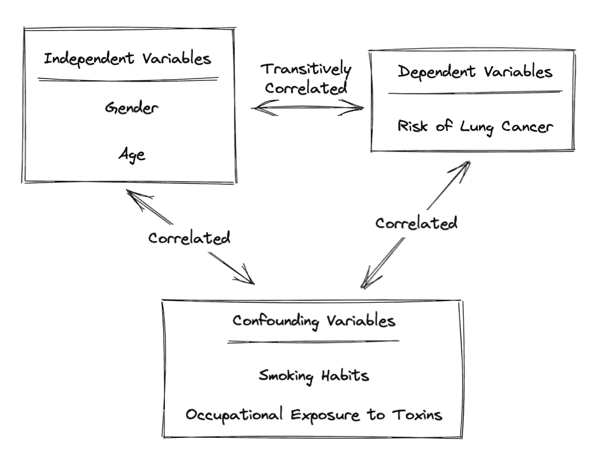
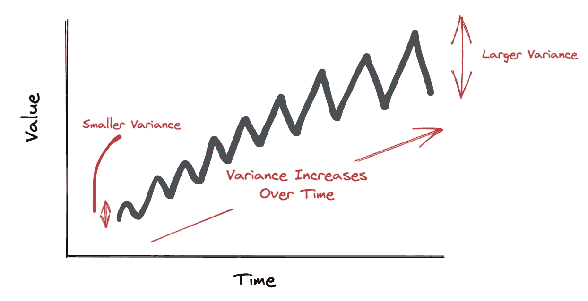
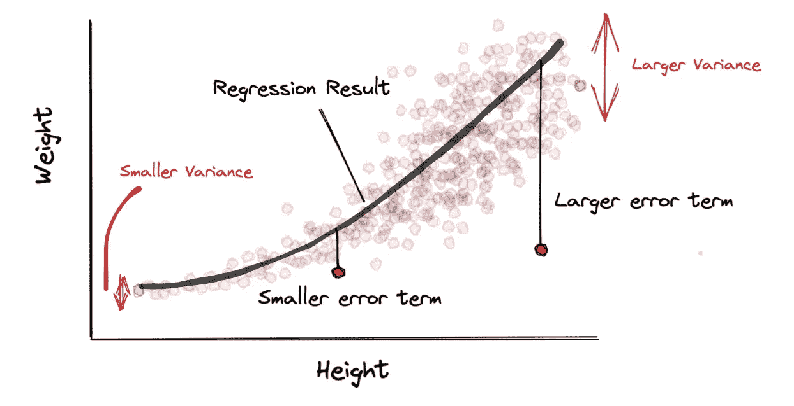

# 每个数据科学家都应该避免的 5 个错误

> 原文：[`towardsdatascience.com/5-mistakes-every-data-scientist-should-avoid-7e3523f6a9ec`](https://towardsdatascience.com/5-mistakes-every-data-scientist-should-avoid-7e3523f6a9ec)

照片由 [Lucas George Wendt](https://unsplash.com/de/@lucasgwendt?utm_source=medium&utm_medium=referral) 提供，来源于 [Unsplash](https://unsplash.com/?utm_source=medium&utm_medium=referral)

## 通过避免这些陷阱来提升你的数据科学水平

 [Louis Chan](https://louis-chan.medium.com/?source=post_page-----7e3523f6a9ec--------------------------------)

·发表在 [Towards Data Science](https://towardsdatascience.com/?source=post_page-----7e3523f6a9ec--------------------------------) ·阅读时间 7 分钟·2023 年 1 月 12 日

--

数据科学是一个广阔的领域，需要大量的经验和知识才能掌握。在我们成为更好的数据科学家的过程中，定期自我审视、从错误中学习并避免无意中犯的错误是至关重要的。

在这篇博客中，我们将讨论我作为数据科学家期间遇到的 5 个陷阱。

# 1. 辛普森悖论

这是数据科学中一个相对被低估的领域。辛普森悖论发生在我们合并组数据时，局部数据模式变得不可观察。这可以通过一个例子来更好地解释：

图片来自作者

我们有一个关于某打车应用流失客户的数据集。我们注意到，对于区域 1，客户的里程越多，流失的可能性越大。对于区域 2，客户的里程越少，流失的可能性越大。最后，对于区域 3，无论客户的里程是多少，流失的可能性几乎相等。在上图中，当我们将这三个区域合并时，我们会看到什么？它就变成了一大堆数据，没有明显的模式。

这可能听起来像是一个棘手的问题。但我们可能需要从最简单的角度来解决它。检测和可能解决辛普森悖论的一些方法包括：

+   我们不应仅仅在整个数据集上应用统计分析（预处理或模型评估）。相反，我们应该将数据集拆分，分别在不同的切片——数值变量的区间、分类变量、类别和标签等——上运行相同的分析。这可以帮助我们识别在整个数据集上可能不显著的局部数据模式。

+   当我们注意到辛普森悖论时，解决这一问题的一种方法是为这一样本组训练一个不同的模型，假设它们足够重要。可以添加启发式规则来确定应该使用哪个模型。

+   解决辛普森悖论的另一种可能方法是在特征工程过程中引入交互项。在上面的例子中，我们可以在面积和里程之间创建一个特征交叉，以放大这两个特征与流失概率之间的不同局部关系。

# 2\. 选择偏差

> 垃圾进，垃圾出。

这对于任何分析功能都是正确的。我们必须更加重视数据质量的重要性。衡量数据质量的一个标准是数据集是否准确代表了总体。

选择偏差的一个例子可能是一个机器学习模型评估新治疗焦虑的有效性，该模型训练的数据来自于大多数患者不患有该病的研究组。虽然建立治疗的基线是重要的，但如果没有包含足够的焦虑患者数据点，就会显著削弱模型的鲁棒性和泛化能力。

为了避免选择偏差，我们应始终考虑以下几点：

+   目标人群是什么？

+   从表现角度来看，我们的训练集与目标人群有多大的不同？

+   我们的数据是如何收集的？我们是否可能低估或高估了某些群体？

+   在考虑人群由哪些群体组成时，我们是否遗漏了其他身份或参数？

当有疑问时，务必花时间审查数据及其收集策略。

# 3\. 混杂变量

我们的模型可能没有达到预期效果的一个原因可能是我们遗漏了一些与我们的自变量（**X**）和因变量（**y**）相关的额外变量（混杂变量）。这意味着，我们不是让模型更容易地找到混杂变量与因变量之间的关联，而是让模型通过特征集与因变量之间的传递关系进行学习。

一个例子可能是分析某人患肺癌的概率。可能发现患这种致命疾病的男性比例很高。但除非我们包含吸烟习惯、家庭空气质量、职业接触毒素和癌症家族史等数据点，否则这可能不是一个非常准确的结论。

作者提供的图片

一旦我们开始包含混杂变量，我们的模型应该会有所改善，因为我们提供了与因变量有更直接关系的特征。我们也应该对我们的特征对因变量的重要性得出更准确的结论。

一般来说，我们应该不断提醒自己，相关性并不等于因果关系。当我们怀疑是否遗漏了任何混杂变量时，以下问题可能会有所帮助：

+   我们是否期望排名最重要的特征对因变量有如此大的影响？

+   专家如何解释重要特征与因变量之间的互动？

+   假设我们对自变量和因变量之间关系的逻辑解释涉及推理步骤（例如，更多男性吸烟，因此肺癌风险更高）。我们可以将中间变量纳入我们的特征集吗？

# 4\. 异方差性

异方差性。除了这个词发音困难外，它还是一个数据科学家在未察觉时可能面临的致命陷阱。大多数时间序列分析方法在数据方差随时间保持稳定时效果最佳。问题在于，当数据的波动性随时间剧烈变化时。

作者提供的图片

即使手头的数据不是时间序列，也并不意味着我们可以摆脱异方差性。想象一下，你在拟合体重和身高之间的回归模型。较低年龄组的收入水平应该集中在较低的范围内。随着年龄的增加，收入应该以一个依赖于多个因素（如公司、职位变动、职业变化、经济情况等）的速率增加，从而导致收入分布更加稀疏。这意味着即使我们可能拥有较高的 R 平方值，随着年龄的增加，我们的模型也会变得不那么准确。

作者提供的图片

好消息是：我们可以通过提出这些问题来提醒自己：

+   错误项是否与所用特征中的任何一个相关？

+   错误项的分布是否会随着所用特征的变化而变化？

+   我们是否可以进行任何变换（如对数变换）或重采样（如自助法）以调整方差的规模？

# 5\. 多重共线性

另一个常见的陷阱是多重共线性。这是一个自变量彼此高度相关的情况。乍一看，这可能是一个相对次要的问题。但它会使我们的解决方案不必要地复杂甚至不稳定。

比如我们想建立一个模型来估计市场营销活动的成功。使用的特征包括 Facebook 广告、Instagram 广告、TikTok 广告和 Google 广告的点击率，以及总体转化率。无论使用哪个平台，精心策划的广告都应该期望有不错的点击率，因此点击率相关的特征应具有合理的相关性。假设你加入了这家公司，你对老板的第一印象是将模型复杂度减少至少 100% 同时保持更稳定的结果。你刚刚为你的晋升做了一个有力的证明。

我们如何准确发现和解决类似问题？以下是我过去亲自使用的一些建议：

+   相关性矩阵：不言自明，用于发现线性相关的特征

+   降维：PCA、t-SNE 和 UMAP 等技术可以作为减少列数的有前途的方法，同时保留数据集中大部分的方差

+   移除/聚合变量：在上述示例中，可以使用加权平均列来替代所有彼此高度相关的列。

+   正则化：可以使用 Lasso（L1）或 Ridge（L2）等技术来克服多重共线性

# 结论

这里有 5 个我个人之前曾经陷入的陷阱。

> 不要止步于此

像任何领域一样，数据科学是一个需要不断打磨思维和获取新知识的深坑，以便从人群中脱颖而出。

如果你喜欢这篇文章，你还可以通过下面的我的推荐链接订阅 Medium 来支持我。这是一个我找到许多有趣阅读的平台。即使你完全不打算订阅，你也可以通过点赞支持我和我的创作。

 [## 使用我的推荐链接加入 Medium — Louis Chan

### 阅读 Louis Chan 的每一个故事（以及 Medium 上其他成千上万的作者）。你的会员费用直接支持……

[louis-chan.medium.com](https://louis-chan.medium.com/membership?source=post_page-----7e3523f6a9ec--------------------------------)

最后但绝对重要的是，如果我遗漏了或误解了任何关键点，请随时在 LinkedIn 上发表评论或发私信给我。让我们共同保持知识流动，并在这个领域中不断进步！

 [## Louis Chan — 领先 GCP 数据与 ML 工程师 — 副总监 — KPMG 英国 | LinkedIn

### 一个雄心勃勃、好奇且富有创造力的个体，坚信知识领域之间的相互联系以及……

[www.linkedin.com](https://www.linkedin.com/in/louis-chan-b55b9287?source=post_page-----7e3523f6a9ec--------------------------------)
