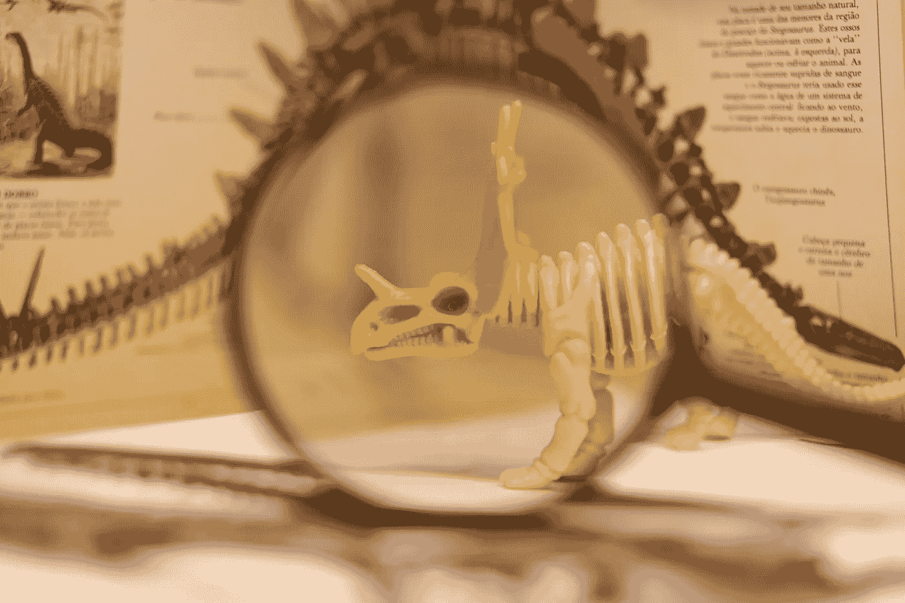
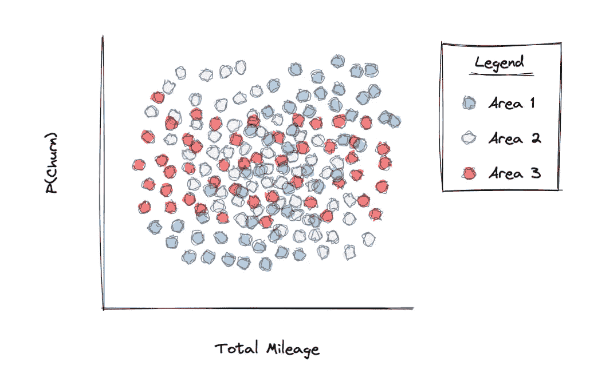

# 每位数据科学家应避免的 5 个错误

> 原文：[`towardsdatascience.com/5-mistakes-every-data-scientist-should-avoid-7e3523f6a9ec?source=collection_archive---------12-----------------------#2023-01-12`](https://towardsdatascience.com/5-mistakes-every-data-scientist-should-avoid-7e3523f6a9ec?source=collection_archive---------12-----------------------#2023-01-12)

图片由 [Lucas George Wendt](https://unsplash.com/de/@lucasgwendt?utm_source=medium&utm_medium=referral) 在 [Unsplash](https://unsplash.com/?utm_source=medium&utm_medium=referral) 提供

## 提升你的数据科学水平，避免这些陷阱

 [Louis Chan](https://louis-chan.medium.com/?source=post_page-----7e3523f6a9ec--------------------------------)

·

[关注](https://medium.com/m/signin?actionUrl=https%3A%2F%2Fmedium.com%2F_%2Fsubscribe%2Fuser%2F6d585e26760a&operation=register&redirect=https%3A%2F%2Ftowardsdatascience.com%2F5-mistakes-every-data-scientist-should-avoid-7e3523f6a9ec&user=Louis+Chan&userId=6d585e26760a&source=post_page-6d585e26760a----7e3523f6a9ec---------------------post_header-----------) 发表在 [Towards Data Science](https://towardsdatascience.com/?source=post_page-----7e3523f6a9ec--------------------------------) ·7 分钟阅读·2023 年 1 月 12 日

--

数据科学是一个广阔的领域，需要大量经验和知识才能掌握。在成为更优秀的数据科学家的过程中，我们必须定期自我审视，学习并避免我们无意中犯下的错误。

在这篇博客中，我们将讨论我在数据科学工作期间遇到的 5 个陷阱。

# 1\. 辛普森悖论

这是数据科学中一个相对被低估的领域。辛普森悖论发生在我们将多个组的数据合并时，本地数据模式不再明显。这可以通过一个例子更好地解释：

作者提供的图片

我们有一个关于某打车应用的流失客户的数据集。我们注意到，在区域 1，行驶里程较多的客户更容易流失；在区域 2，行驶里程较少的客户更容易流失；最后，在区域 3，任何行驶里程的客户几乎同样容易流失。在上面的图表中，当我们将这三者结合起来时，会看到什么？它变成了一堆没有明显特征的数据……
